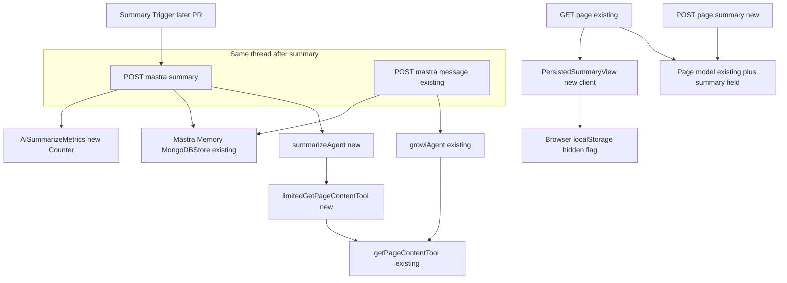
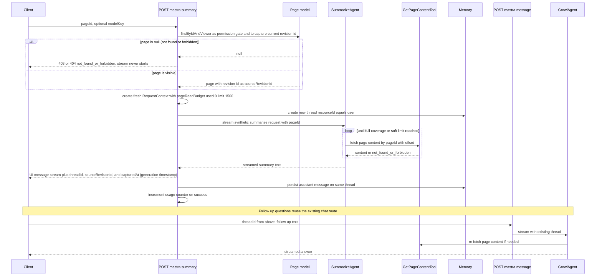
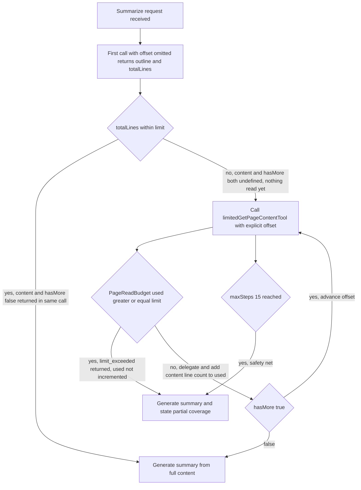
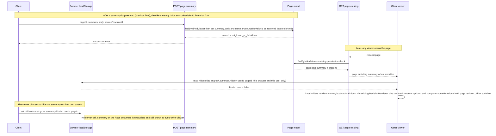

# Technical Design: ai-summarize

## Overview

**この機能の主眼**: 生成した要約をページに永続化し、以後そのページを開く全閲覧者（初めて訪れる人を含む。ただし本文と同じ権限ゲート経由であり、閲覧権限のない人には表示しない）にデフォルト表示すること。本specは、その生成（チャット対話）から、ページへの永続化・共有表示、鮮度判定・削除までを一貫して対象とする。

**Purpose**: GROWIのページ閲覧者が、閲覧中のページの内容を既存のAIチャット基盤（`features/mastra`）を通じてその場で要約でき、気に入った要約を選んでページに残せば、以後そのページの閲覧権限を持つ他の閲覧者にもその要約が表示されるようにする。

**Users**: ページ閲覧者は、ページを開いた状態から要約を要求し、その場で生成された要約を読み、同じ対話の中で内容について追加の質問を続けられる。要約を残すことを選んだ場合、以後そのページの閲覧権限を持つ他の閲覧者は、ページを開いた時点でその要約を読める（閲覧権限のない人には表示されない）。運用者は、機能の利用状況をOpenTelemetryメトリクスで把握できる。

**Impact**: `features/mastra` に、検索Q&A用の既存 `growiAgent` とは独立した要約専用の新規Agent（`summarizeAgent`）と、それを一度だけ起動する新規APIルートを追加する。加えて、既存の `Page` スキーマに要約を保持する新規フィールドを追加し、その保存・削除を行う新規APIルートと、ページ表示時にその要約を描画する新規クライアントコンポーネントを追加する。`growiAgent` 本体（instructions・呼び出し経路）、ページ取得ツール（`getPageContentTool`）、既存のチャットスレッド永続化基盤（`memory`）、ページ本体の閲覧権限判定ロジックはいずれも変更しない。

### Goals
- 閲覧中のページを、既存のAIチャット基盤上での都度のLLM呼び出しにより要約する（次回以降の生成のために結果をキャッシュして使い回すことはしない）。要約の対話自体は既存のチャット対話と同じ仕組みでスレッドとして永続化される。
- 生成された要約についてユーザーが「残す」ことを選択した場合のみ、その要約をページに紐づく永続フィールドに保存する。
- 永続化された要約を、本文と同じ権限ゲート経由で、以後そのページを開く全閲覧者にデフォルト表示する。
- 永続化された要約が保存後のページ更新によって古くなった可能性を、控えめに（背景色を変える等の目立つ演出なしに）示す。追加のLLM呼び出し・DBアクセスなしで判定できるようにする。
- 永続化された要約を、閲覧者ごとに自分の画面上でのみ非表示にする手段を提供する（ページに紐づく永続データ自体は変更せず、他の閲覧者や同一ユーザーの別ブラウザ・別デバイスには影響しない。再表示機能は設けない）。
- 長いページについて、既存の検索Q&A用途の読み取り方針を変えずに、要約時のみ全文カバレッジの読み取り方針を適用する。読み取り量の上限は、以下の3層構えで制御される：**(1) limitedGetPageContentTool がコード側で 1500行でカット（ハード上限）、(2) instructions が limit_exceeded 受領時に読み取り打ち切り（ソフト制御、LLM依存）、(3) maxSteps=15 が最大ステップ数を制限（安全弁、LLM依存）**。層1は完全に強制されるが、層2・3はLLM側の挙動に依存する。
- 要約対象コンテンツの取得経路を既存の `getPageContentTool` に一本化し（読み取り量の上限を強制する専用ラッパー越しに呼び出す）、要約生成のたびに閲覧権限が再チェックされる構造を維持する。
- 要約後、同一スレッド内で既存のチャット対話フローに合流し、追加の質問を継続できるようにする。
- 利用状況をOpenTelemetryの既存カスタムメトリクス基盤にCounterとして計測する。

### Non-Goals
- 複数ページを横断した要約・比較、ページ階層／プロジェクト単位の要約。
- 要約専用の新しいLLM呼び出しパイプライン、独自の権限モデル、独自のページ内容取得手段の新設。永続化された要約の閲覧権限判定も、既存のページ閲覧権限判定ロジックをそのまま利用する。
- 要約トリガーのUIコンポーネント自体の実装。設置場所（ページ上部の操作メニュー。AIサイドバーのクイックメニュー形式は不採用）は決定済みだが、実装は別PRで行う。本設計は、そのUIから呼ばれるAPI契約のみを定義する。
- 「残す」を選ぶ保存ボタンUI自体の実装。トリガーUIと同じ別PRで行う。本設計は、そのUIから呼ばれる保存APIの契約のみを定義する。
- 本文更新時の要約自動再生成（手動再生成のみとする）、非表示にした要約を再表示する機能。
- 永続化された要約そのものをサーバ側で削除する仕組み（「削除」導線はクライアントローカルな非表示状態として実現し、共有データを消す操作ではない。詳細は Requirement 9.3/9.4 参照）。

## Boundary Commitments

### This Spec Owns
- 要約専用Agent（`summarizeAgent`）とそのinstructions（全文カバレッジ方針・出力形式）。
- 読み取り量の上限を強制する専用ツール（`limitedGetPageContentTool`）。既存の `getPageContentTool` 自体は変更しない。
- 要約を1回だけ起動する新規APIルート（トリガー結果を受けてサーバ側で要約対話を開始する契約）。
- 要約生成イベントに対するOpenTelemetryカウンタメトリクスの追加。
- 要約リクエストにおける閲覧権限の担保 — ルート層の `Page.findByIdAndViewer` による短絡ゲート（権限なし時の唯一の応答経路）と、既存 `getPageContentTool` 経由の都度チェック（TOCTOU窓の二重防護）の両立。
- `Page` スキーマへの永続化フィールド（要約本文＋生成元revision ID）の追加。
- 永続化された要約の保存を行う新規APIルート（サーバ側の削除APIは持たない）。
- ページ表示時に永続化された要約を描画する新規クライアントコンポーネント（本文の外側、鮮度表示・見出し「AI要約」・閲覧者ごとのローカル非表示状態を含む。既存i18nパターンに沿った5ロケール分の翻訳追加を伴う）。
- 要約トリガーボタンのコンポーネント実装（`AiSummarizeQuickMenuItem`）: AiSidebar のクイックメニューに「このページを要約」を追加し、AI設定確認・`useCurrentPageId` による表示条件制御を行う。クリック時は `POST /_api/v3/mastra/summary` を呼び出し、`isGenerating` フラグで二重送信防止を実装。トークン消費を明示。
- 保存ボタンのコンポーネント実装（`AiSummarizePersistenceButtons`）: 「残す / 閉じる」ボタンをアシスタントメッセージ下に表示し、既存要約がある場合の置き換え確認ダイアログ・ローディング状態管理・エラー通知を実装。
- 多言語化: トリガー・保存・鮮度表示に関わるすべてのUIテキストを5ロケール（ja_JP, en_US, fr_FR, ko_KR, zh_CN）で翻訳・実装。
- UI層エラーハンドリング: ネットワーク・サーバエラー時に技術詳細を含まない簡潔なユーザー向けメッセージを通知。

### Out of Boundary
- `growiAgent` のinstructions・ツール構成・`post-message.ts` の呼び出しロジック — 本specはこれらを一切変更しない。
- `getPageContentTool` 自体の実装変更 — 本specは既存の入出力契約のまま利用する。`limitedGetPageContentTool` は新規に追加するラッパーであり、`getPageContentTool` を書き換えるものではない。
- ページ閲覧権限の判定ロジックそのもの（`Page.findByIdAndViewer` 等）— 既存のまま利用する。
- 本文更新時の要約自動再生成、非表示にした要約の再表示機能、サーバ側での要約削除（Non-Goals参照）。

### Allowed Dependencies
- `features/mastra/server/services/mastra-modules/tools/get-page-content-tool.ts`（既存、無変更）— 要約対象ページ本文の唯一の取得手段。`limitedGetPageContentTool` がこれをラップして呼び出す（`suggestPathAgent` の `limitedSearchTool` が `fullTextSearchTool` をラップするのと同じパターン）。
- `features/mastra/server/services/mastra-modules/memory`（既存の `Memory` + `MongoDBStore`）— 要約スレッドの永続化に、`growiAgent` と共有で利用する。新規のデータストアは追加しない。
- `features/mastra/server/routes/ai-ready-guard.ts`（既存）— AI未設定・無効時の利用不可化にそのまま流用する。
- `features/opentelemetry/server/custom-metrics/`（既存ディレクトリ構成）— 新規Counterメトリクスをこのパターンに追加する。
- `apps/app/src/server/models/page.ts`（既存の `Page` Mongooseモデル）— 永続化フィールドの追加先。既存のスキーマ定義パターンに1フィールド追加する。
- `Page.findByIdAndViewer` / 既存のページ閲覧権限判定ロジック（既存）— 永続化された要約の表示可否判定にそのまま流用する。
- `apps/app/src/components/PageView/RevisionRenderer.tsx`（既存、無変更）— `summary.body` のMarkdown描画の唯一の経路。任意のMarkdown文字列を描画する既存の先例（コメント・プレビュー・カスタムサイドバー）と同じ使い方をする。要約専用のレンダラは新設しない。
- `~/stores/renderer.tsx` の `generateSimpleViewOptions` 系オプション生成フック（既存、無変更）— `rehype-sanitize` を含むレンダラオプションの取得元。サニタイズは全面的にこのパイプへ委譲し、独自のサニタイズ処理・独自オプションは作らない。
- `useCurrentUser`（既存のクライアント側フック）— `localStorage` キーに含める `userId`（現在のログインユーザーの `_id`）の取得元。未ログイン時は `undefined` を返すため、その場合はローカル非表示機能を無効化する。
- `~/states/page/hooks.ts` の `useCurrentPageId`（既存のクライアント側フック）— 「閲覧中のページ」の識別に用いる想定の依存。本spec自体はページ上部の操作メニューに設置するトリガーUIを実装しないが（実装は別PR）、そのトリガー実装はこのフックを参照する前提でAPI契約を設計する。

### Revalidation Triggers
- `getPageContentTool` の入出力契約（`inputSchema`/`outputSchema`）が変わる場合、`summarizeAgent` 側の呼び出しコードを再検証する。
- `growiAgent` のツール構成や `post-message.ts` のリクエストボディ契約（`threadId`/`modelKey`）が変わる場合、要約後にスレッドを引き継ぐ本設計の前提を再検証する。
- スレッドの永続化方式（`memory` のバックエンド、`getOrCreateThread` の契約）が変わる場合、要約スレッドの生成・引き継ぎ処理を再検証する。
- `Page` モデルがMongooseからPrismaへ移行される場合（`.claude/rules/model.md`）、永続化フィールドの追加方法・アクセス方法を再検証する。
- `@mastra/core` のtool-call/tool-result 再生仕様（LLMプロバイダへ送るツール名がキー（ツール自身の`id`ではなく）であること、tool名が登録ツールセットに存在するか検証・除去しないこと）が変わる場合、クロスAgent スレッド共有（要約後に `growiAgent` が `summarizeAgent` のスレッドを引き継ぐ）を再検証する。
  - **検証済み・根拠** (2026-09-03): 
    - **コード確認**: GROWI のコード上で、`growi-agent.ts` (line 48-51) と `suggest-path-agent.ts` (line 28-32) の tools 登録パターンから、LLM に送られるツール名が tools オブジェクトの**キー**（`getPageContentTool`, `getPageContent` など）であることが確認された。
    - **仮定**: `summarizeAgent` が `tools: { getPageContentTool: limitedGetPageContentTool }` で登録し、`growiAgent` が `tools: { getPageContentTool: getPageContentTool }` で登録された場合、両方で LLM プロバイダに送られるツール名は `getPageContentTool` となり、thread replay 時に正しくツール名が一致する。
    - **「大丈夫そう」という見積もり**: Mastra の tool-pair sanitize ロジック（`sanitizeOrphanedToolPairs`）は、過去のtool-call/tool-resultペアを LLMプロバイダに**そのまま**送る（存在性チェックなし）。したがって、登録キー一致という前提があれば、thread replay は成立する。ただし、これは `@mastra/core` の内部実装仕様に依存し、バージョン差分・実装変更で壊れる可能性は低くない。
    - **前例の欠落**: `suggestPathAgent` はmemory非接続であり、このリポジトリにクロスAgentスレッド共有の前例は存在しない。本specが最初の適用例である。
  
  - **テスト必須・失敗時の対応**: 実装時に、cross-agent thread replay が正しく動作することを unit/integ テストで確認する（先出の仮定が実装レベルで成立することを検証）。タスク 4.2 参照。
    - **テストが GREEN の場合**：仮定が実装で確認され、スレッド共有が成立。要約後の追質問が正常に動作。仕様どおり実装を進める。
    - **テストが RED の場合**（tool-call/tool-result 再生が想定通りに動かない場合）：このリスクは実装段階では対応できない。**設計フェーズに戻って判断が必須**（実装の判断ではない）。以下のいずれかを選択：
      1. **ツール登録キーを分離する**：`summarizeAgent` のキーを `getPageContentTool_summarize` のように別にし、tool-name 不一致を許容する。その場合、`growiAgent` が要約スレッド内の tool-call を再生できないため、スレッド共有（要件1.4）が成立しなくなり、追質問フローの設計・要件の見直しが必須。
      2. **スレッド共有を廃止する**：`summarizeAgent` のスレッドを新規作成するが、追質問は別の新規スレッドで `growiAgent` が開始する。要件1.4「同じ対話の中で追加の質問を続ける」が「独立した2つの対話」に変わり、ユーザー体験が悪化。
      3. **中間レイヤー（スレッド正規化）を追加**：要約スレッドを `growiAgent` が読める形に正規化してから渡す。複雑度大幅増加・保守コスト増。
      
      いずれも要件への影響が大きく、優先度・トレードオフを改めて評価する必要がある。したがって、**テスト失敗 = 要件見直し・設計修正**として扱う。実装フェーズでは回避できない構造的な判断。

### 実装検証マッピング（tasks.md 対応確認）

本設計に記載された3つのクリティカル検証ポイントが tasks.md に確実に組み込まれていることを確認済み：

| 検証ポイント | 対応するタスク | 詳細 |
|-----------|------------|------|
| **クロスAgent スレッド再生テスト**（§Revalidation Triggers 行71-73、要件1.4） | Task 4.2 | `summarizeAgent` のツール登録キーが `getPageContentTool` であり、`growiAgent` が引き継いだスレッド履歴の tool-call 名が一致することを end-to-end テストで確認 |
| **バジェット許容幅テスト**（§全文カバレッジ制御 行282、要件2.1-2.2） | Tasks 3.2, 4.3, 4.4 | (3.2) 連続リクエスト間でのバジェット独立性、(4.3) 1500行超ページでの上限到達と打ち切り、(4.4) 同時リクエストの状態安全性 |
| **権限ゲート維持検証**（§要約の開始から追質問への合流まで 行249-258、要件4.1） | Task 4.1 | ルート層の短絡（ストリーム未開始）、不存在と権限なしの区別なし、TOCTOU窓の二重防護（ルート層＋ツール層） |
| **Prisma スキーマ検証** | Task 5 | Mongoose側の `summary` フィールド追加、Prisma側への追加（`Json?` で既存 `grantedGroups` パターンに揃える）、型生成（`prisma generate` の成功確認）、Changeset 作成（@growi/core は公開パッケージ） |

---

## Architecture

### Existing Architecture Analysis

- `features/mastra` は、`Mastra` インスタンス（`mastra-modules/index.ts`）に複数の `Agent` を登録し、リクエストごとに `mastra.getAgent(id)` で選択して使う構成である。検索Q&A用の `growiAgent`（`memory` 接続、`fullTextSearchTool` + `getPageContentTool`）に加え、既に用途特化の第2Agent `suggestPathAgent`（`memory` 非接続・ステートレス、専用instructions、`getPageContentTool` を含む専用ツールセット）が存在し、「用途ごとに独立したAgentを追加する」という拡張パターンが確立している。
- ページ本文の取得は `getPageContentTool` に一本化されており、`execute()` 呼び出しのたびに `Page.findByIdAndViewer` / `findByPathAndViewer` で閲覧権限を再解決する。この保証は、ツールを経由する以外の本文取得手段が存在しないことによって成立している。
- チャットスレッドの永続化（`memory` = `Memory` + `MongoDBStore`）は `growiAgent` の対話にのみ現在使われているが、Mastraの `Memory` はエージェントをまたいだスレッド共有を前提とした汎用機構であり、スレッドのレコード自体はどのAgentが書き込んだかを区別しない。
- `post-message.ts`（`POST /_api/v3/mastra/message`）は明示的に「assistant-independent」と設計されている（コード中コメント参照）: リクエストボディは `threadId` と `modelKey` のみを運び、どのAgentを使うかはサーバ側で固定（`growiAgent`）である。これは過去の `aiAssistantId` ベースの設計から意図的に離脱した経緯を持つ不変条件であり、本specはこれを壊さない。
- クライアント側には、閲覧中ページのIDを返す既存フック `useCurrentPageId`（`~/states/page/hooks.ts`）が既に存在し、ページ未確定時は `undefined` を返す。「現在ページ」をアンビエントに把握する新規の仕組みは不要である。
- `Page` の閲覧権限判定（`Page.findByIdAndViewer` 等）は、`revision` と無関係に毎リクエストDBの最新状態を見るlive判定である。永続化された要約をこの経路にそのまま乗せることで、以前は見れたが今は見れないはずの人に古い要約が漏れるウィンドウは構造的に発生しない。

### Architecture Pattern & Boundary Map

**選定パターン**: 新規の要約専用Agent＋新規の単発起動ルートを追加する「Option B」（`suggestPathAgent` と同型の拡張パターン）。`post-message.ts` を要約用に分岐させる案（Option C）は、`/message` の「assistant-independent」という既存の不変条件と衝突するため採用しない。永続化された要約は、`Page` 本体と同じ権限ゲートを経由する既存のページ取得APIに相乗りさせ、要約専用の新しい閲覧APIは作らない。

**ディレクトリ構成上の注記**: 本specの実装は、要約生成ロジックを `features/mastra` に、永続化・表示ロジックを `features/ai-summarize` に分割する。CLAUDE.md の「Create new features in features/{feature-name}/」原則の逸脱である。理由は、要約生成が既存の Mastraインスタンス基盤の一部（他の Agentと並列した新規Agent）であり、永続化は全く独立した新規ロジックであるため、責任分離の観点から分割することで、将来の機能変更時に `features/mastra` への影響を最小化する設計判断である。実装際には、両ディレクトリの相互依存を可能な限り制限し、それぞれの変更が他方に波及しない構造を保つこと。



**Architecture Integration**:
- ドメイン境界: 「要約を起動する（1ターン）」ことと「対話を継続する（複数ターン）」ことを別ルート・別Agentに分離する。要約後の追質問は既存の `/message` → `growiAgent` にそのまま合流させ、`growiAgent` は要約スレッドの続きだと意識する必要がない（スレッドはAgentを区別しない）。「要約を生成する」ことと「生成された要約をページに残す」ことも別ルートに分離する: 生成はチャット対話（`features/mastra`）の責務、永続化・共有表示はページ（`Page` モデル・ページ表示API）の責務とし、両者は生成された要約テキストの受け渡しでのみ連携する。
- 既存パターンの維持: `suggestPathAgent` の「新規Agent＋既存ツール共有」パターン、`getPageContentTool` の権限チェック契約、`memory` によるスレッド永続化、`aiReadyGuard` による利用可否ゲート、`Page.findByIdAndViewer` によるlive ACL — いずれも無変更で再利用する。
- 新規コンポーネントの理由: `summarizeAgent` は全文カバレッジという `growiAgent` にはない読み取り方針が要るため独立させる。`/summary` ルートは、`/message` の「assistant-independent」契約を壊さずに要約という異なる開始条件（トリガー起点でユーザーの自由入力を伴わない）を扱うために独立させる。永続化・削除の各ルートは、ページ本体の更新・削除とは別のライフサイクル（要約だけを差し替え・削除できる）を持つため独立させる。
- Steering準拠: `.claude/rules/coding-style.md` のバレルファイル方針・単一責任の原則、`.claude/rules/security.md` のNoSQLインジェクション対策・入力検証、`AGENTS.md` のFeature-Based Architecture方針に従う。

### Technology Stack

| Layer | Choice / Version | Role in Feature | Notes |
|-------|------------------|------------------|-------|
| Backend / Services | `@mastra/core` `Agent`（既存依存） | 要約専用Agentの実行エンジン | `growiAgent`/`suggestPathAgent`と同じAPI |
| Backend / Services | Express（既存） | 新規APIルート `POST /_api/v3/mastra/summary` | `post-message.ts`と同型のストリーミングレスポンス |
| Data / Storage | `@mastra/memory` + `@mastra/mongodb`（既存） | 要約スレッドの永続化 | 新規ストアなし。`growiAgent`と同一インスタンスを共有 |
| Observability | `@opentelemetry/api`（既存） | 要約生成イベントのCounter計測 | `custom-metrics/`に新規ファイルを1つ追加 |
| Data / Storage | Mongoose（既存の `Page` モデル） | 永続化された要約の保存先 | 既存スキーマへのフィールド追加。新規コレクションなし |
| Backend / Services | Express（既存） | 永続化の新規APIルート（保存のみ。削除はクライアントローカルな非表示状態で実現し、サーバ側APIは持たない） | ページ本体の権限判定ロジックを再利用 |
| Frontend | React（既存） | ページ表示時の永続化要約レンダリング | `PageView` 配下に新規コンポーネントを追加 |

## File Structure Plan

### Directory Structure
```
apps/app/src/features/mastra/server/
├── services/mastra-modules/
│   ├── agents/
│   │   ├── growi-agent.ts                 # 無変更
│   │   ├── suggest-path/                  # 無変更
│   │   └── summarize/                     # 新規: 要約専用Agent
│   │       ├── index.ts                   # バレル: summarizeAgent をエクスポート
│   │       ├── summarize-agent.ts         # Agent定義（instructions・limitedGetPageContentTool・memory接続）
│   │       ├── limited-get-page-content-tool.ts # 読み取り行数バジェットを強制するgetPageContentToolのラッパー
│   │       └── instructions.ts            # 全文カバレッジ方針＋出力形式のプロンプト文字列
│   └── index.ts                           # 変更: summarizeAgent を Mastra インスタンスに登録（1行追加）
├── routes/
│   ├── summarize-message.ts               # 新規: POST /summary のハンドラファクトリ
│   ├── summarize-message-validator.ts     # 新規: リクエストボディのバリデーション（pageId/pagePath/modelKey）
│   ├── post-message.ts                    # 無変更
│   └── index.ts                           # 変更: router.post('/summary', ...) を追加（既存パターンに1行追加）
apps/app/src/features/opentelemetry/server/custom-metrics/
├── ai-summarize-metrics.ts                # 新規: 要約生成Counterの登録・エクスポート
└── index.ts                               # 変更: addAiSummarizeMetrics を setupCustomMetrics に追加（既存パターンに1行追加）
apps/app/src/features/ai-summarize/server/routes/
├── ai-summary-persistence.ts              # 新規: POST（保存のみ）の要約永続化ハンドラファクトリ
└── ai-summary-persistence-validator.ts    # 新規: リクエストボディのバリデーション（pageId/body/sourceRevisionId/capturedAt）
apps/app/src/server/models/
└── page.ts                                # 変更: `summary` フィールドをスキーマに追加（1フィールド追加）
apps/app/prisma/
└── schema.prisma                          # 変更: `model pages` に `summary` を追加（Mongoose と二重管理。`.claude/rules/model.md`）
packages/core/src/interfaces/
└── page.ts                                # 変更: `IPage` に `summary` の型を追加（Changeset対象）
apps/app/src/features/rate-limiter/config/
└── index.ts                               # 変更: `defaultConfigWithRegExp` に永続化ルートのレート制限エントリを1件追加
apps/app/src/components/PageView/
├── PersistedSummaryView.tsx               # 新規: 永続化された要約の表示（RevisionRendererによるMarkdown描画・鮮度表示・閲覧者ごとのローカル非表示ボタンを含む）
└── PageView.tsx                           # 変更: PersistedSummaryView をMarkdown本文の外側に描画（数行追加）
```

### Modified Files
- `features/mastra/server/services/mastra-modules/index.ts` — `summarizeAgent` を `Mastra` の `agents` に追加登録する。
- `features/mastra/server/routes/index.ts` — `router.post('/summary', summarizeMessageHandlersFactory(crowi))` を、既存の `/message` 登録と同じ並びに追加する。
- `features/opentelemetry/server/custom-metrics/index.ts` — `addAiSummarizeMetrics()` の呼び出しを追加する。
- `apps/app/src/server/models/page.ts` — `summary: { body: String, sourceRevisionId: ObjectId, capturedAt: Date }`（既定値 `null`）をスキーマに追加する。既存のフィールド・インデックス・staticsは変更しない。
- `apps/app/prisma/schema.prisma` — `model pages`（既存、Mongooseのpagesコレクションからintrospectされたもの）に `summary` フィールドを追加する。`Page` モデルはMongooseからPrismaへの移行途上にあり（`.claude/rules/model.md`）、Mongoose側だけを更新すると型不整合が後から表面化するため、両方を同時に更新する。埋め込みオブジェクトの表現は、同スキーマ内の既存の埋め込みフィールド（`grantedGroups` が `Json?` として表現されている）と同じ扱いに揃える。追加後に Prisma の型生成（`generator` の出力先 `src/generated/prisma`）が成功することを確認する。
- `packages/core/src/interfaces/page.ts` — `IPage` に `summary` の型を追加する（クライアントが `summary` を参照するために必須。Changeset対象）。
- `apps/app/src/features/rate-limiter/config/index.ts` — `defaultConfigWithRegExp` に永続化ルート（`/_api/v3/page/[^/]+/ai-summary`、`POST`、`MAX_REQUESTS_TIER_1`）のエントリを1件追加する。レート制限はルートへのミドルウェア適用ではなく、この設定マップへの宣言で有効になる。
- `apps/app/src/components/PageView/PageView.tsx` — `PersistedSummaryView` をMarkdown本文の描画箇所の外側に追加する。
- `apps/app/src/features/mastra/interfaces/chat-message.ts` — `CustomUIMessageMetadata` に `threadId` / `sourceRevisionId` / `capturedAt` を追加する。現状は `{ finishReason?: string }` のみであり、`/summary` がこれらをストリームメタデータ（`writer.write({ type: 'message-metadata', ... })`）で返すには拡張が必須。サーバとクライアントが共有する型であるため、既存の `finishReason` は optional のまま維持し、追加分も optional にして `/message` 側の互換を壊さない。
- `apps/app/src/features/mastra/interfaces/chat-tools.ts` — `GrowiChatTools.getPageContentTool.output` の型を、`limitedGetPageContentTool` が返す `limit_exceeded` を含む形に広げる。`summarizeAgent` は本文取得ツールを `getPageContentTool` という**キー**で登録するため（1.4の成立条件）、要約ストリームの `tool-getPageContentTool` パートの `output` には `limit_exceeded` が現れうる。現状の型は `GetPageContentToolOutput`（`limit_exceeded` を含まない）のみであり、クライアントが型安全に読むには拡張が必要。
- `apps/app/src/pages/[[...path]]/page-data-props.ts` — SSR（初回描画）で返すページオブジェクトに `summary` を含める。
- `apps/app/src/server/routes/apiv3/page/index.ts` — ページ取得APIのレスポンスに `summary` を含める。加えて、永続化ルート `POST /:pageId/ai-summary` を同ルータに登録する（`apiv3/index.js:194` の `router.use('/page', setupPage(crowi))` 配下）。
  - **注**: 共有表示（8.1, 8.2）は SSR とAPIの**両経路**が `summary` を返して初めて成立する。片方の漏れは「ある閲覧者には見えて別の閲覧者には見えない」形で表面化するため、両方を必ず対応する。
- `apps/app/public/static/locales/{en_US,fr_FR,ja_JP,ko_KR,zh_CN}/translation.json` — `PersistedSummaryView` の文言（見出し「AI要約」・鮮度ヒント・削除ボタンラベル）の翻訳キーを5ロケール分追加する。
- `apps/app/src/features/rate-limiter/config/index.ts` — 生成ルート（`/_api/v3/mastra/summary`、完全一致マップ `defaultConfig`）と永続化ルート（正規表現マップ `defaultConfigWithRegExp`）の2エントリを追加する。

いずれも「既存の列挙・スキーマに1項目追加する」形の変更であり、既存ファイルの他のロジックは書き換えない。

## System Flows

### 要約の開始から追質問への合流まで



**フロー上の意思決定**:
- ページ**本文**の取得は、`summarizeAgent` のツール呼び出しループの中でのみ発生する。ルート層（`summarize-message.ts`）は本文を事前取得せず、`getPageContentTool` を経由しない本文読み取り経路を一切持たない。これにより閲覧権限のチェックが要約生成のたびに実行されることが構造的に保証される（4.1）。
- ルート層は、本文取得ループの開始直前に、既存の `Page.findByIdAndViewer`（Allowed Dependencies参照、無変更）を1回だけ呼び出す。この1回の呼び出しが2つの役割を兼ねる:
  - **(a) 権限ゲート（権限なし時の唯一の応答経路）**: 結果が `null`（不存在または閲覧権限なし）の場合、`summarizeAgent.stream()` を呼ばずに**その場で短絡**し、`not_found_or_forbidden` を返す。ストリームは一切開始されない（4.2）。`findByIdAndViewer` は不存在と権限なしを区別せず `null` を返すため、応答も両者を区別しない単一のステータスコード（403 または 404 のいずれか一方に統一）・単一の応答本文とする。これによりページの存在有無は漏れない。
  - **(b) `sourceRevisionId` と `capturedAt` の取得**: 結果が得られた場合、その時点の revision ID と現在時刻を保持する（7.2）。
    - **参照するのは `page.revision` であり `page.revision._id` ではない**。`Page.findByIdAndViewer`（`page.ts`）は populate を伴わない素のクエリであり、スキーマ上 `revision` は `{ type: Schema.Types.ObjectId, ref: 'Revision' }` として定義されている。したがってこの時点の `page.revision` は **ObjectId そのもの**で、`page.revision._id` は `undefined` になる。本文を読むために `populateDataToShowRevision()` を呼ぶ `getPageContentTool` とは異なり、ルート層は populate しない（本文を読まないため必要がない）。
    - なお、クライアント側の鮮度判定（`summary.sourceRevisionId` と `page.revision._id` の比較）はページ取得APIのレスポンスに対して行われ、そちらは populate 済みであるため `revision._id` で正しい。**サーバ側は `page.revision`、クライアント側は `page.revision._id`** という非対称があることを実装時に取り違えないこと。
    - `capturedAt` もこの同じ時点（生成開始時点）で `new Date()` により生成する。`sourceRevisionId` と同一の瞬間を指すことで、鮮度表示（revision比較）と生成時刻表示（`capturedAt`）が同じ基準時刻を持つ。
    - 実装上はツール呼び出しループの前に実行されるため、ページが生成中に更新される場合、`sourceRevisionId` は古い版を指すことになりうる。要件7.2の「生成時点の版」は「生成開始時点」と解釈される。
- 権限なし／不存在のリクエストは上記のルート層ゲートで必ず短絡するため、通常のフローで `summarizeAgent` のツール呼び出しループが `not_found_or_forbidden` を受け取ることはない。ただし `getPageContentTool` の都度権限チェック（4.1）はこのゲートに置き換えられるものではなく、ゲート通過後にページが削除・権限変更された競合（TOCTOU）の窓を閉じる二重の防護として維持される。
- `sourceRevisionId` と `capturedAt`（どちらも生成開始時点の値）はストリーム応答に `threadId` と併記してクライアントへ返す。永続化を選んだ場合、クライアントはこれらをそのまま `AiSummaryPersistenceRoute` の保存リクエストに渡す。保存ルート側で「保存ボタン押下時点」の値を取り直すことはしない（7.2, 9.2）。
- 要約を開始する最初のユーザー発話は、クライアントの自由入力ではなく、`pageId`（または `pagePath`）からルート層が組み立てる固定形式のリクエストとする。これにより出力形式（3.1）と全文カバレッジ方針の適用対象（要約リクエストのみ、2.3）を安定させる。
- 要約完了後の追質問は、新しく発行された `threadId` を使って既存の `/message` にそのまま送られる。`growiAgent` はスレッド履歴に前段の要約が含まれていることを意識する必要がなく、`growi-agent.ts` は無変更のままで成立する（1.4）。
  - **成立条件（`@mastra/core` 実装で裏取り済み）**: LLMプロバイダに送るツール名は、`Agent` の `tools` オプションに渡すレコードの**キー**であり、ツールの `id` フィールドではない（`Agent.__registerMastra` / `listAssignedTools` が `Object.entries(this.#tools)` のキーを `name` として `makeCoreTool` に渡す）。`Memory`（`lastMessages: 30`）はスレッド再生時にassistantのtool-callパートとtool-resultパートを両方含めてモデルへ送る。Mastraはtool-call/tool-resultの**ペア整合性**（`sanitizeOrphanedToolPairs`）のみをチェックし、**ツール名が現在のAgentの登録ツールに存在するかは検証・除去しない**（そのまま渡される）。したがって、`summarizeAgent` が本文取得ツールを `growiAgent` の登録キー `getPageContentTool` と**同じキー**で登録して初めて、`growiAgent` が引き継いだ際に再生される過去のtool-callが現在のツールセットに実在する名前と一致する。異なるキー（例: `limitedGetPageContentTool`）で登録すると、`growiAgent` は自身が持たないツール名のtool-callを履歴に含んだままプロバイダに送ることになる。
  - `suggestPathAgent` はmemory非接続であり、このリポジトリにクロスAgentスレッド共有の前例は存在しない（`suggest-path-agent.ts` の "memory is intentionally NOT connected" コメント）。本specが最初の適用例である。
  - **決定**: `summarizeAgent` は本文取得ツールを `getPageContentTool` という**キー**で登録する（`tools: { getPageContentTool: limitedGetPageContentTool }`）。`limitedGetPageContentTool` 自身の `id`（`createTool({ id: ... })`）は登録キーと無関係であり、既存の命名規約通り内部識別子として別に持ってよい。

### 全文カバレッジの読み取り制御（三段構え）



- **ハード上限（ツール呼び出し側、コードで強制）**: `summarizeAgent` は `getPageContentTool` を直接使わず、専用の `limitedGetPageContentTool`（`suggestPathAgent` の `limitedSearchTool` と同じラッパーパターン）経由でのみ本文を取得する。`RequestContext` の `pageReadBudget: { used: number; limit: number }` を1リクエストにつき1個生成し、`limit` は**1500行**（`getPageContentTool` のデフォルト`limit: 200`基準で5〜7回の呼び出し分に相当。読み取り量の上限が実際にコストの予測可能性を担保する値であることを優先し、目安ではなく固定値とする）。呼び出しのたびに返された `content` の行数を `used` に加算し、`used >= limit` の状態で呼ばれた場合は本文を取得せず `limit_exceeded` を返す。これが要件2.1の「最大読み取り量の上限」を実際に保証する機構である。`getPageContentTool` 自体は変更せず、ラップされる側として無変更のまま利用する。**注**: バジェット判定は呼び出し**前**に行うため、`used` が `limit` 未満（例: 1499行）の状態で呼ばれた場合でも `getPageContentTool` の1回分（最大500行）が通り得る。したがって実効の読み取り量は最大で **`limit` + 500 = 2000行**（1500 + 500）に達しうる。この許容幅は、ツール層での強制メカニズムと instructions層・呼び出し層での複数の安全弁とのバランスを取った設計であり、research.md 7.3 の記述と同一の数値である。
- **打ち切り時の振る舞い（instructions側）**: `summarizeAgent` のinstructionsは、`limitedGetPageContentTool` から `limit_exceeded` を受け取った時点で読み取りを止め、「読み取れた範囲からの要約である」ことを明示して要約を生成するよう指示する。上限値そのものはツール側が強制するため、instructionsは打ち切り後の振る舞いのみを規定すればよい。
- **安全弁（呼び出し側）**: `/summary` ルートが `summarizeAgent.stream()` に渡す `maxSteps` は **15** に設定する（`post-message.ts` の `maxSteps: 10` Q&A用途とは独立）。根拠: pageReadBudget 上限1500行 ÷ getPageContentTool最大500行 = 最小3ステップ必要だが、instructionsが `limit_exceeded` を無視して続けようとした場合の安全弁として十分なマージンを確保。`limit_exceeded` を受け取ってもinstructionsに従わずツール呼び出しを続けようとした場合に確実に停止する。両者は別の呼び出し箇所のパラメータであるため、この値の変更が `growiAgent` の呼び出しに影響することはない（2.3）。

### 要約の永続化・共有表示・ローカル非表示



**フロー上の意思決定**:
- 保存ルートは、`getPageContentTool` と同じ考え方で `Page.findByIdAndViewer` を経由してから書き込む。要約専用の権限モデルは持たない（7.1）。サーバ側の削除APIは存在しない（Non-Goals参照）。
- 共有表示は、ページ取得の既存経路（API: `GET /_api/v3/page` 相当、および初回描画時のSSR: `page-data-props.ts` の `populateDataToShowRevision()`）が返すページオブジェクトに `summary` を含めるだけで実現する。要約専用の閲覧APIは新設しない。両経路とも同じ権限ゲートを経由するため、本文が見られない閲覧者には `summary` も含めて何も返らない（8.1, 8.2）。
- 鮮度判定はクライアント側で `summary.sourceRevisionId` とページの現在の `revision._id`（既存のページ取得レスポンスに既に含まれる）を比較するだけで行い、追加のサーバ呼び出しは発生しない（9.2）。`sourceRevisionId` は要約を生成した時点（Agentが本文を読み取った時点）の値であり、保存操作が行われた時点のrevisionで取り直したものではない（7.2）。
- 「削除」導線は、ページに紐づく `summary` を変更せず、閲覧者のブラウザの `localStorage` に「このpageIdは非表示」という状態を書き込むだけで実現する（9.3）。サーバへの書き込み・権限チェックは発生しないため、要約専用の権限モデルを設計する必要自体がない。他の閲覧者の表示、および同一ユーザーの別ブラウザ・別デバイスでの表示には一切影響しない。再表示するUIは設けない（9.4）。

## Requirements Traceability

| Requirement | Summary | Components | Interfaces | Flows |
|---|---|---|---|---|
| 1.1 | 対話を通じた要約生成 | SummarizeAgent, SummaryRoute | `POST /summary` | 要約開始フロー |
| 1.2 | 都度生成（再利用しない） | SummaryRoute | `POST /summary`（毎回新規スレッド） | 要約開始フロー |
| 1.3 | 現在ページ非依存時は非提供 | SummaryRoute Validator | `pageId` 必須のリクエストスキーマ | — |
| 1.4 | 同一対話内での追質問継続 | SummaryRoute, Memory, GrowiAgent | `threadId` の引き継ぎ | 要約開始フロー → 追質問合流 |
| 1.5 | 重複生成の抑止 | トリガーUI（別PR、Out of Boundary） | — | 要約開始フロー注記 |
| 2.1 | 全文カバレッジ | SummarizeAgent instructions | `limitedGetPageContentTool` 呼び出しループ | 全文カバレッジ制御 |
| 2.2 | 読み取り量の上限 | LimitedGetPageContentTool | `pageReadBudget`（1500行のハード上限）＋`maxSteps`（安全弁） | 全文カバレッジ制御 |
| 2.3 | Q&A用途への非影響 | SummarizeAgent（別ファイル）, LimitedGetPageContentTool（新規、`getPageContentTool`は無変更）, GrowiAgent（無変更） | 独立した `maxSteps`／`pageReadBudget`／instructions | 全文カバレッジ制御 |
| 3.1 | 出力形式統一 | SummarizeAgent instructions | 固定の初期リクエスト文言 | 要約開始フロー |
| 4.1 | 都度の権限確認 | SummarizeMessageRoute（ルート層ゲート）, GetPageContentTool（既存・無変更、TOCTOU窓の二重防護） | ルート層の `Page.findByIdAndViewer` ＋ `execute()` 内の `findByIdAndViewer` | 要約開始フロー |
| 4.2 | 非開示の失敗応答 | SummarizeMessageRoute（ルート層で短絡） | `not_found_or_forbidden`（403/404 のいずれか一方に統一、不存在と権限なしを区別しない） | 要約開始フロー |
| 5.1 | AI未設定時の利用不可 | AiReadyGuard（既存） | `router.use(aiReadyGuard)` | — |
| 6.1 | 利用実績の記録 | AiSummarizeMetrics | `Counter.add(1, ...)` | 要約開始フロー |
| 6.2 | 既存計測手段での確認 | AiSummarizeMetrics | `custom-metrics/` 登録 | — |
| 7.1 | 選択時のみ永続化 | AiSummaryPersistenceRoute, Page model | `POST` 永続化ルート | 永続化・共有表示・ローカル非表示 |
| 7.2 | 生成元revision IDの記録 | SummarizeMessageRoute, AiSummaryPersistenceRoute, Page model | `sourceRevisionId`（生成時に取得しストリーム経由でクライアントへ返す）、`summary.sourceRevisionId` | 要約開始フロー → 永続化・共有表示・ローカル非表示 |
| 7.3 | 未選択時は永続化しない | AiSummaryPersistenceRoute（呼ばれなければ発生しない）, SummarizeMessageRoute（生成が永続化の副作用を持たない） | 保存ルートを呼ばない限り `Page.summary` は書き込まれない（統合テストで検証） | 永続化・共有表示・ローカル非表示 |
| 7.4 | 既存永続化要約の置き換え | AiSummaryPersistenceRoute, Page model | `summary` の上書き | 永続化・共有表示・ローカル非表示 |
| 8.1 | 権限ゲート経由の共有表示 | PageViewRoute（既存）, Page model | 既存のページ取得APIが返す `summary` | 永続化・共有表示・ローカル非表示 |
| 8.2 | 権限なし時の非表示 | PageViewRoute（既存） | 既存の `findByIdAndViewer` | 永続化・共有表示・ローカル非表示 |
| 8.3 | 本文外への表示 | PersistedSummaryView | `PageView.tsx` への統合 | 永続化・共有表示・ローカル非表示 |
| 9.1 | 鮮度の控えめな明示 | PersistedSummaryView | `sourceRevisionId` と `revision._id` の比較 | 永続化・共有表示・ローカル非表示 |
| 9.2 | 追加呼び出しなしの鮮度判定 | PersistedSummaryView（クライアント側計算） | — | 永続化・共有表示・ローカル非表示 |
| 9.3 | 閲覧者ごとのローカル非表示手段の提供 | PersistedSummaryView（クライアント側 `localStorage`） | `localStorage` キー `growi.summary.hidden.{userId}.{pageId}`（ブラウザ×ユーザー×ページ単位） | 永続化・共有表示・ローカル非表示 |
| 9.4 | 再表示機能なし | PersistedSummaryView（明示的な再表示UIを持たない） | — | 永続化・共有表示・ローカル非表示 |

## Components and Interfaces

| Component | Domain/Layer | Intent | Req Coverage | Key Dependencies (P0/P1) | Contracts |
|---|---|---|---|---|---|
| SummarizeAgent | mastra-modules/agents | 全文カバレッジ方針で単一ページを要約するAgent | 1.1, 2.1, 2.3, 3.1 | LimitedGetPageContentTool (P0), memory (P0) | Service |
| LimitedGetPageContentTool | mastra-modules/agents/summarize | 読み取り行数バジェットを強制する `getPageContentTool` のラッパー | 2.2, 2.3 | getPageContentTool (P0, 既存・無変更) | Service |
| SummarizeMessageRoute | mastra/routes | 要約対話を1回起動しストリーム応答するAPI | 1.1〜1.5, 4.1, 4.2, 5.1, 6.1, 7.2 | SummarizeAgent (P0), Memory (P0), AiSummarizeMetrics (P1), aiReadyGuard (P0), `Page.findByIdAndViewer`（既存） (P0) | API |
| AiSummarizeMetrics | opentelemetry/custom-metrics | 要約生成1件ごとのCounter計測 | 6.1, 6.2 | OpenTelemetry Meter (P1) | State |
| PageAiSummaryField | server/models/page | `Page` スキーマ上の永続化された要約フィールド | 7.1, 7.2, 7.4, 8.1, 9.2 | Mongoose `Page` モデル (P0) | State |
| AiSummaryPersistenceRoute | ai-summarize/server/routes | 要約の保存API（削除・非表示はクライアントローカルで完結し、サーバAPIを持たない） | 7.1〜7.4 | Page model (P0), `Page.findByIdAndViewer`（既存） (P0) | API |
| PersistedSummaryView | components/PageView | ページ表示時に永続化要約を描画するクライアントコンポーネント。閲覧者ごとのローカル非表示状態も本コンポーネントが保持する | 8.1〜8.3, 9.1〜9.4 | ページ取得APIのレスポンス（既存） (P0), `RevisionRenderer` ＋ `generateSimpleViewOptions` 系のレンダラオプション（既存・無変更、Markdown描画とサニタイズ） (P0), `useCurrentUser`（既存、`localStorage` キーの `userId`） (P0), `localStorage`（ブラウザ組み込み） (P0) | Service |

### mastra-modules/agents

#### SummarizeAgent

| Field | Detail |
|-------|--------|
| Intent | 単一ページの内容を、全文カバレッジ方針に基づいて要約する |
| Requirements | 1.1, 2.1, 2.3, 3.1 |

**Responsibilities & Constraints**
- ページ本文の取得は `limitedGetPageContentTool` のみを通じて行う。独自の本文取得・キャッシュ経路を持たない。`getPageContentTool` を直接ツールとして持たない（読み取り量の上限を確実にラッパー経由にするため）。
- `tools` への登録は `{ getPageContentTool: limitedGetPageContentTool }` とし、登録**キー**を `growiAgent` の `getPageContentTool` キーと一致させる。これはLLMプロバイダに送られるツール名がAgentの `tools` オプションのレコードキーであり、ツール自身の `id` ではないためで、要約完了後に `growiAgent` がスレッドを引き継いだ際、再生される過去のtool-callが `growiAgent` の現在のツールセットに実在する名前と一致するために必須（1.4、下記フロー上の意思決定を参照）。
- instructionsは、以下の4点を規定する。
  - **(a) 段階的な全文読み取り手順**（`getPageContentTool` の既存契約に沿った具体手順として明文化する）:
    1. **初回呼び出しは `offset` を省略**する。`getPageContentTool` は `offset` 省略時にアウトライン（見出し構成）と `totalLines` を返す（`includeOutline = (offset == null)`）。
       - ページが1回分（`limit`、既定200行・最大500行）に収まる場合は、この初回呼び出しで `content` と `hasMore`（この場合 `false`）も同時に返るため、**1回で読み終わる**。
       - ページが `limit` を超える長さの場合、初回呼び出しは**アウトラインのみ**を返し、**`content` と `hasMore` はいずれも `undefined`** になる（`includeContent = (offset != null) || totalLines <= limit`）。この `hasMore === undefined` を「偽だから読み終わった」と解釈してはならない。`content` が返らなかった＝**まだ本文を1行も読んでいない**と扱う。`totalLines` はカバレッジの見積り情報として使うが、打ち切り判定には**使わない**。
    2. **2回目以降は `offset` を明示して**（1始まりの行番号）、ページ先頭から順に本文を段階的に読み込む。各呼び出しの結果の `hasMore` と、読み込んだ行数の累計を参考に、次の `offset` を決めて読み進める。`content` が `undefined` でない限り、その行数を累積カウンタに加算する。
    3. **打ち切り条件は次の3つのみ**: (i) `hasMore === false` が返った（＝全文を読み終えた）、(ii) `limit_exceeded` が返った（＝読み取り量のハード上限に到達した）、(iii) `not_found_or_forbidden` 等の失敗が返った（＝これ以上読めない）。それ以外の理由で読み取りを途中でやめてはならない。特に、アウトラインだけを見て「構成が分かったので本文は読まなくてよい」と判断してはならない（要件2.1の全文カバレッジに反する）。
    4. `totalLines` は**カバレッジ判定の参考値**として用いる（`getPageContentTool` の応答に常に含まれる）。「あと何行残っているか」の見積り、および要約が全文に基づくか一部に基づくかの自己判断の材料とする。打ち切り条件そのものは (3) の3条件で判定し、`totalLines` の値で代替しない。**`content` が `undefined` のときは行数を加算しない**（加算量0。初回のアウトラインのみ取得や失敗応答の場合）。
  - **(b) 打ち切り時の明示**: `limitedGetPageContentTool` から `limit_exceeded` を受け取ったら読み取りを止め、要約が部分的な内容に基づくものである旨を明示する。
  - **(c) 出力形式**: リード文1文＋主要ポイント3〜5個の箇条書きで出力する。
  - **(d) 応答言語**: ユーザーの入力言語で応答する。
- `growi-agent.ts` のinstructionsとは完全に独立したファイルとし、共有しない。
- `suggestPathAgent` と同様、`resolveMastraModel` によるモデル解決を用いる。`modelKey` はリクエストから渡された場合のみ考慮し（`post-message.ts` と同じ `resolveEffectiveModelKey` による丸め込みを再利用）、省略時はデフォルトモデルを使う。
- `suggestPathAgent` と異なり `memory` を接続する。要約後の追質問がスレッド履歴を必要とするため（1.4）。

**Dependencies**
- Outbound: `limitedGetPageContentTool`（新規）— ページ本文取得・権限チェック・読み取り量バジェットの適用（P0）
- Outbound: `memory`（既存の `Memory`/`MongoDBStore`、`growiAgent` と共有）— スレッド永続化（P0）

**Contracts**: Service [x] / API [ ] / Event [ ] / Batch [ ] / State [ ]

##### Service Interface
```typescript
// mastra-modules/agents/summarize/summarize-agent.ts
export const summarizeAgent: Agent; // registered in mastra-modules/index.ts as 'summarizeAgent'
```
- Preconditions: `RequestContext` に `user`（閲覧者）と `pageReadBudget`（`{ used: 0, limit: 1500 }` で初期化済み）が設定済みであること。
  - **`RequestContext` はリクエスト毎に新規生成される（毎回、その1つのリクエスト専用のオブジェクトとして生成）**。`SummarizeMessageRoute` が `summarizeAgent.stream()` を呼ぶ直前に、毎回新しいインスタンスを作成する。`pageReadBudget` オブジェクトも同様に毎回の新規インスタンスであり、モジュールスコープ・Agentインスタンス・シングルトンに保持してはならない。これにより、同一ページに対する複数の同時リクエストの間でバジェット（`used`）が共有・漏洩することがなく、一方のリクエストの読み取りが他方の上限を消費しない（要件1.5 の状態安全性に対応）。
- Postconditions: 生成された応答は、要件3.1の形式（リード文＋箇条書き）に従う。ページが存在しない／権限がない場合は、そもそも `SummarizeMessageRoute` のルート層ゲートで短絡するため本Agentは起動されない（応答経路の一本化。上記「フロー上の意思決定」参照）。例外は、ゲート通過後にページが削除・権限変更された競合（TOCTOU）ケースで、この場合のみツールが `not_found_or_forbidden` を返し、Agentは要約できなかった旨を応答する（ページの存在有無は区別しない）。
- Invariants: 本文取得は常に `limitedGetPageContentTool` 経由。エージェント自身が直接MongoDBやページモデルにアクセスすることはない。

**Implementation Notes**
- Integration: `mastra-modules/index.ts` の `Mastra` インスタンスに `summarizeAgent` として登録する（`suggestPathAgent` と同じ並び）。
- Validation: `limit_exceeded` を受け取った場合に「部分的な内容に基づく」旨を明示する文言をinstructionsでテンプレート化し、出力形式の一貫性をテストで検証する。
- Risks: `limit_exceeded` を受け取った後の打ち切り自体はinstructionsへの指示追従性に依存するが、読み取り量そのものの上限は `limitedGetPageContentTool` がコードで強制するため、指示に従わなくてもコスト超過は発生しない。念のため `maxSteps`（呼び出し側の安全弁）を併設する。

#### LimitedGetPageContentTool

| Field | Detail |
|-------|--------|
| Intent | `summarizeAgent` 専用に、`getPageContentTool` の呼び出しを読み取り行数バジェットで制限する |
| Requirements | 2.2, 2.3 |

**Responsibilities & Constraints**
- `RequestContext` の `pageReadBudget: { used: number; limit: number }` を読む。存在しない場合は本文を取得せず `context_error` を返す（`limitedSearchTool` と同じ規約）。
- `used >= limit` の場合は `getPageContentTool` に委譲せず `limit_exceeded` を返す。
- それ以外は `getPageContentTool`（既存、無変更）へ入力をそのまま委譲し、返された `content` の行数を `used` に加算してから結果を返す。
- **`content` が `undefined` の場合は `used` に加算しない**（加算量は0）。`content` が返らないケースは、(i) 初回のアウトラインのみ取得（`offset` 省略）、(ii) `not_found_or_forbidden` 等のエラー応答 — いずれも本文行を消費していないため、バジェットを消費させてはならない。加算対象は「実際に返された本文の行数」のみであり、`content` の有無を判定せずに行数計算を行う実装（`undefined` を空文字として0行と扱う実装を含む）は、意図しないバジェット消費や実行時エラーの原因になるため避ける。
- 委譲結果の `hasMore` / `totalLines` は加工せずそのまま通す（Agentが段階的読み取りの判断に使うため）。`limit_exceeded` を返す場合はこれらを含めない。
- `growiAgent` はこのツールを一切参照しない。`getPageContentTool` 自体の入出力契約は変更しない。

**Dependencies**
- Outbound: `getPageContentTool`（既存、無変更）（P0）

**Contracts**: Service [x] / API [ ] / Event [ ] / Batch [ ] / State [ ]

##### Service Interface
```typescript
// mastra-modules/agents/summarize/limited-get-page-content-tool.ts
export const limitedGetPageContentTool: Tool; // used only by summarizeAgent
```
- Preconditions: `RequestContext` に `pageReadBudget` が設定済みであること（`SummarizeMessageRoute` が要約開始時に、そのリクエスト専用の新規オブジェクト `{ used: 0, limit: 1500 }` を注入する。リクエスト間で共有されるインスタンスではない）。
- Postconditions: `used` は実際に返した `content` の行数だけ単調増加する。`content` が `undefined`（アウトラインのみ／エラー応答）のときは増加しない。`limit_exceeded` を返したときは `used`/`limit` を変更しない。
- Invariants: `getPageContentTool` の権限チェック・入出力契約には一切手を加えない。

**Implementation Notes**
- Integration: `suggestPathAgent` の `limited-search-tool.ts` と同じファイル構成・命名パターンに揃える。
- Validation: バジェット未設定時の `context_error`、`used >= limit` 時の `limit_exceeded`（委譲なし）、通常時の委譲＋`used`加算をユニットテストで検証する。
- Risks: なし（既存ツールをラップするのみで、`getPageContentTool` 自体は無変更）。

### mastra/routes

#### SummarizeMessageRoute

| Field | Detail |
|-------|--------|
| Intent | 要約対話を1回だけ起動し、既存のUIメッセージストリーム形式で応答する |
| Requirements | 1.1, 1.2, 1.3, 1.4, 1.5, 4.1, 4.2, 5.1, 6.1, 7.2 |

**Responsibilities & Constraints**
- `router.use(aiReadyGuard)`（既存、`routes/index.ts` で全 `mastra` ルートに適用済み）により、AI未設定・無効時は自動的に利用不可となる（5.1、追加実装不要）。
- **適用ミドルウェア（順序どおり）**: `aiReadyGuard` は「AI機能が使えるか」しか見ないため、認可は別途必要である。既存の姉妹ルート `post-message.ts` の `postMessageHandlersFactory` と**同一の並び**にする:
  1. `accessTokenParser([SCOPE.WRITE.FEATURES.AI], { acceptLegacy: true })` — `/message` と同じスコープ（AI機能の書き込み。ページ書き込みスコープではない）。
  2. **`loginRequiredStrictly`** — `import loginRequiredFactory from '~/server/middlewares/login-required';` のデフォルトエクスポートから `loginRequiredFactory(crowi)` でハンドラファクトリ内にローカル生成する（`post-message.ts` と同じパターン）。
  3. バリデータ（`summarize-message-validator.ts`）＋ `apiV3FormValidator`。
  4. 本体ハンドラ。
  - **理由**: これを欠くと未ログインのゲストがLLM呼び出しルートを直接叩けてしまい、トークンコストを外部から任意に発生させられる。加えて `getPageContentTool` は `RequestContext` の `user` が無い場合 `context_error` を返すため、`req.user` が確定していない経路では要約自体が成立しない。ハンドラは `req.user` が存在することを前提にできる（`post-message.ts` の `Req` 型と同じ扱い）。
- **レート制限**: 本ルートはLLM呼び出しを伴い1リクエストあたりのコストが大きいため、永続化ルートと同様に `features/rate-limiter` の設定マップにエントリを追加する。パスは固定（`/_api/v3/mastra/summary`）であるため、正規表現マップではなく**完全一致マップ `defaultConfig`** に `{ method: 'POST', maxRequests: MAX_REQUESTS_TIER_1 }` を追加する（`DEFAULT_DURATION_SEC` 60秒に対して1ユーザーあたり5回）。超過時は `res.sendStatus(429)`。
- リクエストボディは `{ pageId?: string; pagePath?: string; modelKey?: string }` とし、`pageId`／`pagePath` のいずれか一方を必須とする（`post-message-validator.ts` と対になる `summarize-message-validator.ts` で検証）。`pageId`/`pagePath` を運ぶことで「現在ページを開いていない」状態はリクエスト不成立として扱われる（1.3）。
- ハンドラは、クライアントの自由入力を受け取らず、`pageId`／`pagePath` からサーバ側で固定形式の初期ユーザー発話を組み立てて `summarizeAgent.stream(...)` に渡す。
- ハンドラは、`summarizeAgent.stream(...)` を呼ぶ前に `Page.findByIdAndViewer`（既存、無変更）を1回呼び出す。これが**権限なし時の唯一の応答経路**である: 結果が `null` の場合は**ストリームを開始せず**、不存在と権限なしを区別しない単一の応答（**403 または 404 のいずれか一方に統一、ステータスコードと応答本文の両者を区別しない**）でその場で短絡する。ストリームは一切開始されず、`summarizeAgent.stream()` が呼ばれない状態になる（4.2）。結果が得られた場合は、その時点の **`page.revision`（populate されていないため ObjectId そのもの。`page.revision._id` ではない）** を `sourceRevisionId` として保持する（7.2。詳細は「フロー上の意思決定」の (b) を参照）。
- 新しい `threadId` を毎回 `uuid()` で採番し、`getOrCreateThread`（既存、無変更で再利用）で新規スレッドを作成する。既存スレッドへの追記は行わない（要約は常に新しい対話として開始する、1.2）。
- `summarizeAgent.stream()` に渡す `RequestContext` は**リクエスト毎に新規生成**し、その中の `pageReadBudget` も毎回 `{ used: 0, limit: 1500 }` の新規オブジェクトとする。モジュールスコープやAgentインスタンスに保持されたコンテキスト／バジェットを再利用してはならない。これにより複数同時リクエスト間でバジェットが漏れない（1.5 の状態安全性）。
- `capturedAt` を、`sourceRevisionId` を取得するのと**同じ時点（生成開始時点、`findByIdAndViewer` 直後）**に `new Date()` でサーバ側に生成し、`threadId`・`sourceRevisionId` と併せてストリーム応答に含める。クライアントから受け取った日時は使わない（7.2）。両者が同一の瞬間を指すことで、鮮度表示と生成時刻表示の基準時刻が一致する。
- ストリーミング応答の構築（`createUIMessageStream` / `toAISdkStream` / `pipeUIMessageStreamToResponse`）は `post-message.ts` と同型のパターンを踏襲し、`CustomUIMessage`（既存の型）と互換のストリームを返す。将来のトリガーUIが、既存のチャット表示コンポーネント（`ChatSidebar` のメッセージレンダリング）をそのまま再利用できるようにするため。
- ストリームが正常終了した時点で `AiSummarizeMetrics` のCounterをインクリメントする（6.1）。エラー終了時はインクリメントしない。
- 重複生成の抑止（1.5）は、サーバ側の新しい排他制御を追加せず、`ChatSidebar` の `handleSubmit` が既に用いている「送信中は再送信しない」という状態ガードと同じ考え方をトリガーUIコンポーネント側（別PR）に適用する前提とする。要約はページ側の状態やページに紐づく永続データを書き換えないため、二重送信が発生してもページの内容・閲覧権限に不整合は生じない。ただし要約対話自体は毎回新規スレッドとして`Memory`に永続化されるため、二重送信は「無駄なリクエスト」に加えて「使われない要約スレッドがMongoDBに残る」という無駄も生む。この判断のトレードオフは research.md 7.5 に記録済み。

**Dependencies**
- Outbound: `summarizeAgent`（P0）, `memory`（P0、`summarizeAgent.getMemory()` 経由）, `getOrCreateThread`（P1、既存関数の再利用）
- Outbound: `Page.findByIdAndViewer`（既存、無変更）— `sourceRevisionId` 取得のための1回限りのメタデータ参照（P0）
- Outbound: `AiSummarizeMetrics`（P1）
- Inbound: `aiReadyGuard`（P0、`routes/index.ts` で既に全 `mastra` ルートにミドルウェアとして適用済み）

**Contracts**: Service [ ] / API [x] / Event [ ] / Batch [ ] / State [ ]

##### API Contract
| Method | Endpoint | Request | Response | Errors |
|--------|----------|---------|----------|--------|
| POST | `/_api/v3/mastra/summary` | `{ pageId?: string; pagePath?: string; modelKey?: string }` | UI Message Stream（ストリームのメタデータとして `threadId`、`sourceRevisionId`、`capturedAt` を含む）。ストリーム構築の形式は `post-message.ts` と同型 | 400（入力不正）, 401 または 403（未ログイン、`loginRequiredStrictly`）, **403/404（`not_found_or_forbidden`）— ルート層の `Page.findByIdAndViewer` が `null` を返した時点で短絡し、ストリームは開始されない。不存在と権限なしで応答を区別しない（403/404 のいずれか一方に統一）**, 429（レート制限超過）, 501（AI未設定/無効、`aiReadyGuard`）, 500（生成失敗） |

**Implementation Notes**
- Integration: `routes/index.ts` に `router.post('/summary', summarizeMessageHandlersFactory(crowi))` を追加し、`loadHandlersRouter` の動的importリストに `./summarize-message` を加える（既存の遅延ロードパターンを維持し、AI未使用インスタンスの起動コストを増やさない）。
- Validation: `pageId`／`pagePath` のいずれか一方が必須。`modelKey` は `post-message-validator.ts` と同じ制約（文字列・長さ上限）を課す。
- Risks: `pageId` がクライアントから渡された時点で既に古くなっている（ページが削除された等）可能性は、`getPageContentTool` の `not_found_or_forbidden` 応答でハンドリング済み（新規リスクではない）。

### opentelemetry/custom-metrics

#### AiSummarizeMetrics

| Field | Detail |
|-------|--------|
| Intent | 要約が1件生成されるたびにCounterをインクリメントする |
| Requirements | 6.1, 6.2 |

**Responsibilities & Constraints**
- 既存の `custom-metrics/` 配下の各ファイルはサーバ起動時に登録される Observable Gauge（ポーリング収集）だが、本コンポーネントは唯一のイベント駆動型 Counter として追加される。
- Counterは**モジュールのトップレベルでは生成しない**。`addAiSummarizeMetrics()` の**内部**で `metrics.getMeter(...)`（既存 `custom-metrics/` 各ファイルと同じ取得方法）を呼んで `Meter` を取得し、その中で `meter.createCounter('growi.ai.summarize.generated', { description: ..., unit: '1' })` を生成してモジュールスコープの変数に束縛する。**この実装により、`addAiSummarizeMetrics()` が呼ばれるまでは Counter は `undefined` のままであり、モジュールの import だけでは Meter 取得（`getMeter()` の呼び出し）が行われない。**モジュール評価時点ではOpenTelemetry SDKが未初期化の場合があり、トップレベルで `getMeter()` を呼ぶと no-op meter に永久に束縛されて計測が失われるため。`addAiSummarizeMetrics()` は `setupCustomMetrics()` から（＝SDK初期化後に）呼ばれるため、この中で取得すれば正しいmeterに束縛される。
- インクリメント用の関数をエクスポートし、`SummarizeMessageRoute` がそれを呼び出す。この関数は**Counterが未初期化（`addAiSummarizeMetrics()` 未呼び出し、＝OpenTelemetry無効時）でも例外を投げず、何もせずに戻る**（`counter?.add(1, ...)` 相当）。計測の欠落が要約機能そのものの失敗を引き起こしてはならない（メトリクスはP1依存）。
- ラベル（属性）は将来の分析に必要な最小限（例: 成否は成功時のみ呼ばれるため付与しない、モデルプロバイダ種別など機微でない情報に限定）とし、ユーザー識別情報・ページ内容は含めない（`.claude/rules/security.md` のエラー/ログ方針に整合）。

**Contracts**: Service [ ] / API [ ] / Event [ ] / Batch [ ] / State [x]

##### State Management
- State model: OpenTelemetry Meter が保持する単調増加のCounter。GROWI側でのステート保持はない。
- Persistence & consistency: OpenTelemetryのエクスポータ（既存基盤）に委譲。本specは計測点の追加のみを担う。
- Concurrency strategy: Counterの`.add()`はスレッドセーフなAPIであり、追加の排他制御は不要。

**Implementation Notes**
- Integration: `custom-metrics/index.ts` の `setupCustomMetrics()` に `addAiSummarizeMetrics()` の呼び出しを1行追加する。
- Validation: メトリクスが登録されること、および要約成功時に値が1件分増加することをユニットテストで検証する。
- Risks: なし（既存パターンの単純な追加）。

### server/models/page

#### PageAiSummaryField

| Field | Detail |
|-------|--------|
| Intent | 選択された要約をページに紐づけて保持する |
| Requirements | 7.1, 7.2, 7.4, 8.1, 9.2 |

**Responsibilities & Constraints**
- `Page` スキーマに `summary: { body: String, sourceRevisionId: ObjectId, capturedAt: Date } | null`（既定値 `null`）を追加する。既存のフィールド・インデックス・staticsは変更しない。
- `sourceRevisionId` は、要約の**生成開始時点**（ルート層が `findByIdAndViewer` を呼んだ時点）のrevision IDである。鮮度判定（9.1, 9.2）はこの値と、ページ取得レスポンスに含まれる現在の `page.revision._id` の比較のみで行う。保存操作が行われた時点のrevisionで取り直した値ではない（7.2）。
- `capturedAt` は `sourceRevisionId` と**同一時点**（生成開始時点）のタイムスタンプであり、鮮度判定には使わない。UI表示用（「この要約はいつ生成されたか」の文言）にのみ用いる。

**Contracts**: Service [ ] / API [ ] / Event [ ] / Batch [ ] / State [x]

##### State Management
- State model: `Page` ドキュメントに埋め込まれた単一のオプショナルフィールド。専用コレクションは作らない。
- Persistence & consistency: `Page` の更新と同じMongoDB書き込み経路（Mongoose）を使う。ページ本体の更新（本文変更等）とは独立して書き換えられる。
- Concurrency strategy: 保存・削除は最後の書き込みが勝つ（last-write-wins）。要約は状態を1件しか持たないため、追加の排他制御は設けない。

**Implementation Notes**
- Integration: `apps/app/src/server/models/page.ts` のスキーマ定義に1フィールド追加する。
- Validation: スキーマ追加後も既存のPageモデルに関するユニットテストが通ることを確認する。
- Risks: `Page` モデルがMongooseからPrismaへ移行される場合、このフィールドの追加方法を再検証する（`.claude/rules/model.md`）。

### ai-summarize/server/routes

#### AiSummaryPersistenceRoute

| Field | Detail |
|-------|--------|
| Intent | 生成された要約の保存を行う（削除・非表示はサーバAPIを持たない） |
| Requirements | 7.1, 7.2, 7.3（本ルートが呼ばれない限り書き込みが発生しないこと）, 7.4 |

**Responsibilities & Constraints**
- **適用ミドルウェア（順序どおり）**: 本ルートは**共有データへの書き込み**であり、生成側（`/summary`、`aiReadyGuard` のみ）とは異なる認可要件を持つ。既存のapiv3ページ系ルート（`server/routes/apiv3/page/index.ts`、`personal-setting/generate-access-token.ts`）と同じ並びで以下を適用する。
  1. `accessTokenParser([SCOPE.WRITE.FEATURES.PAGE])` — アクセストークン経由の呼び出しに対するスコープ制限（既存のページ書き込みルートと同じスコープ）。
  2. **`loginRequiredStrictly`** — 未ログイン（ゲスト）からの書き込みを拒否する。`import loginRequiredFactory from '~/server/middlewares/login-required';` のデフォルトエクスポートから `loginRequiredFactory(crowi)` でハンドラファクトリ内にローカル生成する（第2引数 `isGuestAllowed` の既定値 `false` が「strictly」の意味）。既存パターンに従う。
  3. **`excludeReadOnlyUser`** — 読み取り専用ユーザーからの書き込みを拒否する。`import { excludeReadOnlyUser } from '~/server/middlewares/exclude-read-only-user';`（named export）。
  4. バリデータ（`ai-summary-persistence-validator.ts`）＋ `apiV3FormValidator`。
  5. 本体ハンドラ（`Page.findByIdAndViewer` による権限確認 → 書き込み）。
  - **理由**: `loginRequiredStrictly` なしではゲストが他人のページに要約を書き込め、`excludeReadOnlyUser` なしでは読み取り専用ユーザーが共有データを改変できる。いずれも要件7.1の「ユーザーが選択した要約を保存する」の前提（保存できるのは書き込み権限を持つログインユーザーのみ）を満たすために必須である。`findByIdAndViewer` は**閲覧**権限しか見ないため、これらのミドルウェアの代替にはならない。
- **レート制限**: 本エンドポイントにレート制限を適用する。GROWIのレート制限は**ルートにミドルウェアを差し込む方式ではなく**、`app.use(rateLimiterFactory())` として全体に1回適用され（`apps/app/src/server/routes/index.js`）、エンドポイント単位の上限は `apps/app/src/features/rate-limiter/config/index.ts` の設定マップで宣言される方式である。したがって本specは**設定マップへのエントリ追加**として実装する。
  - 本エンドポイントのパスは `pageId` を含む動的パスであるため、完全一致マップ `defaultConfig` ではなく**正規表現マップ `defaultConfigWithRegExp`** にエントリを追加する（`/_api/v3/page/[^/]+/ai-summary` 相当。キーは `/_api/v3/...` 接頭辞で書く）。
  - 上限値は既存のティア定数 **`MAX_REQUESTS_TIER_1`（5リクエスト）／`DEFAULT_DURATION_SEC`（60秒）= 1ユーザーあたり1分間に5回** とする。独自の数値をハードコードせず既存の定数を使うことで、ティアの見直しが行われた際に自動的に追随する。要約の保存は人間の操作に紐づく低頻度の操作であり、正常利用がこの上限に触れることはない。
  - 制限超過時、レート制限ミドルウェアは `res.sendStatus(429)` を返す（既存実装の挙動）。
- **注**: 生成側の `POST /_api/v3/mastra/summary` はLLM呼び出しを伴い1リクエストあたりのコストが本ルートより大きいため、`features/rate-limiter/config/index.ts` の`defaultConfig`（完全一致マップ）に **`/_api/v3/mastra/summary`, `POST`, `MAX_REQUESTS_TIER_1`** のエントリを追加する（パスが固定であるため）。超過時は `res.sendStatus(429)`。
- 保存は、書き込み前に `Page.findByIdAndViewer`（既存、無変更）を経由して閲覧権限を確認する。要約専用の権限判定は導入しない。
- 保存時、クライアントから受け取った `sourceRevisionId`（要約生成時に `SummarizeMessageRoute` が発行した値）と `capturedAt`（生成時刻）をそのまま記録する。保存ルート自身が現在のページ状態から新たにrevisionや日時を導出することはしない（7.2）。既に永続化済みの要約がある場合は上書きする（7.4）。
- 削除用のエンドポイントは持たない。「削除」導線はクライアントの `localStorage` のみで完結する（PersistedSummaryView参照、9.3, 9.4）。

**Dependencies**
- Outbound: `Page.findByIdAndViewer`（既存、無変更）— 閲覧権限チェック（P0）
- Outbound: `PageAiSummaryField`（P0）
- Inbound: `loginRequiredFactory(crowi)` から生成する `loginRequiredStrictly`（既存、無変更）— 未ログイン拒否（P0）
- Inbound: `excludeReadOnlyUser`（既存、無変更）— 読み取り専用ユーザー拒否（P0）
- Inbound: `accessTokenParser([SCOPE.WRITE.FEATURES.PAGE])`（既存、無変更）— アクセストークンのスコープ制限（P1）
- Inbound: `features/rate-limiter` の設定マップ（既存の仕組み、エントリを1件追加）— 429によるレート制限（P1）

**Contracts**: Service [ ] / API [x] / Event [ ] / Batch [ ] / State [ ]

##### API Contract
| Method | Endpoint | Request | Response | Errors |
|--------|----------|---------|----------|--------|
| POST | `/_api/v3/page/{pageId}/ai-summary` | `{ body: string; sourceRevisionId: ObjectId; capturedAt: ISO Date String }` | 保存後のページ情報（`summary` を含む） | 400（入力不正: `body` 長さ超過／`sourceRevisionId` がObjectId形式でない／`capturedAt` がパース不能）, 401 または 403（未ログイン、`loginRequiredStrictly`）, 403（読み取り専用ユーザー、`excludeReadOnlyUser`）, 403/404（`not_found_or_forbidden`、`Page.findByIdAndViewer` が `null`）, **429（レート制限超過。`rate-limiter` の設定マップに基づき `res.sendStatus(429)`）**, 500（書き込み失敗、詳細はサーバログのみ） |

**Implementation Notes**
- Integration: `features/ai-summarize/server/routes/` に新規ルートを追加し、既存のAPIルート登録パターンに沿って `routes/apiv3` 相当のマウント箇所に組み込む。
- Validation: `body` の長さ上限を設ける（要約は本来3〜5個の箇条書き程度であり、極端に長い入力は拒否する）。`sourceRevisionId` はObjectId形式であることのみを検証し、対象ページの実在するrevisionと一致するかまでは確認しない（一致しない場合は表示側で単に「鮮度不明」相当の扱いになるだけで、権限やデータ整合性には影響しない）。`capturedAt` は**有効なISO 8601 Date String としてパース可能であること**を検証する（`Date` に変換して `Invalid Date` にならないこと）。パース不能な値・数値・オブジェクト等は400で拒否する。値そのものが「本当に生成時刻か」は検証しない（クライアントが `SummarizeMessageRoute` から受け取った値をそのまま渡す契約であり、改変された場合の影響は表示文言の日時が不正確になることに限られ、権限やデータ整合性には影響しない）。
- Risks: `pageId` が保存時点から削除・移動されている可能性は `not_found_or_forbidden` でハンドリングする（新規リスクではない）。

### components/PageView

#### PersistedSummaryView

| Field | Detail |
|-------|--------|
| Intent | ページ表示時に永続化された要約を、本文の外側に鮮度表示付きで描画し、閲覧者ごとのローカル非表示状態を管理する |
| Requirements | 8.1, 8.2, 8.3, 9.1, 9.2, 9.3, 9.4 |

**Responsibilities & Constraints**
- `PageView.tsx` から、既存のページ取得結果に含まれる `summary` を受け取って描画する。専用の取得APIは呼ばない（8.1, 8.2 は既存のページ取得APIの権限ゲートにそのまま乗る）。
- `summary` が存在しない場合は何も描画しない。
- マウント時に `localStorage` から非表示フラグを読む。キー形式は **`growi.summary.hidden.{userId}.{pageId}`** とし、`userId` は既存の `useCurrentUser()` フックから得た現在のログインユーザーの `_id` を用いる。フラグが立っていれば何も描画しない（9.3）。
  - **`userId` をキーに含める理由**: 同一ブラウザを複数ユーザーが使う環境（共用端末、ログアウト→別ユーザーでログイン）で、あるユーザーの非表示操作が別ユーザーの表示に波及することを防ぐ。要件9.3の「閲覧者ごとに自分の画面上でのみ」を、ブラウザ単位ではなく**ブラウザ×ユーザー単位**で満たす。
  - `useCurrentUser()` が `undefined` を返す場合（未ログイン・取得前）は、非表示フラグの読み書きを行わず常に表示する。未ログイン閲覧者に対して安定したキーを与えられないため、ローカル非表示機能はログインユーザーに限定される。
- `summary.sourceRevisionId` とページの現在の `revision._id` を比較し、不一致であれば、控えめな鮮度ヒント（背景色を変える等の目立つ演出なし）を表示する（9.1, 9.2）。表示文言は `summary.capturedAt` を使ったタイムスタンプベースの表現とし、revision IDそのものはUIに出さない。
- `summary.body` は**Markdownとして描画する**。要件3.1の出力形式（リード文＋主要ポイント3〜5個の箇条書き）がMarkdown記法で生成されるため、プレーンテキスト表示では箇条書きが崩れて読みづらくなる。描画には**既存のページ本文Markdown描画パイプ（`RevisionRenderer` + `rehype-sanitize`）をそのまま再利用**し、要約専用のレンダラ・独自のMarkdownパーサは新設しない。
  - 再利用する具体的なコンポーネントは `apps/app/src/components/PageView/RevisionRenderer.tsx`（`rendererOptions` と `markdown: string` を受け取り、`rehypePlugins` 適用済みの `ReactMarkdown` を描画する）。ページ本文用の `PageContentRenderer` は `pagePath` を前提とするため、**revision本文ではない任意のMarkdown文字列**には `RevisionRenderer` を直接使う（既存の先例: `PageComment/Comment.tsx`、`PageEditor/Preview.tsx`、`Sidebar/Custom/CustomSidebarSubstance.tsx`）。
  - `rendererOptions` は既存のオプション生成フックから得る。要約は本文と同等のフル機能を必要としないため、`generateSimpleViewOptions` 系のフック（`~/stores/renderer.tsx` の `useSelectedPagePreviewOptions` / `useCustomSidebarOptions` と同じ系列）を用いる。オプションを自前で組み立てない。
  - **サニタイズは既存パイプに委譲する**。上記オプションの `rehypePlugins` には `rehype-sanitize` が `[sanitize, getCommonSanitizeOption(config)]` として既に含まれており、ページ本文（同じくユーザー由来の任意テキスト）に対して適用されているものと同一である。`summary.body`（LLM生成コンテンツ）も同じサニタイザを通ることで、スクリプト・不正なタグの注入に対する防御が本文と同一水準で担保される（`.claude/rules/security.md`）。**本コンポーネント側で独自のHTMLエスケープ・サニタイズ処理を追加実装してはならない**（サニタイズロジックの重複・乖離を防ぐため）。
  - 既存パイプには `verifySanitizePlugin` / `hasSanitizePlugin` によるガードがあり、サニタイズプラグインを欠いたオプションを渡すと例外が投げられる。これを回避するためにガードを外す・独自オプションを作る、といった実装は禁止する。
- 削除ボタンを表示し、クリックで `localStorage` の `growi.summary.hidden.{userId}.{pageId}` に非表示フラグを書き込み、以後この描画をスキップする。サーバへの書き込みは発生せず、`summary` 自体・他の閲覧者の表示には一切影響しない（9.3）。再表示するUIは設けない（9.4）。
- 表示位置はMarkdown本文のレンダリング箇所の外側とする（8.3）。
- 見出し「AI要約」・鮮度ヒント文言・削除ボタンラベルは、既存の `react-i18next` パターンに沿って5ロケール分の翻訳キーを追加する。

**Contracts**: Service [x] / API [ ] / Event [ ] / Batch [ ] / State [x]

##### State Management
- State model: ブラウザの `localStorage` に、`growi.summary.hidden.{userId}.{pageId}` をキーとした非表示フラグを保持する。サーバ側の状態は持たない。
- Persistence & consistency: 当該ブラウザ内の当該ユーザーに対してのみ有効。別ブラウザ・別デバイスには伝播せず、同一ブラウザを使う別ユーザーにも（キーに `userId` を含むため）伝播しない（意図的な設計、9.3）。
- Concurrency strategy: 単一ブラウザ内のローカルな読み書きのみであり、排他制御は不要。

**Implementation Notes**
- Integration: `PageView.tsx` にMarkdown本文の描画箇所の外側で数行追加する。既存の翻訳ファイル（`locales/{locale}/translation.json` 相当）に本コンポーネントの文言キーを追加する。
- Validation: `summary` の有無・鮮度の一致/不一致・非表示フラグの有無それぞれで正しい表示になることをコンポーネントテストで検証する（`localStorage` はテスト用にモックする）。
- Risks: `localStorage` が利用不可（プライベートブラウジング等）な場合、非表示状態が保存されないため毎回表示される可能性がある。**エラーハンドリング**: read失敗時は非表示フラグなしとして常に表示する（機能喪失を避けるため安全側）。write失敗時は画面上の非表示化は反映するが次回訪問時に復活する可能性を容認する。mid-session quota超過時はページ再読み込みで リセット・再試行する。

## Data Models

- 要約スレッド・メッセージは、既存の `Memory`（`MongoDBStore`）が管理するスレッド／メッセージのスキーマをそのまま利用する。要約であることを示す専用フィールドはスレッドメタデータに追加しない（`getOrCreateThread` の既存方針「アシスタント識別子をメタデータに書き込まない」を踏襲する）。
- 永続化された要約は、既存の `Page` スキーマに追加する `summary: { body: string; sourceRevisionId: ObjectId; capturedAt: Date } | null` フィールドで表す（既定値 `null`）。専用コレクションは作らない（PageAiSummaryField参照）。
- クライアントが `summary` を読むには、`@growi/core` の `IPage`（`packages/core/src/interfaces/page.ts`）にも同じ形の型を追加する必要がある。公開パッケージの変更のため、Changesetの対象とする（`.claude/rules/project-structure.md`）。

## Error Handling

### Error Strategy
既存の `post-message.ts` と同じ方針を踏襲する: ストリーミング開始前のエラーは `apiv3Err` で返し、ストリーミング開始後のエラーはストリームのエラーチャンクとして安全なメッセージのみを転送する（プロバイダ由来の一行メッセージのみ、スタックトレースやレスポンス本体は転送しない）。

### Error Categories and Responses
- **User Errors (4xx)**: `pageId`／`pagePath` がいずれも欠落 → 400（`summarize-message-validator.ts`）。ページ不存在／閲覧権限なし → **ルート層の `Page.findByIdAndViewer` が `null` を返した時点で、ストリームを開始せず `not_found_or_forbidden`（403/404 のいずれか一方に統一）で短絡する。不存在と権限なしで応答を区別しないため、ページの存在有無は明らかにならない**（ストリーム開始後に `getPageContentTool` が `not_found_or_forbidden` を返し得るのは、ゲート通過後にページが削除・権限変更された競合ケースに限られ、通常フローでは到達しない）。永続化リクエストで `body`／`sourceRevisionId`／`capturedAt` が不正 → 400。永続化対象のページが不存在／権限なし → `not_found_or_forbidden`（本文取得と同じ非開示応答）。
- **System Errors (5xx)**: AI未設定・無効 → 501（`aiReadyGuard`、既存）。モデル呼び出し失敗・ストリーム構築失敗 → 500、詳細はサーバログのみに記録。永続化の書き込み失敗 → 500、詳細はサーバログのみに記録。削除（ローカル非表示）はサーバ通信を伴わないため、サーバ側エラーは発生し得ない。

### Monitoring
成功したストリームの完了時点（`post-message.ts` の `Stream finished` ログ相当の位置）で、`AiSummarizeMetrics` のCounterをインクリメントする。失敗時はインクリメントしない。

## Testing Strategy

### LLM Test Double Strategy（本specの全テストに適用する共通方針）

要約機能のテストは実際のLLMプロバイダを呼ばない。テストダブルは**Agentをモック化し、tool-call / tool-result を偽の `data` で埋める方式**を採用する。前例として `apps/app/src/features/ai-tools/suggest-path/server/integration-tests/suggest-path-agentic-integration.spec.ts` があり、その組み方をそのまま踏襲する。

- **モックする対象は Mastra レジストリ**。SUT（ルートハンドラ）がインポートしているモジュール（`~/features/mastra/server/services/mastra-modules`）を `vi.mock` し、`{ mastra: { getAgent: <mock> } }` を返す。`getAgent` は偽のAgentオブジェクトを返し、そのAgentが `stream()`（本specのルートが呼ぶメソッド。前例の `suggestPathAgent` は `generate()` だった点のみ異なる）を持つ。
- **偽のAgentがツール呼び出しループを再現する**。`stream()` のモック実装は、渡された `options.requestContext` を捕捉した上で、**実物の `limitedGetPageContentTool.execute()` を実際に呼ぶ**。これにより「Agentが何回ツールを呼び、バジェットがどう消費され、`limit_exceeded` がどこで返るか」というループの挙動を、LLMの非決定性なしに検証できる。`limit_exceeded` を受け取ったらループを抜ける。
- **実物のツールは必ず「バレル経由ではなく直接そのファイルから」インポートする**（`.../agents/summarize/limited-get-page-content-tool` を直指定）。Agentのバレル経由でインポートすると `@mastra/core/agent` が引き込まれ、vitest 下でロードできない（pnpm の `@mastra/core>p-map` override に起因する既知の制約。前例が同じ理由で同じ回避をしている）。
- **ツール呼び出しの入出力は `as never` キャストで実行時の呼び出し形状に合わせる**（`limitedGetPageContentTool.execute!({ pageId, offset } as never, { requestContext } as never)`）。前例と同じ形にする。
- **偽のAgentが返すストリームは、tool-call / tool-result パートと最終テキストを偽の `data` として組み立てる**。要件3.1の出力形式（リード文＋箇条書き）や「部分的な内容に基づく旨の明示」の検証は、この偽の最終テキストに対して行う。すなわち**LLMが指示に従うかは検証対象にせず**、ルート層・ツール層・ストリーム構築が仕様どおりに振る舞うかを検証する（LLMの指示追従性はテストで保証できない領域であり、design側で「ハード上限はコードで強制する」としている理由でもある）。
- **周辺のモック**: `configManager` は `getConfig(key)` の switch で `app:aiEnabled` 等を返す（`aiReadyGuard` の分岐を実際に通すため）。認証ミドルウェア（`~/server/middlewares/login-required` はデフォルトエクスポートを含めてモックし、`req.user` を注入するパススルーにする。`access-token-parser` も同様）。`~/utils/logger` は無害化する。`Crowi` インスタンスは `vitest-mock-extended` の `mock<Crowi>()` を使い、型アサーションを避ける（`.claude/rules/testing.md`）。ルートは `express` + `supertest` でHTTP経由で駆動する。
- **クロスAgentスレッド再生のテスト**（要件1.4、本リポジトリに前例がないため必須）では、`summarizeAgent` のツール登録キーが `getPageContentTool` であること、および `growiAgent` が引き継いだスレッド履歴に含まれる tool-call のツール名が `growiAgent` の登録ツールセットに実在することを、偽のtool-call `data` を使って検証する。

### Unit Tests
- `summarize-agent`: instructionsに全文カバレッジ・`limit_exceeded`受領時の打ち切り・出力形式の各方針の文言が含まれることを検証する。
- `limited-get-page-content-tool`: `pageReadBudget` 未設定時の `context_error`、`used >= limit` 時に委譲せず `limit_exceeded` を返すこと、通常時は `getPageContentTool` に委譲し `used` が返された行数分増加することを検証する。加えて、**委譲結果の `content` が `undefined`（アウトラインのみ取得／失敗応答）の場合に `used` が加算されないこと**を検証する。
- `summarize-message-validator`: `pageId`/`pagePath` いずれも欠落時に400相当のバリデーションエラーになること、両方指定時・片方のみ指定時に通過すること。
- `ai-summarize-metrics`: `addAiSummarizeMetrics()` 呼び出し後、公開されたインクリメント関数を呼ぶとCounterの値が1増えること（モック `Meter`/`Counter` を用いて検証）。Counterが `addAiSummarizeMetrics()` の**内部**で生成されること（モジュール評価だけでは `getMeter()` が呼ばれないこと）。**`addAiSummarizeMetrics()` を呼ばずに（＝OpenTelemetry無効時に）インクリメント関数を呼んでも例外を投げず、静かに何もせずに戻ること。**
- `ai-summary-persistence-validator`: `body` の長さ上限を超えた場合、`sourceRevisionId` がObjectId形式でない場合、**`capturedAt` が有効なISO Date Stringとしてパースできない場合（不正文字列・数値・オブジェクト等）**に、それぞれ400相当のバリデーションエラーになること。有効なISO Date Stringは通過すること。
- `PersistedSummaryView`: `summary` が `null` の場合は何も描画しないこと、`sourceRevisionId` と `revision._id` が一致/不一致それぞれで表示が切り替わること、`localStorage` の非表示フラグが立っている場合は描画しないこと、削除ボタン押下で `localStorage` に非表示フラグが書き込まれ以後描画されなくなること。加えて:
  - **`summary.body` がMarkdownとして描画されること**（箇条書きが `<ul>`/`<li>` としてDOMに現れる等、観察可能な出力で検証する）。
  - **既存のサニタイザが適用されていること**（`body` にスクリプトタグや危険な属性を含めた場合、描画結果からそれらが除去されること）。独自サニタイズではなく既存パイプ由来であることを、`RevisionRenderer` に渡す `rendererOptions` が `rehype-sanitize` を含むことで担保する。
  - **`localStorage` のキーに `userId` が含まれること**: `useCurrentUser()` をモックして異なる `userId` を返させたとき、一方のユーザーで非表示にしても他方のユーザーでは表示されること（キーが `growi.summary.hidden.{userId}.{pageId}` である帰結として検証する）。`useCurrentUser()` が `undefined` を返す場合は非表示機能が働かず常に表示されること。

### Integration Tests
- `summarize-message` ハンドラ: **閲覧権限のあるページ**に対する要約リクエストが、新規スレッドを作成し、ストリーム応答を返すこと。
- **権限なし／存在しないページへのリクエストが 403（または404、実装で統一した側）で短絡すること**: ルート層の `Page.findByIdAndViewer` が `null` を返した時点でエラー応答となり、**ストリームが開始されない**こと（`summarizeAgent.stream()` のモックが呼ばれていないこと、およびレスポンスがUIメッセージストリーム形式でないこと）。権限なしと存在しないページの2ケースで**同一のステータスコード・同一の応答本文**になり、ページの存在有無が判別できないこと（4.2）。
- **`RequestContext` と `pageReadBudget` がリクエスト毎に新規生成されること**: 連続する2リクエストで捕捉した `requestContext` が別インスタンスであり、2回目の `pageReadBudget.used` が0から始まること（1回目の消費が漏れていないこと）。
- **`capturedAt` がサーバ側で生成され、ストリーム応答に含まれること**: 応答に含まれる `capturedAt` が有効なISO Date Stringであり、リクエスト時刻の近傍であること。
- 要約後、同じ `threadId` を使って既存の `POST /message` に追質問を送ると、`growiAgent` がスレッド履歴（要約メッセージ）を認識して応答できること（1.4 のE2E相当の検証）。
- AI未設定・無効時に `POST /summary` が501を返すこと（`aiReadyGuard` の既存挙動の回帰確認）。
- 閲覧権限のあるページに要約を永続化すると、以後の `GET` でその要約が返り、権限のない別ユーザーの `GET` には含まれないこと（8.1, 8.2）。
- **永続化ルートの認可**: 未ログイン（ゲスト）からの保存リクエストが `loginRequiredStrictly` により拒否されること、読み取り専用ユーザーからの保存リクエストが `excludeReadOnlyUser` により403で拒否されること。いずれの場合も `Page.summary` が書き込まれていないこと。
- **永続化ルートのレート制限**: 設定した上限を超える回数の保存リクエストを短時間に送ると、上限超過分が **429** を返すこと。上限内のリクエストは正常に処理されること。
- **要件7.3（未選択時は永続化しない）**: `POST /summary` が正常に完了しても、続けて `POST /_api/v3/page/{pageId}/ai-summary` を**呼ばなかった**場合、対象ページの `summary` が `null` のまま（＝書き込まれていない）であることをDBの状態で確認すること。要約の生成自体が永続化の副作用を持たないことを保証する。
- 永続化後にページ本文を更新すると新しいrevisionが作られ、以後の `GET` で返る `page.revision._id` が `summary.sourceRevisionId` と一致しなくなり、鮮度判定が「古い可能性あり」に切り替わること（9.1）。本文を変えないメタデータ更新（リネーム等）では `revision._id` が変わらないため、鮮度判定が誤って「古い可能性あり」に切り替わらないこと。

### Performance
- 長いページ（1500行超のフィクスチャ）を用いて、`pageReadBudget` の上限に到達した時点で `limitedGetPageContentTool` が `limit_exceeded` を返し、`maxSteps` のハード上限に達する前に打ち切りが発生し、部分要約である旨が応答に含まれることを確認する。

## Security Considerations

- 閲覧権限は2段で担保する。(1) ルート層の `Page.findByIdAndViewer` が `null` を返した時点でストリームを開始せず短絡する（権限なしリクエストがLLM呼び出しに到達しない）。(2) 本文取得は `getPageContentTool` を唯一の経路として維持し、ツール呼び出しのたびに権限が再チェックされる。(2) は (1) に置き換えられるものではなく、ゲート通過後にページが削除・権限変更された競合（TOCTOU）の窓を閉じるために必須である。この2段構えにより、要約機能が閲覧権限を回避する手段にならないことを保証する（4.1, 4.2、`.claude/rules/security.md` の認可検証項目に対応）。
- `summarize-message-validator.ts` は `pageId`/`pagePath`/`modelKey` の型・長さを検証し、不正な入力がそのままAgent呼び出しやログへ渡らないようにする（`post-message-validator.ts` と同じ方針）。
- エラー応答・ログの方針は `post-message.ts` の既存実装（プロバイダ由来の一行メッセージのみクライアントへ転送、詳細はサーバログのみ）を踏襲し、内部情報の漏えいを防ぐ。
- 永続化された要約の読み取りは、既存のページ取得APIの権限ゲート（`Page.findByIdAndViewer`）にそのまま乗せる。要約専用の閲覧APIを新設しないことで、権限判定ロジックの重複・乖離を防ぐ（8.1, 8.2）。
- 永続化の書き込みも同じ権限ゲートを経由してから行う。加えて、`findByIdAndViewer` は**閲覧**権限しか判定しないため、書き込み特有の認可を別途適用する: `loginRequiredStrictly`（未ログインの書き込み拒否）と `excludeReadOnlyUser`（読み取り専用ユーザーの書き込み拒否）。これらを欠くと、ゲストや読み取り専用ユーザーが全閲覧者に表示される共有データを改変できてしまう。
- 永続化ルートには `features/rate-limiter` の設定マップ経由でレート制限を適用する（超過時429）。共有データへの書き込みエンドポイントを無制限に開放しないことで、要約の反復上書きによる荒らし・DBへの書き込み負荷を抑える。
- 要約生成ルート（`POST /summary`）では、権限なし／存在しないページに対して**ストリームを開始する前に**短絡し、不存在と権限なしを区別しない単一の応答を返す。ステータスコードや応答本文を出し分けないことで、ページの存在有無という情報の漏えいを防ぐ（4.2）。
- `summary.body` はLLM生成コンテンツであり信頼できない入力として扱う。描画は既存のページ本文Markdownパイプ（`rehype-sanitize` を含む `rendererOptions`）に委譲し、本機能独自のサニタイズ・独自レンダラを新設しない。サニタイズロジックを重複させないことで、既存パイプの改善が要約表示にも自動的に及ぶ状態を保つ。
- 「削除」導線はページに紐づく永続データを変更しない、閲覧者のブラウザ内 `localStorage` のみのローカルな非表示状態であるため、共有データへの書き込み権限を判定する必要がそもそも存在しない（9.3）。他の閲覧者のアクセス権限には一切影響しない。

---

# UI層の設計（トリガーボタン・保存ボタン）

## UI層の概要

**Purpose**: ページ上部の AI サイドバーのクイックメニューに「このページを要約」ボタンを追加し、生成された要約について「残す / 閉じる」の選択UIを提供する。API層（ai-summarize spec）で定義された生成・永続化エンドポイントを呼ぶクライアント側の実装。

**Users**: ページ閲覧者が AiSidebar のクイックメニューをクリック → 要約生成 → 保存ボタンで永続化を選択。

## UI層のアーキテクチャ

### 既存との統合

```
AiSidebar（既存）
├── QuickMenuItems（既存）
│   └── [このページを要約]（NEW: AiSummarizeQuickMenuItem）
│
ChatSidebar（既存）
├── ChatMessageList（既存）
│   └── ChatMessage（既存）
│       └── [残す / 閉じる]（NEW: AiSummarizePersistenceButtons）
│
PersistedSummaryView（既存の ai-summarize spec）
└── [非表示にする]（NEW: HideButton in PersistedSummaryView）
```

### コンポーネント

#### AiSummarizeQuickMenuItem

**責務**:
- AI設定・currentPageId確認（可視性制御）
- クリック → `POST /_api/v3/mastra/summary` 呼び出し
- ローディング状態管理・二重送信防止（`isGenerating`）
- 新規チャットスレッド開始
- エラー時は通知

**Props**:
```typescript
interface AiSummarizeQuickMenuItemProps {
  onStartGeneration?: (threadId: string, capturedAt: Date) => void;
  onError?: (error: Error) => void;
}
```

**可視性**:
```typescript
if (useAiReadyGuard() && useCurrentPageId() !== undefined) {
  // 表示
}
```

**実装上の注記**:
- 見た目は「主張を強くしすぎない」
- トークン消費を明示（ツールチップ or クイックメニュー説明文）
- `isGenerating` フラグで二重送信防止

#### AiSummarizePersistenceButtons

**責務**:
- 「残す / 閉じる」ボタン表示
- 既存要約がある場合は確認ダイアログ
- 「残す」クリック → `POST /_api/v3/page/{pageId}/ai-summary` 呼び出し
- 保存中のローディング表示
- 成功時はボタン非表示 + 通知
- エラー時は通知 + ボタン再有効化

**Props**:
```typescript
interface AiSummarizePersistenceButtonsProps {
  pageId: string;
  threadId: string;
  capturedAt: Date;
  summaryText: string;
  onSuccess?: () => void;
  onError?: (error: Error) => void;
}
```

**実装上の注記**:
- ページの currentAiSummary を事前確認
- 確認ダイアログは既存パターン再利用
- 成功時の「保存完了」は Toast で簡潔に
- sourceRevisionId は ai-summarize spec で管理（UI では取扱わない）

## UI層の多言語化

**翻訳キー**（ja_JP を例）:
```
ai_sidebar.summarize_page: "このページを要約"
ai_sidebar.summarize_tooltip: "AIでこのページを要約します（トークンを消費します）"
ai_summarize.persistence.save_button: "残す"
ai_summarize.persistence.close_button: "閉じる"
ai_summarize.persistence.hide_button: "非表示にする"
ai_summarize.persistence.confirm_title: "要約を上書きしますか？"
ai_summarize.persistence.saved: "要約を保存しました"
ai_summarize.persistence.hidden: "非表示にしました"
ai_summarize.freshness.updated: "ページが更新されました"
ai_summarize.error.network: "ネットワークに接続してください"
ai_summarize.error.server: "サーバーエラーが発生しました"
```

## UI層のテスト戦略

### Unit Tests
- **AiSummarizeQuickMenuItem**: AI設定確認 → 表示/非表示の切り替え
- **AiSummarizePersistenceButtons**: ボタンクリック → API呼び出し確認
- ローディング状態遷移（クリック直後無効化、完了後有効化）
- 二重送信防止（isGenerating フラグ）
- エラー時の通知表示

### Integration Tests
- End-to-end: ページ表示 → ボタンクリック → 要約生成 → 保存
- 既存要約がある場合の確認ダイアログ動作
- 多言語表示確認（キー存在確認 + i18n連携）
- localStorage の非表示フラグ動作

## UI層のセキュリティ

- トリガーボタンは AI 設定確認により制御（未ログイン時は表示しない）
- API呼び出しは既存の認可層（`loginRequiredStrictly`, `excludeReadOnlyUser`）に従う
- エラーメッセージに技術詳細は含めない（既存パターン準拠）
- localStorage の非表示フラグはクライアント側操作のみ（サーバに影響なし）

## Optional Sections

（Performance & Scalability, Migration Strategy は本featureの規模では該当なしのため省略）
