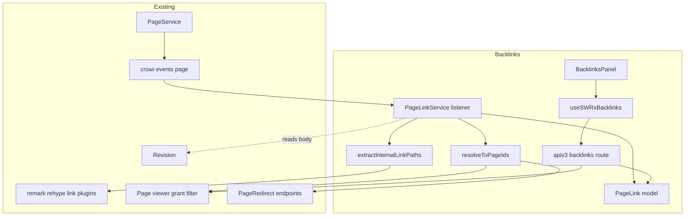
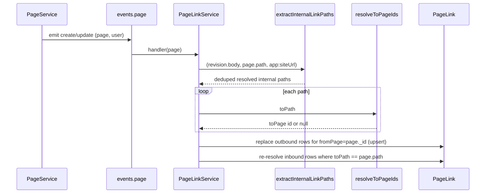
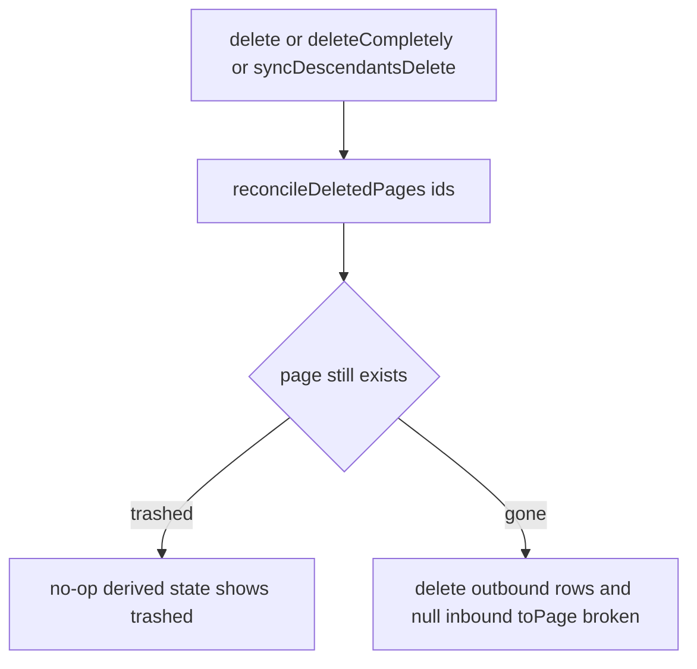
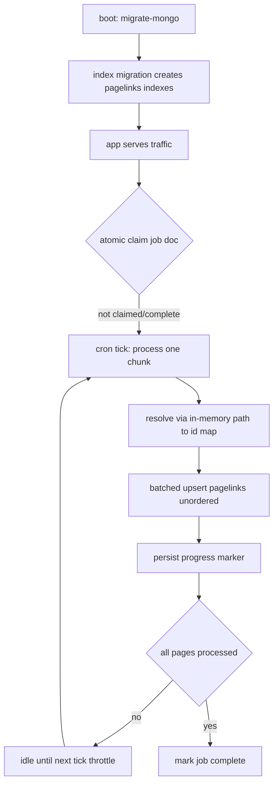

# Design Document

## Overview

**Purpose**: Backlinks gives every GROWI page a trustworthy "what links here" view and surfaces
broken/trashed outgoing links, so readers discover related content and editors stop silently
breaking references on rename or delete.

**Users**: Readers (discover related pages, judge importance), editors (see incoming references
before changing/renaming/deleting a page; spot their own broken outgoing links), administrators
(complete coverage of pre-existing content via a one-time backfill).

**Impact**: GROWI has no link index today — link handling is render-only and client-side. This
feature introduces a new server-side directed **link graph** (`PageLink`), kept current through
the existing page-lifecycle event bus and queried under the existing page-grant model. It adds
storage, one service, one read endpoint, one panel, and a background backfill job; it changes no
existing lifecycle, permission, or Markdown/wiki-link behavior. `pagelinks` is a **Prisma-only**
collection, so its indexes are provisioned by a migrate-mongo index migration (there is no mongoose
schema to build them on connect, and deploy never runs `prisma db push`).

### Goals

- Persist a directed link graph (`fromPage → toPath/toPage`) extracted from page bodies.
- Show permission-filtered backlinks per page in interactive time at ≥100,000 pages.
- Keep the graph accurate across create / update / delete / permanent-delete / subtree-delete,
  and across rename/move and trash/restore with no per-rename writes.
- Backfill all pre-existing pages idempotently.
- Indicate when a link's target is trashed (recoverable) or broken (permanently gone).

### Non-Goals

- Wiki-wide link health/analytics dashboard, visual link graph, outbound automation/webhooks.
- Any change to GROWI's permission model, page lifecycle, redirect behavior, or link syntax.
- A dedicated job queue or `worker_threads`/separate worker process — none exist in GROWI today.
  v1 uses the event-listener seam for live updates and an in-process `CronService` job for
  backfill. Moving Markdown parsing off the main thread (the only way to fully remove CPU
  contention during backfill) is explicitly deferred.
  - **Not excluded**: the lightweight *in-process* coalescing queue the live listener uses (a
    `Set<pageId>` drained on a paced tick — see PageLinkService / Performance & Scalability). It is
    plain in-memory state on the same thread, not a durable queue, worker, or separate process, so
    it is consistent with this non-goal.
- A **blocking boot-time** backfill (a migrate-mongo data migration). Ruled out: it would take
  the wiki offline for the full backfill duration, which scales with page count and is
  unacceptable for large instances. Index creation is not boot-blocking in practice either — the
  index migration runs at boot but builds three indexes on a new, empty collection, which is
  effectively instant; it is the *data* backfill that had to move off the boot path.
- Indexing attachments or `/share/*` targets (only creatable GROWI pages are indexed).

## Boundary Commitments

### This Spec Owns

- The `PageLink` collection and its schema, indexes, and uniqueness invariant.
- Server-side extraction of internal page links from a revision body + the page's path,
  including links written as page permalinks (`/{pageId}`) and absolute URLs whose origin is
  this wiki (`app:siteUrl`).
- Resolution of a stored `toPath` to a target page `_id` (`toPage` cache), including redirect
  following and direct `_id` resolution when `toPath` is a permalink.
- Synchronization of `PageLink` rows in response to page-lifecycle events.
- The one-time backfill: a background `CronService` job that populates rows for pre-existing pages
  without taking the wiki offline. (The `pagelinks` indexes themselves come from the index
  migration — cheap on an empty collection — not from this job.)
- The read API + SWR hook + UI panel that present backlinks and forward-link health.

### Out of Boundary

- Emitting page-lifecycle events, and the page create/update/delete/rename logic itself
  (consumed read-only via `crowi.events.page`).
- The grant/permission model and its condition generator (consumed via the shared viewer/grant
  filter — `PageQueryBuilder.addViewerCondition` / `generateGrantCondition`, as `findByIdsAndViewer`
  also does).
- Markdown/wiki-link parsing and link resolution rules (consumed via existing remark/rehype
  plugins; no syntax owned here).
- `PageRedirect` creation/cleanup (consumed read-only via
  `retrievePageRedirectEndpointsBatch`; see Modified Files — the batch static itself is owned
  by the model, not by this feature).

### Allowed Dependencies

- `@growi/core` utilities (`@growi/core/dist/utils`): `normalizePath`, `isCreatablePage`,
  `isPermalink`, `removeHeadingSlash`.
- Configuration: `crowi.configManager.getConfig('app:siteUrl')` — read-only, used solely to
  recognize absolute URLs that point back to this wiki (may be `undefined`).
- Renderer plugins: `pukiwiki-like-linker`, `relative-links`,
  `relative-links-by-pukiwiki-like-linker`, and `generateCommonOptions`'s plugin set.
- Mongoose models: `Page` (`findByPath`, `PageQueryBuilder.addViewerCondition` /
  `addConditionToExcludeTrashed`), `Revision`, `PageRedirect`.
- `crowi.events.page` (subscribe only), apiv3 middleware (`accessTokenParser`, `loginRequired`),
  `getModelSafely` + `createBatchStream`, `CronService` (node-cron base) and the
  admin Socket.IO channel for backfill scheduling/progress (mirroring the page-bulk-export job).
- **Constraint**: dependency direction is one-way — backlinks depends on page/render/grant
  subsystems; none of them may import backlinks.

### Revalidation Triggers

Re-check this feature if any of the following change:

- `crowi.events.page` event names or payload shapes (esp. `delete`, `deleteCompletely`,
  `syncDescendantsDelete`).
- `PageQueryBuilder.addViewerCondition` / `addConditionToExcludeTrashed` / `generateGrantCondition`
  (and `Page.findByIdsAndViewer`) signatures or semantics.
- The remark/rehype link-resolution plugins' resolution rules or `pagePath` injection.
- `PageRedirect.retrievePageRedirectEndpoints` contract (it is now a lookup over
  `retrievePageRedirectEndpointsBatch`, but its signature and return shape are unchanged).
- `normalizePath` / `isCreatablePage` behavior.
- The `PageLink` schema, its `toPath` faithfulness rule, or the derived target-state contract
  (would force consumers of the read API to revalidate).
- The page-bulk-export job pattern / `CronService` base, or the backfill job's claim/progress
  contract (affects backfill resumability and multi-instance safety).
- `isPermalink` / `removeHeadingSlash` semantics, or GROWI's permalink convention (`/{pageId}`).
- The `app:siteUrl` config key, or `NextLink`'s own-host rule (`isExternalLink`: compares
  `baseUrl.host !== hrefUrl.host`) that link extraction mirrors for absolute URLs.

## Architecture

### Existing Architecture Analysis

- **No prior links infrastructure** — this is greenfield storage grafted onto existing seams.
- **Render pipeline is the single source of "what is a link"** — reusing it server-side keeps
  the index faithful to what the renderer shows and avoids a divergent parser.
- **Event bus is the integration seam** — `search.ts` already subscribes to `crowi.events.page`;
  backlinks follows that precedent, so `PageService` is not modified.
- **Grant filtering is centralized** — the shared viewer/grant filter (`addViewerCondition` /
  `generateGrantCondition`, as also applied by `findByIdsAndViewer`) is the only correct place to
  enforce visibility; the read path must route through it.

### Architecture Pattern & Boundary Map



**Architecture Integration**:
- **Selected pattern**: event-driven projection — `PageLink` is a read-optimized projection of
  page bodies, updated by listeners, queried directly for reads.
- **Domain boundaries**: extraction (body → paths), resolution (path → page id), persistence
  (`PageLink`), read (query + grant filter), presentation (panel) are separate single-purpose
  modules.
- **Existing patterns preserved**: event subscription (`search.ts`), model definition
  (`PageTagRelation`), apiv3 factory routes, SWR hooks, `PageAccessoriesModal` tabs.
- **New components rationale**: each new file owns exactly one of the boundaries above.
- **Dependency direction**: `interfaces → model → {extract, resolve} → service → route → hook → UI`.
  Each layer imports only leftward.

### Technology Stack

| Layer | Choice / Version | Role in Feature | Notes |
|-------|------------------|-----------------|-------|
| Frontend | React + SWR (existing) | Backlinks panel + data hook | New tab in `PageAccessoriesModal`; reuse `PageListItemS`/`PagePathLabel` |
| Backend / Services | Express apiv3 + a new `PageLinkService` | Read endpoint + event listeners | Listener wired in `crowi` setup like `search.ts` |
| Rendering | Existing unified remark/rehype plugins | Server-side link extraction | Node-compatible; trimmed processor (link plugins only) |
| Data / Storage | MongoDB via **Prisma** (`~/utils/prisma`) | `pagelinks` collection + indexes | Prisma-only collection: no mongoose schema, methods on a `Prisma.defineExtension` block; indexes provisioned by `migrations/20260901064500-add-indexes-to-pagelinks.js` (nothing runs `prisma db push`, so schema.prisma declares indexes but creates none) |
| Messaging / Events | `crowi.events.page` (Node EventEmitter) | Sync triggers | Subscribe only |
| Background job | `CronService` / node-cron (existing) | One-time backfill of pre-existing pages | Chunked + resumable + throttled; mirrors page-bulk-export job; admin Socket.IO progress |

## File Structure Plan

### Directory Structure

Tests are co-located (`*.spec.ts` / `*.integ.ts`) and omitted below. Files marked **(story)** are
not yet implemented and land with that story.

```
apps/app/src/features/backlinks/
├── interfaces/
│   ├── page-link.ts              # IPageLink + PageLinkDocument/PageLinkModel (statics declared as implemented)
│   └── backlink.ts               # read DTOs: IBacklink, IBacklinkResponse (+ LinkTargetState B5.1, ILinkTarget B5.4, response.linkTargets B5.9)
├── server/
│   ├── models/
│   │   ├── page-link.ts          # Prisma extension (Prisma.defineExtension) — the pagelinks model methods
│   │   ├── page-link-indexes.ts  # index declaration + ensurePageLinkIndexes (integ harness; production uses the migration)
│   │   ├── throw-on-write-errors.ts    # $runCommandRaw replies carry writeErrors/writeConcernError inside ok:1 — throw on both
│   │   └── page-link-backfill-job.ts   # (B3) Mongoose model: backfill progress marker + atomic claim (multi-instance)
│   ├── services/
│   │   ├── extract-internal-link-paths.ts  # pure: (markdown, pagePath, siteUrl?) => Promise<string[]> (resolved, deduped)
│   │   ├── target-page-resolution.ts   # toPaths -> Map<toPath, toPage id> (permalink by id | findByPath + redirect) — live path only
│   │   ├── page-link-sync.ts           # pure-ish row ops: dropSelfLinks, syncOutboundLinks (+ reconcile-delete B5.2, re-resolve inbound B4.2)
│   │   ├── page-link-service-handlers.ts   # Crowi-free lifecycle handlers: load body -> extract -> resolve -> sync
│   │   ├── page-link-upsert-queue.ts   # coalescing queue (Set<pageId> + duty-cycle paced drain) — requirement 3.5
│   │   ├── upsert-queue-pacing.ts      # validates the configured pacing budget, per-value fallback to CONFIG_DEFINITIONS
│   │   ├── find-backlinks.ts           # read query: backlink sources filtered by viewer grant
│   │   ├── link-target-state.ts        # (B5.1) pure: (toPage, target status) => LinkTargetState
│   │   ├── find-forward-link-health.ts # (B5.4) read query: a page's trashed/broken outbound targets, viewer-filtered
│   │   ├── page-link-service.ts        # thin Crowi adapter: subscribes to crowi.events.page, owns config access, delegates
│   │   └── page-link-backfill-cron.ts  # (B3) CronService: chunked, resumable, throttled backfill (in-memory path->id map)
│   └── routes/
│       └── backlinks.ts                # apiv3 route factory (GET) — getBacklinksHandlerFactory
└── client/
    ├── stores/
    │   └── backlinks.ts                # SWR hook — useSWRxBacklinks
    └── components/
        ├── BacklinksPanel.tsx          # incoming list + empty state (+ forward-health section — B5.6)
        └── BacklinkListItem.tsx        # one row (title + path + target-state badge — badge B5.5)

# Migration: apps/app/src/migrations/20260901064500-add-indexes-to-pagelinks.js provisions
# the three pagelinks indexes. Required because pagelinks is a prisma-only collection — no
# mongoose schema builds them on connect, and deploy never runs `prisma db push`. The
# migration deliberately repeats the list in page-link-indexes.ts rather than importing it
# (a migration is an immutable snapshot); the two are kept in step by the index-inventory
# assertion in page-link-read-perf.integ.ts. The backfill remains the online cron job
# above, not a migration.
```

> **Outgoing-health types are declared by B5, not up front.** `interfaces/backlink.ts` holds only
> `IBacklink` / `IBacklinkResponse` today; the `LinkTargetState` union arrives with its derivation
> helper in **B5.1**, the `ILinkTarget` DTO with the forward-health read in **B5.4**, and
> `IBacklinkResponse.linkTargets` with the endpoint/hook wiring in **B5.9**. The target
> shapes below (§ Data Models) are unchanged — only *when* they are declared moved. (The original plan
> declared both in B1.1; B1 shipped without them, and keeping a type in the same change as its only
> producer is the better trade than a type with no consumer.)

### Modified Files
- `apps/app/src/server/crowi/index.ts` — instantiate and initialize `PageLinkService`
  (subscribe to events) in the page-service setup phase, mirroring `search.ts`; **(B3)** also register
  the backfill `CronService` (mirroring the page-bulk-export job-cron registration).
- `apps/app/src/server/routes/apiv3/index.js` — register the backlinks route.
- `apps/app/src/server/models/page-redirect.ts` — add `retrieveFromPathsRedirectingTo` (the reverse
  walk: which paths reach a given one) and re-implement `removePageRedirectsByToPath` over it, so
  that pipeline exists once as well. Add the `retrievePageRedirectEndpointsBatch`
  static (`$match: { fromPath: { $in } }` + the existing `$graphLookup`) and re-implement
  `retrievePageRedirectEndpoints` as a lookup over it. Adding it to the model rather than to this
  feature keeps one copy of the pipeline; the singular contract is unchanged for
  `page-data-props.ts`. Its duplicate-match handling is kept as-is — first match wins and a
  `logger.warn` names the `fromPath`. `fromPath` is unique-indexed, but MongoDB refuses to build a
  unique index over a collection that already holds duplicates (this one was populated by a data
  migration) and the app boots anyway, so duplicates are reachable; without the explicit first-wins
  the winner would be decided by aggregation order, which is not guaranteed. The depth cap is a
  parameter (`maxDepth`), not baked into the pipeline: `$graphLookup` is memory-bound at 100MB with
  no disk spill, so the save path passes 50, while page view passes nothing — a cap there would
  answer an old URL with a not-found once the chain outgrows it.
- `apps/app/src/client/components/PageAccessoriesModal/PageAccessoriesModal.tsx` (+ the
  modal-contents map in `apps/app/src/states/ui/modal/page-accessories.ts`) — add the **Backlinks**
  tab mapping to `BacklinksPanel`.

> Each file owns one responsibility. `extract-internal-link-paths.ts` and `target-page-resolution.ts` are
> pure/stateless and unit-testable in isolation; `page-link-service.ts` is the only framework
> adapter (event wiring) and receives the page/body as input rather than owning lifecycle logic.

## System Flows

### Save → extract → index (create / update)


### Read backlinks (permission-filtered)
```mermaid
sequenceDiagram
    participant UI as BacklinksPanel
    participant API as backlinks route
    participant DB as PageLink
    participant Grant as viewer grant filter

    UI->>API: GET backlinks pageId
    API->>DB: find toPage == pageId -> fromPage ids
    API->>Grant: ids + user + groups (exclude trashed sources)
    Grant-->>API: readable active source pages
    API-->>UI: backlinks [path, title]; empty state if none
```

### Delete-family reconcile (uniform, state-based)


Key decisions: rename/move emit no usable event and need none — `_id`-stable `toPage` plus
redirect-following resolution keep inbound links valid (requirement 5); permalink links
(`toPath = /{id}`) are immune by construction and need no redirect-following at all (5.4). Restore
needs no write — derived state reads the restored page's status.

## Requirements Traceability

| Requirement | Summary | Components | Interfaces / Flows |
|-------------|---------|------------|--------------------|
| 1.1 | Show list of linking pages | BacklinksPanel, route, PageLinkService.findBacklinks | Read flow |
| 1.2 | Recognize MD / wiki / raw-HTML anchors | extractInternalLinkPaths (+ render plugins) | — |
| 1.3 | Exclude external (diff-host) URLs / in-page fragments | extractInternalLinkPaths classifier | — |
| 1.4 | Ignore links inside code | extractInternalLinkPaths (HAST has no `<a>` in code) | — |
| 1.5 | One source listed once | unique `{fromPage,toPath}` + dedupe in extraction | Save flow |
| 1.6 | Exclude self-link (path or own permalink) | extractInternalLinkPaths (drop `toPath == page.path`) + sync (drop `toPage == fromPage`) | Save flow |
| 1.7 | Empty state | BacklinksPanel | Read flow |
| 1.8 | Show title + path | IBacklink DTO, BacklinkListItem | Read flow |
| 1.9 | Permalink (`/{id}`) link targets page by id | extractInternalLinkPaths (verbatim) + resolveToPageIds permalink branch | Save flow |
| 1.10 | Same-host absolute URL → internal | extractInternalLinkPaths classifier (`app:siteUrl` host match) | — |
| 1.11 | Unset `app:siteUrl` → absolute URLs not internal | extractInternalLinkPaths classifier (no base origin) | — |
| 2.1 | Only readable linking pages | findBacklinks → addViewerCondition (shared grant filter) | Read flow |
| 2.2 | Unreadable omitted from list and count | addViewerCondition + addConditionToExcludeTrashed (filter ids in-query) | Read flow |
| 2.3 | No leak of title/path/existence | DTO built only from filtered pages | Read flow |
| 2.4 | Grant change reflected | per-request filtering (no cached list) | Read flow |
| 3.1 | Create → backlinks appear | PageLinkService create handler | Save flow |
| 3.2 | Update add/remove → reflected | create/update replace outbound rows | Save flow |
| 3.3 | Deleted page not an active source | reconcile (permanent: remove rows; trashed: filtered at read) | Delete flow |
| 3.4 | <~1s at ≥100k pages | indexes `{toPage}`, unique `{fromPage, toPath}` | — |
| 3.5 | Bound extraction impact under save bursts | PageLinkService coalescing queue (`Set<pageId>` + paced drain) | Save flow |
| 4.1 | One-time backfill | PageLinkBackfillCron (indexes via the `pagelinks` index migration) | Backfill flow |
| 4.2 | Backfilled == post-enablement | backfill reuses `extractInternalLinkPaths`; emits same rows as the live path | Backfill flow |
| 4.3 | Re-run / restart produces no duplicates | unique `{fromPage,toPath}` + upsert; resumable progress marker | Backfill flow |
| 5.1 | Links survive rename/move | resolveToPageIds redirect-following + `_id`-stable cache | Reconcile notes |
| 5.2 | Descendants re-associated | same (each descendant keeps `_id`) | Reconcile notes |
| 5.3 | Unresolvable move → broken | absent from the resolveToPageIds map → `toPage: null` → broken state | Read flow |
| 5.4 | Permalink links rename-immune (no re-association) | resolveToPageIds permalink branch + `_id`-stable `toPath`/`toPage` | Reconcile notes |
| 6.1 | Soft-delete target → trashed | derived state from target status | Delete flow |
| 6.2 | Permanent-delete target → broken | reconcile nulls inbound `toPage` | Delete flow |
| 6.3 | Restore → normal | derived state (no write) | Delete flow |
| 6.4 | Indicate trashed/deleted target on viewed page | forward-health read (fromPage=X) → `linkTargets` on the backlinks endpoint → `useSWRxBacklinks` → panel section + badge | Read flow |

## Components and Interfaces

| Component | Layer | Intent | Req | Key Dependencies (P0/P1) | Contracts |
|-----------|-------|--------|-----|--------------------------|-----------|
| pagelinks (PageLink) model | Data | Persist directed link edges | 1.5,3.x,4.3 | Prisma client extension (P0), pagelinks index migration (P0) | State |
| extractInternalLinkPaths | Server logic | Body+path+siteUrl → resolved internal paths | 1.2–1.6, 1.10, 1.11 | render plugins, isCreatablePage, normalizePath, isPermalink, app:siteUrl (P0) | Service |
| resolveToPageIds | Server logic | paths → toPage ids, batched (incl. permalink by id) | 1.9, 5.x | Page.find by _id/path, PageRedirect.retrievePageRedirectEndpointsBatch, isPermalink (P0) | Service |
| PageLinkService | Server service | Subscribe to events, sync index, query backlinks | 1.1,2.x,3.x,5,6 | events.page (P0), PageQueryBuilder.addViewerCondition (P0) | Service, Event |
| getBacklinksHandlerFactory (routes/backlinks.ts) | API | Read endpoint — incoming backlinks **+ forward-link health** (B5.9) | 1.1,1.7,2.x,6.4 | apiv3 middleware (P0), PageLinkService (P0) | API |
| useSWRxBacklinks | Client store | Fetch backlinks **+ link targets** (B5.9) | 1.1,6.4 | apiv3Get (P0) | Service |
| BacklinksPanel / BacklinkListItem | UI | Render list, empty state, target-state badge | 1.1,1.7,1.8,6.4 | useSWRxBacklinks, PageListItemS (P1) | — |
| PageLinkBackfillCron | Batch | Populate pre-existing pages (chunked, resumable, throttled, online) | 4.1,4.2,4.3 | CronService (P0), extractInternalLinkPaths (P0), Revision, in-memory path→id map (P0) | Batch, State |

### Data / Server logic

#### PageLink model

| Field | Detail |
|-------|--------|
| Intent | Authoritative directed link edge: `fromPage` links to `toPath` (faithful to body), cached to `toPage` |
| Requirements | 1.5, 3.1–3.3, 4.3 |

**Responsibilities & Constraints**
- `toPath` is the **source of truth** (exactly what the body resolves to); `toPage` is a derived
  `_id` cache, always computed from `toPath`, never the reverse.
- Invariant: at most one row per `(fromPage, toPath)` (unique index) → requirement 1.5.
- `toPage` is `null` **only** when no live page and no redirect chain resolves `toPath`.
- For a **permalink** row, `toPath` is the resolved `/{pageId}` and `toPage` is the page with that
  `_id` (or `null` if no such page exists); this row is rename-immune by construction (5.4).

**Contracts**: State [x]

##### State Management
- **Prisma-only collection.** `pagelinks` is declared in `apps/app/prisma/schema.prisma` and its
  model methods live in a `Prisma.defineExtension` block (`server/models/page-link.ts`) — there is no
  mongoose schema and no `getOrCreateModel`. It joins the repo's prisma-only pattern
  (`auditlog_es_sync_status`, `changestream_resume_tokens`) rather than the mongoose-schema-plus-
  extension shape the `mongoose-to-prisma` skill produces for models that predate Prisma, because it
  is greenfield and unshipped. No `__v`: nothing has ever written it through mongoose.
- Row shape (`interfaces/page-link.ts`; `Types.ObjectId` is the id type the rest of the server passes
  around, not a mongoose data-access dependency):
```typescript
interface IPageLink {
  fromPage: ObjectId;        // ref Page, required
  toPath: string;            // canonical resolved path, required
  toPage: ObjectId | null;   // ref Page cache, default null
}
```
- Indexes — **three**, provisioned by `migrations/20260901064500-add-indexes-to-pagelinks.js`
  (`prisma db push` is never run, so schema.prisma's `@@index`/`@@unique` describe them but create
  nothing): unique `fromPage_1_toPath_1`, `toPage_1`, `toPath_1`. There is deliberately **no
  standalone `fromPage_1`** — `fromPage` is the compound's prefix, so every `fromPage`-only lookup
  already rides it and a separate index would be dead weight. `fromPage_1_toPath_1` is a correctness
  constraint, not tuning: `replaceOutboundLinks` upserts against that filter.
- Model methods: `replaceOutboundLinks(fromPageId, resolvedRows)`, `findBacklinkSources(toPageId)`,
  `repointInboundLinks(toPath, toPage)`, `removeLinksForPages(pageIds)` (B5.1).
- **Raw-command rule.** Several of these use `client.$runCommandRaw` because Prisma's query API
  cannot express what they need (no bulk-upsert API; `repointInboundLinks` needs a pipeline update).
  MongoDB reports per-statement failures *inside* an `ok: 1` reply, so **every raw write passes its
  reply through `throwOnWriteErrors`**, which throws on both `writeErrors` and `writeConcernError` —
  parity with the `bulkWrite(..., { ordered: true })` these replaced, which threw on both. Do not add
  try/catch at call sites; `PageLinkUpsertQueue` is the error boundary.
- `repointInboundLinks` is the write half of re-resolve-by-path: it points the rows matching
  `toPath` at an already-resolved `toPage` (`null` = broken) and resolves nothing itself. The
  resolution lives in the `reResolveByToPath` **service** (page-link-sync), mirroring the
  `syncOutboundLinks` / `replaceOutboundLinks` split — so the derived `toPage` is always what the
  shared resolver reports, never a value the caller supplies. The method **clears** the row whose own
  source is the target (a page is never its own backlink) rather than skipping it — skipping would
  preserve whatever page occupied the path when that source was last saved, leaving it listed as a
  backlink of a page its body no longer points to. The row itself is cleared, not deleted: row
  existence stays owned by `replaceOutboundLinks`, and `dropSelfLinks` removes it on the source's
  next save.
  - A self row therefore reads as `broken` under the derived target state below (`broken :=
    toPage == null`), even though the path resolves. It is transient — `dropSelfLinks` removes the
    row on the source's next save — so `findForwardLinkHealth` must not report it as broken (B5.4).
  - Both arguments are validated: `toPath` unless it is a non-empty string, `toPage` unless it is an
    ObjectId or null. Neither is protected downstream — `toPath` becomes a query filter where an
    operator object would match every row, and `toPage` goes into an aggregation pipeline, which is
    not type-checked, so an expression object there would be evaluated into the column. (The
    validation matters *more* under Prisma than it did under mongoose: this is a `$runCommandRaw`
    pipeline update, so nothing casts either argument on the way to the server.)
  - The two writes are one pipeline update, so a row is never momentarily its own backlink and a
    failure cannot leave it that way.
- `removeLinksForPages` (B5.1) is the delete-side primitive, and like the other two it is named for
  its mechanism, not for the decision: it writes unconditionally, and the trashed-vs-gone decision
  lives in the `reconcileDeletedPages` **service** (B5.2). Both names exist on purpose — same split
  as `syncOutboundLinks` / `replaceOutboundLinks` and `reResolveByToPath` / `repointInboundLinks`.
- It is **two writes, not one**: delete the gone pages' outbound rows (`fromPage $in ids`), then null
  every inbound cache pointing at them (`toPage $in ids` → `toPage: null`), which is what makes those
  rows read as `broken`. Outbound goes first because those are the rows that have lost their source
  and could still be surfaced as a phantom backlink. No new index — both filters ride existing ones
  (`fromPage_1_toPath_1` by prefix, `toPage_1`).
  - **The two halves cannot use the same API, and this was measured, not assumed.** The delete is
    plain `deleteMany` through the Prisma query API (verified working). The inbound null **must** be
    `$runCommandRaw` + `throwOnWriteErrors`, for two independent reasons: `pagelinks.updateMany`'s
    generated data input accepts **only `toPath`** — the relation scalars are not settable through it
    (`Unknown argument 'toPageId'`), nor via the relation (`toPage: { disconnect: true }`) — **and**
    the client-wide `$allModels.updateMany` extension in `utils/prisma.ts` injects
    `v: { increment: 1 }` for mongoose optimistic-concurrency parity, a field this prisma-only
    collection deliberately does not have. So *any* update on `pagelinks` through the query API is a
    `PrismaClientValidationError`; the raw command is the only route, independent of whether a
    pipeline update is needed. (No prisma-only, `v`-less model had ever been updated before this, so
    the trap was unexercised.)
  - No argument validation, unlike `repointInboundLinks`: every id is stringified and then wrapped as
    `$oid` (or cast by Prisma), so an operator object from an untyped caller cannot reach a filter
    position — it degrades to a malformed id the server rejects.
  - Not a transaction: the index is a derived cache, the two halves are independently idempotent, and
    staying single-command-per-write keeps the collection standalone-MongoDB compatible (the same
    trade `replaceOutboundLinks` documents).
- **Batching is the caller's job, not the primitives'.** Every write primitive here sends its whole
  work-set in a single command — `removeLinksForPages` puts all of `pageIds` in one `$in`,
  `replaceOutboundLinks` emits one update statement per extracted row plus a `$nin` over every path.
  A large enough work-set therefore approaches MongoDB's 16MB command cap (and, for
  `replaceOutboundLinks`, the 100,000-statement batch cap), and the command is rejected whole: the
  write throws and the rows stay stale until the next save or a backfill — loud, and self-healing,
  but a real gap in the meantime. None of the primitives chunk internally, deliberately: every
  recursive delete path in `PageService` already funnels through
  `createBatchStream(BULK_REINDEX_SIZE)` (100), so the delete-family handlers (B5.3) can only ever
  hand over a batch of that size, and a chunk loop would be an untestable branch guarding a caller
  that does not exist. **The precondition, not the loop, is the contract** — it is stated on
  `removeLinksForPages`' JSDoc for the next caller to find. If a future caller assembles page ids
  outside a batch stream (a backfill, a migration, a group-deletion sweep), chunk **both** primitives
  at that point, with a threshold that caller's measured size justifies. (Raised in review of B5.1.)

#### extractInternalLinkPaths

| Field | Detail |
|-------|--------|
| Intent | Pure function: `(markdown, pagePath, siteUrl?) => Promise<string[]>` of deduped, resolved, internal page paths |
| Requirements | 1.2, 1.3, 1.4, 1.5, 1.6, 1.10, 1.11 |

**Contracts**: Service [x]

##### Service Interface
```typescript
function extractInternalLinkPaths(markdown: string, pagePath: string, siteUrl?: string): Promise<string[]>;
```
- **Async because the markdown stack is lazy-loaded**: this module sits in the server boot graph
  (crowi → PageLinkService → handlers), so the unified / remark / rehype plugins are pulled in with
  dynamic `import()` inside the function instead of at top level (~16 MiB RSS otherwise paid by every
  deployment). Extraction runs off the request path on the drain timer, so the first-load cost is not
  user-visible. Guarded by `no-eager-markdown-imports.spec.ts`; see `.claude/rules/server-boot-imports.md`.
- **Mechanism**: run a trimmed unified processor reusing `pukiwikiLikeLinker` (remark),
  `remark-rehype` (`allowDangerousHtml`), `rehype-raw`, `relativeLinksByPukiwikiLikeLinker({ pagePath })`,
  `relativeLinks({ pagePath })`, then a terminal collector over `selectAll('a[href]')`.
  Note `relativeLinks` resolves **relative** hrefs to `/`-paths but **leaves absolute `http(s)://`
  URLs untouched**, so the collector must classify each `href` itself.
- **Per-href classification** (in the collector):
  - in-page fragment (`#…`) → drop (1.3).
  - absolute URL — **defined as having an explicit scheme** (`/^https?:\/\//`), **not** a
    root-absolute `/path` nor a relative href: mirror `NextLink.isExternalLink` — parse with a base
    (`const u = new URL(href, siteUrl)`, wrapped in try/catch; on parse error treat as non-internal
    and drop). Keep `u.pathname` as the target **iff** `siteUrl` is set **and**
    `u.host === new URL(siteUrl).host` (1.10); otherwise drop as external (1.3). When `siteUrl` is
    `undefined`, no scheme-bearing URL is internal → all dropped (1.11). Host comparison (not
    origin) matches `NextLink`.
  - otherwise (a root-absolute or relative-resolved `/`-path, including a permalink `/{id}`) → use it.
- **Postconditions** (each returned path): `new URL(href, base).pathname` strips `?query`/`#anchor`;
  `normalizePath` applied; passes `isCreatablePage` (a bare-ObjectId permalink path `/{id}` passes
  this gate, so permalink targets are returned verbatim and resolved by id downstream — 1.9); not
  equal to `normalizePath(pagePath)` (path self-link excluded, 1.6 — a **permalink** self-link is
  dropped at sync, see PageLinkService); list deduped (1.5).
- **Excluded**: different-host absolute URLs (1.3, 1.11) and in-page `#` anchors (1.3). Exclusion
  is purely by host/fragment, **independent of authoring form** — a same-host absolute URL is
  internal (1.10) whether written as `[x](url)` or as a bare autolink (both are `<a href>` in the
  HAST and indistinguishable); links in code spans/blocks never appear as `<a>` (1.4).
- **Purity**: `siteUrl` is an injected parameter; the function does not read `configManager` itself.
- Skip `sanitize`/`katex`/`math` plugins — only link resolution is needed.

#### resolveToPageIds

| Field | Detail |
|-------|--------|
| Intent | Resolve a page's extracted `toPath`s to target page `_id`s in one batch — by id for permalinks, else by path/redirect |
| Requirements | 1.9, 5.1, 5.2, 5.3, 5.4 |

**Contracts**: Service [x]

##### Service Interface
```typescript
function resolveToPageIds(paths: string[]): Promise<Map<string, ObjectId>>;
```
- **Batched.** A page carries many links and every save re-resolves all of them, so the resolver
  takes the whole set and answers with one `$in` query per stage. Keys are always the **input**
  string, never a redirect endpoint, so a caller's stored `toPath` stays faithful to the body.
  Inputs that resolve to no page are absent from the map (the `null` of the singular form).
  Resolving per link would make the number of DB round-trips scale with a page's link
  count, which the coalescing drain (3.5) exists to bound.
- Order, applied to the batch: **(0)** inputs where `isPermalink` → one `Page.find({_id: {$in}})`
  (the id *is* the target; no path lookup, no redirect-following). **(1)** the rest → one
  `Page.find({path: {$in}, $or: [{isEmpty: false}, {isEmpty: null}]})` — the `isEmpty`
  clause matches `findByPath`, including the v4-compat `null` — **and**, concurrently,
  `PageRedirect.retrievePageRedirectEndpointsBatch(allPaths, 50)` → **(2)** a path with a redirect
  resolves at `end.toPath`, a path without one resolves at its own live page → **(3)** else absent.
  Step (2) needs one more path query, but only for endpoints step (1) did not already answer.
- Always read `.end.toPath` (handles A→B→C via `$graphLookup`).
- **A redirect on the path outranks a live page at it**, because that is what page view does:
  `resolvePathAndCheckIdentical` (`pages/[[...path]]/page-data-props.ts`) overwrites the requested
  path with `chains.end.toPath` whenever a redirect exists, without ever looking for a live page at
  the requested path. A live page and a redirect can coexist at one path in two ways: the v5 create
  deletes the redirect from a sub-operation that is not awaited and logs rather than retries its
  failure (fixed separately in #11683), and `createV4` — taken whenever `app:isV5Compatible` is
  false — never touches `PageRedirect` at all, which makes the coexistence ordinary rather than
  exceptional on a not-yet-migrated install. Matching the precedence is what keeps a backlink from
  being filed under a page no click reaches. This is why the redirect lookup cannot stop at the paths
  that missed: a live hit does not settle the answer.
  - **Cost, accepted deliberately**: one aggregation on every save of a page that has links, and
    three concurrent queries instead of two when everything resolves. Restoring live-page-first to
    win that query back reintroduces the disagreement, and #11683 does not make it safe — the v4
    path above is unchanged.
- **Cycles resolve one hop, they do not fall out as unresolved.** `$graphLookup` visits each
  document once, so a cycle brings the walk back to the starting document, which is then the
  deepest hop — `end` collapses to `start`. Never a hang, and page view lands on the same hop
  because it reads the same static.
- **Redirect following lives on the model, not here.** `retrievePageRedirectEndpointsBatch` is a
  `PageRedirect` static (`server/models/page-redirect.ts`) and the singular
  `retrievePageRedirectEndpoints` is a lookup over it, so the `$match` + `$graphLookup` pipeline
  and the deepest-hop rule exist exactly once and cannot drift between the page-view redirect and
  the link index. Note that sharing the pipeline only makes the two agree about *where a chain
  ends*; the live-page-versus-redirect precedence above is a separate decision this resolver has
  to make deliberately. This resolver only projects `end.toPath` out of the result.
- **The depth cap is the caller's, not the pipeline's.** The save path passes `maxDepth: 50`
  because it runs on every save and `$graphLookup` is memory-bound at 100MB with no spill to disk.
  Page view calls the same static with no cap: shortening a chain there would answer an old URL
  with a not-found for a page that was renamed more times than the cap.
- **Breadth is not bounded here (deferred to B4.5).** The cap limits how far one chain is walked, not
  how many chains one call walks: `fromPaths` is every link path on the page. The same memory bound
  therefore stays reachable through width, and the failure is silent: the upsert queue logs it and
  retries the page up to `MAX_UPSERT_ATTEMPTS`, but a breadth blow-up is deterministic for that
  page, so every attempt hits the same bound and the queue eventually gives up — that page's links
  stay stale until its next save or the backfill. Left as-is for B4.1 on purpose; B4.5 owns
  chunking `fromPaths`.
- **Permalink targets are the strongest case (1.9, 5.4)**: `toPath` already encodes the immutable
  `_id`, so `toPage` is permanent and immune to rename/move/redirect — it never needs
  redirect-following or re-resolution. (`isPermalink` has already validated a 24-hex ObjectId, so the
  id lookup is safe.)
- **Live path only.** This resolver runs on create/update and on the read path, where a per-page
  batch is negligible. The **backfill must NOT call it per page either** — at millions of pages that
  is millions of DB round-trips. Backfill resolves against an in-memory `{path → _id}` map built once
  (see PageLinkBackfillCron) and skips redirect-following (stragglers self-heal on the next
  edit/read).

#### PageLinkService (event listener + read)

| Field | Detail |
|-------|--------|
| Intent | Subscribe to page events, keep `PageLink` in sync, serve backlinks & forward-health reads |
| Requirements | 1.1, 2.x, 3.x, 5, 6 |

**Dependencies**
- Inbound: `crowi.events.page` events (P0).
- Outbound: `extractInternalLinkPaths`, `resolveToPageIds`, `PageLink` model,
  `PageQueryBuilder.addViewerCondition` + `addConditionToExcludeTrashed` (P0); `Revision` to read
  body when payload lacks it (P1).

**Contracts**: Service [x] / Event [x]

##### Event Contract
- Subscribed events (wired in `crowi` setup like `search.ts`):
  - `create (page, user)` → extract `page.revision.body` → `syncOutboundLinks` →
    `reResolveByToPath(page.path)` (correct stale caches from a prior occupant — match on
    `toPath`, not `toPage:null`; and on every path whose redirect chain reaches it, since those
    rows resolve here too).
  - `update (page, user)` → re-extract → `syncOutboundLinks`.
  - Note: handlers call the `syncOutboundLinks` / `reResolveByToPath` **services** (which drop
    self-links and resolve the target, then persist), never the raw
    `PageLink.replaceOutboundLinks` / `PageLink.repointInboundLinks` model statics directly.
  - `delete (targetPage, deletedPage, user)`, `deleteCompletely (page, user)`,
    `syncDescendantsDelete (pages[], user)` → `reconcileDeletedPages(ids)`.
- Ordering/delivery: listeners run asynchronously after the lifecycle op (fire-and-forget, like
  search indexing); the index trails the HTTP response by that window. No cross-event ordering
  assumptions; handlers are idempotent.
- Write-side coalescing (requirement 3.5): `create`/`update` do **not** extract inline in the event
  callback. They mark the page dirty (`Set<pageId>`) and a paced tick drains it, running the upsert
  handler once per page with the **latest** body (re-read at drain time). This is safe because the
  upsert is idempotent last-writer-wins, so intermediate saves carry no information. Properties:
  - **Same page saved repeatedly** → the `Set` collapses it to one extraction run.
  - **Many distinct pages saved at once** → the drain rests after each page in proportion to the
    extraction time it measured, so a burst of full-body parses is spread over time by cost instead
    of blocking the single JS thread back-to-back. Cost, not page count, is the unit — see the
    write-path pacing note under Performance.
  - **Delete supersedes a pending upsert**: a `delete`-family event for a page removes it from the
    dirty set and routes to `reconcileDeletedPages(ids)` instead, so a stale upsert never re-creates
    rows for a gone page — the upsert path uses `upsert: true`, so those would be orphan rows a
    reader could surface as phantom backlinks.
    _Implementation status — B2.2 ships the drain-time half only: the drain re-reads the page by id
    and declines one that is now `STATUS_DELETED` (keyed on deleted rather than published because a
    legacy page's `null` status means published), which closes the window coalescing opened. Clearing
    the rows the page already owned when it was trashed is **B5.2** (`reconcileDeletedPages`); the
    dirty-set removal — abandoning a pending upsert rather than merely declining it at drain time —
    is **B5.3**._
  - **Best-effort, per-instance**: the set is in-memory. A restart drops pending work (that page
    self-heals on its next edit or via backfill); in multi-instance deployments the set is
    per-instance, which is safe (idempotent) but only coalesces per instance.

##### Service Interface
```typescript
interface IBacklinkResult { backlinks: IBacklink[]; }
findBacklinks(toPageId: ObjectId, user: IUser | null): Promise<IBacklink[]>;
findForwardLinkHealth(fromPageId: ObjectId, user: IUser | null): Promise<ILinkTarget[]>;
```
- `findBacklinks`: `findBacklinkSources(toPageId)` → ids → route them through the shared
  viewer/grant filter (`PageQueryBuilder.addViewerCondition` — the same grant logic
  `findByIdsAndViewer` runs internally, unioning the viewer's normal and external user groups) with
  `addConditionToExcludeTrashed` to **exclude trashed source pages in-query**, then `.select('_id path').lean()`
  and map to `IBacklink` (2.1–2.3). Empty array when none (1.7). The builder is used directly rather
  than the `findByIdsAndViewer` static so trashed exclusion happens in the DB (see risk note below)
  and so only the two fields the DTO needs are hydrated — this keeps the read to the two indexed
  queries described under Performance & Scalability.
- `findForwardLinkHealth`: rows where `fromPage == X`; derive each target's
  `LinkTargetState` (`toPage == null` → `broken`; target trashed → `trashed`; else `normal`);
  return the `trashed`/`broken` rows as `ILinkTarget` for the editor's attention (6.4).
  - **Viewer filtering is required here, unlike `findBacklinks`' source filtering.** `ILinkTarget`
    carries the target's `path`, and since B4.1 resolution follows the rename chain, a `toPage` may
    point at a page that has since moved into an area the viewer cannot read — so the *target* set
    must go through the shared viewer/grant filter before the DTO is built, or this endpoint leaks
    private paths to anyone who can read the linking page. Resolution itself is grant-blind by
    design (it must match what a click does, and the live path lookup was always grant-blind), so
    the filter belongs on this read path, not in `resolveToPageIds`.
  - **One query does both jobs.** Deriving `trashed` needs the target page's `status`, and the leak
    fix needs the target pages run through the grant filter — that is the *same* set of documents, so
    it is a single `Page` query, not a grant query plus a status round trip. Shape: the non-null
    `toPage` ids → `PageQueryBuilder(Page.find({ _id: { $in: targetIds } }))` →
    `addViewerCondition(user)` → `.select('_id path status')`, then derive each row's state from the
    returned document. `broken` rows (`toPage == null`) are settled with no lookup at all.
  - **It cannot reuse `buildVisibleSourcesQuery`.** That builder calls
    `addConditionToExcludeTrashed()`, and trashed targets are exactly what this read reports — so
    forward-health needs its own sibling builder that applies the grant condition **only**, and
    selects `status` (which the backlinks read does not need). Deriving state in the same query is
    what makes the difference load-bearing rather than incidental.
  - **`path` is asymmetric by construction.** For a `trashed` (or `normal`) row it is the target
    page's *current* `path` from that query; for a `broken` row there is no page, so it is the row's
    own `toPath` — faithful to what the body actually links to. That is also why a broken row leaks
    nothing: `toPath` is text the linking page's own author wrote.
  - **A non-null `toPage` absent from the query result is omitted**, not reported as broken: "the
    viewer may not read it" and "the document is gone" are indistinguishable from the result set, and
    reporting the latter would leak the former's existence. A genuinely permanently-deleted target
    becomes `broken` because the delete-family reconcile (B5.2) nulls the inbound cache.
  - A **self row** (`fromPage == toPage`'s page, cleared to `null` by `repointInboundLinks`) also
    reads as `broken` although its path resolves. It is transient and must **not** be reported — see
    the `repointInboundLinks` note under § PageLink model.

**Implementation Notes**
- Integration: register in `crowi` page-service setup; never edit `PageService`.
- Validation: handlers tolerate missing/empty bodies and already-deleted pages (idempotent).
- Extraction input: the service reads `configManager.getConfig('app:siteUrl')` and passes it into
  `extractInternalLinkPaths` (so absolute self-URLs resolve — 1.10/1.11); `extractInternalLinkPaths` stays
  config-free/pure.
- Self-link exclusion (1.6): extraction drops a **path** self-link (`toPath == normalizePath(page.path)`);
  a **permalink** self-link (`/{own _id}`) is dropped at sync by skipping any resolved row whose
  `toPage` equals `fromPage` — this also covers any alias that resolves back to the source.
- Resolved risk: `findByIdsAndViewer` / `addViewerCondition` apply only the grant condition and do
  **not** exclude trashed pages, so `findBacklinks` adds `addConditionToExcludeTrashed` explicitly
  (`status` published/null, excluding `deleted`) rather than relying on the viewer filter.

### API

#### getBacklinksHandlerFactory (routes/backlinks.ts)

**Contracts**: API [x]

##### API Contract
| Method | Endpoint | Request | Response | Errors |
|--------|----------|---------|----------|--------|
| GET | `/_api/v3/page/backlinks` | query: `pageId` (MongoId) | `{ backlinks: IBacklink[], linkTargets: ILinkTarget[] }` | 400, 403, 500 |

- Middleware: `accessTokenParser([SCOPE.READ.FEATURES.PAGE])`, `loginRequired` (guest per ACL),
  `apiV3FormValidator`; `req.user` is the viewer. Delegates to `PageLinkService.findBacklinks` and
  (B5.9) `PageLinkService.findForwardLinkHealth`.
- Response carries only filtered pages (no count derived from unfiltered set) → 2.2.
- **Forward-link health rides this endpoint rather than a second one** (B5.9). It is keyed on the
  same `pageId`, has the same viewer and the same 403 semantics, and `BacklinksPanel` renders both
  sections at once — a separate route would mean a second round trip on every panel open, a second
  hook, and a second registration in `apiv3/index.js`, for no independent cacheability. The two
  reads are issued concurrently (`Promise.all`) so the added field costs no extra latency; each
  applies its own filter (sources for `backlinks`, targets for `linkTargets`).

### Client

#### useSWRxBacklinks (summary)
```typescript
// B5.9 widens the payload from IBacklink[] to the whole response, so the panel can read
// both sections from one fetch. Today (B1) it resolves to r.data.backlinks.
useSWRxBacklinks(pageId: string | null): SWRResponse<IBacklinkResponse, IErrorV3[]>;
```
- Key `['/page/backlinks', pageId, isGuestUser]`; fetch via `apiv3Get<IBacklinkResponse>(...)`.
  Key `null` when `pageId == null`. Errors are `IErrorV3[]`, not `Error` — `apiv3Request` rejects
  with the apiv3 error array.
- **Plain `useSWR`, not `useSWRImmutable`**: grants can change while `pageId` and the user stay the
  same, so a reopened panel must revalidate rather than serve a stale cache for the session.
- Widening the return type is a **breaking change for `BacklinksPanel`** (it currently receives the
  array directly). That churn is deliberately placed in B5.9/B5.6, which are rewriting the panel
  anyway — it is not an unplanned break of B1.11.

#### BacklinksPanel / BacklinkListItem (summary)
- New tab in `PageAccessoriesModal`. `BacklinksPanel` renders the incoming list (empty state per
  1.7) and a secondary "outgoing links needing attention" section from forward-health (6.4).
- `BacklinkListItem` renders title + path (reuse `PagePathLabel`/`PageListItemS`) + a target-state
  badge (`trashed`/`broken`) for the forward-health rows.

### Batch

> **Why the backfill is an online job, not a boot-time migration.** GROWI runs migrate-mongo
> migrations *synchronously at boot, before the app serves traffic* (`docker-entrypoint.ts:247`).
> A data migration that parses every page body would therefore make the wiki **offline for the
> full backfill duration** — minutes on small wikis, but tens of minutes to hours on large-plan
> instances. So the heavy data part runs **online** as a throttled background job after boot.
> Nothing schema-related blocks boot either: the index migration that provisions the three
> `pagelinks` indexes (unique `fromPage_1_toPath_1`, `toPage_1`, `toPath_1`) builds them on a new,
> empty collection, which is effectively instant. Backlinks are simply incomplete
> for pre-existing pages until the job finishes (acceptable per 4.2, which only requires
> completeness *after* the process completes); newly edited pages index immediately via the event
> listener.

#### PageLinkBackfillCron

| Field | Detail |
|-------|--------|
| Intent | Online, one-time backfill of `PageLink` rows for pre-existing pages | 
| Requirements | 4.1, 4.2, 4.3 |

**Responsibilities & Constraints**
- Extends `CronService` (node-cron) and follows the **page-bulk-export job** precedent: each tick
  processes a bounded **chunk** of pages, persists progress, then idles until the next tick.
- **Throttle = cron cadence × chunk size** (the duty cycle). Because the job shares the single JS
  thread, the cadence is the only lever bounding CPU contention with live traffic; default
  conservative (≈10–25% duty), operator-tunable.
- **Resumable**: a `PageLinkBackfillJob` document stores a progress marker (e.g. last processed
  `_id`/path) so a restart continues rather than restarting (4.3).
- **Run-once + multi-instance safe**: the job document carries an **atomic claim**
  (`findOneAndUpdate`) so only one instance in a multi-container deployment runs it, and it stops
  permanently once complete. (GROWI has no distributed lock; this Mongo claim is the minimal
  hardening over the bulk-export pattern, which has a known race window.)
- **In-memory resolution**: loads `{path → _id}` for all pages once (one lightweight projection
  query) and resolves extracted links by hash lookup — **never** the live `resolveToPageIds` per page.
  Redirect-following is skipped during backfill. For a **permalink** `toPath` (`isPermalink`),
  resolution is an **existence check** against the set of known page ids (the map's values):
  present → that id; absent → `null` (broken). The id is the target, so the path map is not
  consulted for permalinks.

**Contracts**: Batch [x] / State [x]

##### Batch / Job Contract
- Trigger: **auto-started from `crowi` setup after boot** (throttled). Skips immediately if the job
  document is marked complete. (Admin-triggered start deferred — see Delivery decision below.)
- Input per chunk: a cursor page-batch (`Page.find(...).cursor({ batch_size })` +
  `createBatchStream`); body via `Revision.findById(page.revision).body`.
- Per page: `extractInternalLinkPaths(body, page.path, siteUrl)` → resolve each path via the in-memory
  map (or, for a permalink path, via the id-existence set) → batched upserts. **`pagelinks` is a
  Prisma-only collection with no mongoose model, so there is no `Model.bulkWrite`**: the chunk write
  is either repeated `replaceOutboundLinks` calls or a new batched model method on the extension —
  and if it uses `$runCommandRaw`, its reply must go through `throwOnWriteErrors` like every other
  raw write here. B3 decides which; `ordered: false` remains the intent for a chunk.
- Idempotency: unique `{fromPage,toPath}` + upsert; safe to re-run and to resume mid-chunk (4.3).
- Progress/observability: emit count/total over the existing admin Socket.IO channel (as the
  Elasticsearch reindex does).

**Delivery decision (resolved): auto-start, throttled.**
- The backfill **auto-starts** from `crowi` setup after boot, bounded by a conservative default duty
  cycle (operator-tunable), and guarantees completion with no admin action. An admin-triggered start
  (operator picks an off-peak window / raises the duty cycle) was considered but **deferred**; the
  job is built so adding that trigger later is a one-line wiring change — it reuses the identical job.

## Data Models

### Logical Data Model
- `PageLink (fromPage → Page._id)` and `(toPage → Page._id | null)`; `toPath: string`.
- Cardinality: one page has many outbound rows; a target has many inbound rows.
- Referential integrity: `fromPage` always references a live page (rows removed when source is
  permanently deleted); `toPage` is a best-effort cache reconciled on lifecycle events and read
  resolution. `toPath` has no FK and is never rewritten on rename (stays faithful to the body).
  For permalink rows, `toPath` is `/{pageId}` and the `toPage` cache is permanent (the id is stable
  across rename/move/restore), so they satisfy 5.4 with no reconciliation.

### Derived target state (not stored)
_Declared in B5.1, alongside `deriveLinkTargetState` — a pure `link-target-state.ts` on the **read**
path, not in `page-link-sync`: nothing on the write path derives this, and B5.4 folds the derivation
into the grant-filtered target query it already has to issue (see § File Structure Plan)._
```typescript
type LinkTargetState = 'normal' | 'trashed' | 'broken';
// broken  := toPage == null
// trashed := toPage resolves to a page whose status is "in trash"
// normal  := toPage resolves to an active page
```

### DTOs
```typescript
// Incoming backlinks (findBacklinks): always live, readable source pages — no health to report.
interface IBacklink {
  pageId: string;
  path: string;
}
// Outgoing link health (findForwardLinkHealth): a page the subject links out to, plus its state.
// Declared in B5.4, alongside the read query that produces it.
interface ILinkTarget {
  // null exactly when targetState is 'broken': a broken row is `toPage == null`, so there
  // is no page id to report. Non-null for 'trashed' (and 'normal', which this read never
  // returns). Making it required-string would be unsatisfiable for the broken case.
  pageId: string | null;
  // The target page's CURRENT path when it exists; the row's own `toPath` when broken.
  path: string;
  targetState: LinkTargetState; // required — a health row is meaningless without it
}

interface IBacklinkResponse {
  backlinks: IBacklink[];
  linkTargets: ILinkTarget[]; // B5.9 — trashed/broken outbound targets of the same page
}
```

## Error Handling

### Error Strategy
- Extraction/sync failures are logged with `{ pageId, path }` context and never propagate to
  break the originating save (listener is decoupled from the save transaction).
- Read endpoint returns `403` if the viewer cannot read the **subject** page, and otherwise
  returns only permission-filtered results (never partial-leak on error).

### Error Categories and Responses
- **User errors (4xx)**: invalid/missing `pageId` → 400 via validator; no access to subject page → 403.
- **System errors (5xx)**: DB/resolution failure → 500 with generic message; details logged only.
- **Business-logic**: an unresolved `toPath` is **not** an error — it is the `broken` state.

### Monitoring
- Log sync handler outcomes (rows written/removed, unresolved count) at debug; log handler
  exceptions at error with page context, mirroring the search-indexer logging style.

## Testing Strategy

### Unit Tests
- `extractInternalLinkPaths`: Markdown `[x](/a)`, wiki `[[l>/a]]` / `[[./child]]`, raw `<a href>`
  all yield resolved internal paths (1.2); external/`#`-anchor/code-fence links excluded
  (1.3, 1.4); duplicates collapsed and the **path** self-link dropped (1.5, 1.6 — permalink
  self-links are dropped at sync, covered in integration); relative resolution uses the correct
  per-type base. A same-host absolute URL (`https://<siteUrl-host>/a/b`) yields
  `/a/b` while a different-host URL is excluded (1.10); with `siteUrl` undefined, absolute URLs are
  excluded (1.11); a permalink `/{id}` is returned verbatim (1.9).
- `resolveToPageIds`: single and double redirect chains resolve to `.end.toPath`; a redirect wins over
  a live page at the same path (matching page view), and a path with no redirect resolves to its own
  live page; no page + no redirect → absent from the map (5.1–5.3). Redirects are consulted for
  every path, not only for the ones that missed. Two paths whose chains converge on one endpoint
  both land in the result (the map is keyed by input). A permalink `toPath` resolves directly by id
  (no path/redirect lookup) and is absent when no page has that id (1.9, 5.4). Several paths resolve
  in one redirect lookup, a cycle advances exactly one hop rather than hanging or falling out, and a
  target in the trash resolves rather than reading as broken (6.1). A mixed batch of permalinks
  and paths resolves both in one call.
- `PageRedirect.retrievePageRedirectEndpointsBatch`: one chain endpoint per requested `fromPath`;
  unrequested paths excluded; an empty input runs no aggregation; a given `maxDepth` stops the walk
  while the default walks the chain to its real end; two documents sharing a `fromPath` resolve to
  the first and log a warning. The existing `retrievePageRedirectEndpoints` tests double as the
  regression net for the shared pipeline, and one of them pins that page view stays uncapped.
- `reconcileDeletedPages` (service): trashed page → no-op; permanently-gone page → delegates to
  `removeLinksForPages` (3.3, 6.2).
- `deriveLinkTargetState`: `broken` when the row has no cached target (outranking any status handed
  in alongside), `trashed` when the target's status is `deleted`, `normal` otherwise — including a
  `null`/`undefined` status, which is a v4-era page that `addConditionToExcludeTrashed` counts as
  published (6.1–6.3).
- `reResolveByToPath`: forwards the target the resolver reports for the path, and forwards `null`
  when the path is absent from the map (so a row can return to broken); resolves and writes the
  paths that redirect to it as well, each carrying the resolver's own verdict rather than the
  target's (5.1, 5.2).
- `retrieveFromPathsRedirectingTo`: every `fromPath` whose chain reaches the path at any depth,
  unrelated redirects excluded, empty when none, and a given cap stops the walk while the default
  reaches the chain's real start.

### Integration Tests
- create/update events drive `PageLink` rows so a page's links appear as backlinks on targets,
  and edits add/remove them (3.1, 3.2). A page that links to its own permalink (`/{own id}`) is
  excluded from its own backlinks (1.6); a permalink-based backlink keeps resolving after the
  target is renamed/moved with no index writes (5.4).
- Backlinks read excludes pages the viewer cannot read, including from any derived count
  (2.1–2.3); grant change flips visibility on the next read (2.4).
- Rename/move: inbound links continue resolving to the page at its new path without index
  writes; descendant move behaves identically (5.1, 5.2).
- `removeLinksForPages` write semantics against a real collection (the observable contract is the
  resulting rows): the gone pages' outbound rows are deleted, inbound caches pointing at them are
  nulled while the rows and their `toPath` survive, unrelated rows are untouched, a batch is handled
  including a row that is both a gone source and a gone target (deleted, not merely nulled), and it
  is idempotent. Mutation-checked: an over-broad `deleteMany`/update filter fails the suite.
- `repointInboundLinks` write semantics, driven through `reResolveByToPath` against a real
  collection (there is no unit spec: the observable contract is the resulting rows, and asserting
  the `updateMany` filter instead would spy on the mechanism). Rows at the path are repointed
  (stale non-null cache → new occupant, and `null` → healed), rows at other paths untouched, and
  the row whose own source is the target is cleared while the rest of the path is still repointed
  (1.6, 5.1, 5.2). A `toPath` that is not a non-empty string is refused without writing anything.
- Re-resolve reaches rows that name a redirecting path, not only exact `toPath` matches: a page
  created at a path that another path redirects to repoints those rows too (5.1, 5.2).
- Trash → derived `trashed`; permanent delete → `broken`; restore → `normal` (6.1–6.3).
- Backfill: rows produced for pre-existing pages match the live create/update path (4.2); running
  the job twice, or resuming after an interrupted chunk, produces no duplicate rows (4.3); the
  atomic claim prevents two instances/ticks from double-processing.

### E2E / UI Tests
- Backlinks tab on a page lists linking pages with title + path; empty state when none
  (1.1, 1.7, 1.8).
- Editor viewing a page that links to a trashed/permanently-deleted page sees the
  trashed/broken indicator (6.4).

### Performance / Load
- Backlinks read for a heavily-linked page returns in interactive time (<~1s) on a ≥100k-page
  dataset, exercising the `{toPage}` index and the viewer filter (3.4).

## Security Considerations

- The only data-exposure surface is `findBacklinks`; it **must** route the source ids through the
  shared viewer/grant filter (`PageQueryBuilder.addViewerCondition`, the same filter
  `findByIdsAndViewer` applies) and **never return raw `PageLink` paths**. `toPath` strings are page
  paths and could reveal restricted pages' existence if returned unfiltered — so the DTO is built
  solely from permission-filtered page documents (only their `_id`/`path` are read).
- `pageId` is validated as a MongoId; no regex is built from user input for MongoDB.

## Performance & Scalability

- Reads are two indexed queries (`{toPage}` lookup, then `_id`-`$in` viewer filter); no
  per-request body parsing. Target: <~1s at ≥100k pages (3.4).
- Writes happen off the response path via the event listener; extraction uses a trimmed
  processor (link plugins only) to bound per-save cost (~120–140 ms for a 60 KB body).
- **Write-side burst control** (requirement 3.5). Extraction is CPU-bound and runs on the single JS
  thread, so N saves landing together would otherwise block the event loop for N × per-parse cost
  back-to-back. Two scenarios, one mechanism:
  - *Same page, rapid saves* (e.g. a shared collaborative doc saved several times in a window) — a
    `Set<pageId>` coalesces them to one run. Naturally low-pressure: a Yjs document is shared, so
    N co-editors produce **one** `update` event per explicit save, not N, and there is no autosave —
    the event fires only on an explicit save (`updatePage`).
  - *Many distinct pages saved at once* — the coalescing queue paces itself by **duty cycle over
    measured extraction time**: after each page it rests `elapsed x (100 - duty) / duty`, so its
    share of the event loop holds at `backlinks:dutyCyclePercent`
    (`BACKLINKS_DUTY_CYCLE_PERCENT`, default 20) whatever a page costs. The drain then runs until
    the queue is empty; there is no per-tick page budget.
    - **Why not a pages-per-tick budget** (the original design, replaced after review of B2.2): a
      page is the wrong unit, because extraction cost spans ~700x across real bodies — measured
      1.6 ms at 0.2 KiB, 8.4 ms at 3.2 KiB, 88 ms at 32.6 KiB, 1116 ms at 333 KiB. The shipped
      3 pages/tick was therefore a ~2.5% duty cycle for typical pages (a 10k-page import trailed
      by ~55 min) while still admitting ~3.3 s of blocking for three large ones. Resting in
      proportion to measured cost makes small pages effectively burst and large pages throttle
      themselves, off one operator knob.
    - **Why the measurement is narrow**: only `extractInternalLinkPaths` is timed, not the whole
      upsert. The surrounding DB round-trips yield the loop, so charging them would rest the queue
      for time it never occupied. A failure is charged its elapsed time instead, since a throw
      after a completed extraction never reports the cost.
    - **Why no page cap remains**: every page that extracts incurs a proportional rest and awaits
      its own DB reads, so a cap guards nothing and only inserts dead time between chunks
      (measured ~56% of the throughput for small pages, the bulk-import case this exists to speed
      up).
    - **Accepted limitation (review of B2.2)**: a page whose upsert fails is retried on a later
      drain after `RETRY_BACKOFF_MS`, up to `MAX_UPSERT_ATTEMPTS`; past that the queue gives up and
      logs it, and the page's links stay stale until its next save or the backfill (B3). The drain
      timer is shared, so a save arriving during a retry backoff waits for it too.
  - The pacing is about spreading work over time (yielding between parses), not parallelism —
    concurrency buys nothing for CPU-bound work on one thread.
  - Trade-off: the index trails the save by up to (tick interval × queue depth) — acceptable, since
    the listener is already fire-and-forget and eventually consistent.
- **Backfill** is the only bulk-CPU operation. It runs online but on the single JS thread, so its
  cron cadence/chunk size (duty cycle) bounds latency impact on live traffic; the in-memory
  `{path→_id}` map keeps it CPU-bound (parsing), not round-trip-bound. Measured ~5 ms/page;
  full-speed ~10 min/100k pages, ~50 min/500k, scaled by duty cycle and page size.

## Migration Strategy

One index migration, no data migration: `migrations/20260901064500-add-indexes-to-pagelinks.js`
provisions the three `pagelinks` indexes at boot (instant on an empty collection); the only bulk step
is the online throttled backfill job after boot.

> **Why the indexes need a migration at all.** `pagelinks` is Prisma-only — no mongoose schema means
> no `autoIndex` on connect, and nothing in this repo runs `prisma db push`, so schema.prisma's
> `@@index`/`@@unique` declarations describe the indexes but create none. The migration is the only
> thing that creates them in production. `server/models/page-link-indexes.ts` repeats the same list
> for the integration harness (which skips migrations on the default in-memory MongoDB); the
> index-inventory assertion in `page-link-read-perf.integ.ts` fails on any drift between the two.
>
> **Leftover indexes from earlier builds.** A dev or staging instance created under the pre-Prisma
> mongoose schema may still carry the redundant standalone `fromPage_1` that B2.2 dropped from the
> schema — `createIndex` adds, it never removes. Harmless while the feature is unreleased; **once
> `pagelinks` has shipped, an index removal needs its own migration with an explicit `dropIndex`.**



- **No boot downtime**: the index migration on the empty `pagelinks` collection is effectively instant. The
  wiki is online throughout the backfill; pre-existing backlinks fill in progressively.
- **Estimated backfill wall-clock** (≈5 ms/page CPU; in-memory resolution): ~10 min/100k pages at
  full speed, scaled up by the inverse duty cycle (e.g. ~40 min/100k at 25% duty) and by average
  page size. See `research.md` for the benchmark and the scale/duty-cycle table.
- Rollback: stop the cron and drop the `PageLink` collection (indexes go with it). Recovery from a
  crash = resume from the progress marker; idempotent upserts make partial progress safe.
