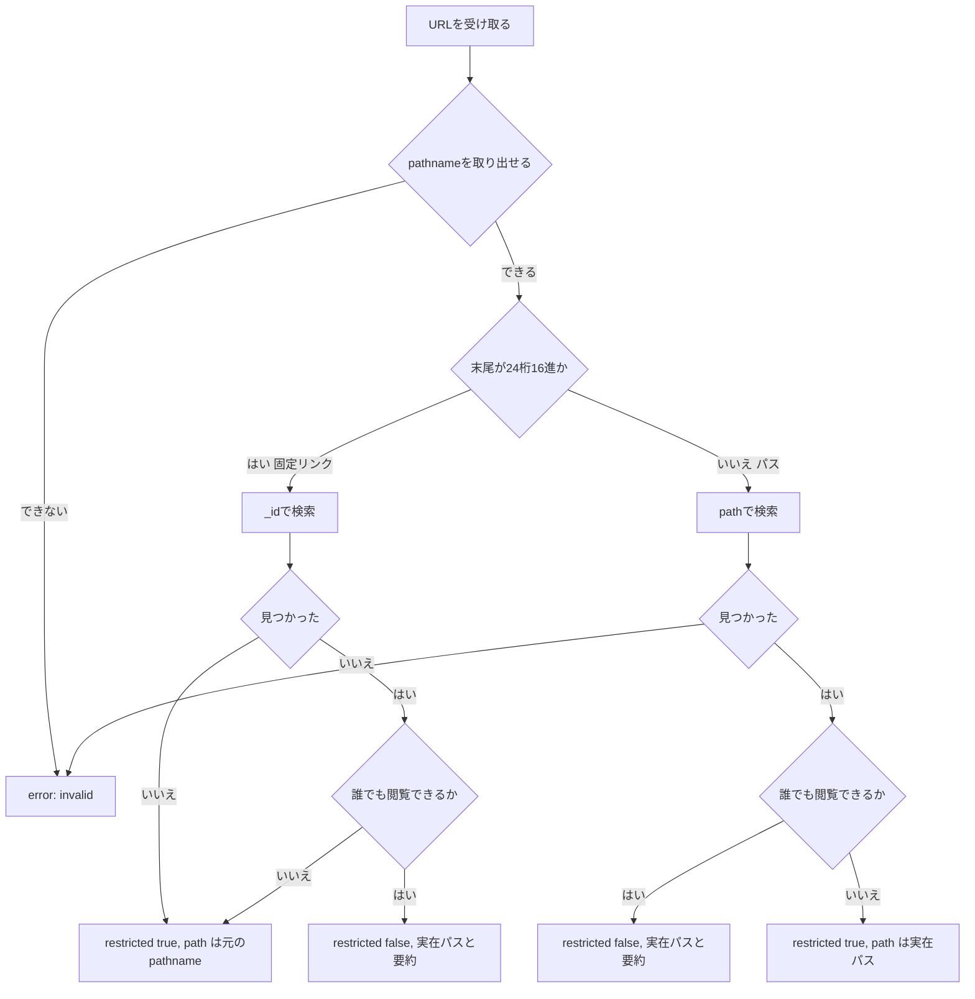

# Design Document

## Overview

**Purpose**: 固定リンク（ページをパス以外の識別子で指す URL）を貼ったときの URL 展開が、投稿者もチャンネルの他の参加者も知らなかった非公開ページの実在パスを開示してしまう問題と、対象を解決できたかどうかが応答の種類そのもので分かってしまう問題（existence-oracle）を閉じる。

**Users**: チャットチャンネルで GROWI のリンクを共有する人、およびそのチャンネルの参加者——閲覧権限を持たない人が対象。

**Impact**: `chat-integration-app` の URL 展開コマンド（`link-preview`）の応答内容の決め方だけを変える。`@growi/chat`（chat-integration-protocol）・`chat-integration-proxy` は変更しない（research.md の「`@growi/chat` の契約と `chat-integration-proxy` の描画」参照）。

### Goals
- 固定リンクで解決した非公開ページの応答に、実在パスを含めない（6.6）
- 固定リンクで解決できない場合の応答を、固定リンクで解決できたが非公開だった場合と区別できない形にする（6.8）
- パス形式 URL の既存の挙動（6.1〜6.5）を一切変えない（6.7）

### Non-Goals
- `@growi/chat` の `CommandResponse`（`link-preview` kind）の契約変更
- `chat-integration-proxy` の応答描画（`previewMarkdown`）の変更
- パス形式 URL で対象が見つからない場合の応答の見直し（要件フェーズで対象外と決定済み）
- 検索・通知・ページ作成など、要件6以外の振る舞い

## Boundary Commitments

### This Spec Owns
- `chat-integration-app` の `link-preview` コマンド処理が、URL から解決した対象（見つかった／見つからない、固定リンクか否か、公開範囲）に応じて、応答へ何を含めるかの判断
- 上記判断を実装する2つの純粋な関数（`resolvePageFromUrl` の返り値の拡張、`buildLinkPreview` のロジック）

### Out of Boundary
- `@growi/chat` の `CommandResponse` の型定義そのもの——変更しない。既存の `path: string`（必須）のまま、中身に何を入れるかだけを変える
- `chat-integration-proxy` の `previewMarkdown`（応答の描画）——変更しない。今のまま `response.path` を無条件に使い続けられる
- Gen 1（`apps/slackbot-proxy`、`packages/slack`）
- URL の参照先がそのチャンネルに紐づく GROWI かどうかの判定（要件6.4）——本 amend が触る解決ロジックより手前の段階で決まる別の関心事

### Allowed Dependencies
- `content/public-page-filter.ts` の `isPubliclyReadablePage`（既存、変更なし）
- `content/excerpt-length.ts` の `EXCERPT_LENGTH`（既存、変更なし）
- `crowi.aclService.isGuestAllowedToRead()`（既存の呼び出し元供給値、変更なし）

### Revalidation Triggers
- `@growi/chat` の `CommandResponse`（`link-preview` kind）に「見つからない」を独立に表現するフィールド（例: `notFound: boolean`）が将来追加された場合、本 amend の「`path` に元の pathname を流用する」方式は不要になるため見直すこと
- `resolvePageFromUrl` の固定リンク判定（`PAGE_ID_PATTERN`）の意味が変わった場合（例: 別の識別子形式を追加する）、本 amend のロジックも合わせて確認すること

## Architecture

### Existing Architecture Analysis

`link-preview` コマンドの現在の処理は2段に分かれている。

1. `resolvePageFromUrl`（`command-endpoint.ts`）— URL からページを解決する。末尾セグメントが24桁16進文字列（Mongo の ObjectId 形式）なら `_id` で、そうでなければ `path` で `Page.findOne` する。見つからなければ `null` を返す
2. `buildLinkPreview`（`content/link-preview-mapper.ts`）— 解決したページ（`null` は呼び出し元が先に弾いている）を受け取り、公開範囲に応じて応答を組み立てる純粋関数

この2段の間で、「固定リンクだったかどうか」「URL から読み取った pathname が何だったか」という情報が失われている。本 amend はこの情報を運ぶ経路を追加するだけで、2段構成そのものは変えない。

### Architecture Integration
- **Selected pattern**: 既存の「解決 → 純粋関数によるマッピング」の2段構成を維持し、2段目が受け取る入力を拡張する
- **Domain/feature boundaries**: 変更なし。ページ解決は `command-endpoint.ts`、応答の組み立ては `content/link-preview-mapper.ts` のまま
- **Existing patterns preserved**: `buildLinkPreview` が純粋関数であること、`isPubliclyReadablePage`/`isGuestAllowedToRead` による公開範囲判定はそのまま再利用
- **New components rationale**: 新規コンポーネントは無い。既存2関数のシグネチャ拡張のみ

## File Structure Plan

### Modified Files
- `apps/app/src/features/chat-integration/server/command/command-endpoint.ts` — `resolvePageFromUrl` の返り値を、解決したページ（見つからなければ `null`）に加えて「URL から読み取った pathname」と「固定リンクかどうか」を含む形へ拡張する。`handleLinkPreview` は `buildLinkPreview` の返り値が `null` のときだけ（＝パス形式 URL で見つからなかったときだけ）`errorResponse('invalid')` にする
- `apps/app/src/features/chat-integration/server/content/link-preview-mapper.ts` — `buildLinkPreview` が「ページが見つからない」ケースも受け取れるようにし、固定リンクかどうかで応答を分岐する
- 上記2ファイルそれぞれの `.spec.ts` — 固定リンクの各分岐（非公開・見つからない・公開）のテストを追加。既存のパス形式 URL のテストは無変更のまま通ることを確認する

## System Flows



**鍵となる分岐**: 「見つからない」（固定リンクの場合）と「見つかったが非公開」（固定リンクの場合）は、どちらも同じ `restricted: true, path: <元の pathname>` に合流する（図の `RestrictedEcho`）。パス形式 URL で見つからない場合だけが `error` に分かれたままで、既存の6.4系統の判定（URL の参照先がそのチャンネルに紐づく GROWI かどうか）はこの図の外、より手前の段階で決まる。

## Requirements Traceability

| Requirement | Summary | Components | Interfaces | Flows |
|-------------|---------|------------|------------|-------|
| 6.6 | 固定リンク・非公開ならパスを含めない | `buildLinkPreview` | `LinkPreviewResult` | `Grant2` → `RestrictedEcho` |
| 6.7 | パス形式 URL の既存挙動は無変更 | `buildLinkPreview` | `LinkPreviewResult` | `Grant` → `Full1` / `RestrictedReal` |
| 6.8 | 固定リンクの「見つからない」と「見つかったが非公開」を区別できない応答にする | `resolvePageFromUrl`, `buildLinkPreview` | `ResolvedUrlTarget`, `LinkPreviewResult` | `FoundById` いいえ → `RestrictedEcho`、`Grant2` いいえ → `RestrictedEcho` |

## Components and Interfaces

| Component | Domain/Layer | Intent | Req Coverage | Key Dependencies (P0/P1) | Contracts |
|-----------|--------------|--------|--------------|--------------------------|-----------|
| `resolvePageFromUrl` | command (server) | URL からページと、応答の組み立てに要る付随情報を解決する | 6.6, 6.8 | Page model (P0) | Service |
| `buildLinkPreview` | content (server) | 解決結果から応答を組み立てる純粋関数 | 6.6, 6.7, 6.8 | `isPubliclyReadablePage`（P0） | Service |

### Command (server)

#### resolvePageFromUrl

| Field | Detail |
|-------|--------|
| Intent | URL 文字列からページを解決し、固定リンク判定と元の pathname を付随情報として返す |
| Requirements | 6.6, 6.8 |

**Responsibilities & Constraints**
- URL の pathname を取り出せない場合（不正な URL）は今までどおり `null` を返し、呼び出し元は `errorResponse('invalid')` にする——この経路は変更しない
- pathname を取り出せた場合は、常に「固定リンクかどうか」と「その pathname」を返す。ページが見つからなかった場合も、この2つの情報は返す（`page` フィールドが `null` になるだけ）

**Dependencies**
- Inbound: `handleLinkPreview`（同ファイル） — 呼び出し元（P0）
- Outbound: Page model — ページの検索（P0）

**Contracts**: Service [x]

##### Service Interface
```typescript
interface ResolvedUrlTarget {
  /** URL の pathname 部分。固定リンクの場合は識別子そのものを含む文字列で、実在パスとは限らない。 */
  readonly pathname: string;
  /** 末尾セグメントが24桁16進文字列（ページをパス以外の識別子で指す形）だったか。 */
  readonly isPermalink: boolean;
  /** 見つかったページ。見つからなければ null。 */
  readonly page: ResolvedLinkPreviewPage | null;
}

function resolvePageFromUrl(pageUrl: string): Promise<ResolvedUrlTarget | null>;
```
- Preconditions: `pageUrl` は文字列として渡される（空でも可）
- Postconditions: `pageUrl` の pathname を取り出せない場合のみ `null` を返す。取り出せた場合は必ず `ResolvedUrlTarget` を返す（`page` が `null` になることはあるが、トップレベルの `null` にはならない）
- Invariants: `isPermalink` が `true` のとき、`pathname` は解決前に判定した24桁16進文字列を含む識別子の形のまま変わらない

### Content (server)

#### buildLinkPreview

| Field | Detail |
|-------|--------|
| Intent | 解決結果（ページの有無・固定リンクかどうか・元の pathname）から `link-preview` の応答を組み立てる |
| Requirements | 6.6, 6.7, 6.8 |

**Responsibilities & Constraints**
- ページが見つからず、かつ固定リンクだった場合は `null` を返さず、`restricted: true` の応答を返す（元の pathname を `path` に入れる）——ここが今回の変更点
- ページが見つからず、かつ固定リンクでなかった場合（パス形式 URL）は `null` を返す。呼び出し元がこれを受けて `errorResponse('invalid')` にする——ここは変更しない
- ページが見つかり、公開範囲の判定（`isPubliclyReadablePage(page) && isGuestAllowedToRead`）が真なら、実在パスを使った全文サマリを返す——変更しない
- ページが見つかり、上記判定が偽なら、`restricted: true` を返す。**このとき `path` に入れる値は、固定リンクなら元の pathname、パス形式 URL なら実在パス（両者は同じ文字列になる）**

**Dependencies**
- Inbound: `handleLinkPreview`（`command-endpoint.ts`） — 呼び出し元（P0）
- Outbound: `isPubliclyReadablePage`（`content/public-page-filter.ts`） — 公開範囲判定（P0）

**Contracts**: Service [x]

##### Service Interface
```typescript
function buildLinkPreview(
  page: LinkPreviewPageSource | null,
  isPermalink: boolean,
  requestedPathname: string,
  isGuestAllowedToRead: boolean,
): LinkPreviewResult | null;
```
- Preconditions: `requestedPathname` は `resolvePageFromUrl` が返した pathname と一致する
- Postconditions: `page === null && !isPermalink` のときのみ `null` を返す。それ以外は必ず `LinkPreviewResult` を返す
- Invariants: 返り値の `restricted === true` のとき、`excerpt`/`updatedAt`/`commentCount` は含まれない（既存のまま）。`isPermalink === true` かつ `restricted === true` のとき、`path` は `page?.path` ではなく `requestedPathname` になる

## Error Handling

### Error Strategy
既存の `errorResponse('invalid', ...)` の使い方を変えない。新しいエラー種別は追加しない——固定リンクで見つからない場合は「エラー」ではなく「`restricted: true` の正常な応答」として扱う（要件6.8が求める、見つかった場合と区別できない形そのもの）。

## Testing Strategy

- **Unit Tests**（`content/link-preview-mapper.spec.ts`）
  - 固定リンクで見つからない場合、`restricted: true` かつ `path` が元の pathname になる（`null` を返さない）
  - 固定リンクで見つかったが非公開の場合、`path` が実在パスと**異なり**、元の pathname と一致する（変異検査: 実在パスを返すよう壊すとこのテストが red になることを実装時に確認する）
  - 固定リンクで見つかり、かつ公開されている場合、`path` は実在パス（今までどおり全文サマリ）
  - パス形式 URL の既存4テスト（公開／非公開／閉域GROWI／レガシー null grant）が無変更のまま green であること
- **Integration Tests**（`command/command-endpoint.spec.ts`、Requirement 6 の describe ブロック）
  - 固定リンクで存在しないIDを渡した場合と、固定リンクで存在するが非公開のページを渡した場合とで、**応答が完全に同じ形**（`kind`・`restricted`・`path` の値まで一致）になることを1つのテストで直接比較する——これが要件6.8の核心の検証
  - 固定リンクで公開ページを渡した場合、実在パスを含む全文サマリが返ること
  - 既存3テスト（公開／非公開／パス形式で見つからない）が無変更のまま green であること
