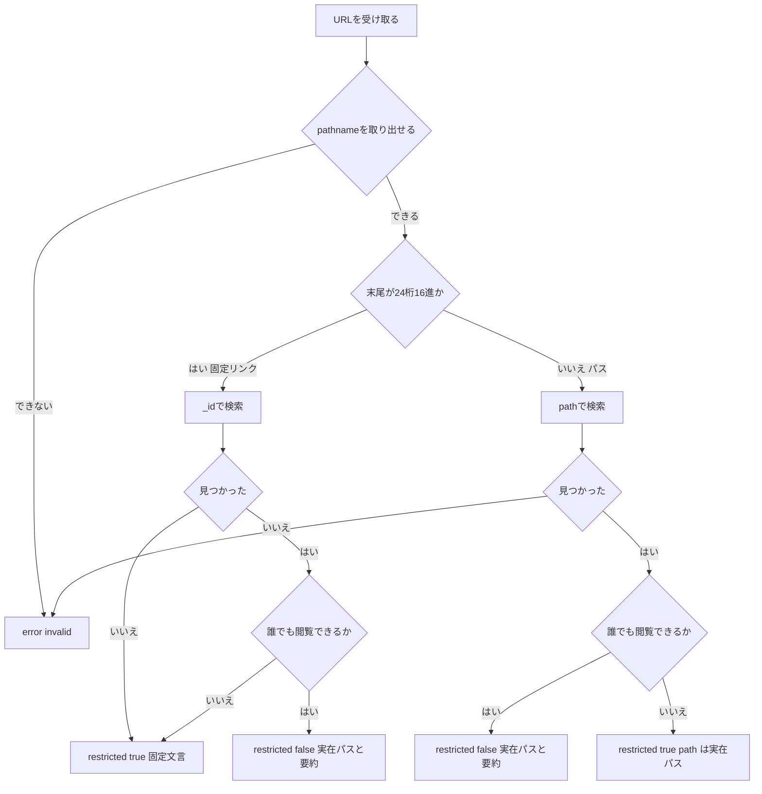

# Design Document

## Amend Target

本 spec は完了済みの umbrella spec `chat-integration` の要件6（GROWI の URL の展開）に受け入れ条件を追加する amend spec である。実装完了時、以下を畳み込んでこの spec ディレクトリを削除すること（`.claude/rules/spec-lifecycle.md`）。

- 受け入れ条件6.6〜6.8 → `chat-integration` の `requirements.md`（既存の6.1〜6.5 は番号を振り直さず、末尾に追記する）
- 本 design.md の設計判断・インターフェイス・図 → sub-spec `chat-integration-app` の `design.md`（`spec.json` の `design_owner`）
- `research.md` の Design Decisions 2件 → `chat-integration-app` の `research.md`

## Overview

**Purpose**: 固定リンク（ページをパス以外の識別子で指す URL）を貼ったときの URL 展開が、投稿者もチャンネルの他の参加者も知らなかった非公開ページの実在パスを開示してしまう問題と、対象を解決できたかどうかが応答の種類そのもので分かってしまう問題（存在するかどうかを応答の違いから探れてしまう問題）を閉じる。

**Users**: チャットチャンネルで GROWI のリンクを共有する人、およびそのチャンネルの参加者——閲覧権限を持たない人が対象。

**Impact**: `chat-integration-app` の URL 展開コマンド（`link-preview`）の応答内容の決め方だけを変える。`@growi/chat`（chat-integration-protocol）・`chat-integration-proxy` は変更しない（research.md の「`@growi/chat` の契約と `chat-integration-proxy` の描画」参照）。ただし、固定リンクで対象が見つからない場合にチャンネルへ表示されるようになる（今は何も表示されない）——詳細は下記「チャンネルへの表示が変わる点」を参照。

### Goals
- 固定リンクで解決した非公開ページの応答に、実在パスを含めない（6.6）
- 固定リンクで解決できない場合の応答を、固定リンクで解決できたが非公開だった場合と区別できない形にする（6.8）
- パス形式 URL の既存の挙動（6.1〜6.5）を一切変えない（6.7）

### Non-Goals
- `@growi/chat` の `CommandResponse`（`link-preview` kind）の契約変更
- `chat-integration-proxy` の応答描画（`previewMarkdown`）の変更
- パス形式 URL で対象が見つからない場合の応答の見直し（要件フェーズで対象外と決定済み）
- 検索・通知・ページ作成など、要件6以外の振る舞い

### チャンネルへの表示が変わる点（要件6.8を守るために受け入れる変化）

`chat-integration-proxy` は今、GROWI からの応答が `link-preview` 以外（今の「固定リンクが見つからない」の `kind: 'error'`）だったとき、チャンネルには何も投稿しない（`command-flow.ts` のコメント: 「リンクが貼られるたびに毎回文句を言うより、黙って何もしない方がよい」という判断）。

本 amend を入れると、固定リンクが見つからない場合も `kind: 'link-preview', restricted: true` を返すようになるため、**GROWI のドメインの URL で、末尾が固定リンクの形（24桁16進文字列）でありさえすれば、実在しないページでも表示が付くようになる**。これは要件6.8（見分けられない応答にする）を守るために避けられない結果であり、意図した変化である——ここを「黙って何も投稿しない」に戻すと、見分けられる状態に逆戻りする。

表示される内容は「ページが存在しないか、非公開のページです」という、ページの状態に関わらず常に同じ固定文言（下記 Components 参照）で、実在パスや個別の識別子は一切含まない。

## Boundary Commitments

### This Spec Owns
- `chat-integration-app` の `link-preview` コマンド処理が、URL から解決した対象（見つかった／見つからない、固定リンクか否か、公開範囲）に応じて、応答へ何を含めるかの判断
- 上記判断を実装する2つの純粋な関数（`resolvePageFromUrl` の返り値の拡張、`buildLinkPreview` のロジック）

### Out of Boundary
- `@growi/chat` の `CommandResponse` の型定義そのもの——変更しない。既存の `path: string`（必須）のまま、中身に何を入れるかだけを変える
- `chat-integration-proxy` の `previewMarkdown`（応答の描画）——変更しない。今のまま `response.path` を無条件に使い続けられる
- Gen 1（`apps/slackbot-proxy`、`packages/slack`）
- URL の参照先がそのチャンネルに紐づく GROWI かどうかの判定（要件6.4）——本 amend が触る解決ロジックより手前の段階で決まる別の関心事

### Allowed Dependencies
- `content/public-page-filter.ts` の `isPubliclyReadablePage`（既存、変更なし）
- `content/excerpt-length.ts` の `EXCERPT_LENGTH`（既存、変更なし）
- `crowi.aclService.isGuestAllowedToRead()`（既存の呼び出し元供給値、変更なし）

### Revalidation Triggers
- `@growi/chat` の `CommandResponse`（`link-preview` kind）に「見つからない」を独立に表現するフィールド（例: `notFound: boolean`）が将来追加された場合、本 amend の「固定文言を `path` に入れる」方式は不要になるため見直すこと
- `resolvePageFromUrl` の固定リンク判定（`PAGE_ID_PATTERN`）の意味が変わった場合（例: 別の識別子形式を追加する）、本 amend のロジックも合わせて確認すること
- 「固定リンクが見つからない場合も表示が付く」という変化（上記）を理由に、`chat-integration-proxy` 側で「黙って何も投稿しない」判定を復活させる変更が提案された場合、要件6.8を壊すため、本 spec の判断へ差し戻すこと

## Architecture

### Existing Architecture Analysis

`link-preview` コマンドの現在の処理は2段に分かれている。

1. `resolvePageFromUrl`（`command-endpoint.ts`）— URL からページを解決する。末尾セグメントが24桁16進文字列（Mongo の ObjectId 形式）なら `_id` で、そうでなければ `path` で `Page.findOne` する。見つからなければ `null` を返す
2. `buildLinkPreview`（`content/link-preview-mapper.ts`）— 解決したページ（`null` は呼び出し元が先に弾いている）を受け取り、公開範囲に応じて応答を組み立てる純粋関数

この2段の間で、「固定リンクだったかどうか」という情報が失われている。本 amend はこの情報を運ぶ経路を追加するだけで、2段構成そのものは変えない。

### Architecture Integration
- **Selected pattern**: 既存の「解決 → 純粋関数によるマッピング」の2段構成を維持し、2段目が受け取る入力を拡張する
- **Domain/feature boundaries**: 変更なし。ページ解決は `command-endpoint.ts`、応答の組み立ては `content/link-preview-mapper.ts` のまま
- **Existing patterns preserved**: `buildLinkPreview` が純粋関数であること、`isPubliclyReadablePage`/`isGuestAllowedToRead` による公開範囲判定はそのまま再利用
- **New components rationale**: 新規コンポーネントは無い。既存2関数のシグネチャ拡張のみ

## File Structure Plan

### Modified Files
- `apps/app/src/features/chat-integration/server/command/command-endpoint.ts` — `resolvePageFromUrl` の返り値を、解決したページ（見つからなければ `null`）に加えて「固定リンクかどうか」を含む形へ拡張する。`handleLinkPreview` は `buildLinkPreview` の返り値が `null` のときだけ（＝パス形式 URL で見つからなかったときだけ）`errorResponse('invalid')` にする
- `apps/app/src/features/chat-integration/server/content/link-preview-mapper.ts` — `buildLinkPreview` が「ページが見つからない」ケースも受け取れるようにし、固定リンクかどうかで応答を分岐する。「見つからない」「見つかったが非公開」のどちらも固定リンクなら同じ固定文言を返す定数を追加する
- 上記2ファイルそれぞれの `.spec.ts` — 固定リンクの各分岐（非公開・見つからない・公開）のテストを追加。既存のパス形式 URL のテストは無変更のまま通ることを確認する

## System Flows



**鍵となる分岐**: 「見つからない」（固定リンクの場合）と「見つかったが非公開」（固定リンクの場合）は、どちらも同じ固定文言の応答（図の `Unavailable`）に合流する——中身は完全に同じ文字列で、識別子もページの状態も一切反映しない。パス形式 URL で見つからない場合だけが `error` に分かれたままで、既存の6.4系統の判定（URL の参照先がそのチャンネルに紐づく GROWI かどうか）はこの図の外、より手前の段階で決まる。

## Requirements Traceability

| Requirement | Summary | Components | Interfaces | Flows |
|-------------|---------|------------|------------|-------|
| 6.6 | 固定リンク・非公開ならパスを含めない | `resolvePageFromUrl`, `buildLinkPreview` | `ResolvedUrlTarget`, `LinkPreviewResult` | `Grant2` → `Unavailable` |
| 6.7 | パス形式 URL の既存挙動は無変更 | `buildLinkPreview` | `LinkPreviewResult` | `Grant` → `Full1` / `RestrictedReal` |
| 6.8 | 固定リンクの「見つからない」と「見つかったが非公開」を区別できない応答にする | `resolvePageFromUrl`, `buildLinkPreview` | `ResolvedUrlTarget`, `LinkPreviewResult` | `FoundById` いいえ → `Unavailable`、`Grant2` いいえ → `Unavailable` |

## Components and Interfaces

| Component | Domain/Layer | Intent | Req Coverage | Key Dependencies (P0/P1) | Contracts |
|-----------|--------------|--------|--------------|--------------------------|-----------|
| `resolvePageFromUrl` | command (server) | URL からページと、固定リンクかどうかを解決する | 6.6, 6.8 | Page model (P0) | Service |
| `buildLinkPreview` | content (server) | 解決結果から応答を組み立てる純粋関数 | 6.6, 6.7, 6.8 | `isPubliclyReadablePage`（P0） | Service |

### Command (server)

#### resolvePageFromUrl

| Field | Detail |
|-------|--------|
| Intent | URL 文字列からページを解決し、固定リンク判定を付随情報として返す |
| Requirements | 6.6, 6.8 |

**Responsibilities & Constraints**
- URL の pathname を取り出せない場合（不正な URL）は今までどおり `null` を返し、呼び出し元は `errorResponse('invalid')` にする——この経路は変更しない
- pathname を取り出せた場合は、常に「固定リンクかどうか」を返す。ページが見つからなかった場合も、この情報は返す（`page` フィールドが `null` になるだけ）

**Dependencies**
- Inbound: `handleLinkPreview`（同ファイル） — 呼び出し元（P0）
- Outbound: Page model — ページの検索（P0）

**Contracts**: Service [x]

##### Service Interface
```typescript
interface ResolvedUrlTarget {
  /** 末尾セグメントが24桁16進文字列（ページをパス以外の識別子で指す形）だったか。 */
  readonly isPermalink: boolean;
  /** 見つかったページ。見つからなければ null。 */
  readonly page: ResolvedLinkPreviewPage | null;
}

function resolvePageFromUrl(pageUrl: string): Promise<ResolvedUrlTarget | null>;
```
- Preconditions: `pageUrl` は文字列として渡される（空でも可）
- Postconditions: `pageUrl` の pathname を取り出せない場合のみ `null` を返す。取り出せた場合は必ず `ResolvedUrlTarget` を返す（`page` が `null` になることはあるが、トップレベルの `null` にはならない）
- Invariants: 同じ `pageUrl` に対して `isPermalink` の値は常に同じ

### Content (server)

#### buildLinkPreview

| Field | Detail |
|-------|--------|
| Intent | 解決結果（ページの有無・固定リンクかどうか）から `link-preview` の応答を組み立てる |
| Requirements | 6.6, 6.7, 6.8 |

**Responsibilities & Constraints**
- `resolvePageFromUrl` の返り値（`ResolvedUrlTarget`）をそのまま受け取る——「`isPermalink` と `page` は同じ解決結果から来ている」という前提を、引数を分けて渡すことで壊さないため
- ページが見つからず、かつ固定リンクだった場合は `null` を返さず、`restricted: true` かつ固定文言（下記 `PERMALINK_UNAVAILABLE_MESSAGE`）の応答を返す——ここが今回の変更点
- ページが見つからず、かつ固定リンクでなかった場合（パス形式 URL）は `null` を返す。呼び出し元がこれを受けて `errorResponse('invalid')` にする——ここは変更しない
- ページが見つかり、公開範囲の判定（`isPubliclyReadablePage(page) && isGuestAllowedToRead`）が真なら、実在パスを使った全文サマリを返す——変更しない
- ページが見つかり、上記判定が偽（非公開）なら、`restricted: true` を返す。**このとき `path` に入れる値は、固定リンクなら固定文言、パス形式 URL なら実在パス**（後者は変更しない、6.3/6.7）

**固定文言**: `PERMALINK_UNAVAILABLE_MESSAGE = 'This page does not exist, or is not visible to everyone.'`（`errorResponse('invalid', 'This URL does not match any page on this GROWI.')` と同じ英語表記の慣習に合わせる）。ページの状態にもリクエストにも依存しない定数であることが重要——「見つからない」と「見つかったが非公開」で呼び出しコードが変わっても、同じ定数を参照する限り文字列は必ず一致する

**Dependencies**
- Inbound: `handleLinkPreview`（`command-endpoint.ts`） — 呼び出し元（P0）
- Outbound: `isPubliclyReadablePage`（`content/public-page-filter.ts`） — 公開範囲判定（P0）

**Contracts**: Service [x]

##### Service Interface
```typescript
const PERMALINK_UNAVAILABLE_MESSAGE =
  'This page does not exist, or is not visible to everyone.';

function buildLinkPreview(
  target: ResolvedUrlTarget,
  isGuestAllowedToRead: boolean,
): LinkPreviewResult | null;
```
- Preconditions: `target` は `resolvePageFromUrl` の返り値をそのまま渡す
- Postconditions: `target.page === null && !target.isPermalink` のときのみ `null` を返す。それ以外は必ず `LinkPreviewResult` を返す
- Invariants: 返り値の `restricted === true` のとき、`excerpt`/`updatedAt`/`commentCount` は含まれない（既存のまま）。`target.isPermalink === true` かつ `restricted === true` のとき、`path` は常に `PERMALINK_UNAVAILABLE_MESSAGE`（ページが見つからない場合・見つかったが非公開な場合のどちらでも同じ）

## Error Handling

### Error Strategy
既存の `errorResponse('invalid', ...)` の使い方を変えない。新しいエラー種別は追加しない——固定リンクで見つからない場合は「エラー」ではなく「`restricted: true` の正常な応答」として扱う（要件6.8が求める、見つかった場合と区別できない形そのもの）。

## Testing Strategy

- **Unit Tests**（`content/link-preview-mapper.spec.ts`）
  - 固定リンクで見つからない場合（`target.page === null`）、`{ path: PERMALINK_UNAVAILABLE_MESSAGE, restricted: true }` を返す（`null` を返さない）
  - 固定リンクで見つかったが非公開の場合、`{ path: PERMALINK_UNAVAILABLE_MESSAGE, restricted: true }` を返す——**上記2つのテストの期待値は完全に同じオブジェクトになる**ことそのものが、要件6.8を担保する（同じ定数を参照しているだけなので、IDを揃える等のテスト側の工夫は不要）
  - 固定リンクで見つかり、かつ公開されている場合、`path` は実在パス（今までどおり全文サマリ）
  - パス形式 URL で見つからない場合、`buildLinkPreview` は `null` を返す（変更なし）
  - パス形式 URL の既存8テスト（公開／非公開／閉域GROWI／レガシー null grant 等）が無変更のまま green であること
- **Integration Tests**（`command/command-endpoint.spec.ts`、Requirement 6 の describe ブロック）
  - 固定リンクで存在しないIDを渡した場合の応答と、固定リンクで存在するが非公開のページを渡した場合の応答が、**完全に同じオブジェクト**（`kind`・`restricted`・`path` の値まで一致）になることを1つのテストで直接比較する——これが要件6.8の核心の検証
  - 固定リンクで公開ページを渡した場合、実在パスを含む全文サマリが返ること
  - 既存3テスト（公開／非公開／パス形式で見つからない）が無変更のまま green であること
