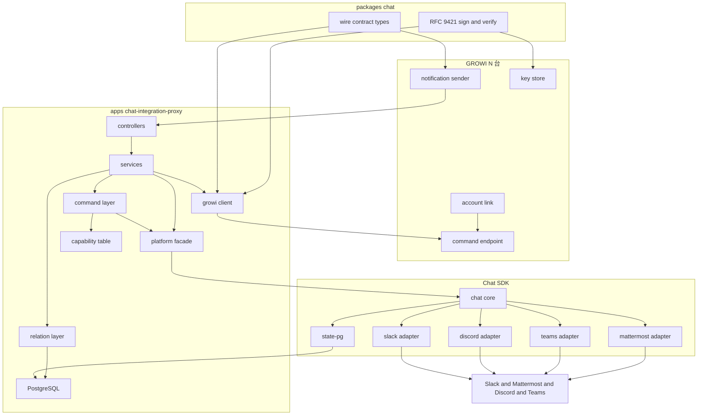

# Technical Design — chat-integration（umbrella）

> **本書は全体像と分担だけを持つ。** 部品の設計は 3 つの sub-spec にある。
> 要件は本ディレクトリの `requirements.md`（14 件・受け入れ条件 85 件）。設計判断の根拠は `research.md`（決定 1〜10）。
> 分割の経緯と方針は `roadmap.md`。

## Sub-spec の分担

| Sub-spec | 成果物 | 持つもの |
|---|---|---|
| [chat-integration-protocol](../chat-integration-protocol/) | `packages/chat` | 通信契約の型、RFC 9421 署名、チャンネル権限の判定、コマンド名の語彙 |
| [chat-integration-proxy](../chat-integration-proxy/) | `apps/chat-integration-proxy` | 4 サービスとのやり取り、常時接続、関係管理、コマンドの解釈、検索の統合 |
| [chat-integration-app](../chat-integration-app/) | `apps/app/src/features/chat-integration/` | 通知、コマンドの処理、紐付け、鍵の保持、管理画面 |

**依存の向き**: `protocol` ← `proxy` / `app`。protocol は他の 2 つを知らない。proxy と app は互いを知らず、protocol の契約だけで話す。

**`protocol` を独立させた理由**: 単一 spec の設計で壊れ続けたのが**まさに両側の境界**だった —
口の向き、鍵の向き、封筒に何を載せるか、識別子の一意性。1882 行に散っていたため 5 巡のレビューでも見落とされた。
「両者の間を何がどちら向きに流れるか」だけを扱う spec があれば一望できる。詳細は `roadmap.md`。

## 要件の割り当て

| 要件 | 受け入れ条件 | 主に担当する sub-spec |
|---|---|---|
| 1. 複数のチャットサービスへの対応と、サービスごとの機能差 | 1.1–1.5 | `app` / `proxy` |
| 2. GROWI からチャットへの通知 | 2.1–2.6 | `app` / `proxy` |
| 3. 複数の GROWI をまたぐ検索 | 3.1–3.9 | `app` / `protocol` / `proxy` |
| 4. チャットからのページ作成 | 4.1–4.6 | `app` / `proxy` |
| 5. チャットの会話の取り込み | 5.1–5.6 | `app` / `proxy` |
| 6. GROWI の URL の展開 | 6.1–6.5 | `app` / `proxy` |
| 7. チャットの利用者と GROWI ユーザーの紐付け | 7.1–7.8 | `app` / `protocol` |
| 8. 1 つの workspace に複数の GROWI が紐づくときの振る舞い | 8.1–8.6 | `proxy` |
| 9. chat-integration proxy と GROWI の紐付け | 9.1–9.7 | `protocol` / `proxy` |
| 10. リクエストごとの相手の確認と鍵の入れ替え | 10.1–10.7 | `app` / `protocol` / `proxy` |
| 11. チャンネル単位のコマンド権限 | 11.1–11.5 | `app` / `protocol` / `proxy` |
| 12. Gen 1 との併存 | 12.1–12.5 | `app` |
| 13. 閉域ネットワークでの運用 | 13.1–13.5 | `proxy` |
| 14. ヘルプ | 14.1–14.5 | `app` / `protocol` / `proxy` |
> **横断する要件がある。** たとえば要件 2（通知）は app が送出し proxy が投稿する。
> 上の表は「主に担当する」ものを示すだけで、各 sub-spec の design がどの ID を覆うかはそちらの本文で確かめること。

---
## Overview

**Purpose**: Slack 専用の中継サーバ（Gen 1、`apps/slackbot-proxy`）を、Slack・Mattermost・Discord・Microsoft Teams の 4 サービスに対応した中継サーバへ作り直す。GROWI を self-host する運用者が、GROWI に合わせてチャットサービスを選び直さずに済むようにする。

**Users**: GROWI をチャットから使うチームメンバー（通知の受信、検索、ページ作成、会話の取り込み）と、GROWI を運用する管理者（連携の設定、チャンネル単位の権限、閉域での構成）。

**Impact**: 新しいアプリ `apps/chat-integration-proxy` と新しいパッケージ `packages/chat`（`@growi/chat`）を作り、GROWI 本体に Gen 2 連携の機能を足す。**Gen 1（`apps/slackbot-proxy` と `packages/slack`）には一切手を入れない。** 両者は GROWI 本体で同時に有効にできる。

### Goals

- 4 サービスすべてで、通知・検索・ページ作成・会話の取り込み・URL の展開・ヘルプを提供する
- チャットサービスごとの機能差を、**利用者に見える形で明示するか、代わりの手段で埋める**
- proxy と GROWI がリクエストごとに相手を確認し、鍵を止めずに入れ替えられるようにする
- GROWI をインターネットに公開せずに運用できる構成を、手順書つきで提供する

### Non-Goals

- Chatwork・Google Chat への対応（要件の Out of scope）
- 各チャットサービスの公式アプリ審査（ブリーフ 決定 5、別トラック）
- LLM を使った自由な文章からのページ作成（ブリーフ 決定 4）
- 検索結果の LLM による並べ替え・要約（ブリーフ 決定 3）
- Gen 1 の実装の変更・移行ツールの提供
- **Cloudflare Workers 向けの 2 つ目のビルド** — 技術検証で成立する見込みは立ったが採らない。成果物は Docker image 1 つ（決定 10）

---

### Existing Architecture Analysis

Gen 1 から引き継ぐ**考え方**と、引き継がない**実装**を分ける。

| Gen 1 の要素 | Gen 2 での扱い |
|---|---|
| `Relation` の `[installation, growiUri]` 複合ユニーク（1 workspace 対 N GROWI） | **考え方を引き継ぐ。** Chat SDK では代替できないハブの中核 |
| `Order`（10 分で失効する登録コード）と `urlVerificationRequestToGrowi()` | **考え方を引き継ぐ。** 短命の登録コードとエンドポイント所有証明は正しいプリミティブ |
| `permissionsFor{Broadcast,SingleUse}Commands` | **考え方を引き継ぐ。** 要件 11 |
| `tokenGtoP` / `tokenPtoG`（固定文字列） | **捨てる。** 要件 9.6 / 10.6 が非対称鍵を要求する |
| `growi-uri-injector/*` の Delegator ツリー | **捨てる。** Slack の payload に GROWI URI を差し込むための仕組みで、決定 3 により不要になる |
| `packages/slack` の Block Kit 組み立て | **捨てる。** Chat SDK が中立表現を持つ |
| MySQL + TypeORM 0.2.45、Ts.ED 6.43 | **捨てる。** PostgreSQL + Prisma、Hono（決定 8） |
| `POST /g2s/:method`（Slack Web API の汎用パススルー） | **捨てる。** 用途ごとの限定された契約に置き換える（後述の Security Considerations） |

### Architecture Pattern & Boundary Map

**Architecture Integration**:

- **選んだ形**: 層状（依存の向きを一方向に固定）+ 外部 SDK を 1 つの facade 層に隔離。SDK のリリース頻度が高いという実測されたリスク（研究ログ 1）に対する構造的な答え。
- **責務の分かれ目**: 「チャットサービスとの配線」は Chat SDK と platform 層、「どの GROWI へ流すか」は relation 層、「何を集めて何をするか」は command 層。**Chat SDK が置き換えるのは配線だけで、関係管理とルーティングは Gen 2 でも GROWI 側が持ち続ける**（ブリーフ §3.2）。
- **引き継ぐ考え方**: 1 workspace 対 N GROWI、短命の登録コード、エンドポイント所有証明、チャンネル単位の権限。
- **新しい部品の理由**: `capabilities`（プラットフォーム差をデータとして 1 か所に置く）と `packages/chat`（両側が同じ署名実装を使う）。どちらも「同じ知識が 2 か所に分かれて食い違う」ことを防ぐために存在する。

### Technology Stack

| Layer | Choice / Version | Role in Feature | Notes |
|-------|------------------|-----------------|-------|
| Backend / Services | **Hono `^4.13.5`**（MIT・依存ゼロ） | proxy の HTTP 層 | Chat SDK の webhook ハンドラ（Web 標準の `Request` / `Response`）をそのまま扱えるので橋渡しが要らない。DI コンテナは使わない（決定 8） |
| Backend / Services | `chat@=4.38.1` + 公式アダプタ 3 + `chat-adapter-mattermost@=1.1.3` | 各サービスの OAuth・webhook 検証・ネイティブ形式への変換 | platform 層のみが import（決定 1・2） |
| Data / Storage | PostgreSQL 16 + Prisma `6.19.2` | 関係・鍵・登録コード・nonce | apps/app と同じ Prisma 版 |
| Data / Storage | `@chat-adapter/state-pg@=4.38.1` | Chat SDK が要求する購読・分散ロック・重複排除 | 同じ PostgreSQL、スキーマを分ける（決定 6） |
| Messaging / Events | Slack Socket Mode / Discord Gateway / Mattermost WebSocket / Teams Bot Framework | 各サービスからの受信 | **Teams だけが外部からの接続を必要とする**（研究ログ 4） |
| Infrastructure / Runtime | Node.js 24（native ESM）/ **Docker image 1 つ** | proxy の実行 | official proxy も custom proxy も同じ image を動かす。置き場所だけが違う（決定 10） |
| Cross-cutting | **`node:crypto`** + `structured-headers@^2.0.3` | Ed25519 署名と RFC 8941 正準化 | `crypto.subtle` は Ed25519 の検証が壊れているので使わない。`@noble/ed25519` / `jose` / `http-message-signatures` も採らない（決定 7） |

### プラットフォーム能力表（設計の中核データ）

研究ログ 3 の実測結果を、**コード上の 1 つの宣言**として持つ。各所で `if (platform === 'mattermost')` と書かない（`.claude/rules/coding-style.md`「モード名で分岐しない」）。

| 能力 | Slack | Discord | Teams | Mattermost | これが無いときの代わり |
|---|:--:|:--:|:--:|:--:|---|
| `slashCommand` | ○ | ○ | × | × | mention で起動する（決定 4） |
| `mention` | ○ | ○ | ○ | ○ | — （全サービス対応） |
| `plainReply`（呼びかけ無しの返信を bot が受け取れるか） | 要確認 | 要確認 | 要確認 | 要確認 | **呼びかけ付きの返信にする**（下記） |
| `modal` | ○ | × | ○ | × | コマンド行の引数 + その場限りのメッセージで聞き返す（決定 5） |
| `interactiveActions` | ○ | ○ | ○ | × | 番号つきの一覧を出して返信で選ばせる |
| `card` | ○ | ○ | ○ | △ | markdown で投稿する |
| `linkPreview` | ○ | × | × | × | 要件 6.5 に従い「使えない」と運用者に示す |
| `fetchMessages` | ○ | ○ | ○ | ○ | — （全サービス対応） |
| `requiresInboundReachability` | × | × | **○** | × | 要件 13.3 の接続元制限の対象 |

> **`plainReply` に依存しない設計にする。** 番号つき一覧への返信は、`modal` も `interactiveActions` も使えない Mattermost にとって
> 唯一の経路だが、「bot が呼びかけ無しの通常メッセージを受け取れるか」はサービスごとに追加の権限や設定が要る場合があり、
> **実物で確かめるまで表の値を確定できない**。そこで **「`@growi 1` と返信してください」と呼びかけ付きで促す**形を採る。
> 必要な能力が全サービス ○ の `mention` だけになり、この不確かさが消える。利用者の手間は 1 語増える。
> `plainReply` が使えると確認できたサービスでは、呼びかけ無しの返信も受け付けてよい。

> この表は**デプロイ先に依存しない**。proxy は常駐プロセスなので、Slack は Socket Mode、Discord は Gateway、Mattermost は WebSocket で受けられ、mention はどのサービスでも届く（決定 10）。

> `linkPreview`（投稿されたリンクを bot に通知する仕組み）は Slack の `link_shared` に相当するものが他の 3 サービスに無い。要件 6.5 はこの場合に「使えないことを運用者に示す」ことを求めており、代わりの手段は用意しない。

---

## Security Considerations

### 要件 10 の署名が防ぐもの・防がないもの

**署名の確認が止められるのは、鍵を持たない第三者だけである。鍵を持っている本人は止められない。**
この区別を曖昧にすると、閉域に置くという判断が誤った前提の上で下される。

| 出来事 | 要件 10 の署名で防げるか |
|---|---|
| 経路上の第三者がリクエストを書き換える | **防げる**（`@method` / `content-type` / `content-digest` を署名対象に含める。本体には `relationId` と `op` が入り、`content-digest` が覆う） |
| 第三者が署名を**別の口へ流用する** | **防げる**（受ける側が本体の `op` と自分がどの口で受けたかを突き合わせる） |
| 第三者が署名を**別の GROWI へ流用する** | **防げる**（鍵は関係ごとなので、別の関係では検証が落ちる） |
| 第三者が過去のリクエストをそのまま再送する | **防げる**（`expires` と nonce） |
| **相手側の DB が漏れて、そこから自分になりすまされる** | **防げる**。相手が持つのは公開鍵だけで、秘密鍵は通信路にも相手の DB にも出ない（要件 10.6）。Gen 1 は平文の共有秘密を両側に置いていたのでこれが成立していなかった |
| **chat-integration proxy 自身が侵害される** | **防げない。** 攻撃者は proxy の秘密鍵をそのまま使い、GROWI から見て完全に正しいリクエストを作れる。要件 10.1〜10.4 と 10.6 はすべて素通りする |

### proxy が侵害されたときに実際にできること

閉域構成では proxy が DMZ に立つため、ここを具体的に把握しておく必要がある。

- **紐付いている利用者の名前でページを作れる。** 要件 4.3 により、作成者はその利用者に紐付いた GROWI ユーザーとして記録される
- **紐付いている利用者の閲覧権限で検索できる。** 要件 3.6 により、その人が読めるページのパス・タイトル・URL・更新日時が得られる
- **通知として任意の文面を、紐づく workspace のチャンネルへ投稿できる**

**逆に、できないこと** — GROWI の管理者になること、GROWI の権限判定を回避すること、紐付いていない利用者になりすますこと。
いずれも **GROWI 側が独立に判定する**ため。

### 「どちら側が判定するか」が防御になるかを決める

**proxy 側で判定するものは、proxy が侵害された時点で防御にならない。** 攻撃者は自分が持っている検査を飛ばすだけでよい。
したがって、防御として数えてよいのは **GROWI 側で判定するもの**に限られる。

| 仕組み | 判定する側 | 侵害時に防御になるか |
|---|---|---|
| 署名の検証（要件 10.1–10.4, 10.6） | GROWI | **ならない**（攻撃者が秘密鍵ごと持っているため） |
| **チャンネル単位のコマンド権限（要件 11）** | GROWI と proxy の両方 | **どこでも不許可にしてあるコマンドについてだけ、なる** — 下記 |
| ページの閲覧・作成の権限（要件 3.6 / 4.5） | GROWI | **なる** |
| 契約面の狭さ | — | **なる**（そもそも呼べる操作が限られている） |

**逆向き（1 台の GROWI が侵害された場合）**: 公式に運用する proxy には多数の GROWI が紐づくので、こちらも現実的な筋である。
攻撃者は自分の関係の範囲でしか動けない — 通知の宛先チャンネルがその関係の installation に属することを proxy が確かめ（後述）、
他の GROWI の関係にも、その workspace の他のチャンネルにも触れられない。

**チャンネル権限が侵害時にどこまで効くかを正確に書く。**

`CommandEnvelope.channel` を GROWI 側の判定に使う形にしたが、**その `channel` を書き込んでいるのは proxy 自身である。**
GROWI にはそれを裏付ける手立てが無い。署名が示すのは「本文が経路上で書き換えられていないこと」だけで、
**署名した本人が正しいことを言っているかは示さない。** これは同じ封筒の `actor` とまったく同じ性質で、
`actor` について「紐付いている利用者の名前でページを作れる」と認めているのと揃えなければならない。

したがって、GROWI 側の判定が侵害時に効くのは次の場合だけである。

- **そのコマンドがどのチャンネルでも許可されていないとき（`'none'`）** — 名乗れるチャンネルが 1 つも無いので本当に止まる。
  今回決めた既定値（`create-page` / `keep` はどこでも不許可）により、**管理者がまだ 1 つも許可していない組織は守られる**
- **1 つでもチャンネルを許可した瞬間、攻撃者はそのチャンネルを名乗るだけで通る。**
  「許可したチャンネルの範囲に被害が収まる」わけではない

**`CommandEnvelope.channel` は残す。** 侵害時の防御としては上記に限られるが、別の価値が 3 つある —
(1) どこでも不許可のコマンドが本当に止まる、(2) proxy 側の判定に不具合があったときの二重の網になる、
(3) **監査ログにチャンネルを残せる**。proxy 側の判定は無駄なリクエストを送らないための早いふるい分けである。

### 実際に影響を抑えている 3 つ（要件 10 ではない）

1. **契約面が狭い。** Gen 1 の `POST /g2s/:method` は Slack Web API の任意のメソッドを呼べたため、`tokenGtoP` 1 本が
   workspace の bot 権限そのものに等しかった。Gen 2 は用途ごとの限定された契約（`CommandRequest` の 5 種と `NotificationRequest`）
   しか持たず、**任意のプラットフォーム API を呼べる経路を作らない**
2. **チャンネル単位のコマンド権限**（要件 11）。ただし**どこでも不許可にしてあるコマンドについてだけ**（上記のとおり、チャンネルを名乗るのは proxy 自身であるため）
3. **GROWI 側の権限判定**（要件 3.6 / 4.5）。ページの閲覧・作成の可否は GROWI が判定し、proxy の言い分を信用しない

### 既定値（要件 11.1 の設定の初期値として決める）

- **書き込みを伴うコマンド（`create-page` / `keep`）の既定は「どのチャンネルでも不許可」。** 管理者が明示的に許可する
- **読み取り（`search` / URL の展開 / `help`）の既定は許可**

### 初版では作らないもの（将来の選択肢として記録する）

次の 2 つは影響をさらに小さくできるが、**要件に無い新しい機能**なので初版では作らない。
必要になった時点で要件から起こす。

- 関係ごとに、ページを作成してよいパスの範囲を管理者が絞る（GROWI 側で判定する必要がある）
- proxy 経由の書き込みに GROWI 側で回数の上限を置く

### 採らない対策

- **proxy から GROWI への相互 TLS** — ブリーフの決定 6 で検討済み。self-host 運用者の大半がリバースプロキシで TLS を終端しており、
  証明書の受け渡しと更新の運用負荷が現実的でない
- **秘密鍵をハードウェアや外部の鍵管理に置く** — self-host の前提に合わない。ただし `own_key.private_key_pem` は保存時に暗号化する

### その他

- **保存時の暗号化。** `installation.credentials` と `own_key.private_key_pem` は暗号化して保存する（Gen 1 は平文 JSON カラムだった）。
  暗号化に使う鍵は `runtime/config.ts` が環境変数から読み、他の層へは復号済みの値を渡さず、復号する関数を渡す
- **検証失敗の詳細を利用者に返さない。** 失敗の種類は運用者向けの記録にのみ残す。署名そのものと本文は記録しない
- **通知の宛先を検査する。** `NotificationRequest.targets` のチャンネルが、署名から特定した関係の installation に属することを
  proxy が確認する。属さないチャンネルへの投稿は行わない
- **非公開ページの本文を通知に含めない**（要件 2.3）。判断は GROWI が行い、proxy は再判断しない

> **導入ドキュメントへの反映（要件 13.5）**: 上の「防げるか」の表と「侵害されたときに実際にできること」は、
> そのまま閉域構成の手順書に載せる。運用者が閉域に置くかどうかを判断する材料はこれである。

## Performance & Scalability

> **この節は `chat-integration-proxy` の「常時接続の生涯」と「受信が 1 台に集まる」で更新されている。**
> 実測（Slack の Socket Mode はアプリごと 1 本）により、次の 3 点が確定した。
> - **常駐コストは installation の数に比例する**（GROWI の台数には比例しない）。アイドル時のコストはゼロではない
> - **台数を増やしても Slack と Discord の受信は分散しない**（投稿と GROWI への送信は分散する）
> - **接続の持ち主が落ちると、他の台が引き取るまで（既定 60 秒）そのサービス全体が黙る**
>
> 規模と可用性の見積もりは proxy の spec を正とすること。

- ~~**アイドル時のコストはゼロに保つ。**~~（上記のとおり更新された） ブリーフの決定 7（接続方向）が常時接続方式を採らなかった理由がこれ。ただし Slack の Socket Mode と Discord の Gateway、Mattermost の WebSocket は**チャットサービス側への接続**であり、登録された GROWI の数には比例しない（installation の数に比例する）。
- **水平に増やせる状態を保つ。** 検索の待ち合わせはインスタンスをまたがない。Chat SDK が要求する分散ロックと重複排除は `state-pg` が担う。
- **検索の締め切り**は既定 10 秒（Gen 1 の `REQUEST_TIMEOUT_FOR_GTOP` に合わせる）。設定で変えられるようにする。

## Migration Strategy

移行はしない。Gen 1 と Gen 2 は GROWI 本体で同時に有効にでき（要件 12.1）、利用者は好きなタイミングで乗り換える。**Gen 1 からのデータ移行ツールは提供しない**（後方互換を取らないという前提の帰結）。運用者は Gen 2 でペアリングをやり直す。
