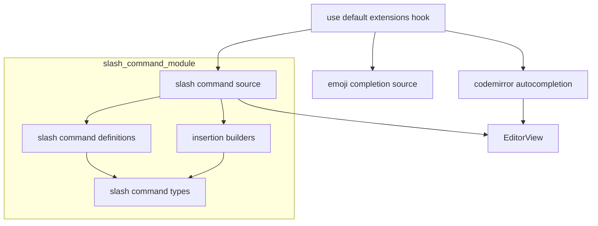
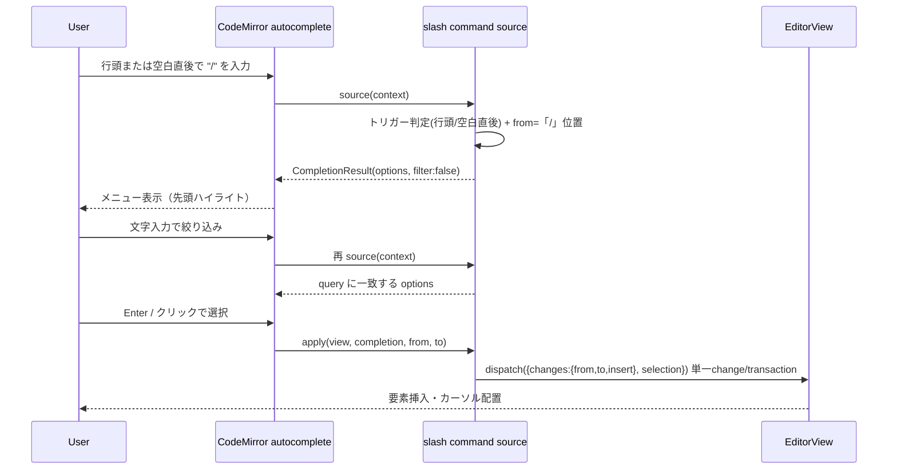

# Technical Design Document

## Overview

**Purpose**: GROWI の Markdown エディタ（CodeMirror 6、`packages/editor/`）に、`/` 入力で起動するスラッシュコマンドメニューを追加し、見出し・リスト・引用・コードブロック・テーブルなどのブロック要素をキーボードから手を離さず高速に挿入できるようにする。

**Users**: エディタで執筆する全ユーザーが、要素挿入のたびにツールバーを探す代わりに `/` で要素を選んで挿入する。

**Impact**: 既存の絵文字オートコンプリート（`:` トリガー）と同じ `@codemirror/autocomplete` 補完エンジンに、新たなスラッシュコマンド補完ソースを統合する。既存のツールバー・キーバインド・グローバルホットキー（`/` 検索）の挙動は変更しない。

### Goals
- `/` 入力（行頭または空白直後）でコマンドメニューを表示し、入力で絞り込み、選択で対応 Markdown 要素を単一トランザクションで挿入する。
- 既存の絵文字補完・キーバインド・グローバル検索と干渉しない。
- コマンド集合をデータ駆動で宣言し、将来のコマンド追加を定義ファイルへの追記のみで可能にする。

### Non-Goals
- GROWI 拡張要素（drawio / math / lsx / テンプレート）のコマンド化（将来拡張）。
- テーブル挿入時の表ビルダー（行列数指定モーダル）起動（将来拡張）。
- 単語の途中（空白以外の文字の直後、例 `foo/`）での発火（誤爆防止のため非対応）。
- インライン要素の挿入（将来拡張。MVP のコマンドはすべてブロックレベル要素）。
- コマンドの並び順・表示内容のユーザーカスタマイズ。

## Boundary Commitments

### This Spec Owns
- スラッシュコマンドの補完ソース（トリガー検出・候補生成・フィルタリング・`apply`）。
- コマンドのアクション抽象 `SlashCommandAction`（`insert` 静的挿入 / `run` 副作用起動）と `apply` の分岐。`run` は子スペック `editor-slash-extended-elements` が drawio/lsx のモーダル起動に用いる**共有 seam**（基盤は run の中身を知らない）。
- コマンド集合の宣言（定義レジストリ）と、各コマンドの挿入ビルダー（行頭マーカー / コードブロック / 空テーブル）。
- コマンドラベル/説明の i18n キーと、その解決（`t` 関数によるラベル解決）。
- 絵文字補完と統合した単一 `autocompletion()` 設定の構築（登録点）。

### Out of Boundary
- 絵文字補完のロジック自体（`:` トリガーの挙動・絵文字データ）。本スペックは emoji ソースを**統合する登録点のみ**変更し、emoji の挙動は不変に保つ。
- 既存の挿入系 toggle 関数（`toggleMarkdownSymbol` / `insertLinePrefix` 等）の仕様変更。
- グローバルホットキー `/`（ページ検索）と `hotkeys` スペックの領域。
- キーバインド体系（`editor-keymaps`）。
- 協調編集（Yjs）の同期機構（`collaborative-editor`）。本スペックは通常の `view.dispatch` トランザクションを発行するのみ。

### Allowed Dependencies
- `@codemirror/autocomplete`（`autocompletion`, `CompletionSource`, `Completion`）、`@codemirror/state`、`@codemirror/view`。
- `react-i18next`（`useTranslation`）— ラベル解決のため登録フックでのみ使用。
- 既存の `emojiAutocompletionSettings.ts` から切り出す emoji 補完ソース/レンダラ（統合のため）。
- 依存方向: `types → definitions → insertion-builders → source →（登録フック）use-default-extensions`。左方向のみ参照可、逆方向参照は禁止。

### Revalidation Triggers
- `emojiAutocompletionSettings.ts` のエクスポート形変更（emoji 側に影響）。
- `use-default-extensions.ts` の補完登録構造の変更（補完全体に影響）。
- `SlashCommand` 定義インタフェースの変更（コマンド定義ファイルに影響）。
- i18n キー命名（`slash_command.*`）の変更（ロケール JSON に影響）。

## Architecture

### Existing Architecture Analysis
- 補完は `stores/use-default-extensions.ts` の `defaultExtensions[]` に Extension を並べ、`appendExtensions([...])`（`Compartment` + `StateEffect.appendConfig`）で登録される。
- 絵文字補完は、共有の `autocompletion({ icons: false })` ファシリティ（`baseExtensions`）に対し、`markdownLanguage.data.of({ autocomplete: emojiCompletionSource })` で補完ソースを、`autocompletion({ addToOptions: [render] })` でレンダラを足す形で登録している。
- 挿入系 pure 関数は `EditorView` を受け取り内部で `view.dispatch` する（選択範囲ベース・トグル意味論）。

> **設計改訂メモ（dev/8.0.x マージ後）**: 当初 emoji・slash を単一 `autocompletion({ override: [...] })` に統合する設計だったが、dev/8.0.x で先行した `@` メンション補完が `markdownLanguage.data.of(...)` で登録されており、`override` を使うと language-data 由来のソースが全て置き換わりメンションが動かなくなる。このためマージ後は **slash・emoji・mention とも「共有 `autocompletion()` ファシリティ + language-data ソース追加」方式**に統一した。以降の記述はこの改訂後の形を指す。

### Architecture Pattern & Boundary Map



**Architecture Integration**:
- **Selected pattern**: 既存実績のある `@codemirror/autocomplete` 補完ソースパターンを踏襲し、slash・emoji・mention を**共有 `autocompletion()` ファシリティ + language-data ソース追加**方式で共存させる（上記「設計改訂メモ」参照）。
- **Domain boundaries**: コマンド宣言（データ）/ 挿入生成（純粋ビルダー）/ トリガー・適用（補完ソース）/ 登録・i18n 解決（フック）を分離。
- **Existing patterns preserved**: `Compartment` 登録、`services-internal` 配下のモジュール分割、barrel 公開面。
- **Steering compliance**: 「Executors take their work-set as input」「Data-Driven Control」「pure function 抽出」「barrel 最小公開」に準拠。

### Technology Stack

| Layer | Choice / Version | Role in Feature | Notes |
|-------|------------------|-----------------|-------|
| Frontend (editor) | `@codemirror/autocomplete` (既存) | 補完ソース/ポップアップ/キーボード操作/フィルタ | 共有ファシリティに language-data ソースとして追加（emoji/mention と共存） |
| Frontend (editor) | `@codemirror/state`, `@codemirror/view` (既存) | `EditorView`・トランザクション（`ChangeSpec`/`EditorSelection`） | 単一トランザクション挿入 |
| Frontend (i18n) | `react-i18next` (既存) | コマンドラベル/説明の解決 | キーは locale JSON |
| Data / Storage | なし | — | 永続化なし |

新規依存ライブラリは**なし**（全て既存スタック）。

## File Structure Plan

### Directory Structure
```
packages/editor/src/client/services-internal/slash-command/
├── index.ts                          # barrel: source とテスト用に definitions/types を公開
├── slash-command-types.ts            # SlashCommand / ResolvedSlashCommand / SlashInsertion 型
├── slash-command-definitions.ts      # コマンド集合の単一ソース（id・i18nキー・keywords・builder参照）
├── insertion-builders.ts             # 純粋ビルダー: lineMarkerInsertion / codeBlockInsertion / tableInsertion
├── resolve-slash-commands.ts         # (t) => ResolvedSlashCommand[]（i18nキー→表示文字列、純粋）
├── slash-command-source.ts           # createSlashCommandSource(commands): CompletionSource（トリガー検出+apply）
├── slash-command-source.spec.ts      # トリガー/フィルタ/apply の単体テスト
├── insertion-builders.spec.ts        # 各ビルダーの挿入結果テスト
└── resolve-slash-commands.spec.ts    # ラベル解決テスト
```

### Modified Files
- `packages/editor/src/client/services-internal/extensions/emojiAutocompletionSettings.ts` — emoji の `CompletionSource` と `render` addToOption を named export として切り出す（既存の統合済み Extension export は登録点へ移動）。
- `packages/editor/src/client/stores/use-default-extensions.ts` — `useTranslation` でラベル解決し、`createSlashCommandExtension(t) = markdownLanguage.data.of({ autocomplete: createSlashCommandSource(resolveSlashCommands(t)) })` を共有の `autocompletion({ icons: false })` ファシリティ（`baseExtensions`）とともに登録する。`override` は使わない（language-data の emoji/mention ソースを消さないため）。
- `packages/editor/src/client/services-internal/extensions/index.ts` — emoji source/render の再エクスポート調整。
- `packages/editor/src/client/services-internal/index.ts` — `slash-command` barrel を公開。
- `apps/app/public/static/locales/{en_US,ja_JP,fr_FR,ko_KR,zh_CN}/translation.json` — `slash_command.*` キー追加（GROWI がサポートする全ロケール）。

## System Flows



- **トリガー判定**: `from`（`/` の位置）の直前が**行頭（先頭空白のみ）または空白文字**の場合に `CompletionResult` を返す。直前が空白以外の文字（単語の途中、例 `foo/`）の場合は `null`（Req 1.2）。
- **フィルタと並び順**: `filter: false` とし、source 側で query（`/` 以降の文字列）を **id と `keywords`** に対して大文字小文字を無視して前方一致で照合（Req 2.1/2.2）。**表示ラベルは照合しない**（Req 2.6 — 到達に必要な入力が表示言語で変わらないようにするため）。**どこで一致したかでランク付けし**、id 一致をキーワード（別名）一致より先に並べる（Req 2.5）。同順位は `sort` の安定性により宣言順を保つ。`filter: false` はここでも効いており、有効にすると CodeMirror 自身のスコアで並べ替えられこの順序が失われる。一致なしは `options: []`→メニューは閉じ、入力テキストは不変（Req 2.4/4.3）。
- **apply**: コマンドの `action.kind` で分岐。`insert` は `buildInsertion` が返す `{ insert, cursorOffset }` から `/query`（`[from, to]`）を置換する単一 change を 1 トランザクションで発行（Req 3.2/3.5）。`run` は `/query` 削除の単一 change を発行後に `action.run(view, from)` を呼ぶ（副作用＝モーダル起動等。拡張要素スペックが利用）。

## Requirements Traceability

| Requirement | Summary | Components | Interfaces | Flows |
|-------------|---------|------------|------------|-------|
| 1.1 | 行頭/空白直後 `/` でメニュー表示 | slash command source | `createSlashCommandSource` | 起動フロー |
| 1.2 | 単語途中（非空白直後）で非発火 | slash command source | トリガー判定 | 起動フロー |
| 1.3 | ラベル+説明表示 | resolve-slash-commands, source | `ResolvedSlashCommand` | 起動フロー |
| 1.4 | 初期ハイライト | autocompletion（標準） | — | 起動フロー |
| 2.1 | 入力で絞り込み | slash command source | query 照合 | 絞り込み |
| 2.2 | 大小文字無視 | slash command source | query 照合 | 絞り込み |
| 2.3 | 入力変化で更新 | slash command source | `validFor` / 再 source | 絞り込み |
| 2.4 | 一致なしで閉じ・テキスト保持 | slash command source | `options: []` | 絞り込み |
| 3.1 | 矢印で候補移動 | autocompletion（標準） | — | 選択 |
| 3.2 | 選択で削除+挿入 | slash command source | `apply` 単一transaction | 選択 |
| 3.3 | 空 Markdown テーブル挿入 | insertion-builders | `tableInsertion` | 選択 |
| 3.4 | カーソル配置 | insertion-builders | `SlashInsertion.selection` | 選択 |
| 3.5 | undo で復元 | slash command source | 単一transaction | 選択 |
| 3.6 | 行中発火時はブロックを改行挿入 | insertion-builders | 行頭判定+改行前置 | 選択 |
| 4.1 | Escape で閉じ・テキスト保持 | autocompletion（標準） | `closeCompletion` | — |
| 4.2 | 外側クリック/blur で閉じ | autocompletion（標準） | — | — |
| 4.3 | 空白入力でテキスト不変 | slash command source | `validFor`（`\w*`） | — |
| 5.1 | コマンド集合 | slash-command-definitions | `SlashCommand[]` | — |
| 5.2 | 行頭プレフィックス系挿入 | insertion-builders | `lineMarkerInsertion` | 選択 |
| 5.3 | コードブロック挿入 | insertion-builders | `codeBlockInsertion` | 選択 |
| 5.4 | 拡張要素は非提供 | slash-command-definitions | 定義から除外 | — |
| 6.1 | 非フォーカス時は検索維持 | （本機能はエディタ拡張のみ） | `/` をグローバルにバインドしない | — |
| 6.2 | emoji と共存 | use-default-extensions | 単一 `autocompletion` | — |
| 6.3 | 協調編集の整合 | slash command source | 通常 `view.dispatch` | 選択 |
| 6.4 | キーバインド不変 | （keymap 追加なし） | — | — |
| 7.1 | ラベル i18n | resolve-slash-commands | `resolveSlashCommands(t)` | — |
| 7.2 | 既定言語フォールバック | react-i18next（標準） | `fallbackLng` | — |

## Components and Interfaces

| Component | Domain/Layer | Intent | Req Coverage | Key Dependencies (P0/P1) | Contracts |
|-----------|--------------|--------|--------------|--------------------------|-----------|
| slash-command-types | types | コマンド/挿入の型定義 | 5.1 | — | State |
| slash-command-definitions | data | コマンド集合の単一ソース | 5.1, 5.4 | types (P0) | State |
| insertion-builders | logic | 挿入内容（純粋）を生成 | 3.3, 3.4, 3.6, 5.2, 5.3 | types (P0) | Service |
| resolve-slash-commands | logic | i18nキー→表示文字列に解決 | 1.3, 7.1, 7.2 | definitions (P0), react-i18next (P1) | Service |
| slash-command-source | logic | トリガー検出・フィルタ・apply | 1.1, 1.2, 2.1-2.4, 3.2, 3.5, 4.3, 6.3 | builders (P0), `@codemirror/autocomplete` (P0) | Service |
| use-default-extensions（変更） | integration | emoji と統合し登録 | 6.2, 7.1 | source (P0), emoji source (P0) | Service |

### types / data

#### slash-command-types
| Field | Detail |
|-------|--------|
| Intent | コマンドと挿入の型を定義 |
| Requirements | 5.1 |

**Contracts**: State [x]

```typescript
import type { EditorView } from '@codemirror/view';

/**
 * `/query`（[from, to]）を置換して挿入する内容。
 * 位置を持たないテキストと、挿入後カーソルの `from` 相対オフセットのみを表現し、
 * 削除と挿入の合成は呼び出し側（`apply`）が単一の { from, to, insert } として行う。
 * これにより builder 側が絶対位置の ChangeSpec を持たず、削除レンジとの重なり/競合が原理的に発生しない。
 */
export interface SlashInsertion {
  readonly insert: string;        // 置換レンジを置き換えるテキスト全体
  readonly cursorOffset: number;  // 挿入後のカーソル位置（置換レンジ先頭からの相対オフセット）
  /**
   * 置換レンジの開始を `from` より手前へ広げる量（<= 0、既定 0）。リスト変換が
   * 項目自身のマーカーを吸収するために使う（Req 9.1）。相対オフセットのままなので
   * position-free の原則は維持され、ChangeSpec を組むのは `apply` のみ。
   */
  readonly replaceFromOffset?: number;
}

/** 挿入すると周囲の構造が壊れる文脈（Req 8）。list = リスト項目行、table = テーブルセル */
export type SlashCommandContext = 'list' | 'table';

/**
 * コマンドのアクション。2 種を判別共用体で表す。
 * - insert: `/query`（[from,to]）を静的テキストで置換する（MVP の全コマンド）。
 * - run:    `/query` を削除したうえで副作用処理を実行する（モーダル起動など。拡張要素スペックが利用）。
 * これにより「テキスト挿入」と「モーダル起動等の副作用」を単一の抽象で表現でき、
 * 基盤は run の中身（drawio/lsx 等）を知らずに `apply` から呼ぶだけで済む。
 */
export interface SlashInsertAction {
  readonly kind: 'insert';
  /** 挿入内容（テキスト + カーソルオフセット）を生成（純粋・副作用なし） */
  readonly buildInsertion: (view: EditorView, from: number) => SlashInsertion;
}
export interface SlashRunAction {
  readonly kind: 'run';
  /** `/query` 削除後に呼ばれる副作用処理。テキスト挿入は run 側 or 後続モーダルが担う */
  readonly run: (view: EditorView, from: number) => void;
}
export type SlashCommandAction = SlashInsertAction | SlashRunAction;

/** コマンド定義（i18n キーを保持。表示文字列は解決時に付与） */
export interface SlashCommand {
  readonly id: string;                   // 安定 id 例: 'heading1'
  readonly labelKey: string;             // i18n キー 例: 'slash_command.heading1.label'
  readonly descriptionKey: string;
  readonly keywords: readonly string[];  // 追加の照合語 例: ['h1', 'title']
  /** アクション（insert: 静的挿入 / run: 副作用起動） */
  readonly action: SlashCommandAction;
  /** 候補から除外する文脈（Req 8）。未宣言なら常に候補に出る */
  readonly disallowedIn?: readonly SlashCommandContext[];
  /**
   * 説明文の代わりに表示する Markdown 記法（Req 10）。単一行マーカーで表現できる
   * コマンドのみが持つ。記法は表示言語によらず同一なので翻訳しない。
   */
  readonly syntaxHint?: string;
}

/** 表示文字列を解決済みのコマンド */
export interface ResolvedSlashCommand extends SlashCommand {
  readonly label: string;
  readonly description: string;
}
```

#### slash-command-definitions
| Field | Detail |
|-------|--------|
| Intent | MVP のコマンド集合を単一ソースとして宣言 |
| Requirements | 5.1, 5.4 |

**Responsibilities & Constraints**
- 提供コマンド（Req 5.1）: `heading1`/`heading2`/`heading3`（`# `/`## `/`### `）, `bulletList`(`- `), `numberedList`(`1. `), `taskList`(`- [ ] `), `quote`(`> `), `codeBlock`, `table`。
- 拡張要素（drawio/math/lsx/template）は**含めない**（Req 5.4）。
- 各コマンドは `action: { kind:'insert', buildInsertion }` に `insertion-builders` のいずれかを参照する（executor へ集合を渡す単一ソース）。MVP は全コマンドが `insert`。`run` は拡張要素スペック（drawio/lsx のモーダル起動）が用いる。

```typescript
export const SLASH_COMMANDS: readonly SlashCommand[] = [
  { id: 'heading1', labelKey: 'slash_command.heading1.label', descriptionKey: 'slash_command.heading1.description', keywords: ['h1', 'title'], action: { kind: 'insert', buildInsertion: lineMarkerInsertion('# ') } },
  // ... heading2/3, bulletList, numberedList, taskList, quote, codeBlock, table — すべて { kind:'insert', ... }
];
```

### logic

#### insertion-builders
| Field | Detail |
|-------|--------|
| Intent | カーソル位置 `from` を起点に挿入内容（`SlashInsertion`）を返す純粋関数群 |
| Requirements | 3.3, 3.4, 3.6, 5.2, 5.3, 8.1, 9.1, 9.2, 9.3, 9.5 |

**Contracts**: Service [x]

##### Service Interface
```typescript
/**
 * リスト文脈での振る舞い（Req 9.3 — ロジック側で分岐せずデータとして宣言する）。
 * - convert: その項目の既存マーカーを置換する（リスト系コマンド）
 * - append:  項目のマーカーを残し同一行に付加する（引用）
 */
export type ListItemBehavior = 'convert' | 'append';

/** 行頭マーカー（見出し/リスト/引用/タスク）。挿入後カーソルはマーカー直後 */
export const lineMarkerInsertion: (
  marker: string,
  listItemBehavior?: ListItemBehavior,
) => SlashInsertAction['buildInsertion'];

/** 空のコードブロック。挿入後カーソルは中身の空行 */
export const codeBlockInsertion: SlashInsertAction['buildInsertion'];

/** 2 列・ヘッダ+区切り+1 ボディ行の空 Markdown テーブル。挿入後カーソルは先頭ヘッダセル */
export const tableInsertion: SlashInsertAction['buildInsertion'];
```
- **Preconditions**: `from` は `/` の位置（置換レンジ `[from, to]` の起点）。
- **Postconditions**: `insert`（置換テキスト全体）と `cursorOffset`（`from` 相対）のみを返す。絶対位置の変更や `view.dispatch` は行わない。`cursorOffset` で続行入力位置を指定（Req 3.4）。
- **行頭/行中の出し分け（Req 3.6）**: `view` と `from` から「`from` が行頭（同じ行に先行する非空白テキストがない）か」を判定し、**先行する非空白テキストがある場合は `insert` の先頭に区切りを付与**して、ブロック要素を新しい行に挿入する（先行テキストを壊さない）。`cursorOffset` も付与分を加味する。
- **要素種別ごとの区切り（Req 3.3/3.6）**: 必要な区切りは Markdown の描画規則に従って要素ごとに決める。
  - **テーブル**: GFM のテーブルは直前に**空行**がないと段落の一部と解釈され表として描画されない。先行行が非空のときは**空行（`\n\n`）**を前置する（行頭ケースでも直前行が非空段落なら同様に空行を確保する）。
  - **見出し / リスト / 番号付き / タスク / 引用**: 段落を中断できるため、先行テキストがある場合は**単一改行（`\n`）**で可。
  - **コードブロック**: フェンスは新しい行に置く必要があるため、先行行が非空のときは改行（必要に応じて空行）を前置する。
  - 各要素の必要区切りはテストで固定する。
- **先行空白の扱い（任意）**: `あいうえお /h1` のように `/` の直前に空白がある場合、`[from, to]` のみ置換すると前行末に空白が残る（`あいうえお \n# `）。気になる場合は `/` 直前の単一空白も置換範囲に含めて吸収してよい（実装時の判断、必須ではない）。
- **リストマーカーのみの行での振る舞い（Req 9）**: `from` の直前が「インデント + 任意の引用マーカー（`> `）+ リストマーカー（`-`/`*`/`+`/`1.`/`1)`）+ 空白 + 任意のタスクチェックボックス」だけで構成される場合を `bareListMarkerOffsetAt` が検出し、次のように分岐する。引用マーカーはインデントと同じく吸収範囲の**外**に置くため、`> - /` の変換は `> 1. ` となり引用が保たれる（source 側の文脈判定と同じく引用ネストを許容し、両者の認識がずれないようにしている）。いずれも既存の行中区切りロジック（`\n` 前置）は使わない。
  - `listItemBehavior === 'convert'`（リスト系）: 置換レンジを `/` より手前へ広げて**既存マーカーを吸収**し、新しいマーカーへ置換する（`  - /` → `  1. `）。インデントは吸収範囲に含めないので階層が保たれる。
  - `listItemBehavior === 'append'`（引用）: 置換レンジは `/query` のままで、区切りを前置せず同一行にマーカーを置く（`- /` → `- > `）。
  - コードブロック: **リスト固有の分岐を持たない**。項目の内側にネストさせる案を一度実装したがレビューで撤回し、フェンスは常に新しい行に置く方針とした。あわせてリスト文脈では候補から除外する（Req 8.1）ため、この経路はメニューからは到達しない。
  - リスト項目内のそれ以外の位置（本文のあるマーカー行 `- foo /`、継続行 `  bar /`）は別分岐: 改行したうえで**その項目自身の行頭プレフィックスを引き継ぐ**（Req 9.5）。`convert`（リスト系）はプレフィックスをそのまま再現して同階層の兄弟項目にし、`append`（引用）は内容カラムまで空白で詰めて項目の内側に留める。プレフィックスは**構文木で囲っている `ListItem` を特定し、そのマーカー行から**求める（継続行はマーカーを持たないため、カーソル行からは求められない）。内容カラムはマーカー直後の空白すべてを含め、タブはタブストップ幅で数える。リストのいずれの位置でもないときのみ Req 3.6 の既存挙動（Req 9.6）。
- **置換レンジの後方拡張（Req 9.1/9.4）**: `SlashInsertion` に `replaceFromOffset`（`<= 0`、既定 `0`）を持たせ、`apply` が `from + replaceFromOffset` を置換起点にする。**相対オフセットのままなので position-free の原則は維持**され、ChangeSpec を組むのは引き続き `apply` のみ。1 つの change に収まるため undo も 1 回（Req 9.4）。
- **Invariants**: 副作用なし。`view` は行コンテキスト参照（行頭判定・リストマーカー判定）のためにのみ使用（位置を直接変更しない）。

**Implementation Notes**
- Integration: `lineMarkerInsertion` のプレフィックス文字列はツールバーの行頭挿入と概念的に一致（将来共有ビルダーへ統合余地）。
- Validation: 既存 markdown-utils テストと同様に `EditorState`/`EditorView` を組んで挿入結果を検証。Req 9 は `apply` と同じ合成（`replaceFromOffset` を含む）を行って**結果ドキュメント**を検証する。
- Risks: テーブル雛形の列数は固定 2 列（MVP）。

#### resolve-slash-commands
| Field | Detail |
|-------|--------|
| Intent | i18n キーを表示文字列へ解決した `ResolvedSlashCommand[]` を返す純粋関数 |
| Requirements | 1.3, 7.1, 7.2 |

**Contracts**: Service [x]

```typescript
import type { TFunction } from 'i18next';
export const resolveSlashCommands: (
  t: TFunction, commands?: readonly SlashCommand[],
) => ResolvedSlashCommand[];
```
- **Preconditions**: `t` は `translation` 名前空間。`commands` 省略時は `SLASH_COMMANDS`。
- **Postconditions**: 各コマンドに `label`/`description` を付与。未対応言語は i18next の `fallbackLng` で既定言語に解決（Req 7.2）。

#### slash-command-source
| Field | Detail |
|-------|--------|
| Intent | 解決済みコマンド配列から CodeMirror の `CompletionSource` を生成 |
| Requirements | 1.1, 1.2, 2.1, 2.2, 2.3, 2.4, 3.2, 3.5, 4.3, 6.3, 8.1, 8.2, 8.3, 8.4 |

**Responsibilities & Constraints**
- 入力（work-set）として `ResolvedSlashCommand[]` を受け取る（executor は集合を所有しない）。
- トリガー判定: `/` の直前が行頭（先頭空白のみ許容）**または空白文字**のときに発火。直前が空白以外（単語の途中）のときは発火しない。`from` を `/` 位置、`to` を `context.pos` とする。
- `filter: false`。query を **id と `keywords`** に対し大文字小文字無視で前方一致照合（ラベルは照合しない＝Req 2.6）し、id 一致をキーワード一致より先に並べる（Req 2.5）。`validFor` は付けない。
- **構造上の文脈フィルタ（Req 8）**: `activeContextsAt` が現在位置の文脈（`list` / `table`）を求める。判定は **syntax tree と「カーソル自身の行の見た目」の両方が一致したときのみ**成立させる。片方だけでは誤判定するため:
  - **木だけでは広すぎる**: lezer-markdown はテーブル行やリスト項目の**次の行**を、空行が来るまで同じノード（`Table` / `ListItem`）の内側に含める。テーブルの直後で Enter を1回押して `/` を打つと `table` 文脈と判定され、全コマンドが `table` を除外しているため**メニューが空になる**。
  - **行だけでは狭すぎる**: 単なる本文が `|` や `-` で始まることはあり、そこで絞り込むのは誤検出になる。
  - 木側は `isInCodeContext` と同じ親チェーン走査（`ListItem` / `Table`・`TableRow`・`TableCell`・`TableHeader`）。行側の判定は構造ごとに異なる:
    - **テーブル**: 行内に**セル区切り `|` があること**（行頭パイプは要求しない）。GFM は外側のパイプを省略した表（`a | b` / `--- | ---` / `c | d`）を許すため、行頭アンカーにするとそのセルが無防備になる。
    - **リスト**: 行がリストマーカーで始まる、**または**最も内側のリスト項目の**内容カラム以上**にインデントされている。閾値を「インデントされているか」ではなく内容カラムにするのが要点: Enter は `insertNewlineAndIndent` に割り当てられており現在行のインデントを再現するため、`  - b` の次行は最初から列2にある。単にインデントの有無で判定すると、**ネストしたリストからブロック系コマンドへ到達する手段が一切なくなる**（Enter を2回押しても戻らない）。
    - いずれも「インデントも区切りも無い行」は文脈から外れる。これがユーザーが構造を抜ける操作であり、そこを内側と見なすとメニューが空になるため。
  - 判定に使うリストマーカーの文法は `list-line-patterns.ts` に集約し、ビルダー側の「ベアマーカー判定」と同じソースから導出する（片方だけ更新すると、フィルタは通すのにビルダーが変換しないという無音のデグレになるため）。さらに「囲っている `ListItem` の幾何情報（兄弟用プレフィックス / 項目内用プレフィックス / 内容カラム）」は `markdown-context.ts` に集約し、**補完ソースの文脈判定とビルダーの挿入位置が同じ計算を使う**ようにする（内容カラムの求め方が2箇所にあると、片方だけがタブや複数空白を取りこぼす）。両文脈が同時に成立することもある（リスト項目内のテーブル）。各コマンドは `disallowedIn?: readonly ('list'|'table')[]` を宣言し、`activeContextsAt` の結果と `disallowedIn` の積が空でなければそのコマンドを候補から除外する。判定はクエリ照合の**前**に行う（除外されたコマンドは絞り込み対象にも入らない）。コードコンテキストはメニュー自体を非表示にする（`null` を返す）のに対し、list/table 文脈は**メニューは開いたまま該当コマンドだけ除く**という違いがある。
- `apply`: コマンドの `action.kind` で分岐する。
  - `insert`: `action.buildInsertion(view, from)` の結果から、**単一の `view.dispatch({ changes: { from, to, insert }, selection: { anchor: from + cursorOffset } })`** を発行する。削除（`[from, to]`）と挿入が1つの change にまとまるため、change レンジの重なりが発生せず、undo も1回で復元される（Req 3.5）。
  - `run`: `/query` を削除する単一の `view.dispatch({ changes: { from, to, insert: '' }, selection: { anchor: from } })` を発行したうえで `action.run(view, from)` を呼ぶ。`run` はモーダル起動等の副作用を行ってよい（実際の挿入は run / 後続モーダルが別トランザクションで担う）。基盤は `run` の中身を知らない（拡張要素スペックが drawio/lsx 等を供給）。MVP の基本コマンドはすべて `insert`。

**Dependencies**
- Outbound: insertion-builders — 挿入内容生成（P0）
- External: `@codemirror/autocomplete` — `CompletionSource`/`Completion`/`apply`（P0）

**Contracts**: Service [x]

##### Service Interface
```typescript
import type { CompletionSource } from '@codemirror/autocomplete';
export const createSlashCommandSource: (
  commands: readonly ResolvedSlashCommand[],
) => CompletionSource;
```
- **Preconditions**: `commands` は解決済み。
- **Postconditions**: トリガー時に query 一致 `Completion[]` を返し、`apply` が `action.kind` に応じて（`insert`: 単一トランザクションで削除+挿入 / `run`: 削除後に副作用起動）処理する。非トリガー時は `null`。
- **Invariants**: `/query` 以外のドキュメントを変更しない（Req 2.4/4.3）。

**Implementation Notes**
- Integration: 各 `Completion` は `label`（表示）、`detail`/`info`（説明）、`apply`（上記）を持つ。`render` は任意（MVP は標準表示で可）。
- Validation: トリガー（行頭/空白直後で発火・単語途中で非発火）、query 照合（大小文字/keyword）、apply 後の文書・選択・undo を単体テスト。
- Risks: 行頭判定の境界（先頭空白・リスト内）に注意。

### integration

#### use-default-extensions（変更）
| Field | Detail |
|-------|--------|
| Intent | slash を共有 `autocompletion()` ファシリティに language-data ソースとして登録、ラベル解決（emoji/mention と共存） | 
| Requirements | 6.2, 7.1 |

**Responsibilities & Constraints**
- `useTranslation('translation')` で `t` を取得 → `resolveSlashCommands(t)` → `createSlashCommandSource(...)`。
- slash ソースは `markdownLanguage.data.of({ autocomplete: ... })` として登録し、共有 `autocompletion({ icons: false })` ファシリティ（`baseExtensions`）に足す。`override` は使わない（emoji/mention の language-data ソースを消さないため）。
- emoji の従来挙動を不変に保つ（Out of Boundary）。

**登録機構（多重 append / 破壊の防止）**
- 統合 `autocompletion()` 拡張は `t` に依存するため module-level const にできない。`useMemo([t])` で拡張を**安定化**してから登録する。
- `appendExtensions`（`Compartment` + `StateEffect.appendConfig`）は呼び出しごとに新しい `Compartment` を生成するため、`t` が変わるたびに素朴に再呼び出しすると**多重登録**になる。これを避けるため、本フックでは以下を満たす:
  - `appendExtensions` の戻り値（cleanup 関数）を保持し、再登録の前に必ず前回分を cleanup する（`useEffect` の cleanup で `Compartment.reconfigure([])`）。
  - `useEffect` の依存配列を `[codeMirrorEditor.view, memoizedExtension]` とし、`view` 確定時とラベル（言語）変化時のみ再構成する。
- 代替案（MVP 簡素化）: ラベルは初期マウント時の言語で1回だけ解決し、実行時の言語切替はエディタ再マウントで反映する。この場合 `t` 依存の再登録は不要となり、`defaultExtensions` 相当を初期化時に1回 append すれば足りる。**どちらを採るかは実装タスクで確定**（既存 `useDefaultExtensions` の呼び出し文脈が i18n provider 配下かつ単一マウントであることを前提に、まず簡素化案を採用）。

**Implementation Notes**
- Integration: 既存の単独 emoji Extension 登録を、統合 `autocompletion()` に置換。emoji 側は `emojiCompletionSource` と render addToOption を named export に切り出す（ロジックは不変）。
- Validation: emoji 補完が回帰しないこと、slash と同時に機能すること、言語切替で補完が多重化/消失しないことをスモーク確認（Req 6.2）。
- Risks: `appendExtensions` は呼び出しごとに新 `Compartment` を作る仕様のため、cleanup 漏れが多重登録に直結する点に注意。
- 対象エディタ（コメント欄）: `useDefaultExtensions` はページ本文エディタとコメント欄エディタ（`CodeMirrorEditorComment`）の双方で使われるため、slash は両方で有効になる。コメント欄では `CommentEditor` が `@` メンション拡張を追加で append するため、slash・emoji・mention の 3 ソースが同一エディタ上で共存する。3 者は全て language-data ソースとして登録され互いを消さない（Integration Tests で検証）。
- follow-up #6（emoji の `addToOptions` render が全候補に適用され、slash のように `type` を持たない候補に空 `<span>` が付く問題）は、language-data 統一により **mention 候補にも同じ影響が及ぶ**範囲になった。render を emoji 候補（`completion.type` あり）に限定する対応の優先度を引き上げる。

## Error Handling

### Error Strategy
- **トリガー外**: `source` は `null` を返し副作用なし。
- **一致なし**: `options: []` でメニューは閉じ、文書は不変（Req 2.4）。
- **キャンセル**: Escape / blur / 外側クリックは `@codemirror/autocomplete` 標準でメニューを閉じ、文書は不変（Req 4.1/4.2）。
- **行中での挿入**: `/` が行の途中にある場合、ブロック要素はビルダーが改行を前置して新しい行に挿入し、先行テキストの破綻を防止（Req 3.6）。単語の途中（非空白直後）では発火しない（Req 1.2）。

### Monitoring
- 本機能はクライアント内 UI で永続化・サーバ通信なし。専用ログは追加しない（既存エディタの挙動に委譲）。

## Testing Strategy

### Unit Tests
1. `slash-command-source`: 行頭または空白直後の `/` で `CompletionResult` を返し、空白以外の文字の直後（単語途中、例 `foo/`）では `null`（1.1, 1.2）。
2. `slash-command-source`: query に対し label/keywords を大文字小文字無視で照合し、一致なしで `options: []`（2.1, 2.2, 2.4）。
3. `slash-command-source`: `apply` 実行後に `/query` が消え対象要素が挿入され、1 回の undo で元の文書に戻る（3.2, 3.5）。
4. `insertion-builders`: `lineMarkerInsertion('# ')` / `codeBlockInsertion` / `tableInsertion` が期待する文字列とカーソル位置を返す（3.3, 3.4, 5.2, 5.3）。
5. `insertion-builders`: `from` が行頭のときは区切りなし、行の途中（先行する非空白テキストあり）のときは要素種別に応じた区切り（テーブル/コードブロックは空行、見出し/リスト/引用は単一改行）を前置してブロックを新しい行に挿入し、`cursorOffset` が付与分を加味する。特に**テーブルは先行段落の直後で空行を確保**し表として描画されることを検証（3.3, 3.6）。
5. `resolve-slash-commands`: 各コマンドに label/description が解決され、未対応キーで既定言語にフォールバック（1.3, 7.1, 7.2）。
6. `slash-command-source`: 絞り込み機構を `disallowedIn` の形ごとの合成コマンドで検証する（list+table 制限は list 内で除外、table のみ制限は list 内で残る、未宣言はどこでも残る）。あわせて**文脈判定が構文木と行の両方を要求する**ことを固定: インデントもセル区切りも無い行（テーブル/リストを抜けた位置）は当該文脈と見なさないこと、実際のテーブル行・引用内リスト項目・**パイプ省略テーブルのセル**・**リスト項目のインデント継続行**は見なすこと（8.1, 8.2, 8.4）。
7. `slash-command-definitions`: `disallowedIn` が heading1-3/table/codeBlock では `['list','table']`、bulletList/numberedList/taskList/quote では `['table']` のみであることを契約テストで固定（8.3）。
8. `insertion-builders`: リストマーカーのみの行で、リスト系コマンドが**既存マーカーを置換**し（`  - /` → `  1. `、`- [ ] /` → `- `、`> - /` → `> 1. ` と引用を保つ）、引用が**同一行に付加**される（`- /` → `- > `）ことを、**本番の補完ソースの `apply` を通して**（`replaceFromOffset` の合成込みで）結果ドキュメントとして検証（9.1, 9.2）。dispatch をテスト側で再実装すると `replaceFromOffset` を無視する回帰を検出できないため、ヘルパでの再現は禁止。あわせて、マーカー以外の本文がある行（`- foo /`）と通常の文章中では既存の区切り挙動が変わらないことを回帰として固定（9.5）。

（テストは markdown-utils の既存規約に倣い、`@codemirror/state` の `EditorState`/`EditorSelection` と `@codemirror/view` の `EditorView` を組んで `view.state.doc.toString()` と `view.state.selection` を検証。`// @vitest-environment jsdom`。）

### Integration Tests
1. `use-default-extensions` 経由で slash と emoji の両補完ソースが共有 `autocompletion()` に登録され、`/` と `:` がそれぞれ独立に発火する（6.2）。
2. コマンド選択による挿入が通常の `view.dispatch` トランザクションとして発行され、協調編集前提の編集経路と整合する（6.3、トランザクション発行の検証）。
3. コメント欄相当の構成（`baseExtensions` + emoji + slash + mention）で、`/head`・`:smi`・`@ab` の各トリガー位置で slash・emoji・mention の候補がそれぞれ surface し、互いを消さないこと（`slash-command-source.integ.ts`）。dev/8.0.x 由来の `emojiAutocompletionSettings.integ.ts`（emoji+mention の 2 者）を、slash を含む 3 者へ拡張したもの（6.2、Adjacent expectations の mention 共存）。

### E2E/UI Tests（任意）
1. エディタで `/` 入力→`table` 絞り込み→Enter で空テーブルが挿入されカーソルが先頭セルに来る（1.1, 2.1, 3.2, 3.3, 3.4）。
2. `/` 入力後 Escape で `/` テキストが残りメニューが閉じる（4.1）。

## Implementation Notes（試用フィードバック起点、Req 8 関連・別スコープ）

以下は Req 8 の議論で仕様を確定させたが、**新規コマンド追加**（9 コマンド契約を壊す）にあたるため本スペックでは実装しない。別ストーリーで扱う際にそのまま使える形で記録する。

- **太字・リンク挿入コマンド**: 選択範囲が無い状態（空行で `/` を打った直後）での挿入結果は、**空マーカーを挿入しカーソルを中に置く**（例: 太字は `**` + カーソル + `**`）。リンクは `editor-slash-extended-elements` 側で検討中の `run` アクション（既存 `Edit Link Modal` 起動、`useLinkEditModalActions().open(getMarkdownLink(view), onSave)`）と合流させる想定。
- ~~**リスト種別変換コマンド（`[convert]` 系）**~~ → **Requirement 9 として実装済み**（本ノートの当初判断を訂正）。当初は「`[convert] ordered list` のような**新規コマンド**を足す」前提で 9 コマンド契約を壊すと判断していたが、試用フィードバックの再確認により、**既存のリスト系コマンドがリスト文脈で変換として振る舞う**設計に変更した。コマンドは増えないため契約は保たれる。対象は当初どおり bulletList ⇔ numberedList ⇔ taskList の3種のみ（quote は変換対象ではなく、リスト項目内では同一行への付加＝Req 9.2 として扱う）。
  - なお「現在の種別を候補から除く」（bulletList の行に `[convert] bulleted list` を出さない）という当初案は**採用していない**: 現在の種別を選んでも同じマーカーへの置換となり無害な no-op で済むため、動的な候補生成の複雑さに見合わないと判断した。必要になった場合は `disallowedIn` と同じデータ駆動の枠組みで後から足せる。
