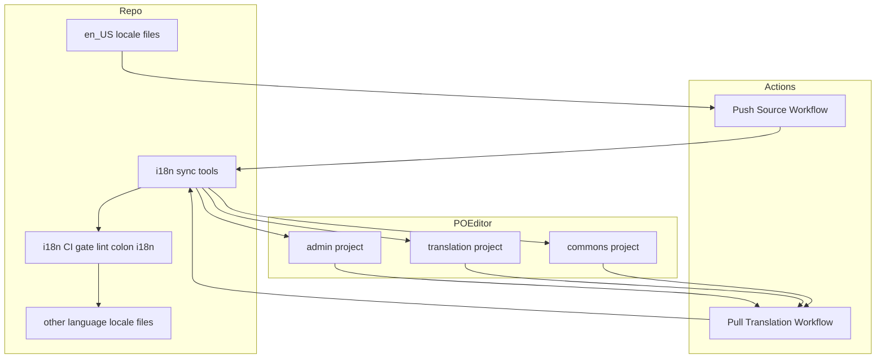
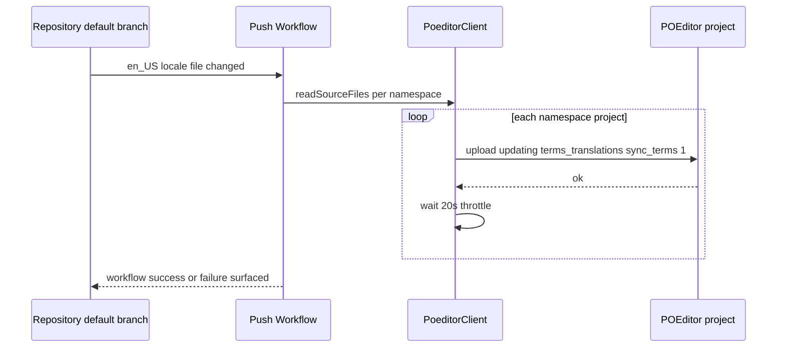
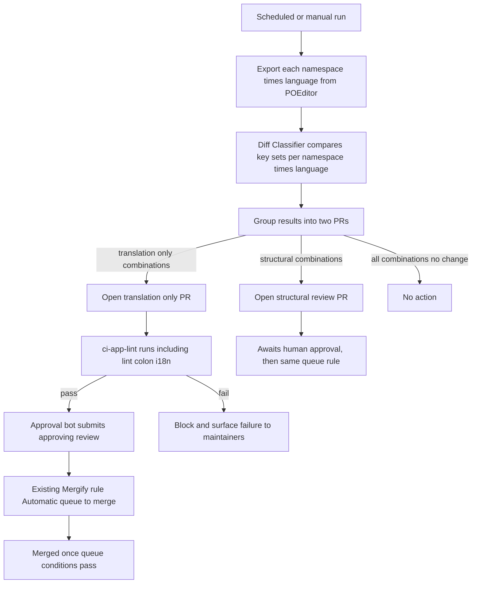

# Design Document

## Overview

GROWI は5言語の翻訳ファイルを `apps/app/public/static/locales/` に持つが、コミュニティが翻訳に貢献する導線が無い。本機能は、翻訳管理サービス POEditor を受け皿として接続し、(1) GitHub 操作なしで翻訳に参加できる導線、(2) リポジトリと POEditor 間の双方向同期、(3) 変更の種類（訳文更新か、キー構造の変更か）に応じたレビュー体制を実現する。

**Users**: GitHub アカウントを持たない翻訳ボランティア（POEditor 上で翻訳を投稿する）と、GROWI メンテナー（構造変更を伴う取り込みをレビューする）。

**Impact**: 現在の翻訳ファイルは手動の PR でのみ更新されている。本機能により、ソース言語（en_US）の変更が自動的に POEditor へ反映され、翻訳者が投稿した訳文のうち訳文のみの変更は既存の i18n CI ゲートを条件に自動でリポジトリへ反映される。

### Goals
- GitHub アカウント不要で翻訳に参加できる導線を確立する
- ソース言語（en_US）の変更を人手のコピーなしに POEditor へ反映する
- POEditor から取り込む変更を、訳文のみの変更（自動反映）とキー構造の変更（人レビュー必須）に機械的に分岐する
- 既存の i18n CI ゲート（`lint:i18n`）を、どちらの反映経路でも迂回しない
- 翻訳内容は引き続き git にコミットされたファイルのみから配信し、GROWI の実行時に POEditor への依存を作らない

### Non-Goals
- 翻訳そのものを埋める作業（本 spec は導線と同期の仕組みのみを扱う）
- `apps/app/resource/locales/`（markdown・メール ejs テンプレート）への対応
- i18next の namespace 再編、または Paraglide 等コンパイラ方式への移行（`.kiro/specs/i18n/roadmap.md` の未決事項として別途判断）
- 翻訳内容の品質保証・機械翻訳の導入
- GROWI 側で独自の翻訳進捗表示 UI を新設すること（POEditor 自体の画面を使う）

## Boundary Commitments

### This Spec Owns
- リポジトリの翻訳ファイル（`apps/app/public/static/locales/*/{admin,translation,commons}.json`）と POEditor プロジェクト間の双方向同期ロジック（push/pull それぞれの GitHub Actions ワークフローとその実装コード）
- 取り込む変更が「訳文のみ」か「キー構造の変更」かを判定するロジックと、それに応じた反映経路（自動反映 or 人レビュー必須の変更提案）の分岐
- POEditor 側のプロジェクト構成（namespace ごとに専用プロジェクト）の決定
- 貢献者向けガイド文書の設置場所と内容

### Out of Boundary
- POEditor の OSS プラン申請そのもの（人手の手続き。本 spec は「承認されるまで本番運用を進めない」という条件だけを持つ）
- 翻訳の投稿・レビュー内容そのものの品質判断（POEditor 上のワークフローに委ねる）
- 既存の i18n CI ゲート（`apps/app/tools/i18n-audit/`）自体の変更。本機能はこのゲートを**呼び出す側**であり、ゲートの検出ロジックには一切手を入れない
- i18next の namespace 構成の変更。本機能は既存の3 namespace（`admin`/`translation`/`commons`）をそのまま POEditor のプロジェクト境界として使う
- GROWI アプリケーション本体（`apps/app/src/`）のコード変更。本機能が触れるのは同期用ツール（`apps/app/tools/i18n-sync/`）と GitHub Actions ワークフローのみ

### Allowed Dependencies
- 既存の i18n CI ゲート（`pnpm run lint:i18n` / `apps/app/tools/i18n-audit/`）: 同期が取り込む変更の合否判定に使う。呼び出すだけで内部には依存しない
- POEditor API v2（`https://api.poeditor.com/v2/*`）: `projects/upload` / `projects/export` / `languages/list` を使う
- リポジトリの既存 CI 慣習（`paths:` トリガー、`concurrency` グループ、`secrets.*` によるトークン注入）
- `.github/mergify.yml` の既存ルール「Automatic queue to merge」（条件: `#approved-reviews-by >= 1` かつ変更要求レビューが無いこと）。**このルール自体は変更しない。** 人レビューなしで反映する経路は、このルールに乗せるために「PR作成者とは別のIDが承認レビューを送る」ことで実現する（GitHub は PR 作成者自身による自己承認を拒否するため）。もう一方の既存ルール「Automatic merge for Preparing next version」は `queue_rules` のCI条件（`ci-app-lint` 等）を経由しない direct merge であり、Requirement 3.4（CIゲートを迂回しない）に反するため使わない

### 承認ボットの必要性（新しい依存）
- 上記の「別ID承認」を実現するには、同期ワークフローの既定の `GITHUB_TOKEN` とは別に、レビュー承認を送れるボットID（GitHub App のインストールトークン、または専用ボットアカウントの PAT）が要る。これは本 spec が新たに用意する依存であり、`Security Considerations` に持ち越して扱う

### Revalidation Triggers
- `apps/app/public/static/locales/` の namespace 構成が変わる（分割・統合・ファイル名変更）→ POEditor 側のプロジェクト構成、`SyncConfig` の宣言、両ワークフローのトリガーパスをすべて見直す必要がある
- i18next から Paraglide 等コンパイラ方式へ移行する（`.kiro/specs/i18n/roadmap.md` 未決事項2）→ 同期対象のファイル形式・POEditor のフォーマット指定（`type=i18next`）が成立しなくなるため、同期設定の作り直しが要る
- 既存の i18n CI ゲート（`apps/app/tools/i18n-audit/`）の検出ロジックが変わる → 自動反映経路が誤って通過/ブロックするようになっていないか再確認が要る
- `master` の branch protection / Mergify ルールが変わる → 「訳文のみの変更を人レビューなしで反映する」ための自動マージ機構が引き続き機能するか再確認が要る

## Architecture

### Existing Architecture Analysis
- 翻訳ファイルは `apps/app/public/static/locales/<lang>/{admin,translation,commons}.json` に5言語×3 namespace で存在し、実行時は `next-i18next` がこれをそのまま読み込む（`apps/app/config/next-i18next.config.mjs`）
- 既存の i18n CI ゲート（`i18n-key-audit` spec で実装済み）は `apps/app/tools/i18n-audit/run-audit.ts` が `i18next-cli status` を実行し、未使用キー・言語間欠損・存在しないキー参照を検出して `pnpm run lint:i18n`（`turbo run lint` の一部）で強制している。これは「pure function（判定ロジック）＋ 薄い I/O ラッパー」という構成を取っており、本機能もこのパターンを踏襲する
- リポジトリの GitHub Actions は `paths:` フィルタでトリガー範囲を絞り、`concurrency` グループで多重実行を防ぐ慣習がある（`research.md` 参照）
- `master` の branch protection は classic Required Reviews を使っておらず、Mergify アプリと merge queue に委ねている

### Architecture Pattern & Boundary Map



**Architecture Integration**:
- Selected pattern: 既存リポジトリを起点にした双方向 ETL（push = リポジトリ→POEditor、pull = POEditor→リポジトリ）。GitHub Actions を実行基盤とし、独立した常駐サービスは持たない
- Domain/feature boundaries: namespace（`admin`/`translation`/`commons`）ごとに POEditor プロジェクトを1つ割り当てる。1プロジェクト＝1つのフラットな用語リストという POEditor の制約上、これが用語衝突を避ける唯一の構成（`research.md` 参照）
- Existing patterns preserved: i18n CI ゲートの呼び出し方（`pnpm run lint:i18n`）、既存ツールの pure function 分離、GitHub Actions の `paths:`/`concurrency` 慣習
- New components rationale: POEditor という新しい外部システムとの通信・変更分類ロジックが必要なため、`apps/app/tools/i18n-sync/` を新設する
- Steering compliance: Executors はマッピング（namespace↔プロジェクトID）を宣言データとして受け取り、ハードコードしない（`coding-style.md` の Executor パターン）
- 依存方向: `SyncConfig` → `PoeditorClient` → `PushSourceSync` / `PullTranslationSync` → GitHub Actions ワークフロー。逆方向の参照（ワークフローが `PoeditorClient` を直接呼ぶ、`PoeditorClient` が `SyncConfig` を書き換える等）は禁止

### Technology Stack

| Layer | Choice / Version | Role in Feature | Notes |
|-------|------------------|-----------------|-------|
| CI/CD | GitHub Actions | push/pull 同期ジョブの実行基盤 | 既存ワークフローと同じ `paths:`/`concurrency` 慣習 |
| Sync Tooling | Node.js（Native ESM, 既存の `apps/app/tools/` と同じ実行方式） | POEditor API 呼び出し・差分分類・ファイル書き換え | `apps/app/tools/i18n-audit/` と同じ構成に合わせる |
| External Service | POEditor API v2 | 翻訳の受け皿・貢献者向け UI | `type=i18next` で入れ子 JSON をそのまま送受信 |
| Existing Gate | `i18next-cli status`（`apps/app/tools/i18n-audit/`） | 取り込み内容の合否判定 | 変更しない。呼び出すだけ |

## File Structure Plan

### Directory Structure
```
apps/app/tools/i18n-sync/
├── sync-config.ts              # namespace <-> POEditor project ID の宣言（データ。コードにハードコードしない）
├── poeditor-client.ts           # POEditor API v2 の薄いラッパー（upload/export/languages）
├── diff-classifier.ts           # pure function: 旧/新JSONのキー集合を比較し translation-only / structural を判定
├── diff-classifier.spec.ts
├── push-source.ts               # CLI: en_US を namespaceごとに POEditor へ push（sync_terms=1）
├── push-source.spec.ts
├── pull-translations.ts         # CLI: POEditor から翻訳を export し、分類結果に応じてファイルを書き換える
├── pull-translations.spec.ts
├── poeditor-client.spec.ts
└── no-runtime-dependency.spec.ts # drift test: apps/app/src 配下に POEditor 呼び出しが無いことを保証（Requirement 4）

.github/workflows/
├── i18n-sync-push.yml           # en_US locale ファイル変更時に push-source.ts を実行
└── i18n-sync-pull.yml           # 定期実行 + 手動実行で pull-translations.ts を実行し、分類結果に応じてPRを作成/自動マージ

docs/
├── i18n-community-translation.md       # 貢献者向けガイド（参加方法・POEditorでの翻訳投稿方法・進捗の見方）
└── i18n-community-translation-setup.md # メンテナー向け運用手順（OSSプラン申請・3プロジェクト作成・public join page有効化）
```

### Modified Files
- `apps/app/package.json` — `i18n:sync:push` / `i18n:sync:pull` スクリプトを追加（既存の `lint:i18n` と同じ実行方式）
- `README.md` — 翻訳貢献ガイド（`docs/i18n-community-translation.md`）へのリンクを追加。`CONTRIBUTING.md` と `docs/` はこのリポジトリにまだ存在しないため、`docs/` は新規作成する

## System Flows

### Push: ソース言語の同期（Requirement 2）

- 3 namespace を直列に処理し、POEditor の20秒レート制限を守るために呼び出し間隔を空ける
- いずれかの namespace ファイルが読み込めない場合、他の namespace への push も中止する（部分反映によるプロジェクト間の不整合を避ける）

### Pull: 翻訳の取り込みと分岐（Requirement 3）

- 判定基準: namespace×言語ごとに、取り込み前後のキー集合（ネストしたリーフパス）が完全一致すれば「訳文のみ」、1件でも増減があれば「構造変更」
- **PRの粒度（不変条件）**: 1回のpull実行で対象になる最大12通り（namespace3×非ソース言語4）の判定結果は、**必ず2本以下のPRに分ける**。「訳文のみ」の組み合わせは1本のPRにまとめ、「構造変更」の組み合わせは（本 spec では）別の1本のPRにまとめる。**同一PRの中に構造変更の組み合わせを1件でも含めてはならない。** これに違反すると、構造変更が人レビューを経ずに反映されてしまい Requirement 3.2 を破る
- 「訳文のみ」PRは人レビューを要求しないが、必ず PR を経由し既存の i18n CI ゲート（`ci-app-lint` が包含する `lint:i18n`）を通過させる。通過した場合のみ、PR作成者とは別のID（承認ボット、`Security Considerations`参照）が承認レビューを送り、既存の `.github/mergify.yml` の「Automatic queue to merge」ルール（`#approved-reviews-by >= 1`）にそのまま乗せる。ゲートに失敗した場合は承認を送らず、default branch には反映しない（Requirement 3.3, 3.4）
- 「構造変更」PRは通常の人レビュー待ちとし、承認ボットは関与しない。人が承認すれば同じ「Automatic queue to merge」ルールでキューに乗る（既存の運用と同じ経路）

## Requirements Traceability

| Requirement | Summary | Components | Interfaces | Flows |
|-------------|---------|------------|------------|-------|
| 1.1, 1.2 | GitHub不要の参加導線 | Operational Prerequisites（POEditorプロジェクトのpublic join page） | — | — |
| 1.3 | 貢献手順の文書化 | Contributor Guide (`docs/i18n-community-translation.md`) | — | — |
| 2.1, 2.2, 2.3 | ソース言語のpush同期 | PushSourceSync, PoeditorClient, SyncConfig | `PoeditorClient.uploadTerms` | Push Flow |
| 3.1, 3.2 | 変更種類での分岐 | PullTranslationSync, DiffClassifier | `DiffClassifier.classify` | Pull Flow |
| 3.3, 3.4 | CIゲート通過必須・迂回禁止 | PullTranslationSync（既存 `lint:i18n` を呼び出し） | — | Pull Flow |
| 4.1, 4.2 | 実行時の外部非依存 | no-runtime-dependency.spec.ts（drift test） | — | — |
| 5.1, 5.2 | 進捗はPOEditor画面を使う | Contributor Guide | — | — |
| 6.1 | toolbar.*キーの同期範囲包含 | SyncConfig（`translation` namespace に含まれる） | — | — |
| 7.1, 7.2 | POEditor OSSプラン運用 | Operational Prerequisites | — | — |
| 8.1 | 同期失敗の可視性 | PushSourceSync / PullTranslationSync（ワークフロー失敗として表面化） | — | Push Flow, Pull Flow |

## Components and Interfaces

| Component | Domain/Layer | Intent | Req Coverage | Key Dependencies (P0/P1) | Contracts |
|-----------|--------------|--------|--------------|--------------------------|-----------|
| SyncConfig | Sync Tooling | namespace↔POEditorプロジェクトIDの宣言データ | 2.1, 6.1 | — | State |
| PoeditorClient | Sync Tooling | POEditor API v2 の薄いラッパー | 2.1, 3.1 | POEditor API (P0) | API |
| DiffClassifier | Sync Tooling | 訳文のみ/構造変更を判定するpure function | 3.1, 3.2 | — | Service |
| PushSourceSync | Sync Tooling | en_USをnamespaceごとにpushするCLI | 2.1, 2.2, 2.3, 8.1 | PoeditorClient (P0), SyncConfig (P0) | Batch |
| PullTranslationSync | Sync Tooling | 翻訳をexportし分類結果に応じて反映するCLI | 3.1, 3.2, 3.3, 3.4, 8.1 | PoeditorClient (P0), DiffClassifier (P0), 既存 `lint:i18n` (P0) | Batch |
| Contributor Guide | Docs | 貢献手順・進捗の見方の文書 | 1.3, 5.1, 5.2 | — | — |
| Operational Prerequisites | Ops（非コード） | OSSプラン申請、3プロジェクト作成、public join page有効化 | 1.1, 1.2, 7.1, 7.2 | — | — |

`Operational Prerequisites` は `docs/i18n-community-translation-setup.md` に手順として記録する（対応する file path を持つ非コード成果物）。

### Sync Tooling

#### SyncConfig

| Field | Detail |
|-------|--------|
| Intent | namespaceとPOEditorプロジェクトIDの対応関係を宣言する、唯一の情報源 |
| Requirements | 2.1, 6.1 |

**Responsibilities & Constraints**
- `admin` / `translation` / `commons` の3 namespace それぞれに対応する POEditor プロジェクトIDを持つ
- `PushSourceSync` / `PullTranslationSync` はこの宣言を読むだけで、namespace名やプロジェクトIDをコード中に直接埋め込まない（`coding-style.md` の Executor パターンに準拠）

**Contracts**: State [x]

##### State Management
```typescript
interface NamespaceSyncEntry {
  readonly namespace: 'admin' | 'translation' | 'commons';
  readonly poeditorProjectId: string;
  readonly localeFilePath: (lang: string) => string; // e.g. apps/app/public/static/locales/{lang}/{namespace}.json
}

export const SYNC_TARGETS: readonly NamespaceSyncEntry[] = [/* 3 entries */];
```
- 永続化: リポジトリにコミットされた TypeScript ファイル（`sync-config.ts`）そのものが唯一の情報源。POEditor プロジェクトIDは公開してよい情報（トークンではない）だが、値そのものは実装タスクで確定する

#### PoeditorClient

| Field | Detail |
|-------|--------|
| Intent | POEditor API v2 の upload/export/languages 呼び出しを抽象化する |
| Requirements | 2.1, 3.1 |

**Responsibilities & Constraints**
- API トークンは呼び出し元から注入される（`process.env.POEDITOR_API_TOKEN`を直接読まない。**Config層**が読み、Clientには値として渡す — 依存方向 Config→Client を守る）
- upload 呼び出し間に最低20秒の間隔を空ける責務を持つ（レート制限順守）
- export はダウンロードURLの取得までを行い、URL の10分の有効期限内にファイル取得まで完了させる

**Dependencies**
- Outbound: なし
- External: POEditor API v2（P0）

**Contracts**: API [x]

##### API Contract
| Method | Endpoint | Request | Response | Errors |
|--------|----------|---------|----------|--------|
| POST | `/v2/projects/upload` | `{ id, updating: 'terms_translations', file, language, sync_terms: 1 }` | `{ result: {...} }` | 400 (invalid file), 429 (rate limit), 500 |
| POST | `/v2/projects/export` | `{ id, language, type: 'i18next' }` | `{ result: { url } }`（10分で失効） | 400, 404 (project/language not found), 500 |
| POST | `/v2/languages/list` | `{ id }` | `{ result: { languages: [{ code, percentage }] } }` | 400, 404 |

```typescript
interface PoeditorClient {
  uploadTerms(input: {
    projectId: string;
    language: string;
    fileContent: string; // i18next JSON, stringified
  }): Promise<Result<void, PoeditorApiError>>;

  exportTranslations(input: {
    projectId: string;
    language: string;
  }): Promise<Result<string, PoeditorApiError>>; // resolves to the downloaded file content

  listLanguages(input: {
    projectId: string;
  }): Promise<Result<readonly { code: string; percentage: number }[], PoeditorApiError>>;
}

type PoeditorApiError =
  | { type: 'rate_limited' }
  | { type: 'not_found' }
  | { type: 'invalid_request'; message: string }
  | { type: 'network_error'; cause: unknown };
```
- Preconditions: `projectId` は `SyncConfig` に宣言された値のいずれかであること
- Postconditions: `uploadTerms` 成功後、POEditor 側の該当 namespace プロジェクトが渡した内容と一致する
- Invariants: 呼び出し元（`PushSourceSync`/`PullTranslationSync`）は `PoeditorApiError` を握りつぶさず、いずれかの namespace で失敗したら残りの処理を中止する（Requirement 8.1）

#### DiffClassifier

| Field | Detail |
|-------|--------|
| Intent | 取り込み前後のJSONを比較し、訳文のみの変更か構造変更かを判定するpure function |
| Requirements | 3.1, 3.2 |

**Responsibilities & Constraints**
- I/O を一切持たない。ファイル読み込み・API呼び出しは呼び出し元（`PullTranslationSync`）の責務
- ネストしたリーフキーのパス集合を比較する（例: `a.b.c` が両方に存在するか）

**Contracts**: Service [x]

##### Service Interface
```typescript
type ClassificationResult =
  | { kind: 'no_change' }
  | { kind: 'translation_only'; changedKeys: readonly string[] }
  | { kind: 'structural'; addedKeys: readonly string[]; removedKeys: readonly string[] };

interface DiffClassifierService {
  classify(input: {
    before: Readonly<Record<string, unknown>>; // 現在リポジトリにあるJSON
    after: Readonly<Record<string, unknown>>;  // POEditorからexportしたJSON
  }): ClassificationResult;
}
```
- Preconditions: `before`/`after` は同一 namespace・同一言語のJSONであること
- Postconditions: `structural` と判定された場合、`addedKeys`/`removedKeys` の少なくとも一方が非空
- Invariants: 純粋関数。同じ入力に対し常に同じ結果を返す

#### PushSourceSync（CLI）

| Field | Detail |
|-------|--------|
| Intent | en_US の翻訳ファイルを namespace ごとに POEditor へ push する |
| Requirements | 2.1, 2.2, 2.3, 8.1 |

**Responsibilities & Constraints**
- `SyncConfig` の宣言を順に処理し、`PoeditorClient.uploadTerms` を呼ぶ。呼び出し間隔を20秒以上空ける
- いずれかの namespace ファイルの読み込みに失敗した場合、他の namespace への push も行わず、非ゼロ終了コードでワークフローを失敗させる（Requirement 8.1、部分反映を避ける）

**Contracts**: Batch [x]

##### Batch / Job Contract
- Trigger: `.github/workflows/i18n-sync-push.yml`（`apps/app/public/static/locales/en_US/**` への push）
- Input / validation: 3 namespace分の en_US JSON ファイルが読み込めること
- Output / destination: POEditor の3プロジェクト
- Idempotency & recovery: `sync_terms=1` は毎回「現在のen_USの状態」に収束させる操作なので、再実行しても結果は同じ（冪等）。失敗時はワークフロー再実行で復旧する

#### PullTranslationSync（CLI）

| Field | Detail |
|-------|--------|
| Intent | POEditorから翻訳をexportし、`DiffClassifier`の判定に応じて自動反映PRまたはレビュー必須PRを作る |
| Requirements | 3.1, 3.2, 3.3, 3.4, 8.1 |

**Responsibilities & Constraints**
- namespace × 非ソース言語（4言語）それぞれについて export → `DiffClassifier.classify` を行い、結果を集計する
- **PRは判定結果の種類ごとに最大2本まで**: `translation_only` と判定された組み合わせをまとめた1本と、`structural` と判定された組み合わせをまとめた1本を、それぞれ該当する組み合わせが1つ以上あるときだけ作成する。**同一PRに `structural` の組み合わせを1件でも含めることを禁止する**（不変条件。Requirement 3.2）
- `translation_only` PR は既存の `pnpm run lint:i18n`（`ci-app-lint` の一部として実行される）の結果を確認し、通過した場合のみ、PR作成者とは別の承認ボットIDで承認レビューを送る。これにより既存の `.github/mergify.yml`「Automatic queue to merge」ルールにそのまま乗り、追加の承認なしで queue → merge まで進む。失敗した場合は承認を送らず、失敗を表面化する（新しいマージ経路や `.github/mergify.yml` の変更は行わない）
- `structural` PR は通常のレビュー必須PRとして作成するのみで、承認ボットは関与しない。人が承認すれば同じ既存ルールでキューに乗る
- `no_change`（変更なし）の組み合わせのみだった場合は何もしない

**Contracts**: Batch [x]

##### Batch / Job Contract
- Trigger: `.github/workflows/i18n-sync-pull.yml`（スケジュール実行 + `workflow_dispatch`）
- Input / validation: POEditorから取得したi18next JSONが不正な形式でないこと
- Output / destination: リポジトリの該当ロケールファイルを変更するPR
- Idempotency & recovery: 同じ差分に対して複数回実行しても、既存の未マージPRがあれば更新する（重複PRを作らない）ことをタスク実装時の要件とする

## Data Models

本機能はデータベースを持たない。唯一の永続構造は `SyncConfig`（上記）と、リポジトリ内の翻訳JSONファイルそのものである。

## Error Handling

### Error Strategy
- POEditor API呼び出しの失敗（レート制限・ネットワークエラー・不正リクエスト）は握りつぶさず、`PoeditorApiError` として呼び出し元に伝播させる
- Push/Pullいずれも、一部のnamespaceで失敗した場合は残りを継続せず、ワークフロー全体を失敗として終了する（部分反映によるリポジトリとPOEditor間のドリフトを避ける）

### Error Categories and Responses
- **外部サービスエラー**（POEditor APIの4xx/5xx、レート制限）: ワークフローを失敗させ、GitHub Actionsの実行失敗として既存の通知経路（リポジトリの標準的なワークフロー失敗通知）に乗せる。新しい通知チャネルは作らない（Requirement 8.1 はこれで満たす）
- **既存i18n CIゲートの失敗**: 自動反映経路であってもPRを自動マージせず、失敗したチェックとして残す(Requirement 3.3)
- **不正な形式のexportデータ**: `DiffClassifier`に渡す前段でJSONパースに失敗した場合、その namespace×言語の処理を失敗として扱い、他のnamespaceの処理は継続する(exportは読み取り専用でリポジトリを変更しないため、pushと異なり部分失敗の許容度が高い)

### Monitoring
- 既存のGitHub Actions実行ログとワークフロー失敗通知に委ねる。本機能独自のログ基盤・アラートは新設しない

## Testing Strategy

- **Unit Tests**:
  - `DiffClassifier.classify` — 訳文のみの変更/キー追加/キー削除/キーリネーム(追加+削除として扱われることの確認)/無変化の5パターン
  - `PoeditorClient` — レート制限エラー・not foundエラーが `PoeditorApiError` として正しく分類されること(HTTPモック)
  - `SyncConfig` — 宣言された3 namespace が既存の3ロケールファイル名(`admin.json`/`translation.json`/`commons.json`)と一致すること
- **Integration Tests**:
  - `PushSourceSync` — 3 namespaceのうち1つでファイル読み込みが失敗した場合、他のnamespaceへのpushも実行されないこと(部分反映防止の検証)
  - `PullTranslationSync` — `translation_only`判定後に既存`lint:i18n`が失敗するケースで、自動マージ対象PRが作られない(または失敗として扱われる)こと
  - `no-runtime-dependency.spec.ts` — `apps/app/src/` 配下に POEditor のドメイン文字列(`poeditor.com`等)への参照が無いこと(Requirement 4.1, 4.2の継続的な保証)
- **Workflow-level (manual/CI dry-run)**:
  - `i18n-sync-push.yml` を実際のPOEditorテストプロジェクトに対してdry-run実行し、`sync_terms=1`によるキー追加・削除が意図通り反映されることを確認
  - `i18n-sync-pull.yml` が構造変更を検出した際に、レビュー必須ラベル付きPRが作成されること

## Security Considerations

- POEditor APIトークンは GitHub Actions の `secrets.POEDITOR_API_TOKEN` として注入し、コード・ログに平文で出力しない(`security.md`のSecret Management原則に準拠)
- 同期ワークフローに付与するGitHub側の権限(`contents: write` / `pull-requests: write`)は同期ジョブに必要な範囲に限定し、他のワークフロー権限を流用しない
- 「訳文のみ」PRを承認するボットID(専用GitHub Appのインストールトークン、または専用ボットアカウントのPAT)は、`secrets.I18N_SYNC_APPROVAL_TOKEN`のような専用シークレットとして注入し、他の用途と共有しない。このIDに付与する権限は「PRへの承認レビュー(pull-requests: write相当)」に限定し、`contents: write`のような書き込み権限は持たせない(承認だけができれば十分で、それ以上の権限は攻撃対象を広げるだけのため)
- POEditorから取り込む翻訳文字列はそのままJSONファイルへ書き込まれる。GROWI側での表示時のサニタイズは既存のi18next/Reactのレンダリング経路にすでに存在するため、本機能側で追加のサニタイズは行わない(Non-Goal)
