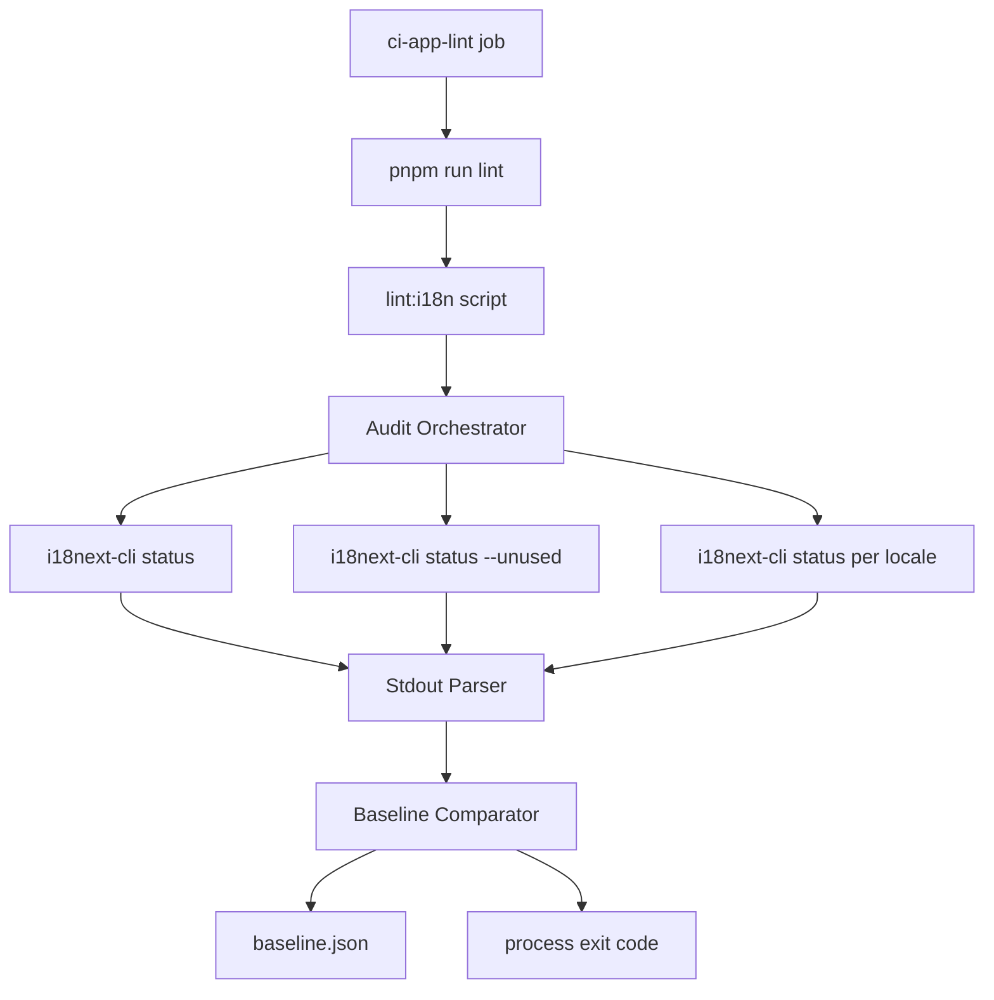
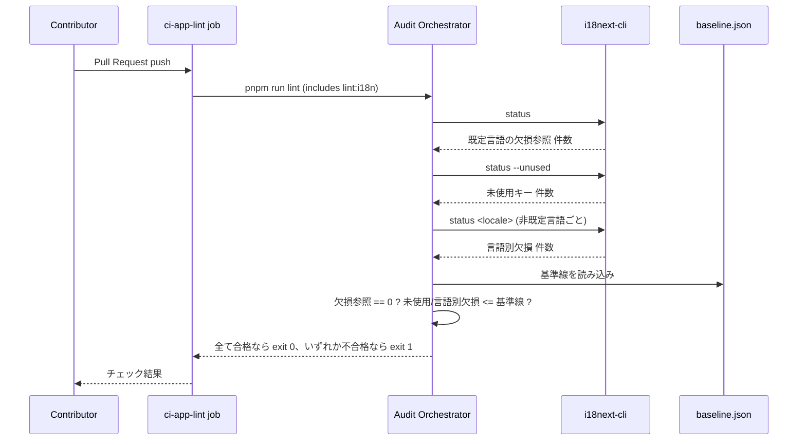

# 技術設計書

## Overview

**目的**: `apps/app` の翻訳キー参照が壊れていないことを継続的に検出する仕組みを既存の CI パイプラインに組み込み、discovery で見つかった実バグ2件（存在しないキー参照27件相当、管理画面の生キー表示）を解消する。

**利用者**: GROWI へのコントリビューター全員が、Pull Request のチェック結果として本機能の合否を確認する。GROWI 管理者は、修正後の管理画面で常に翻訳済みラベルを見る。

**Impact**: 現在 i18n 関連の CI ステップは0件（`.github/workflows/` を grep して確認済み）。本機能は新しい GitHub Actions ジョブを追加するのではなく、既存の `apps/app` の `pnpm run lint`（`run-p lint:**`、CI では `ci-app.yml` の `ci-app-lint` ジョブが `turbo run lint --filter=@growi/app` として実行）に新しい `lint:i18n` スクリプトを1本追加する形で統合する。

### Goals
- 存在しない翻訳キーへの参照を0件にし、その0件化が将来の新しい壊れた参照を検出できなくする恒久的な盲点を作らない
- 未使用キー・言語間の翻訳欠損を、現在の件数を基準線として悪化のみを検出する
- 動的に構築されるキー参照を、宣言によって誤検出から除外する
- 検出処理が翻訳ファイルを書き換えない
- 既存の手書きドリフトテスト2本を、新設する検出処理との重複が無い状態に整理する

### Non-Goals
- `translation.json` / `admin` namespace の構成そのものの再編（umbrella spec `i18n` の「未決1」が保持する）
- 未使用キー約1,130件の一括削除、他言語の欠損翻訳を埋める作業
- キーの型付けによる compile-time 検証、TMS 連携

## Boundary Commitments

### This Spec Owns
- `i18next-cli` の設定（`i18next.config.ts`）と、CI から呼び出す読み取り専用コマンドの組み立て
- 未使用キー・言語間欠損の基準線（`baseline.json`）と、その比較・更新ロジック
- 動的キー参照の宣言（未使用キー側は `extract.preservePatterns`、存在しないキー参照側は `status.ignoreKeys`。この2つは別々の報告に効くため、両方に宣言する必要がある — 後述 i18next.config.ts）
- 既存の `pnpm run lint`（`lint:**` glob）への統合スクリプト1本
- 存在しないキー参照の0件化を、検出をすり抜けさせる除外ではなく、call site を検出可能な形に書き換えることで達成する一連の修正（後述 Components）
- 管理画面の共有ラベル20件の `commons` namespace への複製と、管理画面側 call site の書き換え
- 既存の手書きドリフトテスト2本の disposition（維持 or 削除）の決定と実施

### Out of Boundary
- `translation.json` 830キー・`admin` 1,166キー全体の namespace 再編（umbrella の未決事項）
- 未使用キーの一括削除、欠損翻訳の追加（`i18n-community-translation` の管轄）
- 新しい GitHub Actions ワークフローファイルの追加（既存 `ci-app.yml` の `lint` ジョブに乗せるため不要）
- キーの型付け（`CustomTypeOptions` の `resources` 拡張）

### Allowed Dependencies
- `i18next-cli`（新規 devDependency、CI では読み取り専用コマンドのみ呼び出す）
- 既存の `apps/app` lint パイプライン（`package.json` の `lint:**` glob、`turbo.json` の `lint` タスク）
- `public/static/locales/{en_US,ja_JP,zh_CN,fr_FR,ko_KR}/{translation,admin,commons}.json`

### Revalidation Triggers
- `i18next-cli` のメジャーバージョンアップ（stdout フォーマット変更の可能性、パーサーが壊れる）
- 新しい管理画面コンポーネントが「`t` を props 経由で受け取る」「複数 namespace 配列を試す helper を使う」という形を再び持ち込んだ場合（本設計は既存分を書き換えるだけで、パターン自体を禁止する lint は持たないため、新規コードでは Requirement 1 AC5 の趣旨に沿って最初から明示 namespace 前置を使う必要がある）
- namespace 構成の再編（umbrella の未決1）に着手する場合、`extract.input` / `ignore` / `preservePatterns` / `status.ignoreKeys` の再確認が必要
- 新しい動的キーを宣言するとき、編集者は次の2点を知っている必要がある（task 1.2 の実測で確定した設計上の決まり）:
  1. **宣言する場所は2つある。** `extract.preservePatterns` は未使用キーの報告（Requirement 2）にしか効かず、存在しないキー参照の報告（Requirement 1）には一切効かない。逆に `status.ignoreKeys` は存在しないキー参照の報告にしか効かない。あるキーが両方の報告に現れる場合は両方に書く。片方だけに書いて「宣言したのに報告が消えない」と悩む経路を避けるため、config ファイルのコメントにもこの区別を残している
  2. **ワイルドカード（`*`）で書くか、具体キーを並べるか。** 同じ接頭辞を静的な `t('…')` 呼び出しと共有しているキーファミリでは、具体キーを列挙する。ワイルドカードにすると、その接頭辞を持つ静的キーまで報告から隠れてしまい、後でそのキー名を打ち間違えても誰も気づけない恒久的な死角（Requirement 1 AC5 が禁じている状態）が生まれる。逆に、変わる部分の取りうる値がこのファイルの外（保存済みの値、スコープ id、設定されたアップローダ種別など）で決まり将来増える可能性があるファミリは、ワイルドカードで書く

## Architecture

### Architecture Pattern & Boundary Map

読み取り専用の静的解析ツール（`i18next-cli`）をラップする薄いオーケストレーターが、既存の lint パイプラインの一部として実行される。オーケストレーターは基準線ファイルと比較するだけで、翻訳ファイルには一切書き込まない。



**Architecture Integration**:
- 選択パターン: CLI ラッパー + 基準線比較。新しいサーバー/データベース層は不要
- Domain 境界: 検出（本 spec）と、検出結果を受けた翻訳ファイルの構成整理（umbrella の未決事項）を分離
- 既存パターンの維持: `tools/lint/*.cjs` として既に存在する自前 lint スクリプト群と同じ位置付け（`lint:**` glob に1本追加するだけ）
- 新規コンポーネントの根拠: `i18next-cli` 自体は基準線比較・複数コマンドの合成を行わないため、その2点だけを薄いラッパーで補う

### Technology Stack

| Layer | Choice / Version | Role in Feature | Notes |
|-------|------------------|------------------|-------|
| CLI ツール | `i18next-cli` 1.69.0（`^` 無しで固定。実装時点の最新安定版 1.71.0 で固定した — tasks.md の Implementation Notes 参照） | 既存キー参照の欠損・未使用キー・言語間ドリフトの検出 | MIT。`extract`/`sync` は呼ばない（Requirement 5） |
| 検出除外の宣言（未使用キー側） | `i18next-cli` の `extract.preservePatterns` | 動的に組み立てられるキーを**未使用キーの報告**（Requirement 2）から除外する | task 1.2 の実測: 宣言により `status --unused` が 3176件 → 1992件 |
| 検出除外の宣言（存在しないキー参照側） | `i18next-cli` の `status.ignoreKeys` | 動的に組み立てられるキーを**存在しないキー参照の報告**（Requirement 1）から除外する | `preservePatterns` はこちらの報告には効かないことを task 1.2 で実測（182件のまま、一覧も完全一致）。`ignoreKeys` を足して 182件 → 176件。Requirement 4.2 が両方からの除外を求めているため、この2つは片方では足りない |
| ラッパー | Node.js 24 標準機能のみ（`node:child_process`, `node:fs`） | 複数コマンドの実行・stdout 解析・基準線比較・終了コード決定 | `.ts` を直接 `node` で実行（`bin/postbuild-server.ts` と同じ規約） |
| CI 統合 | 既存 `apps/app/package.json` の `lint:**` glob | `turbo run lint --filter=@growi/app`（既存 `ci-app-lint` ジョブ）に自動的に含まれる | 新規ワークフローファイル不要 |

## File Structure Plan

### Directory Structure
```
apps/app/
├── i18next.config.ts                    # NEW: locales, extract.input/ignore/preservePatterns, status.ignoreKeys
└── tools/
    └── i18n-audit/
        ├── run-audit.ts                 # NEW: orchestrator (Components: Audit Orchestrator)
        ├── parse-status-output.ts       # NEW: pure parser functions (Components: Stdout Parser)
        ├── parse-status-output.spec.ts  # NEW: parser unit tests (fixture stdout)
        ├── baseline.ts                  # NEW: baseline read/compare/update (Components: Baseline Store)
        └── baseline.json                # NEW: recorded baseline counts (Data Models)
```

### Modified Files
- `apps/app/package.json` — devDependency に `i18next-cli` を追加。`scripts` に `"lint:i18n": "node tools/i18n-audit/run-audit.ts"` を追加（`lint:**` glob に含まれ、`pnpm run lint` から自動実行される）。基準線を更新するための `"i18n:baseline:update": "node tools/i18n-audit/run-audit.ts --update-baseline"` も追加（改悪方向の更新には別途 `--allow-regression` が必要）
- `apps/app/src/client/components/Admin/Security/SecuritySetting/{CommentManageRightsSettings,PageAccessRightsSettings,PageDeleteRightsSettings,PageListDisplaySettings,SessionMaxAgeSettings,UserHomepageDeletionSettings,UserPageVisibilitySettings}.tsx`（7ファイル） — `t` を props で受け取るのをやめ、各コンポーネントが自前で `useTranslation('admin')` を呼ぶように変更（Components: Call-site Remediation — Group 1a）
- `t` を props で受け取る管理画面コンポーネント12ファイル（`Admin/LegacySlackIntegration/SlackConfiguration.jsx`、`Admin/ElasticsearchManagement/StatusTable.jsx`、`Admin/ImportData/GrowiArchiveSection.jsx`、`Admin/MarkdownSetting/XssForm.jsx`、`Admin/MarkdownSetting/LineBreakForm.jsx`、`Admin/Users/PasswordResetModal.jsx`、`Admin/Notification/UserTriggerNotification.jsx`、`Admin/Notification/GlobalNotificationList.jsx`、`Admin/Notification/NotificationDeleteModal.jsx`、`Admin/Security/DeleteAllShareLinksModal.jsx`、`Admin/Users/StatusActivateButton.jsx`、`Admin/Users/UserRemoveButton.jsx`。いずれも `apps/app/src/client/components/` 配下） — キー文字列に `admin:` を前置（Components: Call-site Remediation — Group 1b）
- `apps/app/src/client/components/Me/{AssociateModal,DisassociateModal}.tsx` と、`commons.json` にのみ実在するキーを既定 namespace のまま参照している9ファイル（下記 Group 4 の一覧） — キー文字列に `admin:` / `commons:` を前置（Components: Call-site Remediation — Group 4）
- `apps/app/src/client/components/Admin/G2GDataTransfer.tsx`、`apps/app/src/client/components/Admin/AdminHome/AdminHome.tsx` — キー文字列の区切り `:` の重ね書き（`admin:g2g:transfer_success` 等）を `.` に直す（Components: Call-site Remediation — Group 5）
- `apps/app/src/pages/admin/` 以下（直下および `global-notification/` / `user-group-detail/` / `users/` などのサブディレクトリを含む、再帰的な対象）の `*.page.tsx` のうち `createAdminPageLayout` の `title` callback を使う19ファイル — `title: (props, t) => t('xxx')` のキー文字列に `admin:` を前置（Components: Call-site Remediation — Group 2）。`/kiro-validate-design` 5回目のレビューで、`admin/*.page.tsx` という書き方が単一階層しか一致せず、サブディレクトリ配下の5ファイル（`global-notification/[globalNotificationId].page.tsx`、`global-notification/new.page.tsx`、`user-group-detail/[userGroupId].page.tsx`、`users/external-accounts.page.tsx`、`users/index.page.tsx`）を取り落とすと指摘された
- `apps/app/src/server/routes/apiv3/security-settings/saml.ts` および同様に `getTranslation({ ns: [...] })` を使うサーバー側ファイル — 誤検出の原因になっているキーに namespace を明示前置（Components: Call-site Remediation — Group 3）
- 真の Bug 1（3つの namespace ファイルのどこにも存在しないキー参照）25件の call site — 完全な一覧と1件ごとの方針は task 1.2 の成果物 `apps/app/tools/i18n-audit/task-1.2-findings.md` の §1（24件、26箇所）に確定済みで、これに §5 の `LikeButtons.tsx`（`No users have liked this yet.`）1件を加えた25件が対象。`apps/app/src/components/PageView/PageAlerts/FixPageGrantAlert/FixPageGrantModal.tsx`（`fix_page_grant.modal.alert_message` を `fix_page_grant.modal.alert_message_select_group` への参照修正、`Successfully updated`/`Failed to update` は新規キー追加）、`apps/app/src/client/components/PageEditor/EditorGuideModal/{components/GuideRow.tsx,contents/TextStyleTab.tsx}`（`common:failed_to_copy` を新規キー追加）を含む（Components: Non-Existent Key Reference Fix）
- 共有ラベル20件（`Created` / `Cancel` / `Close` / `Name` 等）— `translation.json` の内容を変更せず `commons.json` へ複製し（全5言語）、参照している36の管理画面コンポーネントの call site のみ `commons:` 前置に変更（Components: Bug 2 Remediation）
- `apps/app/src/client/components/Admin/shared-labels-locale-sync.spec.ts`（NEW） — 複製した20キーについて、5言語すべてで `translation.json` と `commons.json` の値が一致することを検証する（`i18n-reconcile.spec.ts` と同種のパターン。Components: Bug 2 Remediation）
- `apps/app/src/client/components/Admin/g2g-error-keys-locale-drift.spec.ts` — 変更しない（全面維持）。`admin:g2g:*` キーは `t()` の固定引数として書かれておらず新設ゲートの検査対象に入らないため、既存の2つの検査（en_US への実在確認、`KEYS_WITH_DETAIL_MESSAGE` の整合性確認）とも重複しない（Components: Existing Spec Disposition）

## System Flows



いずれのコマンドも読み取り専用で、`extract` / `sync` は呼ばれない（Requirement 5）。パース失敗時は「不合格」として扱い、誤って0件扱いにしない（Error Handling を参照）。

## Requirements Traceability

| Requirement | Summary | Components | Interfaces | Flows |
|-------------|---------|------------|------------|-------|
| 1.1–1.4 | 存在しないキー参照の検出とゼロ化 | Audit Orchestrator, Stdout Parser, Non-Existent Key Reference Fix | `runDefaultLanguageCheck()` | System Flow |
| 1.5 | 除外による恒久的盲点を作らない | Call-site Remediation (Group 1a/1b/2/3/4/5), i18next.config.ts（ワイルドカードを使わず具体キーを列挙する規則） | — | — |
| 1.6 | 書き換え前後で表示文言が変わらないことの確認 | Call-site Remediation | Testing Strategy: 前後比較 | — |
| 2.1–2.5 | 未使用キー検出（基準線） | Audit Orchestrator, Baseline Store | `runUnusedKeysCheck()`, `baseline.json` | System Flow |
| 3.1–3.5 | 言語間欠損の検出（基準線） | Audit Orchestrator, Baseline Store | `runLocaleDriftCheck()`, `baseline.json` | System Flow |
| 4.1–4.3 | 動的キーの誤検出防止 | i18next.config.ts（未使用キー側は `extract.preservePatterns`、存在しないキー参照側は `status.ignoreKeys`。AC2 が両方からの除外を求めているため、この2つの宣言で1つの要件を満たす） | — | — |
| 5.1–5.2 | 翻訳ファイルの不変性 | Audit Orchestrator | `status` / `status --unused` のみ呼ぶ | System Flow |
| 6.1–6.2 | 既存 CI への統合 | package.json `lint:**` | `lint:i18n` script | System Flow |
| 7.1–7.2 | 管理画面の生キー表示解消 | Bug 2 Remediation | — | — |
| 8.1–8.2 | 既存ドリフトテストの整理 | Existing Spec Disposition | — | — |

## Components and Interfaces

| Component | Domain/Layer | Intent | Req Coverage | Key Dependencies | Contracts |
|-----------|---------------|--------|---------------|-------------------|-----------|
| i18next.config.ts | Config | `i18next-cli` の入出力・除外設定を宣言（`extract.preservePatterns` と `status.ignoreKeys` の2系統） | 4.1–4.3, 5.1 | i18next-cli | State |
| Audit Orchestrator | Tooling | 3種の検出コマンドを実行し合否を決定 | 1.1–1.4, 2.1–2.4, 3.1–3.4, 5.1–5.2, 6.1–6.2 | Stdout Parser, Baseline Store | Batch |
| Stdout Parser | Tooling | `i18next-cli` の人間向けテキスト出力から件数を抽出する純粋関数 | 1.1, 2.1, 3.1 | なし | Service |
| Baseline Store | Tooling | 基準線の読み込み・比較・更新 | 2.2, 2.5, 3.2, 3.5 | baseline.json | State |
| Non-Existent Key Reference Fix | Client | 本当に存在しない25件のキー参照を修正する（task 1.2 実測の24件＋`LikeButtons.tsx` 1件） | 1.1, 1.4 | なし | — |
| Call-site Remediation (Group 1a/1b/2/3/4/5) | Client/Server | 静的には解決できるはずのキー参照が検出ツールから追跡できない状態を、除外でなく書き換えで解消 | 1.1–1.6, 7.1 | createAdminPageLayout, getTranslation | — |
| Bug 2 Remediation | Client | 管理画面の共有ラベルを常に翻訳済み表示にする | 7.1, 7.2 | commons namespace | — |
| Existing Spec Disposition | Test | 手書きドリフトテスト2本を整理 | 8.1, 8.2 | i18n-reconcile.spec.ts, g2g-error-keys-locale-drift.spec.ts | — |

### 報告176件の内訳と、1件ごとの受け皿

Requirement 1 の「0件」は `i18next-cli status` の生の報告件数に対する条件である。したがって、実行時には正常に見えているものであっても、報告に残る限りは何らかの受け皿が必要になる。下表は task 1.2（`apps/app/tools/i18n-audit/task-1.2-findings.md`）で実測した内訳と、本設計のどのコンポーネントが担当するかの対応で、合計は実測値 176 と一致する（`status.ignoreKeys` に動的キー6件を宣言する前の生の報告は 182 件）。

| 分類 | 件数 | 担当コンポーネント |
|---|---:|---|
| A. 3つの namespace ファイルのどこにも存在しない（真の Bug 1） | 24 | Non-Existent Key Reference Fix |
| C. `admin.json` に実在するのに `translation` の不在として報告される | 119 | Call-site Remediation（Group 1a: 7ファイル / Group 1b: 12ファイル / Group 2: 19ファイル / Group 3: `saml.ts` / Group 4 の `admin:` 前置1キー） |
| D. `translation.json` にのみ実在し、管理画面から参照されている（Bug 2 の共有ラベル） | 18 | Bug 2 Remediation |
| E. `commons.json` にのみ実在し、既定 namespace のまま参照されている | 5 | Call-site Remediation（Group 4） |
| F. 区切り `:` を重ねて書いているため CLI が解決できない | 4 | Call-site Remediation（Group 5） |
| G. キー名に `.` を literal で含む | 2 | 1件（`LikeButtons.tsx`）は Non-Existent Key Reference Fix、1件（`GROWI.5.0_new_schema`）は i18next.config.ts の `status.ignoreKeys` |
| H. 複数形サフィックスの照合が合わない | 4 | i18next.config.ts の `status.ignoreKeys` |
| 合計 | 176 | |

**176 件が0件に到達することの検算（どのタスクが何件を報告から消すか）**: 上の分類と担当の対応を、タスク単位に積み直すと合計は 176 になり、余りは出ない。実装中に「どこにも属さない報告」が新たに見つかった場合は、この表のどこかが崩れているという意味になる。

| タスク | 消える件数 | 内訳 |
|---|---:|---|
| 3.1（Non-Existent Key Reference Fix） | 25 | A 24 + G 1（`LikeButtons.tsx`） |
| 3.3（`status.ignoreKeys` への宣言） | 5 | G 1（`GROWI.5.0_new_schema`）+ H 4 |
| 4.1 + 5.1 + 6.1（Group 1a / 2 / 3） | 57 | C のうち、この3グループのいずれかから参照されている分（119 − 62） |
| 4.2（Group 1b） | 61 | C のうち、`t` を props で受け取る12ファイルから参照されている分 |
| 4.3（Group 4） | 6 | C 1（`security_settings.updated_general_security_setting`）+ E 5 |
| 4.4（Group 5） | 4 | F 4 |
| 7.2（Bug 2 Remediation） | 18 | D 18 |
| 合計 | 176 | |

**報告が新たに増えないことの確認**: 7.2 は共有ラベル23件すべてに `commons:` を前置する。このうち5件（`Confirm` / `Help` / `Password` / `Warning` / `add`）は、前置前は CLI が `translation` で解決できていたため今は報告に出ていない。前置後は `commons.json` を見に行くので、7.1 の複製対象（20件）にこの5件が含まれていることが必要である — 23件から除外するのは `commons.json` に既に値がある3件（`Delete` / `toaster.remove_share_link` / `toaster.remove_share_link_success`）だけなので、5件はいずれも複製対象に含まれている。したがって 7.2 は新しい報告を生まない。

C の 119 件のうち **62 件は Group 1a / 2 / 3 のどのファイルからも参照されていない**（task 1.2 の実測）。この62件の報告元を本改訂で改めて測り直したところ、内訳は次のとおりだった。これが Group 1b と Group 4 を新たに起こす根拠である。

- 61件 — Group 1b の12ファイル（`t` を props で受け取る `.jsx` / `.tsx`）のいずれかから参照されている
- 1件（`security_settings.updated_general_security_setting`）— `Me/AssociateModal.tsx` / `Me/DisassociateModal.tsx` の2ファイルだけから参照されている。この2ファイルは自分で `useTranslation()`（引数なし＝既定の `translation`）を呼んでおり、キーは `admin.json` にしか無いため、**実行時にも生キーが表示される実在の不具合**である（`/me` 配下のページには `admin` namespace が配られているので、`admin:` を前置すれば表示が直る）

### Tooling

#### Audit Orchestrator

| Field | Detail |
|-------|--------|
| Intent | `i18next-cli` の3種のコマンドを実行し、Requirement 1/2/3/5 の合否をまとめて判定する |
| Requirements | 1.1, 1.2, 1.3, 1.4, 2.1, 2.2, 2.3, 2.4, 3.1, 3.2, 3.3, 3.4, 5.1, 5.2, 6.1, 6.2 |

**Responsibilities & Constraints**
- `status`（既定言語の欠損参照件数）、`status --unused`（未使用キー件数）、非既定言語ごとの `status <locale>`（言語別欠損件数）の3系統のみを呼ぶ。`extract` / `sync` は呼ばない（機構的に不変性を保証する）
- パースに失敗した場合は各チェックを「不合格」として扱う。パース失敗を0件（合格）として扱ってはならない
- `--update-baseline` フラグを渡された場合のみ、測定した件数で `baseline.json` を上書きする（通常実行では読み取りのみ）

**Dependencies**
- Outbound: Stdout Parser — コマンド出力の構造化 (P0)
- Outbound: Baseline Store — 基準線の読み込み・比較・更新 (P0)
- External: `i18next-cli` CLI（`node:child_process` 経由で起動） (P0)

**Contracts**: Service [ ] / API [ ] / Event [ ] / Batch [x] / State [ ]

##### Batch / Job Contract
- Trigger: `pnpm run lint`（`lint:**` glob）から `lint:i18n` として実行、または `--update-baseline` フラグ付きで手動実行
- Input / validation: `apps/app` の `src/` と `public/static/locales/`（`i18next.config.ts` が指す範囲）
- Output / destination: 標準出力へのチェック結果サマリー、非ゼロ終了コード（不合格時）
- Idempotency & recovery: 読み取り専用のため常に冪等。失敗時は再実行するだけでよい

**Implementation Notes**
- Integration: 既存の `lint:**` glob に1本追加するだけで、新しい GitHub Actions ジョブは不要
- Validation: パーサーの単体テスト（下記 Stdout Parser）と組み合わせて、出力フォーマット変更の早期検知を行う
- Risks: `i18next-cli` のバージョンアップで stdout フォーマットが変わるとパーサーが壊れる。バージョンを `^` 無しで固定することで軽減する（research.md 参照）

#### Stdout Parser

| Field | Detail |
|-------|--------|
| Intent | `i18next-cli` の人間向けテキスト出力から、検出に必要な件数だけを取り出す純粋関数群 |
| Requirements | 1.1, 2.1, 3.1 |

**Responsibilities & Constraints**
- 副作用を持たない純粋関数として実装する（`coding-style.md` の Pure Function Extraction に従う）。オーケストレーターから見て「コマンド実行」と「出力の解釈」を分離する
- 期待した形式に一致しない入力を渡された場合は例外を投げる（呼び出し側であるオーケストレーターが「不合格」に変換する）

**Contracts**: Service [x] / API [ ] / Event [ ] / Batch [ ] / State [ ]

##### Service Interface
```typescript
interface StatusParser {
  parseDefaultLanguageMissingCount(stdout: string): number;
  parseUnusedCount(stdout: string): number;
  parseLocaleMissingCount(stdout: string, locale: string): number;
}
```
- Preconditions: `stdout` は対応するコマンド（`status` / `status --unused` / `status <locale>`）の生出力そのものであること
- Postconditions: 件数を返す。該当する行が見つからない場合は例外を投げる（0を返さない）
- Invariants: 入力文字列に対して常に同じ結果を返す（副作用なし）

#### Baseline Store

| Field | Detail |
|-------|--------|
| Intent | 未使用キー・言語別欠損の基準線を保持し、測定値との比較・更新を行う |
| Requirements | 2.2, 2.5, 3.2, 3.5 |

**Responsibilities & Constraints**
- `baseline.json`（単一のファイル、Data Models 参照）を単一の真実源とする
- 比較は「測定値 <= 基準線」であること。等しい場合は合格
- 更新は明示的な `--update-baseline` 実行時のみ行い、通常の CI 実行では書き込まない
- `--update-baseline` は、新しい測定値が既存の基準線より大きい（悪化する）場合、既定では書き込みを拒否してエラー終了する。`/kiro-validate-design` のレビューで、悪化した測定値でもそのまま上書きできてしまうと、CI が落ちたときに原因を直す代わりに「基準線を今の状態に合わせて更新する」ことで通してしまう経路が残ると指摘された。改悪方向への更新は `--update-baseline --allow-regression` を明示的に渡した場合のみ許可する
- 更新実行時は、常に「基準線が何件から何件に変わるか」を標準出力に明示する（改善方向の更新であっても、レビュアーが PR の diff だけでなく実行ログでも変化量を確認できるようにする）
- `baseline.json` がまだ存在しない最初の実行（本機能を初めて導入する時点）では、比較対象となる既存の基準線が無いため、悪化防止ガードの対象外として扱い、`--allow-regression` 無しでも測定値をそのまま書き込む。以後の実行では通常のガードが働く
- `missingByLocale` にある言語のキーが記録されていない場合（新しい言語をこの機能に追加した直後など）、その言語の基準線は「0」として扱う。すなわち、その言語で1件でも欠損があれば不合格になる。「まだ基準線を決めていないので常に合格」という解釈は採らない（要件3.2が求める「本機能の提供時点で言語ごとに集計した件数を基準線として記録する」という前提に、新しい言語を後から追加した場合でも一貫させる）

**Contracts**: Service [ ] / API [ ] / Event [ ] / Batch [ ] / State [x]

##### State Management
- State model: `{ unusedKeys: number, missingByLocale: Record<Lang, number> }`（Data Models 参照）
- Persistence & consistency: リポジトリにコミットされた JSON ファイル。変更は通常の PR diff として現れ、レビュアーが見える
- Concurrency strategy: 単一ファイルへの逐次読み書きのみ。並行更新のシナリオは無い（CI は読み取りのみ、更新は開発者が手動実行）

### Client/Server

#### Non-Existent Key Reference Fix

| Field | Detail |
|-------|--------|
| Intent | 「どの namespace ファイルにも存在しない（真の Bug 1）」と分類された25件のキー参照を実際に修正する |
| Requirements | 1.1, 1.4 |

**対象は25件（research.md の「31件」からの変化）**: research.md が 31 と数えたのは、discovery 時点の分類粒度による。task 1.2 で、(1) 区切り `:` を重ねた書き方、(2) キー名に `.` を literal で含む書き方、(3) 複数形サフィックス付きの呼び出しという3種類の照合を追加したところ、そのうち7件は「実行時には正しく解決されるが CLI が解決できないだけ」のものだと分かり、A（真の Bug 1）は 24 件になった。件数が減ったのではなく、**分類の粒度が変わった**というのが正しい理解である。本コンポーネントの対象は、この 24 件（call site は 26 箇所。`common:failed_to_copy` と `Browsing of this page is restricted` がそれぞれ2箇所から参照されている）に、下記の `LikeButtons.tsx` 1件を加えた **25 件**。1件ごとの方針（参照修正 / 新規キー追加 / 判断要）は task 1.2 の成果物 `apps/app/tools/i18n-audit/task-1.2-findings.md` §1 の表に確定済みで、実装者はその表をそのまま対象一覧として使う。

**Responsibilities & Constraints**
- `/kiro-validate-design` のレビューで、Call-site Remediation（Group 1/2/3）が対象にしているのは「namespace ファイルには実在するのに検出ツールが見つけられない119+5件の誤検出」だけであり、要件1.4が名前まで挙げて0件化を約束している31件の「本当に存在しないキー参照」を直す担当が design.md に無いと指摘された。本コンポーネントはその欠落を埋める
- 各キーについて、次の2通りのいずれかで直す。どちらになるかはキーごとに異なり、task 1.2 が25件それぞれについて方針（参照修正 / 新規キー追加 / 「判断要」＝候補が複数あるか意味の一致が微妙なため実装者が call site を読んで決める）を確定させている:
  1. **参照修正**: 意図していた既存キーが翻訳ファイルの中に見つかる場合、call site をその既存キーを指すように直す。5言語の翻訳ファイルには手を入れないため、Requirement 3 の基準線に影響しない
  2. **新規キー追加**: 意図に合う既存キーが見つからない場合、en_US に新しいキーを追加した上で、**同じ変更の中で**残り4言語すべてに翻訳を追加する。1言語だけ追加して他言語を後回しにすると、Requirement 3 が監視する言語別欠損件数がその分だけ増え、Baseline Store の悪化防止ガード（`--allow-regression` が無いと基準線を更新できない）に、この機能を導入する変更自身が引っかかる
- discovery が名前を挙げている3例の disposition は、レビュー時点で次のように確認済み（残りの28件は同じ手順で `/kiro-spec-tasks` 側で判定する）:
  - `fix_page_grant.modal.alert_message`（`FixPageGrantModal.tsx`）→ **参照修正**。`/kiro-validate-design` 4回目のレビューで、このキーが表示される条件（`shouldShowModalAlert`、グループ指定を選んだのに1つも選ばず「変換」を押した場合のみ true になる、69〜73行の `submit` 関数を参照）を実際に確認した結果、常時表示の案内文である `need_to_fix_grant`（192行目で既に使用中）ではなく、同じ `fix_page_grant.modal` 配下にある `alert_message_select_group`（「選択されたグループがありません」、現在どこからも参照されておらず未使用キーの一部）が意味の一致する修正先だと判明した。修正によって未使用キーが1件減るため、Requirement 2 の基準線にも良い影響がある
  - `Successfully updated` / `Failed to update`（同ファイル）→ **新規キー追加**。既存キーに意味の一致する候補が見つからなかった
  - `common:failed_to_copy`（`GuideRow.tsx` 37行目、`TextStyleTab.tsx` 28行目）→ **新規キー追加**。同じ関数内でコピー成功時に使っている `editor_guide.textstyle.copy_done` の対になるキー（`editor_guide.textstyle.copy_failed`）として追加する。**新規キー追加の場合、キーを追加するだけでは不十分で、call site の呼び出し文字列自体も新しいキー名に書き換える必要がある**（`/kiro-validate-design` 5回目のレビューで、この書き換えが明記されておらず `t('common:failed_to_copy')` という存在しない参照がそのまま残ってしまうと指摘された）。この2ファイルの呼び出しを `t('common:failed_to_copy')` から `t('editor_guide.textstyle.copy_failed')` に書き換える。一方 `Successfully updated`/`Failed to update` は、追加する新規キー名が呼び出し文字列そのものと一致するため、call site の書き換えは不要（キーの追加だけで解決する）

**task 1.2 で新たに見つかった15件の disposition**

discovery の分類（真の Bug 1・Group 1/2/3・Bug 2 の共有ラベル）のどれにも入らない15件が、task 1.2 の実測で見つかった。上記3例と同じ書き方で、1件ごとの担当を確定させる:

| # | 分類 | 対象 | 担当 / 方針 |
|---:|---|---|---|
| 1 | G（literal `.`） | `No users have liked this yet.`（`PageControls/LikeButtons.tsx:87`） | **本コンポーネント（参照修正）**。`en_US` には末尾に `.` がある版（値は英語のまま）と無い版が両方あるが、`ja_JP` などには `.` の無い版しか無い。そのため日本語では en_US へフォールバックして英語が出ている、実在の不具合である。呼び出しを `t('No users have liked this yet')`（末尾 `.` なし）に直すと4言語の翻訳が効くようになり、報告も1件減る。**この1件だけは Requirement 1.6 の「前後で文言が変わらない」が成り立たない**（英語→日本語に変わるのが修正の目的そのもの）。検証の書き方は Testing Strategy の例外一覧を参照 |
| 2 | G（literal `.`） | `GROWI.5.0_new_schema`（`IdenticalPathPage.tsx:52`） | **i18next.config.ts の `status.ignoreKeys` に1キーだけ列挙**。`translation.json` は `"GROWI.5.0_new_schema"` を1つのキー名として持っており、実行時は正しく解決する（i18next を起動して戻り値を確認済み）。CLI は `.` を階層の区切りとしてしか解釈できないため、この形のキーは原理的に解決できない。キー名そのものを改名する案もあるが、5言語のファイルと call site を触る変更になり、得られるのは「CLI が読める形になる」ことだけなので採らない |
| 3〜6 | H（複数形サフィックス） | `page_page.notice.stale_one` / `stale_other`（`PageStaleAlert.tsx:51`）、`commons:toaster.remove_share_link_one` / `_other`（`ShareLink.tsx:32`、`Admin/Security/ShareLinkSetting.tsx:74`） | **i18next.config.ts の `status.ignoreKeys` に4キーを列挙**。CLI は `t(key, { count })` に対して `key_one` / `key_other` の実在を求めるが、i18next 本体はサフィックス無しのキーでも解決する（実測済み）。翻訳ファイル側を i18next v4 の複数形形式（`_one` / `_other`）に移行するのが本筋だが、それは5言語×複数形規則の異なる言語を扱う別作業であり、Non-Goals（翻訳ファイル構成の再編）に隣接する。本 spec では宣言による除外に留め、移行は follow-up として research.md に記録する。なお `page_page.notice.stale` は `stale_plural`（i18next v3 の書き方で、v4 既定では読まれない）を持つため英語の複数形が崩れている（"More than 3 year"）。これも同じ follow-up に含める |
| 7〜11 | E（`commons.json` にのみ実在） | `not_found_page.page_not_exist` / `Show` / `Hide` / `New` / `toaster.create_failed`（9ファイル） | **Call-site Remediation（Group 4）**。`commons:` を前置する |
| 12〜15 | F（区切り `:` の重ね書き） | `admin:g2g:transfer_success`（`G2GDataTransfer.tsx:110`）、`admin:admin_top:copy_prefilled_host_information:default` / `:done` / `admin:admin_top:submit_bug_report`（`AdminHome/AdminHome.tsx:138,147,158`） | **Call-site Remediation（Group 5）**。区切りを `.` に直す |

**Implementation Notes**
- Integration: 25件の完全な一覧は task 1.2 の成果物 `apps/app/tools/i18n-audit/task-1.2-findings.md` §1 と §5 に確定済み。再生成は不要で、実装者はその表を対象一覧として使う（一覧の作り方＝「`status en_US --hide-translated` の報告を、3 namespace ファイルに対して (1) そのままの形、(2) `:` を `.` に置換した形、(3) 複数形サフィックスを外した形の3通りで実在確認する」は同ファイル §8 に手順として残っている）
- Validation: 新規キー追加を伴う修正は、Baseline Store が基準線を記録するタイミングより前に完了させる（Data Models 参照）。参照修正のみの分は Requirement 1.6 の前後比較で検証する
- Risks: 新規キー追加の翻訳文言（en_US 以外の4言語）が、機械的な直訳で意味を損なう可能性。既存の近傍キーの言い回しに揃える

#### Call-site Remediation (Group 1a/1b/2/3/4/5)

| Field | Detail |
|-------|--------|
| Intent | 静的には解決できるはずのキー参照が検出ツールから追跡できない状態（C の 119 件、E の 5 件、F の 4 件）を、検出対象からの除外ではなく、静的解析で追跡可能な形への書き換えで解消する |
| Requirements | 1.1, 1.5, 1.6, 7.1 |

**Responsibilities & Constraints**
- Group 1a（`SecuritySetting/` 配下7ファイル）: `t` を props 経由で受け取るのをやめ、各コンポーネントが自前で `useTranslation('admin')` を呼ぶ。書き換え前に親コンポーネントが実際にどの namespace で `t` を束縛していたかを確認し、同じ namespace を明示指定する
- Group 1b（12ファイル）: 同じ「`t` を props で受け取る」書き方は `SecuritySetting/` の外にも広くあり、task 1.2 の実測で12ファイルが見つかった（`SlackConfiguration.jsx` 14キー / `StatusTable.jsx` 9 / `GrowiArchiveSection.jsx` 6 / `XssForm.jsx` 6 / `PasswordResetModal.jsx` 6 / `UserTriggerNotification.jsx` 6 / `LineBreakForm.jsx` 5 / `GlobalNotificationList.jsx` 2 / `NotificationDeleteModal.jsx` 2 / `DeleteAllShareLinksModal.jsx` 2 / `StatusActivateButton.jsx` 2 / `UserRemoveButton.jsx` 1。件数は「そのファイルが持つ、報告されているキーの数」で、1つのキーを複数ファイルが共有するため合計は 61 を超える）。`SecuritySetting/` 配下の7ファイルだけが `t: (key: string) => string` という型注釈を持つため grep で見つかりやすく、型注釈の無い `.jsx` 側が discovery で見落とされていた
  - **この12ファイルは Group 1a と同じ構造だが、直し方は違う。** hook 化ではなく、**キー文字列に `admin:` を前置する**（Group 2 と同じ技法）。理由は2つ: (1) `StatusTable.jsx` は `React.PureComponent` を継承した class component で、hook を呼べない。hook 化するには関数コンポーネントへの書き換えが必要で、検出のために求められている変更量を大きく超える。(2) 前置は、`t` の出自を問わず文字列だけで namespace が決まるため、props 経由の `t` に対しても有効であることを実測で確認している（research.md の該当 Decision）。親が束ねている namespace は12ファイルすべて `admin` である
  - 各ファイルは wrapper の関数コンポーネントで `useTranslation('admin')` を呼んで `t` を渡している（例: `StatusTable.jsx` 203行目）。前置後も実行時の解決先は変わらない
- Group 2（19ファイル）: `createAdminPageLayout` の `title` callback 内のキー文字列に `admin:` を前置する（`useTranslation('admin')` に実際に束縛されているため、前置は文字列上の事実確認に過ぎない）。`createAdminPageLayout` を使うファイルは実際には23個あり、そのうち4個は対象外: `[...path].page.tsx` / `vault.page.tsx` の2個は `title` がキー参照を持たない固定文字列（`() => 'Not Found'` 等）、`app.page.tsx` / `data-transfer.page.tsx` の2個は既に `t(key, { ns: 'commons' })` という options 引数形式で明示指定済み。この options 引数形式も、`ns:key` という文字列前置と同様に `i18next-cli` の静的解析が正しく認識することをサンドボックスで確認済みであり、書き換え不要
- Group 3（`saml.ts`）: `getTranslation({ ns: [...] })` で解決しているキーに namespace を前置する。前置対象のキーが両方の namespace に重複して存在しないことを、書き換え前に機械的に確認する（フォールバック順序の変化による値の取り違えを防ぐ）。task 1.2 で `grep -rn "getTranslation(" src` の7箇所すべてを確認した結果、**`ns:` の配列を渡しているのは `saml.ts` 1ファイルだけ**で、書き換えが必要な固定キーもその中の1つ（`saml.ts:220` の `security_settings.form_item_name.ABLCRule`）だけだった。同じキーはクライアント側 `SamlSecuritySettingContents.tsx:685` からも参照されており、そちらも報告に出ているので同時に前置する。同ファイル197行目のテンプレートリテラルは完全な動的キーで、`preservePatterns` / `status.ignoreKeys` の側で扱う。`input_validation.message.*` は `translation.json` に実在し報告に出ていないため前置しない（フォールバック順を変えるリスクを取らない）
- Group 4（6キー / 11ファイル）: **自分で `useTranslation()` を呼んでいるが、その宣言 namespace ではキーが解決できない**という別の型の書き方。前置で直す。**このうち実際に実行時にも生キーが表示される実在の不具合は4キー・5ファイルだけである**（4.3 の実装時に i18next の実際の解決結果を再確認した結果判明）。残り2キー・6ファイルは、`useTranslation(['translation', 'commons'])` という配列指定、または `useTranslation('commons')` という既定 namespace 指定により、前置前から実行時には正しく `commons.json` の値へ解決できていた（Bug 2 と原因は同じ「管理画面外から admin/commons のキーを参照している」型だが、i18next の namespace フォールバックが機能していたため生キー表示には至っていなかった）。前置はこの2キーについても `i18next-cli` の検出（Requirement 1.1/1.5）のためには必要だが、表示文言への影響は無い
  - **実在の不具合4キー・5ファイル**（前後で生キー→翻訳済み文言に変わる）: `security_settings.updated_general_security_setting`（`Me/AssociateModal.tsx`、`Me/DisassociateModal.tsx` — いずれも `useTranslation()` を引数無しで呼んでいる）、`Show` / `Hide`（`Me/BasicInfoSettings.tsx` — 同上）、`New`（`Me/AccessTokenSettings.tsx`、`PageAccessoriesModal/ShareLink/ShareLink.tsx` — いずれも同上）
  - **検出の都合のみ（前後で表示文言は変わらない）2キー・6ファイル**: `not_found_page.page_not_exist`（`RevisionComparer/RevisionComparer.tsx` は `useTranslation(['translation', 'commons'])`、`Admin/NotFoundPage.tsx` は `useTranslation('commons')`）、`toaster.create_failed`（`Hotkeys/Subscribers/EditPage.tsx` / `Navbar/PageEditorModeManager.tsx` / `client/services/use-toastr-on-error.tsx` は `useTranslation('commons')`、`CreateTemplateModal/CreateTemplateModal.tsx` は `useTranslation(['translation', 'commons'])`）
  - `admin:` を前置する1キー: `security_settings.updated_general_security_setting`（`Me/AssociateModal.tsx:59`、`Me/DisassociateModal.tsx:45`）。`/me` 配下のページには `commons` / `translation` / `admin` の3つが配られている（`pages/me/[[...path]].page.tsx:170`）ので、前置すれば解決する
  - `commons:` を前置する5キー: `not_found_page.page_not_exist`（`RevisionComparer/RevisionComparer.tsx:79`、`Admin/NotFoundPage.tsx:7`）、`Show`（`Me/BasicInfoSettings.tsx:142`）、`Hide`（同:160）、`New`（`Me/AccessTokenSettings.tsx:152`、`PageAccessoriesModal/ShareLink/ShareLink.tsx:81`）、`toaster.create_failed`（`Hotkeys/Subscribers/EditPage.tsx:68`、`CreateTemplateModal/CreateTemplateModal.tsx:74`、`Navbar/PageEditorModeManager.tsx:68`、`client/services/use-toastr-on-error.tsx:16`）。`commons` はすべてのページに必ず配られる（`pages/common-props/i18n.ts:22-27` が先頭に足す）ので、前置すれば解決する
- Group 5（4キー / 2ファイル）: 区切り文字 `:` を重ねて書いているキー（`admin:g2g:transfer_success`、`admin:admin_top:submit_bug_report`、`admin:admin_top:copy_prefilled_host_information:default` / `:done`）の2つ目以降の `:` を `.` に直す。i18next 本体は最初の `:` の前を namespace とみなし、残りを `keySeparator`（`.`）で繋ぎ直して解決するため、書き換え前後で解決先は完全に同じである（i18next を起動して戻り値を確認済み）。`i18next-cli` はこの繋ぎ直しをしないので、直さない限り報告に残る
  - **既存テストとの関係**: `g2g-error-keys-locale-drift.spec.ts` は `admin:g2g:*` という書き方を前提にしているが、キー文字列を抽出しているのは `server/service/g2g-transfer.ts`（ソケットで送る値）だけで、`G2GDataTransfer.tsx` の呼び出しは読んでいない。したがって Group 5 の書き換えはこのテストに差分を生じさせない（Existing Spec Disposition の「2本とも変更しない」という結論と両立する）。実装時にはこのテストが green のままであることを確認する
- 完全な動的キー（`saml.ts` のテンプレートリテラル等）はこの書き換えの対象外で、Requirement 4 の `preservePatterns` / `status.ignoreKeys` でカバーする

**Implementation Notes**
- Integration: namespace 構成そのものは変更しない。文字列に前置を追加する、区切りを直す、または hook 呼び出し元を変えるだけの書き換え
- Validation: 書き換え対象の各キーについて、書き換え前後で実際に解決される翻訳文言が変わらないことを確認する（Testing Strategy 参照）。ただし Group 4 のうち実在の不具合4キー（`security_settings.updated_general_security_setting` / `Show` / `Hide` / `New`）は、書き換え前が生キー表示という不具合なので、この確認は「一致」ではなく「生キーが翻訳済み文言に変わる」ことの確認になる。同じ Group 4 でも `not_found_page.page_not_exist` / `toaster.create_failed` は前置前から実行時解決が正しかったため、通常どおり「一致」を確認する
- Risks: research.md の Risks & Mitigations に記載の2点（Group 1a の namespace 取り違え、Group 3 のフォールバック順変化）

#### Bug 2 Remediation

| Field | Detail |
|-------|--------|
| Intent | 管理画面が本番でのみ生キーを表示する不具合を解消する |
| Requirements | 7.1, 7.2 |

**Design Decision: `translation.json` から削除して移動するのではなく、`commons.json` に複製する**
- `/kiro-validate-design` によるレビューで、共有ラベル（`Cancel` / `Close` / `Created` / `Name` / `Email` / `Update` / `Edit` / `Create` / `add` の少なくとも9件）が、discovery で数えた管理画面43コンポーネントとは別に、`Me` / `PageEditor` / `LoginForm` / `InstallerForm` / `external-user-group` 配下など少なくとも約25の管理画面外のファイルから、namespace を指定しない書き方（既定の `translation` namespace）で参照されていることが実際のコード検索で確認された。この事実は「移動」案（`translation.json` から削除して `commons.json` へ移す）を採ると、管理画面外のこれら約25ファイルが、今直そうとしているのと同じ「生キー表示」を新たに起こすことを意味する
- そのため、対象キーは `translation.json` から**削除せず**、`commons.json` に**複製**する。翻訳ファイルとしては同じ値が2ファイルに存在する状態になるが、これは `coding-style.md` が原則とする単一の真実源から意図的に外れる判断であり、根拠は次の2点: (1) 対象は20件という限定された集合であり、将来大きく増える見込みが薄い、(2) このリポジトリには既に同種の複製+同期確認テストという前例がある（`i18n-reconcile.spec.ts`）。新しい仕組みを持ち込むのではなく、既存の前例に揃える
- この選択により、管理画面外の約25ファイル（および今回のコード検索で洗い出していない残りのキーの消費者）は一切変更不要になる。「移動」案が要求していた「リポジトリ全体から消費者を洗い出す」という未調査のタスクも不要になる

**Responsibilities & Constraints**
- 対象の共有ラベルは **23件**（`Cancel` / `Close` / `Confirm` / `Create` / `Created` / `Delete` / `Description` / `Edit` / `Email` / `Error occurred` / `Help` / `Name` / `Password` / `Update` / `User` / `UserGroup` / `V5 Page Migration` / `Warning` / `add` / `eg` / `toaster.remove_share_link` / `toaster.remove_share_link_success` / `username`。task 1.2 で「管理画面のコードから `t('固定文字列')` として呼ばれ、その file が宣言した namespace では解決できず、`translation.json` には実在する」ものを機械的に洗い出した一覧）。research.md / design.md 初版の「約20〜23件」という見積りはこの23件と一致した
- **このうち3件（`Delete` / `toaster.remove_share_link` / `toaster.remove_share_link_success`）は `commons.json` に既に値があるため、複製の対象は 20 件**である。既にある3件を複製対象に入れると、値の出どころが2つある状態を意味なく増やしてしまう。この3件は call site の `commons:` 前置だけを行う（`toaster.remove_share_link*` の2件は call site が既に `{ ns: 'commons' }` を渡しているため、実際には変更不要な可能性が高い。実装時に確認する）
- 20件を、5言語すべての `translation.json` から `commons.json` へ複製する（`translation.json` 側の値は変更しない）
- 管理ページの `getServerSideAdminCommonProps` は既に `['commons', 'admin']` を読み込んでいるため、複製後は追加のペイロードなしで解決できる
- 対象の管理画面コンポーネントは **36ファイル**（完全な一覧と、各ファイルが持つ共有ラベルの対応は task 1.2 の成果物 `task-1.2-findings.md` §2 の表）。design.md 初版の「約43コンポーネント」は数え方の違い（call site 数、または `admin.json` にも実在するキーを含めた数え方）と考えられ、7ファイルの取りこぼしではない。この36ファイルの call site のキー文字列にのみ `commons:` を前置する（管理画面外の call site は変更しない）
- **`status` の生の報告に現れるのは23件のうち18件だけである**（分類 D）。差の5件（`Confirm` / `Help` / `Password` / `Warning` / `add`）は、その file が `useTranslation()` を引数なしで呼んでいるため CLI が「`translation` namespace で解決できている」と判定し報告に出てこないが、実行時には管理画面に `translation` が配られていないので生キーになる。**報告件数だけを見て対象を18件に狭めてはならない**
- 複製した20件のキーが、5言語すべてで `translation.json` と `commons.json` の値が一致することを検証する専用テストを設ける（Testing Strategy 参照）。将来どちらかの値だけを更新してしまうドリフトを検知する
- **未確定の追加候補1件**: 本改訂の検算で、`Done`（`translation.json` に実在。`Admin/Users/PasswordResetModal.jsx:67` が `t('commons:Done')` として呼んでおり `commons.json` には無い）が上記23件と同じ条件を満たすのに task 1.2 の一覧に入っていないことが分かった。task 1.2 の分類（182 / 176 の内訳）には `Done` は分類 D として含まれており、抜けているのは「複製する23件」の洗い出しの側だけである。件数を独断で 21 件に書き換えるのではなく、実装時に task 1.2 と同じ洗い出し手順を再実行し、`Done` を含めるかどうかを確認した上で確定させる（research.md の該当 Decision に記録）

**Implementation Notes**
- Integration: namespace 構成の再編（umbrella 未決1）には踏み込まず、20キーの複製に限定する
- Validation: 変更前後で、管理画面36コンポーネントの表示文言が変わらないことを確認する（`translation.json` は変更しないため、管理画面外への影響はそもそも発生しない）
- Risks: 複製ペアの片方だけを更新してしまうドリフト。専用テストで機械的に検知する（Testing Strategy 参照）。単一の真実源からの意図的な逸脱であることは上記 Design Decision に明記済み

### Test

#### Existing Spec Disposition

| Field | Detail |
|-------|--------|
| Intent | 手書きドリフトテスト2本と新設する検出処理の重複を整理する |
| Requirements | 8.1, 8.2 |

**Responsibilities & Constraints**
- `g2g-error-keys-locale-drift.spec.ts` は**全面維持**する（削除しない）。このファイルは性質の異なる2つの検査を持つ:
  1. `admin:g2g:*` という静的なキー参照が en_US に実在すること
  2. `KEYS_WITH_DETAIL_MESSAGE`（クライアント側で「詳細メッセージ付き通知」として扱うキーの一覧）が、`server/service/g2g-transfer.ts` から抽出した実際の発生キー集合からはみ出していないこと
  - `/kiro-validate-design` 6回目のレビューで、1番目の検査を「新設ゲートが同じ範囲を完全にカバーする」という理由で削除しようとした判断が誤りだと判明した。`admin:g2g:*` というキー文字列は `g2g-transfer.ts` の中で、`t()` の固定引数としては一度も書かれておらず、ソケット通信で送るデータの値として埋め込まれている（例: `key: 'admin:g2g:error_data_conflict'`）。翻訳する側の唯一の呼び出しはクライアント側 `G2GDataTransfer.tsx` の `t(key)` で、`key` は実行時に受け取った変数である。新設ゲート（`i18next-cli`）はコード中の `t('固定文字列')` という形しか静的に追跡できないため、この経路のキーはそもそも検査対象に入らない（Requirement 4 が扱う「動的キー」そのものであり、`preservePatterns` に宣言しても「誤検出として報告しない」だけで「実在することを確認する」わけではない）。したがって1番目の検査を削除すると、`g2g-transfer.ts` が新しいエラーキーを送るように変更されても対応する翻訳が追加されているかを確認する手段が失われる。このファイル自身のコメント（12〜18行目）が、まさにこの種の不具合（`error_upload_attachment` の翻訳漏れ）が過去に一度実際に起きたことを記録している
  - 2番目の検査は当初から維持する判断だった（翻訳ファイルの整合性ではなく、アプリケーション内部の2つの配列間の整合性チェックであり `i18next-cli` は関知しない）
  - 1番目の検査が使う `pusherSource` の読み込みと `emittedKeys` の抽出処理は、2番目の検査も共有して使っている。どちらか一方だけを消すという判断がそもそも成立しない（両方維持する今回の結論と整合する）
- `i18n-reconcile.spec.ts` は維持する。このテストは8つの**特定の**キーが存在し空でないことを保証しており、Requirement 2/3 の基準線比較（集計件数のみを見る）では、この特定キーの欠落を検出できない（別のキーが増減して合計件数が基準線以下に収まってしまう可能性があるため）。集約値の基準線と個別キーの存在保証は異なる性質の保証であり、後者は前者に包含されない

**Implementation Notes**
- Integration: `i18n-reconcile.spec.ts` を維持し `g2g-error-keys-locale-drift.spec.ts` を全面維持する、それぞれの判断根拠を PR の説明に残す
- Risks: 無し（判断はこの設計時点で確定済み）

## Data Models

### Baseline Store Schema

`apps/app/tools/i18n-audit/baseline.json`:

```typescript
interface I18nAuditBaseline {
  /** status --unused が報告する未使用キー件数の基準線 */
  unusedKeys: number;
  /** 既定言語(en_US)に対する各言語の欠損キー件数の基準線 */
  missingByLocale: Partial<Record<'ja_JP' | 'zh_CN' | 'fr_FR' | 'ko_KR', number>>;
}
```

- 本機能の提供時点で実測した件数を初期値として記録する（Requirement 2.2, 3.2）。この「提供時点」は、Non-Existent Key Reference Fix・Call-site Remediation（Group 1a/1b/2/3/4/5）・Bug 2 Remediation の複製作業がすべて完了した後を指す。これらの作業のうち新規キー追加を伴う分（Non-Existent Key Reference Fix の一部）が先に完了していないと、まだ翻訳されていない言語分がそのまま基準線に組み込まれてしまう
- `--update-baseline` フラグ付き実行でのみ上書きされる。CI からの通常実行では読み取りのみ
- 変更はコミットされた JSON の diff として PR に現れ、基準線がどちら方向にどれだけ動いたかをレビュアーが直接確認できる

## Error Handling

### Error Strategy
- **パース失敗**: 期待した形式の出力が見つからない場合、Stdout Parser は例外を投げる。Audit Orchestrator はこれを「不合格」として扱い、`0件` として通過させない。CI 上ではジョブ失敗として現れ、原因（`i18next-cli` の出力フォーマット変更の可能性）をログに出す
- **コマンド実行失敗**（`i18next-cli` 自体が予期せず終了した場合）: 検出不能として「不合格」扱いにする。「検出できなかったので合格」という解釈は行わない
- **基準線ファイルの欠落・破損**: 通常実行（CI 上の `lint:i18n`）では、起動時に検証し、読めない場合はエラーとして即座に失敗する（曖昧な既定値へのフォールバックはしない）。ただし `--update-baseline` 実行時にファイルがまだ存在しない場合（本機能の初回導入時）だけは例外で、Baseline Store の規定どおり「基準線0件からの更新」として書き込みを許可する

### Monitoring
- CI のジョブ失敗が唯一の通知経路。既存の Slack 通知（`ci-app.yml` の `Slack Notification` ステップ）が `ci-app-lint` ジョブ全体の失敗として既に配線されているため、追加の監視設定は不要

## Testing Strategy

- **Unit Tests**:
  - Stdout Parser の3関数それぞれについて、`i18next-cli` の実際の出力サンプル（正常系・0件系・パース不能系）を fixture として持つテスト
  - Baseline Store の比較ロジック（基準線以下・基準線超過・境界値）
- **Integration Tests**:
  - Audit Orchestrator を実際の `apps/app` リポジトリに対して実行し、Requirement 1 の0件化・Requirement 2/3 の基準線遵守を確認する（CI で毎回実行されるテスト自体がこの役割を果たす）
  - Call-site Remediation の書き換え対象キーそれぞれについて、書き換え前後で実際に解決される翻訳文言が一致することを確認する（Requirement 1.6）。書き換え前の値をテスト実装時に記録し、書き換え後の値と比較する形で行う
  - **前後一致を求めない例外（合計5キー）**: 次のキーは、書き換え前の表示が不具合そのものなので、確認する内容は「一致」ではなく「生キー（または誤ったフォールバック）が、選択言語の翻訳済み文言に変わること」である。前後一致を条件にすると、直したことが不合格として現れてしまう
    - Group 4 のうち実在の不具合4キー（`security_settings.updated_general_security_setting`、`Show`、`Hide`、`New`）— 書き換え前は宣言 namespace で解決できず生キーが表示されている。同じ Group 4 でも `not_found_page.page_not_exist` / `toaster.create_failed` は配列指定または `commons` 既定指定により前置前から正しく解決できていたため、この例外には含めない（通常の前後一致確認の対象）
    - `No users have liked this yet.`（`LikeButtons.tsx`、Non-Existent Key Reference Fix）— 書き換え前は ja_JP などで en_US へフォールバックして英語が表示されている
  - Bug 2 Remediation で複製する各キーについて、5言語すべてで `translation.json` と `commons.json` の値が一致することを検証する専用テスト（`i18n-reconcile.spec.ts` と同種のパターン）。将来どちらかだけが更新された場合のドリフトを検知する
  - Baseline Store の `--update-baseline` について、既存の基準線より悪化した測定値を渡した場合に `--allow-regression` 無しでは書き込みを拒否することを確認するテスト
  - Non-Existent Key Reference Fix が新規追加するキー（`Successfully updated` / `Failed to update` / `editor_guide.textstyle.copy_failed` を含む）について、5言語すべてに値が存在し空でないことを検証する専用テスト。`/kiro-validate-design` 4回目のレビューで、「新規キー追加がすべて終わってから基準線を記録する」という順序が文章の注意書きだけで実行時に確認されないと指摘されたため、この確認を「注意書き」から「実行して合否が付くテスト」に変える。CI のタスク順序としては、このテストが緑になっていることを、`--update-baseline` を初めて実行する前提条件として運用する（Baseline Store 自体には強制する仕組みは持たせず、テストというチェックポイントで担保する）
- **E2E Tests**: 対象外（本機能は CI 上の静的検出であり、ブラウザ操作を伴わない。Bug 2 の修正確認は既存の管理画面 Playwright スモークテストの範囲で十分カバーされる）

## Open Questions / Risks

- **Group 1a/3 の書き換えに伴う回帰リスク**（namespace 取り違え、フォールバック順の変化）— research.md の Risks & Mitigations に詳細を記録済み。Testing Strategy の前後比較で検証する
- **`i18next-cli` の stdout フォーマット依存** — バージョン固定とパーサー単体テストで軽減するが、将来のアップグレード時には再検証が必要（Revalidation Triggers 参照）
- **複製した20キーのドリフト** — `translation.json` と `commons.json` の値が将来ずれる可能性。専用の同期テストで機械的に検知する（Bug 2 Remediation 参照）。単一の真実源から意図的に外れた判断であることは Design Decision に明記済み

- **`Done` を Bug 2 の複製対象に含めるか**（未決の1件）— 上記 Bug 2 Remediation の「未確定の追加候補1件」を参照。実装時に洗い出し手順を再実行して確定させる
- **複数形形式の移行**（follow-up、本 spec の対象外）— `page_page.notice.stale_plural` のような i18next v3 の書き方が残っており、英語の複数形が崩れている。本 spec では `status.ignoreKeys` による除外に留め、移行は別作業として research.md に記録した

「`t` を props で受け取るファイルが `SecuritySetting/` 配下の7ファイル以外にもあるのではないか」という懸念は、task 1.2 の実測（12ファイル）と本改訂での検算により**決着済み**であり、リスクではなく確定した対象一覧として上記 Group 1b に書いてある。この決着に至る経緯（実測値、代替案、選んだ直し方の理由）は research.md の Design Decisions に記録している。

`/kiro-validate-design` による複数回のレビューで見つかった Critical Issue とその修正経緯も research.md の Design Decisions に記録している。
