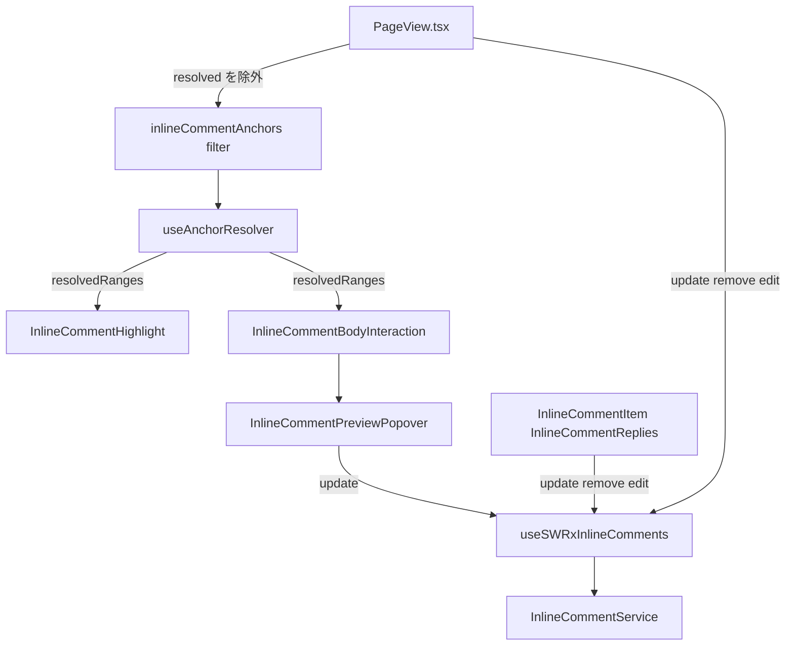
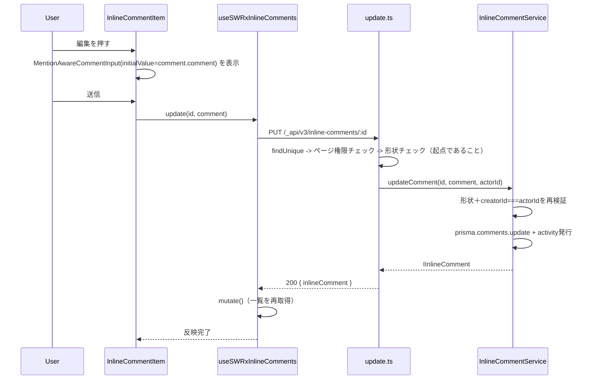

# Design Document

## Overview

**Purpose**: この機能は、インラインコメント（起点コメント・返信）に、通常コメントと同じ権限モデルでの編集・削除を追加し、解決済みのインラインコメントを本文中から見えなくする（一覧には残す）。

**Users**: 自分の投稿したインラインコメント・返信を後から直せる／消せるようになる投稿者本人。加えて、解決済みの指摘で本文の見た目が埋まらなくなる恩恵を、ページ閲覧者全般が受ける。

**Impact**: 既存の `inline-comment` フィーチャー（サーバー側ルート／サービス／DTO、`InlineCommentItem`／`InlineCommentReplies`／`InlineCommentPreviewPopover`／`PageView.tsx`）を拡張する。新しいサーバーサイドモデルは作らず、通常コメントと共有している既存の `comments` Prisma モデルをそのまま使う。解決／未解決を切り替える仕組み自体には変更を入れず、その結果として本文中にどう見えるかだけを変える。

### Goals
- 起点コメント・返信の両方について、投稿者本人限定の編集・削除を、画面最下部の一覧に提供する。
- 本文中のプレビューポップオーバーからも、起点コメント自体の編集を投稿者本人限定で提供する（削除は一覧のみ）。
- 解決済みのインラインコメントは、本文中のハイライトとプレビューポップオーバーが表示されなくなる。画面最下部の一覧には影響しない。
- 権限判定は `comments.update`／`comments.remove` と同じく、サーバー側を最終的な決定者とする。

### Non-Goals
- 編集にともなう対象範囲（アンカー）自体の再選択・変更 — 本文だけが変わり、再アンカリングは従来通りクオート文字列ベースのベストエフォートのまま。
- 解決／未解決を切り替える仕組み自体の変更（amend対象スペックの Requirement 4）。切り替わった結果、本文中でどう見えるかだけが変わる。
- ポップオーバーからの削除（削除は一覧のみ。本スペック自身の Boundary Context の通り）。
- 共有リンク閲覧者向けの編集・削除UI（既存の共有リンク非公開方針は維持）。

## Boundary Commitments

### This Spec Owns
- 新規の apiv3 ルート4本（起点編集・返信編集・起点削除・返信削除）とそのDTO、対応する `InlineCommentService` のメソッド、Activityアクションの追加。
- `InlineCommentItem.tsx`／`InlineCommentReplies.tsx` の編集・削除UI（ボタン、削除確認、編集モードの入力欄）。
- `InlineCommentPreviewPopover.tsx` の編集UI。
- `PageView.tsx` で解決済みコメントのアンカーを除外するフィルタ、およびそれに伴う `InlineCommentBodyInteraction.tsx`／`InlineCommentPreviewPopover.tsx` 側の帰結（ポップオーバーを閉じる・バッジを消す）。

### Out of Boundary
- `use-highlight-hit-test.ts` の当たり判定アルゴリズム自体 — 変更しない。上流で絞り込まれた小さい `ranges` を受け取るだけになる。
- 解決／未解決トグルの仕組み（`resolve.ts`、`setResolved()`）— 変更しない。その表示上の帰結だけが新しい。
- 通常（インラインでない）コメントの編集・削除（`comments.update`／`comments.remove`、`Comment.tsx`、`CommentControl.tsx`、`DeleteCommentModal`）— パターン参照のためだけに読み、変更も直接共有もしない。
- アンカーの再選択・再作成 — 編集で変わるのは `comment` 本文フィールドだけ。

### Allowed Dependencies
- `prisma.comments.removeWithReplies(id)`（既存、`apps/app/src/features/comment/server/models/comment.ts`）— 起点コメント削除時の道連れ削除にそのまま流用する。
- `findPageAndMetaDataByViewer`（既存）— `resolve.ts`／`create-reply.ts` と同じページ閲覧権限チェックに再利用する。
- `MentionAwareCommentInput`（既存）— 新しい任意prop（`initialValue`）を1つ追加し、作成・編集の両方で使い回す。
- `NotAvailableIfReadOnlyUserNotAllowedToComment`（既存、`apps/app/src/client/components/NotAvailableForReadOnlyUser.tsx`）— 一覧・ポップオーバーの新しい編集・削除操作に新規で組み込む。
- `apps/app/src/interfaces/activity.ts` の `SupportedAction` — 新しい定数4つを末尾に追加する（既存の並びは変更しない）。

### Revalidation Triggers
- `IInlineComment`／`InlineCommentReply` の形（フィールドの追加・削除）が変わった場合、更新用DTOとサービス側の行形状チェックを再確認する必要がある。
- `PageView.tsx` の `inlineCommentAnchors` が別の理由で変更された場合、ここで加えた解決済みフィルタが残っているか再確認する必要がある。
- `removeWithReplies` の挙動（例えば `isInline` フィルタが追加される等）が変わった場合、起点コメント削除の道連れ削除が引き続き機能するか再確認する必要がある。

## Architecture

### Existing Architecture Analysis
`inline-comment` フィーチャーはすでに、1操作につき1つのルート・サービスメソッドという一貫したパターン（`create.ts`／`create-reply.ts`／`list.ts`／`resolve.ts`、いずれも apiv3、いずれも `InlineCommentService` の1メソッドが対応）を確立している。本設計はこの同じパターンに4操作を追加するだけで、新しいパターンは持ち込まない。クライアント側では、`InlineCommentBodyInteraction` の `displayedId ?? inlineComments.find(...)` という既存の探索（すでに要件2.6「再アンカリング失敗時はポップオーバーを提供しない」を支えている仕組み）を、形を変えずにそのまま「解決済みコメントにはポップオーバーを提供しない」にも流用する。

### Architecture Pattern & Boundary Map



**Architecture Integration**:
- 選定パターン: 既存の層構成をそのまま維持する。本スペックが加えるのは既存のstore／ルート／サービスの連なりに対する新しい末端の能力（更新・削除）であり、新しい層は作らない。
- ドメイン境界: サーバー側の認可判定は常に `InlineCommentService` とそのルートの内側だけで完結させる。クライアント側のコンポーネントは「何を見せるか」だけを決め、「何が許可されるか」は決めない。
- 既存パターンの維持: apiv3 ルートのファクトリ形式、`ErrorV3`／`res.apiv3Err` によるエラー表現、`prisma.activities.createByParameters` 経由でのActivity発行（`addActivity` ミドルウェアを使わない、他4ルートと同じ既定の例外）。
- 新規コンポーネントの理由: サーバー側で新しいルート／DTOファイル以外のコンポーネントは追加しない。クライアント側でも新規コンポーネントファイルは追加せず、既存コンポーネントに新しいprop・stateを足すだけにとどめる。
- Steering準拠: サーバー・クライアント境界は変更しない。named exports・不変な状態更新は維持する。

## Technology Stack

| Layer | Choice / Version | Role in Feature | Notes |
|-------|------------------|-----------------|-------|
| Backend | Express + apiv3（既存） | 新規ルート4本 | `resolve.ts` と同一のミドルウェア順序 |
| Data | Prisma `comments` モデル（既存） | 更新・削除の対象 | 通常コメントと共有する同じモデル。`isInline`／`replyToId` で区別 |
| Frontend | React 18 + `MentionAwareCommentInput`（既存） | 編集用入力 | 任意prop `initialValue` を1つ追加 |

## File Structure Plan

### Modified Files
- `apps/app/src/interfaces/activity.ts` — `ACTION_INLINE_COMMENT_UPDATE`、`ACTION_INLINE_COMMENT_REPLY_UPDATE`、`ACTION_INLINE_COMMENT_DELETE`、`ACTION_INLINE_COMMENT_REPLY_DELETE` を追加（末尾追加、既存項目は変更しない）。
- `apps/app/src/features/inline-comment/server/service/inline-comment-service.ts` — `updateComment`、`updateReply`、`deleteComment`、`deleteReply` を追加。加えて既存の `toIInlineCommentFromUpdateResult` と対になる `toInlineCommentReplyFromUpdateResult` マッパーを追加。
- `apps/app/src/features/inline-comment/interfaces/index.ts` — フィールド変更なし。新しいDTOからそのまま参照する。
- `apps/app/src/features/inline-comment/interfaces/dto/index.ts` — 新規DTOファイル2つ分のbarrel再エクスポートを追加。
- `apps/app/src/features/inline-comment/client/stores/inline-comment.ts` — `useSWRxInlineComments` に `update`／`updateReply`／`remove`／`removeReply` を追加。既存の `resolve`／`createReply` とまったく同じ形（POST/PUT/DELETE → `mutate()` → ペイロードを返す）に揃える。
- `apps/app/src/features/inline-comment/client/components/InlineCommentItem/InlineCommentItem.tsx` — 編集・削除ボタンを追加（投稿者本人チェック＋`NotAvailableIfReadOnlyUserNotAllowedToComment`でガード）、編集モードでの `MentionAwareCommentInput` への切り替え、削除確認モーダルの配線。
- `apps/app/src/features/inline-comment/client/components/InlineCommentItem/InlineCommentReplies.tsx` — 返信に対して同様の対応。
- `apps/app/src/features/inline-comment/client/components/InlineCommentBodyInteraction/InlineCommentPreviewPopover.tsx` — 起点コメントの編集手段を追加。解決状態バッジを削除（Requirement 5.3）し、解決する操作ボタンだけを残す。
- `apps/app/src/features/inline-comment/client/components/InlineCommentBodyInteraction/InlineCommentBodyInteraction.tsx` — 表示中のidが `inlineComments` から消えたとき（再アンカリング失敗・今回追加する解決済みの両方のケース）に `pinnedId`／`hoverPreviewId` をクリアする。
- `apps/app/src/features/inline-comment/client/components/MentionAwareCommentInput/MentionAwareCommentInput.tsx` — 任意prop `initialValue` を追加。渡された場合、マウント時に一度だけ `codeMirrorEditor.initDoc(initialValue)` を適用する。
- `apps/app/src/components/PageView/PageView.tsx` — `inlineCommentAnchors` の既存の `.map()` の前に `.filter((c) => c.resolvedAt == null)` を追加する。新しい `update`／`remove` 系のstoreユーティリティを、既存の `resolve`／`createReply` と並べて一覧側・`InlineCommentBodyInteraction` 側へ渡す。

### New Files
```
apps/app/src/features/inline-comment/
├── server/routes/
│   ├── update.ts             # PUT /_api/v3/inline-comments/:id（起点）
│   ├── update.integ.ts
│   ├── update-reply.ts       # PUT /_api/v3/inline-comments/replies/:id
│   ├── update-reply.integ.ts
│   ├── delete.ts             # DELETE /_api/v3/inline-comments/:id（起点、返信も道連れ削除）
│   ├── delete.integ.ts
│   ├── delete-reply.ts       # DELETE /_api/v3/inline-comments/replies/:id
│   └── delete-reply.integ.ts
└── interfaces/dto/
    ├── update-inline-comment.ts        # UpdateInlineCommentRequestBody/ResponseBody
    └── update-inline-comment-reply.ts  # UpdateInlineCommentReplyRequestBody/ResponseBody
```
削除にはDTOファイルを追加しない — リクエストは本文を持たず（idはURLパラメータ）、レスポンスも意味のあるペイロードを持たない（`res.apiv3({})`）。`/comments.remove` 自身の最小レスポンスと同じ考え方。

`InlineCommentItem`／`InlineCommentReplies` で共有する新規の削除確認コンポーネントは、あえて追加しない — 理由は Components セクションを参照。

## System Flows

### 更新シーケンス（起点コメント。返信もルート・DTOが違うだけで同じ形）



図から自明でない決定点: 投稿者本人チェックは**2回**行う — 1回はルート側（形状チェックと同じ `findUnique` で `creatorId` も一緒に取得できるので、そのついでに確認する）、もう1回はサービス側の内部（`setResolved()` がすでに行っている前提の再検証と同じ、多層防御）。両者は必ず一致するべきものであり、食い違えばそれはレースではなくバグである。

## Requirements Traceability

| Requirement | Summary | Components | Interfaces | Flows |
|-------------|---------|------------|------------|-------|
| 1.1 | 一覧が起点・返信双方に編集手段を提供する | InlineCommentItem, InlineCommentReplies | 編集ボタン | 更新シーケンス |
| 1.2 | 編集用入力欄に現在の本文が初期値として入る | MentionAwareCommentInput | `initialValue` prop | 更新シーケンス |
| 1.3 | 確定でコメントが更新される | update.ts/update-reply.ts, InlineCommentService | `updateComment`/`updateReply` | 更新シーケンス |
| 1.4 | キャンセルで変更せず元の表示に戻る | InlineCommentItem, InlineCommentReplies | 編集モードのlocal state | — |
| 1.5 | 投稿者本人以外の編集は拒否される | update.ts/update-reply.ts, InlineCommentService | creatorIdチェック | 更新シーケンス |
| 1.6 | リードオンリー利用者の制限 | InlineCommentItem, InlineCommentReplies | `NotAvailableIfReadOnlyUserNotAllowedToComment` | — |
| 1.7 | ポップオーバーからも起点の編集を提供する | InlineCommentPreviewPopover | `update` prop | 更新シーケンス |
| 2.1 | 一覧が起点・返信双方に削除手段を提供する | InlineCommentItem, InlineCommentReplies | 削除ボタン | 削除シーケンス |
| 2.2 | 削除前に確認する | InlineCommentItem, InlineCommentReplies | 削除確認 | 削除シーケンス |
| 2.3 | 確認で削除される | delete.ts/delete-reply.ts, InlineCommentService | `deleteComment`/`deleteReply` | 削除シーケンス |
| 2.4 | 起点削除で返信も道連れになる | InlineCommentService | `removeWithReplies` | 削除シーケンス |
| 2.5 | 起点削除で本文中のハイライトも消える | PageView (`inlineCommentAnchors`) | SWR再取得 | — |
| 2.6 | 投稿者本人以外の削除は拒否される | delete.ts/delete-reply.ts, InlineCommentService | creatorIdチェック | 削除シーケンス |
| 2.7 | リードオンリー利用者の制限 | InlineCommentItem, InlineCommentReplies | `NotAvailableIfReadOnlyUserNotAllowedToComment` | — |
| 3.1 | 通常コメントと同じ権限モデル | update/deleteルート群, InlineCommentService | creatorId比較 | — |
| 3.2 | 最終判定はサーバー側 | update/deleteルート群, InlineCommentService | — | — |
| 4.1 | 解決済みは本文にハイライトが出ない | PageView (`inlineCommentAnchors`) | `.filter()` | — |
| 4.2 | 解決済みも一覧には引き続き表示される | InlineCommentItem（変更なし） | — | — |
| 4.3 | 解決済みにはポップオーバーを提供しない | InlineCommentBodyInteraction | `inlineComments.find()` によるガード（既存の仕組みを流用） | — |
| 4.4 | 解決済みに変わった時点でハイライトが消える | PageView, useAnchorResolver（既存の再描画挙動） | — | — |
| 5.1 | 開いていたポップオーバーは解決すると閉じる | InlineCommentBodyInteraction | pinnedId/hoverPreviewIdのクリア | — |
| 5.2 | ポップオーバーには解決する操作を含める | InlineCommentPreviewPopover（既存） | `resolve` prop | — |
| 5.3 | ポップオーバーに状態バッジは不要 | InlineCommentPreviewPopover | マークアップの削除 | — |

## Components and Interfaces

| Component | Domain/Layer | Intent | Req Coverage | Key Dependencies (P0/P1) | Contracts |
|-----------|--------------|--------|--------------|--------------------------|-----------|
| InlineCommentService（update/deleteメソッド） | Server | 起点・返信の編集・削除の認可と永続化 | 1.3, 1.5, 2.3, 2.4, 2.6, 3.1, 3.2 | prisma.comments(P0), removeWithReplies(P0) | Service |
| update.ts / update-reply.ts / delete.ts / delete-reply.ts | Server / API | ルート側の形状・権限チェックとサービスへの委譲 | 1.3, 1.5, 2.3, 2.6, 3.2 | findPageAndMetaDataByViewer(P0) | API |
| InlineCommentItem / InlineCommentReplies | Client / UI | 編集・削除操作、編集モードの入力切り替え、削除確認 | 1.1, 1.2, 1.4, 1.6, 2.1, 2.2, 2.7 | MentionAwareCommentInput(P0), useCurrentUser(P0), NotAvailableIfReadOnlyUserNotAllowedToComment(P0) | State |
| InlineCommentPreviewPopover | Client / UI | 起点コメントの編集手段。状態バッジは削除する | 1.7, 5.2, 5.3 | MentionAwareCommentInput(P0) | State |
| InlineCommentBodyInteraction | Client / Orchestration | 解決済み（または削除済み）になったコメントに対してポップオーバーを閉じる／開かせない | 4.3, 5.1 | inlineComments prop(P0) | State |
| PageView (`inlineCommentAnchors`) | Client / Orchestration | 解決済みコメントのアンカーをアンカー解決の対象から除外する | 2.5, 4.1, 4.4 | useAnchorResolver(P0) | State |

### Server

#### InlineCommentService（update/deleteメソッド）

| Field | Detail |
|-------|--------|
| Intent | 起点コメント・返信の編集・削除を、投稿者本人限定で認可し永続化する |
| Requirements | 1.3, 1.5, 2.3, 2.4, 2.6, 3.1, 3.2 |

**Responsibilities & Constraints**
- `updateComment(id, comment, actorId): Promise<IInlineComment>` — `isInline && replyToId == null` と `creatorId === actorId` を再検証し、満たさなければ例外を投げる。`comment` を更新し、`ACTION_INLINE_COMMENT_UPDATE` を発行する。
- `updateReply(id, comment, actorId): Promise<InlineCommentReply>` — 同じ形だが `replyToId != null` を要求する。`ACTION_INLINE_COMMENT_REPLY_UPDATE` を発行する。
- `deleteComment(id, actorId): Promise<void>` — 起点の形状・投稿者チェックを行い、`removeWithReplies(id)` を呼ぶ。`ACTION_INLINE_COMMENT_DELETE` を発行する。
- `deleteReply(id, actorId): Promise<void>` — 返信の形状・投稿者チェックを行い、単純な `prisma.comments.delete({ where: { id } })`（道連れ削除は不要）を呼ぶ。`ACTION_INLINE_COMMENT_REPLY_DELETE` を発行する。
- アンカー関連フィールド・`resolvedAt`／`resolvedById` は、更新処理では一切触れない（変更されるのは `comment` と、暗黙的に `updatedAt` のみ）。

**Dependencies**
- Inbound: 新規ルート4本 (P0)
- Outbound: `prisma.comments` (P0), `prisma.comments.removeWithReplies` (P0), `prisma.activities.createByParameters` (P0)

**Contracts**: Service [x] / API [ ] / Event [ ] / Batch [ ] / State [ ]

##### Service Interface
```typescript
interface InlineCommentUpdateDelete {
  updateComment(id: string, comment: string, actorId: string): Promise<IInlineComment>;
  updateReply(id: string, comment: string, actorId: string): Promise<InlineCommentReply>;
  deleteComment(id: string, actorId: string): Promise<void>;
  deleteReply(id: string, actorId: string): Promise<void>;
}
```
- Preconditions: `id` は既存の `isInline: true` 行で、対応する形状（`*Comment` なら起点、`*Reply` なら返信）を満たしていること。`actorId` は認証済み利用者のid。
- Postconditions: 成功時、その行の `comment` フィールド（更新）または行自体（削除）、`deleteComment` の場合はその返信群も、以前の形のままでは存在しなくなる。
- Invariants: `anchor`／`anchorOriginRevisionId`／`resolvedAt`／`resolvedById` はこれらのメソッドによって一切変更されない。

##### API Contract
| Method | Endpoint | Request | Response | Errors |
|--------|----------|---------|----------|--------|
| PUT | /_api/v3/inline-comments/:id | `{ comment }` | `{ inlineComment }` | 400（起点でない）, 403（投稿者でない）, 404 |
| PUT | /_api/v3/inline-comments/replies/:id | `{ comment }` | `{ inlineCommentReply }` | 400（返信でない）, 403（投稿者でない）, 404 |
| DELETE | /_api/v3/inline-comments/:id | — | `{}` | 403（投稿者でない）, 404 |
| DELETE | /_api/v3/inline-comments/replies/:id | — | `{}` | 403（投稿者でない）, 404 |

**Implementation Notes**
- Integration: 4ルートすべてのミドルウェア順序は `resolve.ts` と完全に一致させる（`accessTokenParser → loginRequired → バリデータ → apiV3FormValidator`）。`certifySharedPage` は使わず、`addActivity` も使わない。
- Validation: `express-validator` の `param('id').isMongoId()`。更新系ルートはさらに `body('comment').isString().notEmpty()` を検証する。
- Risks: research.md の Risks 節に記載した内容以外に新規のものはない。

### Client

#### InlineCommentItem / InlineCommentReplies

| Field | Detail |
|-------|--------|
| Intent | 投稿者本人向けの編集・削除操作を表示し、編集用入力への切り替えと削除前の確認を行う |
| Requirements | 1.1, 1.2, 1.4, 1.6, 2.1, 2.2, 2.7 |

**Responsibilities & Constraints**
- 投稿者本人チェック: `comment.creatorId === currentUser?._id`（`useCurrentUser()` 経由）で行い、`creator` は使わない（research.md の指摘の通り、`creator` は一覧取得以外では `null` になる。`InlineCommentItem`／`InlineCommentReplies` は今のところ常に `listByPageId()` の結果からしか描画されないため `creator` も実際には入っているが、ポップオーバー側は populated な `creator` を保証されないため、一貫性のために両方とも `creatorId` で判定する）。
- 編集モード: アイテムごとにローカルな `isEditing` 真偽値を持つ。読み取り表示を `MentionAwareCommentInput` に切り替え、`initialValue={comment.comment}`、コメントごとに区別した `editorKey`（例: `inline_comment_edit_${comment.id}`）を与え、`onSubmit` は `createReply` ではなく新しい `update`／`updateReply` のstoreユーティリティに配線する。
- 削除: 削除ボタンを押すと、軽量なインラインコメント専用の確認手段を開く（`DeleteCommentModal` 自体は使わない — Implementation Notes を参照）。確認すると `remove`／`removeReply` を呼ぶ。
- 両操作とも `NotAvailableIfReadOnlyUserNotAllowedToComment` でラップし、`CommentControl.tsx` と同じ制限をかける。

**Dependencies**
- Inbound: `PageView.tsx`（既存の `resolve`／`createReply` と並べて `update`／`updateReply`／`remove`／`removeReply` を渡す）(P0)
- Outbound: `MentionAwareCommentInput` (P0), `useCurrentUser` (P0), `NotAvailableIfReadOnlyUserNotAllowedToComment` (P0)

**Contracts**: Service [ ] / API [ ] / Event [ ] / Batch [ ] / State [x]

##### State Management
- State model: `isEditing: boolean`、`isDeleteConfirmOpen: boolean`、`editError`／`deleteError: string | undefined` — すべてアイテムごとのlocal state（既存の `resolveError` と同じ方針）。
- Persistence & consistency: 新規の永続化なし — 成功はstoreの `update`／`remove` ユーティリティがすでにトリガーする既存のSWR再取得を通して反映される（`resolve` と同じ仕組み）。
- Concurrency strategy: 編集と削除はそれぞれ独立した、調整されないアイテムごとの操作であり、既存の解決・返信操作と同じ扱いにする。

**Implementation Notes**
- Integration: `DeleteCommentModal` を再利用する代わりに、インラインコメント専用の新しい削除確認UIを使う — `DeleteCommentModal` は通常コメント自身のstore・型（`ICommentHasId`）に強く結びついており、この機能の既存の方針（`inline-comment-popover-refinement` の research.md「解決トグルのマークアップを共有化しない」判断と同じ）は、小さく型の異なるUIは無理に共有コンポーネント化しないというもの。
- Validation: `MentionAwareCommentInput` がすでに持つ空文字・空白のみのチェック以外、新規のものはない。
- Risks: research.md の Risks 節に記載した内容以外に新規のものはない。

#### InlineCommentPreviewPopover

| Field | Detail |
|-------|--------|
| Intent | 起点コメントの編集手段を提供する。今となっては不要な状態バッジを削除する |
| Requirements | 1.7, 5.2, 5.3 |

**Responsibilities & Constraints**
- 起点コメントの編集手段を追加する（同じ `creatorId` チェックによる投稿者本人限定）。一覧と同じく `MentionAwareCommentInput` を `initialValue` 付きで再利用する。
- `inline-comment-status` バッジのspanを完全に削除する — このポップオーバーは未解決のコメントに対してしか開かれない（Requirement 4.3）ため、バッジは常に「未解決」を示すだけで何も伝えない。
- 解決する操作ボタン（Requirement 5.2）は残す — ここから解決することには意味がある（その操作こそが、次の描画でこのポップオーバー自体を消す）。
- 削除は提供しない（Boundary Context: 削除は一覧のみ）。

**Dependencies**
- Inbound: `InlineCommentBodyInteraction`（既存の `resolve`／`createReply`／`onPointerEnter` と並べて `update` を渡す）(P0)
- Outbound: `MentionAwareCommentInput` (P0)

**Contracts**: Service [ ] / API [ ] / Event [ ] / Batch [ ] / State [x]

**Implementation Notes**
- Integration: 位置決め・ポータルのロジックに変更はない。
- Validation: 新規のものはない。
- Risks: なし。

#### InlineCommentBodyInteraction

| Field | Detail |
|-------|--------|
| Intent | 対象コメントが解決済み（または削除済み）になった時点で、ポップオーバーのピン留め・表示を止める |
| Requirements | 4.3, 5.1 |

**Responsibilities & Constraints**
- 既存の `comment == null → return null` というガードは、再アンカリング失敗の場合と同様に（`PageView.tsx` のフィルタが入った後は）解決済みの場合にも「ポップオーバーを描画しない」を無改修でカバーする。
- 新規: `inlineComments.find((c) => c.id === (pinnedId ?? hoverPreviewId))` が `undefined` になった時点で、該当する `pinnedId`／`hoverPreviewId` をクリアする小さなeffectを追加する。これにより、二度とポップオーバーに解決しないidを内部stateが指し続けることがなくなり、`handleClose` がすでに保っている不変条件と揃う。

**Dependencies**
- Inbound: `PageView.tsx`（`inlineComments` — アンカー用には上流で解決済みを除外済みだが、このコンポーネントには全件を渡し続ける。そうすることで「解決済みだからポップオーバーなし」と「存在しないからポップオーバーなし」の両方を、同じ一覧探索ガードで一様に扱える）(P0)

**Contracts**: Service [ ] / API [ ] / Event [ ] / Batch [ ] / State [x]

**Implementation Notes**
- Integration: propの形は変わらない。内部だけの追加。
- Risks: research.md の該当する Design Decision に記載した内容以外に新規のものはない。

#### PageView (`inlineCommentAnchors`)

| Field | Detail |
|-------|--------|
| Intent | 解決済みコメントのアンカーをアンカー解決の対象から除外する |
| Requirements | 2.5, 4.1, 4.4 |

**Responsibilities & Constraints**
- `inlineCommentAnchors` に、既存の `.map()` の前に `.filter((c) => c.resolvedAt == null)` を1つ加える — この機能のハイライト表示要件に対して、このファイルへの変更はこれだけ。
- 新しい `update`／`remove`（および返信版）のstoreユーティリティを、既存の `resolve`／`createReply` と並べて一覧バンドルと `InlineCommentBodyInteraction` に渡す。

**Dependencies**
- Outbound: `useAnchorResolver`（変更なし）, `useSWRxInlineComments`（拡張、Data Models参照）

**Contracts**: Service [ ] / API [ ] / Event [ ] / Batch [ ] / State [x]

## Data Models

スキーマ変更はない。既存の `comments` Prisma モデルの `comment`／`isInline`／`replyToId`／`creatorId` フィールドを、通常コメントとまったく同じ形で読み書きするだけ。`anchor`／`resolvedAt`／`resolvedById` はこの機能の新しい操作からは一切触れない。

### Data Contracts & Integration

**新規DTO**（`apps/app/src/features/inline-comment/interfaces/dto/`）:
```typescript
// update-inline-comment.ts
export interface UpdateInlineCommentRequestBody {
  comment: string;
}
export interface UpdateInlineCommentResponseBody {
  inlineComment: IInlineComment;
}

// update-inline-comment-reply.ts
export interface UpdateInlineCommentReplyRequestBody {
  comment: string;
}
export interface UpdateInlineCommentReplyResponseBody {
  inlineCommentReply: InlineCommentReply;
}
```
削除にはリクエスト本文がなく（idはURLパラメータ）、レスポンスにも意味のあるペイロードがない（`res.apiv3({})`）ため、DTOファイルは追加しない — `/comments.remove` 自身の空ペイロードのレスポンスと同じ考え方。

## Error Handling

### Error Strategy
サーバー側の新しいエラー経路は2つとも、`create.ts`／`create-reply.ts`／`resolve.ts` がすでに使っている `ErrorV3`／`res.apiv3Err` の慣習をそのまま使う。クライアント側では、編集・削除のエラーは捕捉してローカルな `editError`／`deleteError` のテキストとして表示し、これらのファイルにすでにある `resolveError`／`submitError` と同じ扱いにする。

### Error Categories and Responses
**User Errors**: 投稿者本人以外による編集・削除 → 403 `inline-comment-forbidden`（新しいエラーコード。`inline-comment-not-origin` の命名にならう）。形状違いのid（返信のidを起点専用ルートに投げた、あるいはその逆） → 400、`resolve.ts` の `inline-comment-not-origin` と同じ扱い。見つからない → 404、既存4ルートと同じ一律な扱い（存在の漏えいなし）。
**Business Logic Errors**: 編集・削除の拒否は、操作を行った要素の近くに `editError`／`deleteError` として表示する。アイテムは（編集モードのまま、あるいは読み取り表示のまま）現在の状態を保ち、勝手に元に戻ったりはしない。

## Testing Strategy

### Unit Tests
- `InlineCommentService`: `updateComment`／`updateReply` は形状違いのidと投稿者本人以外のactorを拒否する。成功時は `comment` だけを更新し `anchor`／`resolvedAt` には触れない。`deleteComment` は（`removeWithReplies` 経由で）返信も削除する。`deleteReply` は自分自身だけを削除する。
- `InlineCommentItem`／`InlineCommentReplies`: 編集・削除操作は投稿者本人にだけ表示され、リードオンリー利用者の制限下では無効化される。編集は本文が入った状態で送信され、`update`／`updateReply` を呼ぶ。キャンセルは更新を呼ばずに元に戻る。削除は確認前に `remove`／`removeReply` を呼ばない。
- `InlineCommentPreviewPopover`: 状態バッジが一切描画されないこと（Requirement 5.3 の退行防止。以前のように「正しい状態が表示される」ではなく「そもそも存在しない」ことを検証する）。編集手段が起点コメントを更新すること。削除操作が存在しないこと。
- `InlineCommentBodyInteraction`: `inlineComments` から消えたid（解決・削除いずれのシミュレーションでも）に対して、それを指していた `pinnedId`／`hoverPreviewId` がクリアされ、ポップオーバーの描画が止まること。
- `MentionAwareCommentInput`: `initialValue` がマウント時に一度だけエディタへ反映されること。渡さない場合は現状とまったく同じ挙動であること（退行防止）。
- `PageView` の `inlineCommentAnchors`（または単体テスト可能な形に切り出した同等のもの）: 解決済みは除外され、未解決は含まれること。

### Integration Tests
- `update.ts`／`update-reply.ts`／`delete.ts`／`delete-reply.ts`（`.integ.ts`）: ルート全体の挙動 — 形状違いで400、投稿者本人以外で403、見つからず404、成功時は正しいレスポンス形。起点削除の結合テストでは、実行後に返信も消えていることまで確認する。

### E2E/UI Tests (Playwright)
- 起点コメントの編集（一覧側・ポップオーバー側の両方）が新しい本文を保持し、リロード後も反映されていること。
- 返信の編集が新しい本文を保持すること。
- 返信の削除がその返信だけを消し、起点コメントや他の返信はそのまま残ること。
- 起点コメントの削除が、その起点・すべての返信・本文中のハイライト／ポップオーバーを消すこと。
- 投稿者本人以外のブラウザセッションには他人のインラインコメントの編集・削除操作が一切見えないこと（クライアント側のガード）。加えて、直接APIを叩いた場合は403になること（サーバー側の認可。こちらは結合テストレベルで担保し、必ずしもE2Eでは検証しない）。
- ポップオーバーを開いたまま解決すると、ポップオーバーが閉じること。コメント自体は（解決済みとして）一覧に引き続き表示されること。
- 解決済みのコメントは、ページを開き直してもハイライト・ポップオーバーが一切出現しないこと。一覧側の項目は出現すること。
