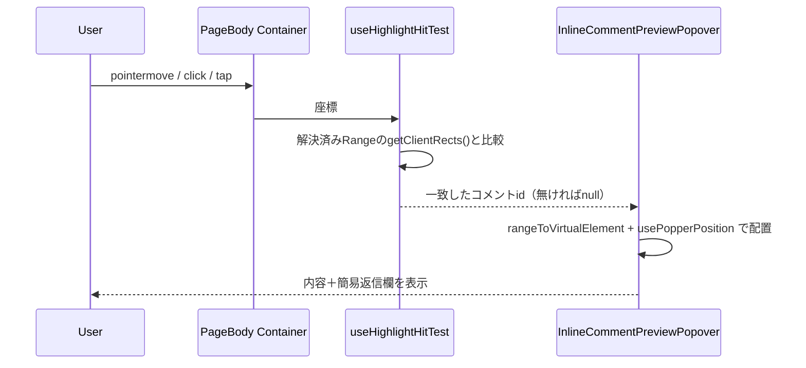
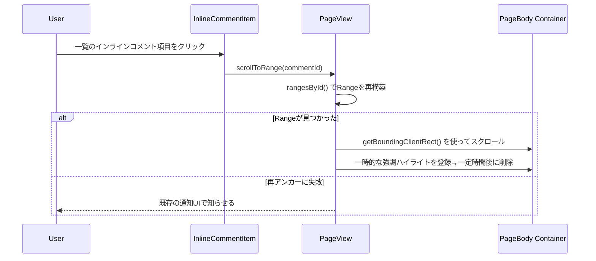

# Technical Design: inline-comment-interaction-ux

## Overview

実装済みのインラインコメント機能を実際に使ったユーザーからの指摘4点に対応する。変更は4つの領域に分かれる。

1. 作成中（選択中・入力中）のハイライト色と、保存済みコメントのハイライト色を区別し、重なったときも両方見分けられるようにする
2. 本文中の保存済みハイライトを hover／click／tap すると、その場で内容確認・簡易返信ができるようにする
3. 画面最下部のコメント一覧のインラインコメント項目から、本文中の対応するハイライト範囲へスクロールできるようにする
4. 画面最下部のコメント一覧における、インラインコメントへの返信UIを通常コメントの返信UIと統一する

いずれも、アンカーの計算・照合・再アンカーの仕組みそのもの、選択→起点→フォームという作成フロー、インラインコメント本体の編集・削除は変更しない。

### Amend target

- **対象スペック（複数）**:
  - `.kiro/specs/inline-comment/` — 最終的な戻し先。Requirement 1〜4を新規 Requirement として追加する
  - `.kiro/specs/inline-comment-visual-consistency/` — まだ fold-back が完了していないため、その `requirements.md` の Requirement 12.8 を本スペックで上書きする（ユーザー判断により確定済み）
- **戻す内容**: `requirements.md`（Requirement 1〜4）、`design.md`（Components and Interfaces / File Structure Plan）、`research.md`（下記 Design Decisions を移す）

### Goals

- 作成中・保存済みという2つのハイライトの意味を、色で見分けられるようにする
- 本文中のハイライトから、一覧まで移動せずに内容確認・簡易返信ができるようにする
- 一覧と本文を、クリック一つで行き来できるようにする
- インラインコメントへの返信操作を、通常コメントへの返信操作と同じものにする

### Non-Goals

- アンカーの計算・照合・再アンカーの仕組みそのものの変更（既存のまま）
- インラインコメント本体（起点・返信とも）の編集・削除の追加（引き続き対象外）
- 選択→起点→フォームという作成フローの2段階の流れの変更
- 通常コメント側（`Comment.tsx` / `CommentEditor.tsx` / `PageComment.tsx` の返信トグル）の振る舞い・見た目の変更
- 本文中ポップオーバーの返信UIを、一覧の返信UIと同じ（メンション対応）にすること — ポップオーバー側は意図的に簡易なUIのまま据え置く（ユーザー判断により確定済み）

---

## Boundary Commitments

### This Spec Owns

- 作成中・保存済みハイライトの色の出どころ（2つ目のテーマ対応トークンの追加）
- 保存済みハイライトへの hover／click／tap の当たり判定と、その場での内容確認・簡易返信ポップオーバー
- 一覧のインラインコメント項目から本文中のハイライトへのスクロールナビゲーション
- インラインコメントの返信UI（一覧側）を通常コメントの返信UIと揃えること

### Out of Boundary

- `AnchorResolver` / `quote-matcher` / `rendered-text` / `normalized-offset-mapping`（アンカーの計算・照合・再アンカーそのもの）
- `use-text-selection` / `SelectionCapture` の状態機械そのもの（選択の監視・3段階遷移）
- `SelectionPopover` の見た目・配置ロジックそのもの（Popper連携の仕組みは再利用するが、選択中ポップオーバー自体は変更しない）
- インラインコメントの編集・削除
- `CommentEditor.tsx`・通常コメントの返信トグル状態管理（`PageComment.tsx`の`showEditorIds`）そのもの
- 一覧取得・作成・解決のAPI入出力（`useSWRxInlineComments`の追加フィールドは不要）

### Allowed Dependencies

- `apps/app/src/features/inline-comment/client/components/SelectionPopover/selection-virtual-element.ts` / `use-popper-position.ts`（`Range`をPopperの仮想要素として使う仕組み）
- `apps/app/src/features/inline-comment/client/services/rendered-text.ts`（`resolveDomPosition`）
- `apps/app/src/states/ui/device.ts`の`useDeviceLargerThanMd()`（デスクトップ／タブレット以下の判定）
- `apps/app/src/features/inline-comment/client/components/InlineCommentForm/InlineCommentForm.tsx`のエディタ組み立て部分（共有部品として切り出す対象）
- `apps/app/src/client/components/PageComment.tsx`の`showEditorIds`パターン（返信トグルの状態管理として踏襲する対象。コードの共有ではなく、パターンの踏襲）
- 既存の通知UI（toastr等、GROWIクライアントの既存の使い方に合わせる）

### Revalidation Triggers

- `--grw-inline-comment-marker-bg` / `_marker.scss`のトークン構成が変わったとき
- `useAnchorResolver`が返す`ResolvedRange`の形が変わったとき（本スペックの共有ユーティリティが依存する）
- `SelectionPopover`のPopper連携の仕組みが変わったとき
- `InlineCommentForm.tsx`のエディタ組み立て部分の実装が変わったとき（共有部品の土台）

---

## Architecture

### 決定1: ハイライト色を2トークン化し、作成中側に半透明を持たせる

**新しいトークンを1つ追加する。**

```scss
// apps/app/src/styles/_marker.scss の :root ブロックに追記
:root {
  --grw-inline-comment-marker-bg: var(--grw-marker-bg, var(--grw-marker-bg-yellow));
  // 追加: 作成中（選択中・入力中）の範囲専用のトークン。既定では保存済みと異なる
  // 色になるよう、別のマーカー色ファミリーにフォールバックする。
  --grw-inline-comment-marker-bg-pending: var(--grw-inline-comment-marker-bg-pending-override, var(--grw-marker-bg-blue));
}
```

（既定色の具体的な組み合わせは実装時に決定する。ここでの要点は「保存済みと異なるマーカー色ファミリーにフォールバックすること」）

**適用箇所は半透明にする。** `PendingSelectionHighlight.tsx`の`::selection`と`::highlight(growi-inline-comment-pending)`が読む値を、トークンそのものではなく`color-mix(in srgb, var(--grw-inline-comment-marker-bg-pending) 70%, transparent)`のような半透明値にする。トークン自体は不透明な色のまま他所でも再利用できるようにし、実際に重なりが起きる箇所（作成中ハイライトの適用側）だけに透明度を持たせる。

これにより、保存済みハイライトの上で新しい選択が始まっても、下の保存済み色が透けて見え、Requirement 1.2（重なったときに両方見分けられる）を満たす。`InlineCommentHighlight.tsx`側は変更しない（`--grw-inline-comment-marker-bg`をそのまま、不透明のまま使う）。

### 決定2: 保存済みハイライトの当たり判定は、解決済みRangeの矩形と座標を比較する新規フックで行う

保存済みハイライトはDOM要素を持たない（`CSS.highlights`へのRange登録のみ）ため、標準のイベントハンドラを直接使えない。新規フック`useHighlightHitTest`が、本文コンテナに委譲した`pointermove`（`requestAnimationFrame`でスロットル）・`click`イベントの座標を、解決済みの各`Range`の`getClientRects()`と比較し、該当するコメントidを返す。

```
apps/app/src/features/inline-comment/client/components/InlineCommentBodyInteraction/
├── InlineCommentBodyInteraction.tsx   ← 当たり判定結果に応じてポップオーバーを開閉する
├── use-highlight-hit-test.ts          ← 座標→コメントid の当たり判定フック
├── InlineCommentPreviewPopover.tsx    ← ポップオーバー本体（内容表示＋簡易返信）
└── *.spec.tsx / *.spec.ts
```

`InlineCommentBodyInteraction`は`containerRef`・決定3の共有ユーティリティが返す`ReadonlyMap<string, Range>`・`inlineComments`（一覧データ）・`resolve`/`createReply`（`useSWRxInlineComments`から）を受け取る。デスクトップ幅（`useDeviceLargerThanMd()`）では hover と click の両方で開き、タブレット以下の幅では tap（click相当）でのみ開く。ポップオーバーの位置は`rangeToVirtualElement`＋`usePopperPosition`（`SelectionPopover`と同じ仕組み）で決める。

ポップオーバー内の返信欄は、意図して簡素なもの（Bootstrapスタイルの`<textarea>`＋送信ボタン）にする（Non-Goals参照）。編集は提供しない。

### 決定3: 解決済みオフセット→Rangeの再構築ロジックを共有ユーティリティに切り出す

`InlineCommentHighlight.tsx`の非公開関数`rangeFor()`と同じロジックを、id付きで複数箇所から使えるユーティリティとして切り出す。

```
apps/app/src/features/inline-comment/client/services/resolved-range.ts
```

```typescript
export const rangeForResolved = (
  renderedText: RenderedText,
  resolved: ResolvedRange,
): Range | null => { /* InlineCommentHighlight.tsx の rangeFor() をそのまま移す */ };

export const rangesById = (
  container: HTMLElement,
  resolvedRanges: ReadonlyMap<string, ResolvedRange>,
): ReadonlyMap<string, Range> => {
  const renderedText = renderedTextOf(container);
  const next = new Map<string, Range>();
  for (const [id, resolved] of resolvedRanges) {
    const range = rangeForResolved(renderedText, resolved);
    if (range != null) next.set(id, range);
  }
  return next;
};
```

`InlineCommentHighlight.tsx`はこのユーティリティを使う形に書き換える（挙動は変えない、ロジックの移動のみ）。決定2の当たり判定と、決定4の一部であるスクロール機能（後述）の両方がこの`rangesById()`を使う。`Range`オブジェクト自体はキャッシュしない（都度再構築する、既存の設計方針を維持）。

### 決定4: 一覧からのスクロールは、PageViewが持つ既存データをコールバックとして一覧側へ渡す

`PageView.tsx`は既に`resolvedInlineCommentRanges`（決定3のユーティリティへの入力）と`pageBodyContainerRef`の両方を持っている。新しいコールバック`scrollToRange(commentId: string): boolean`（見つかれば`true`、再アンカーに失敗していれば`false`を返す）を`PageView.tsx`内に実装し、既存の`inlineCommentsForComments`バンドル（`{ comments, resolve, createReply }`、`inline-comment-visual-consistency`スペックで導入済み）に追加する。

```typescript
// PageView.tsx 内
const scrollToRange = useCallback((commentId: string): boolean => {
  const container = pageBodyContainerRef.current;
  if (container == null) return false;
  const range = rangesById(container, resolvedInlineCommentRanges).get(commentId);
  if (range == null) return false;
  range.getBoundingClientRect(); // スクロール位置の算出に使う
  // スクロール実行 + 一時的な強調表示（決定3のユーティリティで得たRangeを
  // 一時的に第3のハイライト名で登録し、一定時間後に削除する）
  return true;
}, [resolvedInlineCommentRanges]);

const inlineCommentsForComments = useMemo(
  () => inlineComments == null ? undefined : {
    comments: inlineComments,
    resolve: resolveInlineComment,
    createReply: (parentId: string, comment: string) => createInlineCommentReply(parentId, { comment }),
    scrollToRange,
  },
  [inlineComments, resolveInlineComment, createInlineCommentReply, scrollToRange],
);
```

このバンドルは既存の経路（`PageView` → `Comments` → `PageComment` → `InlineCommentItem`）でそのまま下流に渡る。`InlineCommentItem.tsx`が`scrollToRange`をクリックハンドラに接続する（対象はコメント項目内の適切な操作要素。装飾の詳細は実装時に決める）。

再アンカーに失敗している（`scrollToRange`が`false`を返した）場合は、既存の通知UIで利用者に伝える。

一時的な強調表示は、対象の`Range`を短時間だけ別のハイライト名（例: `growi-inline-comment-emphasis`）に登録し、一定時間後に削除する形で実装する（`CSS.highlights`は同じ`Range`を複数の名前に同時登録でき、後から登録した名前が上に描画される）。

### 決定5: インラインコメント返信のUIを、通常コメントの「Reply...」⇄ 入力欄トグルと同じ形にする

`InlineCommentForm.tsx`のエディタ組み立て部分（`CodeMirrorEditorComment`＋`useCodeMirrorEditorIsolated`＋メンション補完拡張）を共有部品として切り出す。

```
apps/app/src/features/inline-comment/client/components/MentionAwareCommentInput/
├── MentionAwareCommentInput.tsx   ← エディタ組み立て・送信・エラー表示
└── MentionAwareCommentInput.spec.tsx
```

`InlineCommentForm.tsx`はこの部品を使う形に書き換える（外部から見た挙動は変えない、リファクタリングのみ）。`InlineCommentReplies.tsx`は、通常コメントの`showEditorIds`パターンを踏襲したローカルな開閉状態（1スレッドにつき返信欄は1つなので`boolean`で足りる）を持ち、閉時は「Reply...」ボタン（既存キー`t('page_comment.reply')`を流用）、開時は`MentionAwareCommentInput`＋Cancelボタンを描画する。現状の素の`<textarea>`ベースの返信欄は削除する。`CommentEditor.tsx`・通常コメント側は無変更。

---

## File Structure Plan

### 新規

```
apps/app/src/features/inline-comment/client/components/InlineCommentBodyInteraction/
├── InlineCommentBodyInteraction.tsx
├── use-highlight-hit-test.ts
├── InlineCommentPreviewPopover.tsx
└── *.spec.{ts,tsx}

apps/app/src/features/inline-comment/client/components/MentionAwareCommentInput/
├── MentionAwareCommentInput.tsx
└── MentionAwareCommentInput.spec.tsx

apps/app/src/features/inline-comment/client/services/resolved-range.ts
apps/app/src/features/inline-comment/client/services/resolved-range.spec.ts
```

### 変更

| ファイル | 変更 |
|---|---|
| `apps/app/src/styles/_marker.scss` | `--grw-inline-comment-marker-bg-pending` を追加 |
| `.../PendingSelectionHighlight/PendingSelectionHighlight.tsx` | 適用色を新トークン＋半透明値に変更 |
| `.../InlineCommentHighlight/InlineCommentHighlight.tsx` | `rangeFor()` を `resolved-range.ts` の呼び出しに置き換え（挙動不変） |
| `.../InlineCommentForm/InlineCommentForm.tsx` | エディタ組み立て部分を `MentionAwareCommentInput` の呼び出しに置き換え（挙動不変） |
| `.../InlineCommentItem/InlineCommentReplies.tsx` | Reply.../Cancelトグル＋`MentionAwareCommentInput`に置き換え |
| `.../InlineCommentItem/InlineCommentItem.tsx` | `scrollToRange`をクリックハンドラに接続 |
| `apps/app/src/components/PageView/PageView.tsx` | `scrollToRange`の実装・`inlineCommentsForComments`バンドルへの追加・`InlineCommentBodyInteraction`の描画 |
| `apps/app/src/client/components/Comments.tsx` / `PageComment.tsx` | `inlineComments`バンドル型に`scrollToRange`を追加して素通し（型定義のみ、ロジック変更なし） |
| `apps/app/public/static/locales/en_US/translation.json` | ポップオーバー・簡易返信欄・再アンカー失敗通知の文言キーを追加 |

---

## System Flows

### 本文ハイライトのhover/click/tapからポップオーバー表示まで



### 一覧クリックからスクロール・強調表示まで



---

## Requirements Traceability

| Requirement | Summary | Components | Interfaces | Flows |
|---|---|---|---|---|
| 1.1, 1.3, 1.4, 1.5 | ハイライト色の分離・独立したテーマ上書き | `_marker.scss`, `PendingSelectionHighlight` | `--grw-inline-comment-marker-bg-pending` | — |
| 1.2 | 重なったときの視認性 | `PendingSelectionHighlight` | 半透明適用 | — |
| 2.1, 2.2 | hover/click/tapでの内容確認 | `InlineCommentBodyInteraction`, `use-highlight-hit-test`, `useDeviceLargerThanMd` | `useHighlightHitTest` | 本文ハイライトのhover/click/tapフロー |
| 2.3 | 簡易返信欄 | `InlineCommentPreviewPopover` | `createReply` | 同上 |
| 2.4 | 外側クリックで閉じる | `InlineCommentPreviewPopover` | — | 同上 |
| 2.5 | 編集は提供しない | `InlineCommentPreviewPopover` | — | 同上 |
| 2.6 | 再アンカー失敗時はトリガーを提供しない | `resolved-range.ts` (`rangesById`が対象を絞り込む) | — | 同上 |
| 3.1 | 一覧からのスクロール | `InlineCommentItem`, `PageView.scrollToRange` | `scrollToRange` | 一覧クリックからスクロールまでのフロー |
| 3.2 | 再アンカー失敗時の通知 | `PageView.scrollToRange` | 既存の通知UI | 同上 |
| 3.3 | 一時的な強調表示 | `PageView.scrollToRange` | `CSS.highlights`（`growi-inline-comment-emphasis`） | 同上 |
| 4.1〜4.5 | 返信UIの統一 | `InlineCommentReplies`, `MentionAwareCommentInput` | `createReply` | — |

---

## Testing Strategy

- **ハイライト色の分離**（1.1, 1.3, 1.4）: `_marker.scss`の新トークン宣言を確かめる単体テスト（`_marker.spec.ts`と同じ形）。`PendingSelectionHighlight.spec.tsx`で、生成されるCSS文字列が新トークン・半透明指定を参照することを確認する
- **重なったときの視認性**（1.2）: 単体テストでは実際の描画結果を確認できないため、Playwrightで保存済みハイライトの上に新しい選択を作り、両方の色由来の値が反映されていることを確認する
- **当たり判定**（2.1, 2.2, 2.6）: `use-highlight-hit-test.spec.ts`で、モックした`Range`（`getClientRects()`が既知の矩形を返す）に対して、座標がその内側／外側のときの判定結果を確認する。解決失敗（`not_found`）の範囲が候補に含まれないことも確認する
- **ポップオーバーの開閉・簡易返信**（2.3, 2.4, 2.5）: `InlineCommentBodyInteraction.spec.tsx`で、当たり判定の結果に応じてポップオーバーが開閉すること、返信欄からの送信が`createReply`を呼ぶこと、編集用の要素が存在しないことを確認する
- **スクロールナビゲーション**（3.1, 3.2, 3.3）: `PageView.spec.tsx`に`scrollToRange`の単体テストを足す（見つかった場合／再アンカー失敗の場合の両方）。Playwrightで、一覧のインラインコメント項目をクリックすると本文中の対象範囲までスクロールし、一時的な強調表示が起きることを確認する
- **返信UIの統一**（4.1〜4.5）: `InlineCommentReplies.spec.tsx`で、「Reply...」ボタン→`MentionAwareCommentInput`の表示→Cancelでボタンに戻る、という開閉サイクルを確認する。`MentionAwareCommentInput.spec.tsx`で、`InlineCommentForm`から抽出した挙動（メンション補完・送信・エラー表示）が変わっていないことを確認する。Playwrightで、一覧上でインラインコメントに返信する操作が、通常コメントへの返信操作と同じUIで行えることを確認する
