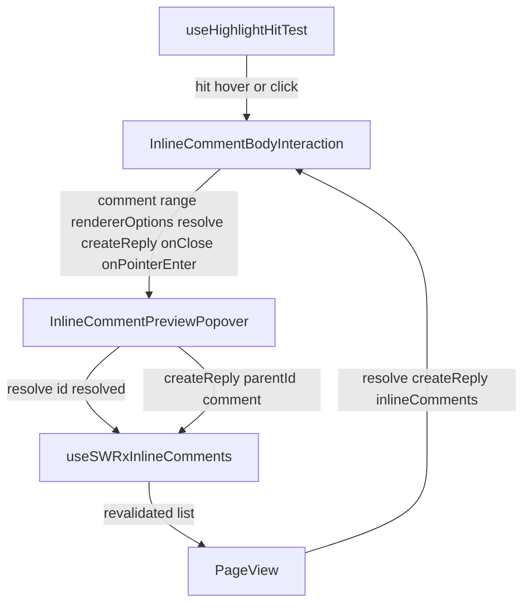
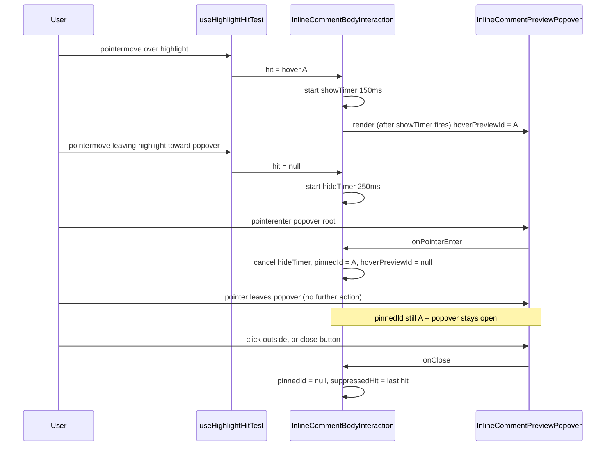

# Design Document

## Overview

**Purpose**: This feature refines the already-shipped body-highlight preview popover (`InlineCommentPreviewPopover`) so that a hover-opened popover survives the mouse's transit toward it, so that a viewer can resolve/reopen a comment without leaving the popover, and so that the popover's layout reads as a coherent thread rather than a dense stack of `CommentCard` blocks.

**Users**: Page viewers who hover/click/tap a saved inline-comment highlight in the page body (existing Requirement 15 audience), and anyone with page-comment permission who wants to toggle a comment's resolved state without scrolling to the bottom-of-page list.

**Impact**: Modifies two existing client components (`InlineCommentBodyInteraction.tsx`, `InlineCommentPreviewPopover.tsx`) and threads one existing store function (`resolve`) one level further through `PageView.tsx`. No server, route, DTO, or data-model change.

### Goals
- A hover-opened popover never disappears while the pointer is travelling from the highlight to the popover, and stays open indefinitely once the pointer has reached it, until an explicit close.
- The popover exposes a resolve/reopen control equivalent to the bottom-of-page list's, using the same underlying capability.
- The popover's layout separates avatar/name/timestamp, the quoted anchor, the comment body, existing replies, and the reply composer into visually distinct regions.

### Non-Goals
- Editing or deleting inline comments (upstream Non-Goal, unchanged).
- Unifying the popover's reply composer with the bottom-of-page list's mention-aware editor (upstream Requirement 15.3, unchanged).
- Changing tablet-and-below tap timing (unchanged — tap remains an immediate, pinned open exactly as today).
- Changing `InlineCommentItem.tsx`'s own resolve-toggle markup or behavior (out of boundary — see below).
- Any change to `use-highlight-hit-test.ts`'s hit-testing algorithm.

## Boundary Commitments

### This Spec Owns
- The show/hide timing state machine for `InlineCommentPreviewPopover` inside `InlineCommentBodyInteraction.tsx`: debounced show, debounced hide, and promotion of a hover-shown popover into the existing `pinnedId` state on pointer-enter.
- A resolve/reopen control rendered inside `InlineCommentPreviewPopover.tsx`, and the one new prop (`resolve`) needed to reach it.
- The visual layout of `InlineCommentPreviewPopover.tsx` (avatar/name/timestamp header, quoted-anchor strip, body, replies, composer).

### Out of Boundary
- `use-highlight-hit-test.ts` — consumed exactly as-is; its hit-test algorithm, `pointermove`/`click` sourcing, and desktop/tablet gating are unchanged.
- `InlineCommentItem.tsx`'s own resolve-toggle markup, behavior, and permission handling — unchanged, not extracted into a shared component (see research.md's "Duplicate the resolve badge/button" decision).
- The resolve/reply server routes, DTOs, and `useSWRxInlineComments` store implementation — consumed as-is, no signature change.
- Any change to how `PageView.tsx` fetches inline comments (no new fetch site; `resolveInlineComment` already exists there).

### Allowed Dependencies
- `useHighlightHitTest` (`HighlightHit`, `HighlightHitSource`) — existing hook, read-only dependency.
- `useSWRxInlineComments(pageId).resolve` — existing store function, already available in `PageView.tsx` as `resolveInlineComment`.
- `CommentCard`'s `headerEnd`/`footer` slots — existing extension points, already used by `InlineCommentItem.tsx` for the same resolve-toggle pattern.
- `UserPicture` (`@growi/ui/dist/components`) and `useCurrentUser` (`~/states/global`) — same pattern `InlineCommentForm.tsx` already established for its own composer avatar.

### Revalidation Triggers
- A change to `HighlightHit`'s shape (e.g. adding a third `source`) would require re-checking the hover/click branching in `InlineCommentBodyInteraction.tsx`.
- A change to `IInlineComment`'s resolved-state fields (`resolvedAt`, `resolvedById`) would require re-checking both this popover's and `InlineCommentItem.tsx`'s `isResolved` derivation.
- A change to `CommentCard`'s slot contract (`headerEnd`/`footer`) would require re-checking this popover's layout.

## Architecture

### Existing Architecture Analysis
`InlineCommentBodyInteraction` (a client component with no DOM of its own beyond conditionally rendering `InlineCommentPreviewPopover`) already separates "what is currently under the pointer" (`useHighlightHitTest`, unowned by this spec) from "what should be displayed, and until when" (`pinnedId`/`suppressedHit`, owned by this spec and where the new hover-timing state joins). This design keeps that same separation: no new state lives in the hit-test hook, and no hit-testing logic moves into the interaction component.

### Architecture Pattern & Boundary Map

**Architecture Integration**:
- Selected pattern: unchanged layered composition (hit-test hook → interaction/orchestration component → presentational popover); this spec only adds state and props within that existing layering.
- Domain/feature boundaries: hit-testing, display-timing/orchestration, and presentation stay in the same three components they are in today — no new file is introduced.
- Existing patterns preserved: `pinnedId`/`suppressedHit` close semantics, `CommentCard` slot usage, the `resolve`/`createReply` store-function shape.
- New components rationale: none — this spec adds behavior to two existing components and one new prop threaded through a third.
- Steering compliance: server-client boundary untouched (no server change); named exports, immutable state updates preserved.

### Technology Stack

| Layer | Choice / Version | Role in Feature | Notes |
|-------|------------------|-----------------|-------|
| Frontend | React 18 (existing) | `useState`/`useEffect`/`useRef` for the debounce timers and pointer-enter promotion | No new dependency |
| Frontend | `@growi/ui` `UserPicture` (existing) | Composer avatar, matching `InlineCommentForm.tsx` | Already a dependency |

## File Structure Plan

### Modified Files
- `apps/app/src/features/inline-comment/client/components/InlineCommentBodyInteraction/InlineCommentBodyInteraction.tsx` — adds `hoverPreviewId` state, `showTimerRef`/`hideTimerRef`, the debounced show/hide effect for hover-sourced hits (click-sourced hits keep their existing immediate-pin path), a `handlePointerEnterPopover` callback that promotes `hoverPreviewId` into `pinnedId`, and a new `resolve` prop threaded straight through to `InlineCommentPreviewPopover`.
- `apps/app/src/features/inline-comment/client/components/InlineCommentBodyInteraction/InlineCommentPreviewPopover.tsx` — adds `onPointerEnter` (wired to the popover root's `onMouseEnter`) and `resolve` props; adds the resolve/reopen badge+button (via `CommentCard`'s `headerEnd` slot, mirroring `InlineCommentItem.tsx`'s existing markup); adds a quoted-anchor strip (`comment.anchor.quote`, new — not rendered by this component today); replaces the plain `<textarea>`+button composer with an avatar (`UserPicture`+`useCurrentUser`) + pill input + icon send button row, matching `InlineCommentForm.tsx`'s established composer visual language; adds `
` separators between the body, replies, and composer regions.
- `apps/app/src/components/PageView/PageView.tsx` — passes the already-destructured `resolveInlineComment` as a new `resolve` prop to `<InlineCommentBodyInteraction>` (one line; no new fetch site).

### Test Files (co-located, existing files extended)
- `InlineCommentBodyInteraction.spec.tsx` — hover-show delay, hover-hide delay, pointer-enter promotion, click-path regression coverage (unchanged behavior).
- `InlineCommentPreviewPopover.spec.tsx` — resolve/reopen rendering and click wiring, resolve-error surfacing, quoted-anchor rendering, `onPointerEnter` wiring.
- `apps/app/playwright/20-basic-features/inline-comment.spec.ts` — real-browser regression coverage for the hover-transit fix and the resolve-from-popover flow.

No new files are created; no files are deleted.

## System Flows

### Hover show/hide/lock sequence

Key decisions not obvious from the diagram: the hide timer set on leaving the highlight is the *only* thing that can close a hover-shown popover before it is promoted; once `onPointerEnter` fires, that timer is irrelevant for the rest of the popover's lifetime — closing from then on goes exclusively through the existing `onClose` path, identical to a click-opened popover.

## Requirements Traceability

| Requirement | Summary | Components | Interfaces | Flows |
|-------------|---------|------------|------------|-------|
| 1.1 | Sustained hover shows the popover after a delay | `InlineCommentBodyInteraction` | `hoverPreviewId`, `showTimerRef` | Hover sequence |
| 1.2 | Leaving the highlight keeps the popover shown for a grace period | `InlineCommentBodyInteraction` | `hideTimerRef` | Hover sequence |
| 1.3 | Reaching the popover before the grace period elapses keeps it open | `InlineCommentBodyInteraction`, `InlineCommentPreviewPopover` | `onPointerEnter`, `handlePointerEnterPopover` | Hover sequence |
| 1.4 | While hovered, the popover never auto-closes | `InlineCommentBodyInteraction`, `InlineCommentPreviewPopover` | `onPointerEnter` | Hover sequence |
| 1.5 | Once reached by the pointer, stays open until explicit close | `InlineCommentBodyInteraction` | `pinnedId` (promotion) | Hover sequence |
| 1.6 | Click/tap still shows immediately and pins (unchanged) | `InlineCommentBodyInteraction` | existing `pinnedId` click path | — |
| 1.7 | Outside click / close button still closes (unchanged) | `InlineCommentBodyInteraction` | existing `handleClose` | Hover sequence |
| 2.1 | Popover shows current resolved state | `InlineCommentPreviewPopover` | `comment.resolvedAt` | — |
| 2.2 | Popover offers a control to toggle resolved state | `InlineCommentPreviewPopover` | resolve badge+button (`headerEnd`) | — |
| 2.3 | Toggling an unresolved comment resolves it | `InlineCommentPreviewPopover` | `resolve(id, true)` | — |
| 2.4 | Toggling a resolved comment reopens it | `InlineCommentPreviewPopover` | `resolve(id, false)` | — |
| 2.5 | Resolve errors surface inside the popover | `InlineCommentPreviewPopover` | local `resolveError` state | — |
| 2.6 | Successful toggle updates the displayed state | `InlineCommentPreviewPopover` | SWR revalidation (existing `resolve` behavior) | — |
| 3.1 | Avatar and author name shown | `InlineCommentPreviewPopover` | `CommentCard` (existing) | — |
| 3.2 | Timestamp shown | `InlineCommentPreviewPopover` | `CommentCard` (existing) | — |
| 3.3 | Quoted anchor shown, visually distinguished from body | `InlineCommentPreviewPopover` | new anchor strip | — |
| 3.4 | Existing replies shown in order | `InlineCommentPreviewPopover` | replies list (existing, re-styled) | — |
| 3.5 | Reply composer with input and send | `InlineCommentPreviewPopover` | new composer row | — |
| 3.6 | Popover stays open after a successful reply (unchanged) | `InlineCommentPreviewPopover` | existing `handleSubmit` | — |

## Components and Interfaces

| Component | Domain/Layer | Intent | Req Coverage | Key Dependencies (P0/P1) | Contracts |
|-----------|--------------|--------|--------------|--------------------------|-----------|
| InlineCommentBodyInteraction | Client / Orchestration | Owns display timing (hover debounce, pin/promotion) and threads `resolve` through | 1.1-1.7, 2.1-2.6 | useHighlightHitTest (P0), useSWRxInlineComments via PageView (P0) | State |
| InlineCommentPreviewPopover | Client / UI | Renders the popover's layout, resolve control, and composer; reports pointer-enter | 1.3, 1.4, 2.1-2.6, 3.1-3.6 | CommentCard (P0), UserPicture/useCurrentUser (P1) | State |

### Client / Orchestration

#### InlineCommentBodyInteraction

| Field | Detail |
|-------|--------|
| Intent | Decides which comment id (if any) has its popover open, and for how long a hover-triggered one survives the pointer leaving the highlight |
| Requirements | 1.1, 1.2, 1.3, 1.4, 1.5, 1.6, 1.7, 2.1, 2.2, 2.3, 2.4, 2.5, 2.6 |

**Responsibilities & Constraints**
- Interprets `HighlightHit` transitions from `useHighlightHitTest` into a display decision; does not alter the hook itself.
- Owns the two new pieces of state this spec introduces: `hoverPreviewId` (the debounced hover-shown id) and the two timer refs (`showTimerRef`, `hideTimerRef`).
- A click-sourced hit continues to set `pinnedId` immediately (existing behavior, unmodified) — the debounce applies only to hover-sourced hits.
- Promotion (`handlePointerEnterPopover`) sets `pinnedId = hoverPreviewId`, clears `hoverPreviewId`, and cancels any pending `hideTimerRef` — a no-op if a click already set `pinnedId` (idempotent: promoting an already-pinned id changes nothing observable).
- `displayedId` becomes `pinnedId ?? hoverPreviewId ?? null` (replacing today's `pinnedId ?? effectiveHit?.commentId ?? null`).
- All timers are cleared on unmount and whenever `hit`/`pinnedId` transitions make them stale, following the existing cleanup convention already used for this component's own effects.

**Dependencies**
- Inbound: `PageView.tsx` — passes `resolve` (new), `createReply`, `inlineComments`, `resolvedRanges`, `rendererOptions` (all existing except `resolve`) (P0)
- Outbound: `InlineCommentPreviewPopover` — receives `onPointerEnter`, `resolve` (both new props) alongside existing `comment`/`range`/`rendererOptions`/`createReply`/`onClose` (P0)
- Outbound: `useHighlightHitTest` — unchanged consumption (P0)

**Contracts**: Service [ ] / API [ ] / Event [ ] / Batch [ ] / State [x]

##### State Management
- State model: `pinnedId: string | null` (existing, semantics unchanged), `hoverPreviewId: string | null` (new), `suppressedHit: HighlightHit | null` (existing, unchanged), two `useRef<ReturnType<typeof setTimeout> | null>` timer handles (new).
- Persistence & consistency: purely client-side, component-local; no persistence.
- Concurrency strategy: a single `useEffect` reacting to `hit` (and a separate handler for the promotion callback) mirrors the existing single-effect pattern already used for the click-pin logic; no concurrent timer races are possible because each hover transition clears the other timer before starting a new one.

**Implementation Notes**
- Integration: `resolve` prop type is `(id: string, resolved: boolean) => Promise<unknown>` — identical shape to `InlineCommentItem`'s existing `resolve` prop, and identical to `resolveInlineComment`'s actual signature in `PageView.tsx`, so no adapter is needed (unlike `createReply`, which needed `createInlineCommentReplyText`'s shape adapter — that adapter is unrelated to this spec and stays as-is).
- Validation: none new — `resolve`'s own validation (server-side) is unchanged.
- Risks: see research.md's "Risks & Mitigations" (timer leakage, interaction with `suppressedHit`).

### Client / UI

#### InlineCommentPreviewPopover

| Field | Detail |
|-------|--------|
| Intent | Presents the popover's content (header, quoted anchor, body, replies, composer) and reports when the pointer enters its own DOM |
| Requirements | 1.3, 1.4, 2.1, 2.2, 2.3, 2.4, 2.5, 2.6, 3.1, 3.2, 3.3, 3.4, 3.5, 3.6 |

**Responsibilities & Constraints**
- Adds `onPointerEnter: () => void` (new, optional-in-practice but always supplied by the only real caller) fired from the root portaled div's native `onMouseEnter` — a plain DOM event handler, no new listener registration pattern.
- Adds `resolve: (id: string, resolved: boolean) => Promise<unknown>` (new), used exactly as `InlineCommentItem.tsx` uses its own `resolve` prop: `resolve(comment.id, !isResolved)`, with `isResolved = comment.resolvedAt != null` (same derivation, duplicated per research.md's decision, not shared).
- Renders `comment.anchor.quote` in a new, visually distinct element (not currently rendered by this component) to satisfy 3.3 — does not attempt fuzzy re-highlighting or truncation logic beyond simple CSS clamping; the raw stored quote string is displayed as-is (same string `InlineCommentForm.tsx` keeps in the DOM for its own quote handling).
- Replaces the existing plain `<textarea>` + button composer with an avatar (`UserPicture` fed by `useCurrentUser()`) + input + icon send button row, mirroring `InlineCommentForm.tsx`'s already-established composer layout — the underlying `handleSubmit`/`createReply` call and its error handling are unchanged.
- Continues to use `CommentCard` for the origin comment and each reply exactly as today; the resolve badge+button is supplied through `headerEnd`, matching `InlineCommentItem.tsx`'s existing use of that same slot.

**Dependencies**
- Inbound: `InlineCommentBodyInteraction` — supplies `comment`, `range`, `rendererOptions`, `createReply`, `resolve` (new), `onClose`, and expects `onPointerEnter` to be called on pointer-enter (P0)
- Outbound: `CommentCard` — unchanged usage, `headerEnd`/`footer` slots now populated with the resolve control and the composer/dividers respectively (P0)
- Outbound: `UserPicture` (`@growi/ui/dist/components`), `useCurrentUser` (`~/states/global`) — same pattern as `InlineCommentForm.tsx` (P1)

**Contracts**: Service [ ] / API [ ] / Event [ ] / Batch [ ] / State [x]

##### State Management
- State model: existing `draftComment`/`isSubmitting`/`submitError` (unchanged) plus a new `resolveError: string | undefined` local state for 2.5.
- Persistence & consistency: none new — resolve success is reflected via the existing SWR revalidation already triggered by the store's `resolve()`.
- Concurrency strategy: unchanged — resolve and reply submission are independent, uncoordinated async actions, same as the existing reply-submit path.

**Implementation Notes**
- Integration: no new portal/positioning logic — `usePopperPosition`/`rangeToVirtualElement` usage is unchanged.
- Validation: none new.
- Risks: none beyond the layout/markup change itself; covered by the extended `.spec.tsx` and Playwright coverage below.

## Data Models

No data-model change. `IInlineComment.resolvedAt`/`resolvedById` (already present) are read, never written directly by the client — the write path remains the existing `PUT /_api/v3/inline-comments/:id/resolve` route, unchanged.

## Error Handling

### Error Strategy
Both new client-observable error paths reuse the existing pattern already present in this file for reply submission: catch, extract `err.message` when available, otherwise a generic fallback string, store in local state, render as `text-danger` text near the control that triggered the action.

### Error Categories and Responses
**Business Logic Errors**: A resolve-toggle rejection (e.g. permission denied by the server) surfaces as `resolveError`, rendered next to the resolve control — the popover itself stays open and usable (Requirement 2.5).

## Testing Strategy

### Unit Tests (`InlineCommentBodyInteraction.spec.tsx`)
- A hover hit shorter than the show delay (hit clears before the timer fires) never renders the popover.
- A hover hit sustained past the show delay renders the popover for that comment id.
- After the hit clears (pointer left the highlight), the popover remains rendered until the hide delay elapses, then is removed if nothing else happened.
- Calling the popover's `onPointerEnter` before the hide delay elapses cancels the pending hide and keeps the popover open.
- After `onPointerEnter` has fired once, the popover stays open with no further hover hit at all (i.e. behaves exactly like a click-pinned popover from that point on).
- A click hit still shows the popover immediately (no delay) and pins it — existing regression coverage, unchanged expectation.
- The `resolve` prop passed to `InlineCommentBodyInteraction` reaches `InlineCommentPreviewPopover` unchanged (wiring test).

### Unit Tests (`InlineCommentPreviewPopover.spec.tsx`)
- Renders an "unresolved" badge and a "Resolve" control when `comment.resolvedAt` is `null`; clicking calls `resolve(comment.id, true)`.
- Renders a "resolved" badge and a "Reopen" control when `comment.resolvedAt` is set; clicking calls `resolve(comment.id, false)`.
- Displays an error message when `resolve()` rejects, without closing the popover.
- Renders `comment.anchor.quote` in an element visually/structurally distinct from the comment body.
- Calls the `onPointerEnter` prop when the popover root receives a `mouseenter`/`pointerenter`.

### E2E/UI Tests (Playwright, `inline-comment.spec.ts`)
- Hovering a highlight, then moving the pointer toward and onto the popover, keeps it visible throughout the transit (the exact regression this spec fixes).
- Once the pointer has rested on the popover, moving it away entirely (off both the highlight and the popover) leaves the popover open until an explicit outside click.
- Resolving a comment from the popover updates the badge shown in the bottom-of-page list for the same comment (cross-surface consistency, Requirement 2.6 / adjacent expectation from requirements.md).
- Clicking a highlight still opens the popover immediately with no visible delay, and it remains open exactly as before (regression coverage for the unchanged click path).
