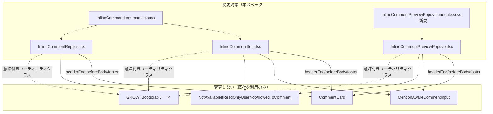

# Design Document

## Overview

**Purpose**: `InlineCommentItem`／`InlineCommentReplies`（画面最下部の一覧）と `InlineCommentPreviewPopover`（本文中ポップオーバー）の見た目を、承認済みのデザインモックアップ（Artifact: https://claude.ai/code/artifact/d19799da-fedc-4687-ad14-24d134bc7e89）に合わせて刷新する。

**Users**: インラインコメントを一覧・本文中で見る・操作するすべての利用者。

**Impact**: 対象3ファイルとその `.module.scss` のみを変更する。`InlineCommentService`・apiv3ルート・DTO・データモデルは一切変更しない。既存の単体テストは新しいマークアップ・クラス名に合わせて更新するが、テストが検証する内容（操作の呼び出し・権限判定）自体は変えない。

### Goals
- 一覧アイテムの4状態（通常・編集・削除確認・解決済み）を Artifact `Main.dc.html` に忠実な見た目にする
- ポップオーバーの2状態（通常＋返信＋返信フォーム・編集）を Artifact `Popover.dc.html` に忠実な見た目にする
- 一覧アイテムの編集・削除操作を、通常コメント（`CommentControl.tsx`）と同じ「ホバーで現れるアイコンのみ」の操作感に変える（配置は既存のヘッダー行に収める）
- 引用ブロックの見た目を一覧・ポップオーバー間で統一する
- GROWIの既存Bootstrapテーマ（意味付きユーティリティクラス）だけで実現し、新規のハードコード16進色・カスタムフォント指定を持ち込まない
- 実装完了の判定に、実ブラウザ（Playwright）でのスクリーンショット目視照合を含める

### Non-Goals
- 解決トグルの仕組み自体の変更（モックアップの「ピルをクリックしてトグル」案は不採用。現行の「バッジ＋別ボタン」を維持）
- ポップオーバーへの削除操作の追加
- 通常コメント（`Comment.tsx`／`CommentControl.tsx`／`DeleteCommentModal`）自体の変更
- API・サービス・データモデルの変更
- 新しい受け入れ基準・機能の追加

## Boundary Commitments

### This Spec Owns
- `InlineCommentItem.tsx`／`InlineCommentReplies.tsx`／`InlineCommentPreviewPopover.tsx` のJSXマークアップとクラス名
- `InlineCommentItem.module.scss`（既存）の拡張、および新規 `InlineCommentPreviewPopover.module.scss` の追加
- 対応する `.spec.tsx` の、新しいマークアップ・クラス名に合わせたテスト更新
- 実ブラウザでのスクリーンショット照合手順（Playwright）

### Out of Boundary
- `InlineCommentService`、apiv3ルート4本（`update.ts`／`update-reply.ts`／`delete.ts`／`delete-reply.ts`）、DTO — 一切変更しない
- `CommentCard.tsx`、`NotAvailableForReadOnlyUser.tsx` — 既存のprops・振る舞いのまま利用する。中身は変更しない
- **`MentionAwareCommentInput.tsx`（2026-09-10 訂正: 変更禁止を解除）**: task 4.1（項目11・30）で判明した「保存ボタンが常にコンポーネント内部に描画され、呼び出し側が位置を変える手段を持たない」という制約により、要件2.2・2.4の「入力欄の下、キャンセルと並んで右揃え」が一覧アイテム・ポップオーバーのどちらでも実現不能だった。ユーザーの判断により、このファイルへの変更を許可する。採用する具体的な変更: 送信ボタンの描画を呼び出し側に完全に移す。コンポーネントは `onControlsChange?: (controls: { canSubmit: boolean; submit: () => void; insertMention: (username: string) => void }) => void` を新設し、`canSubmit`／`submit`／`insertMention` が変わるたびに通知する。コンポーネント自身はもう送信ボタン・メンションピッカーボタンを描画しない（boolean フラグによる分岐は導入しない — 全ての呼び出し元が同じ形でコントロールを受け取り、自分で描画する）。既存の呼び出し元（`InlineCommentForm.tsx`／`InlineCommentReplies.tsx`）は、これまでコンポーネント内部にあったのと同じ見た目・同じクラス構成のボタンを、`onControlsChange` で受け取った値を使って自分のJSX内（エディタのすぐ右、これまでと同じ位置）に描画し直す。`InlineCommentItem.tsx`／`InlineCommentPreviewPopover.tsx`の編集モードは、送信ボタンをキャンセルボタンと同じ行（入力欄の下、右揃え）に描画する。
- `_comment-inheritance.scss`（`%bg-comment`／`%user-picture`／`%comment-section`）— 変更しない。これらのプレースホルダがすでに決めている値（投稿者アイコンの大きさ＝`1.2em`、カード左側の吹き出し風の飾り、カードの背景の濃さ）は、モックアップの値と異なっていても、そのまま採用する（下記「モックアップ忠実度の適用範囲」参照）
- `Comment.tsx`／`CommentControl.tsx`／`DeleteCommentModal` — 参照のみ、変更しない
- 一覧・ポップオーバー間での解決トグル・削除確認UIの共通コンポーネント化（`inline-comment-popover-refinement` の既存決定「解決トグルのマークアップを共有化しない」を維持する）

### モックアップ忠実度の適用範囲（Critical Issue 2 の解決）

`InlineCommentItem`／`InlineCommentReplies`／`InlineCommentPreviewPopover` がこの機能のために新しく持ち込む・作り直す要素——状態バッジ、引用ブロック、編集・削除アイコンボタン、削除確認帯、編集モードの入力欄、返信フォーム——は、モックアップに忠実にする。

一方、`CommentCard`・共有スタイル（`_comment-inheritance.scss`）がすでに決めている以下の見た目は、モックアップの値と異なっていても、既存の値をそのまま採用する。**上書きも変更もしない**（オーバーライドによる部分的な変更も含めて行わない——理由は「シンプルさ・共有コードへの影響ゼロを優先する」というユーザーの判断による）:

| 要素 | 既存の値（`_comment-inheritance.scss`／Bootstrap既定） | モックアップの値 | 扱い |
|---|---|---|---|
| 投稿者アイコンの大きさ | `%user-picture { width: 1.2em; height: 1.2em; }`（本文16px基準で約19px） | 30px（返信・返信フォームは22〜26px） | 既存の値のまま。約19pxで表示される |
| カード左側の吹き出し風の飾り | `%comment-section::before` による三角形（`border: 1em solid transparent; border-left-width: 0;`） | 描画なし（単純な角丸長方形） | 既存の値のまま。飾りは残る |
| カードの角の丸み | Bootstrap既定 `.rounded`（`--bs-border-radius: 0.375rem` = 6px） | 12〜14px | 既存の値のまま。6px相当になる |
| カードの背景色の濃さ | `%bg-comment`（ライト: `rgba(gray-200, 0.5)` + ぼかし、ダーク: `rgba(gray-800, 0.3)` + ぼかし） | モックアップ独自の配色（実装には持ち込まない、Requirement 3.1） | 既存の値のまま |

この切り分けにより、`CommentCard`・共有スタイルへの変更は文字通りゼロ件になり、実装のスコープも小さくなる。トレードオフとして、投稿者アイコンはモックアップより小さく、カードには吹き出しの飾りが残った状態で仕上がる——これは実装のミスではなく、意図した仕様である。

### Allowed Dependencies
- `CommentCard`（既存）の `headerEnd`／`beforeBody`／`footer` スロット — 新しい見た目はすべてこれらのスロットの中身の変更で実現し、`CommentCard` 自体には手を入れない
- GROWIのBootstrapテーマ（`packages/core-styles`）が提供する意味付きユーティリティクラス（`badge`／`rounded-pill`／`bg-warning-subtle`／`bg-danger-subtle`／`bg-success-subtle`／`text-*-emphasis`／`btn-outline-secondary`／`btn-link`／`btn-close` 等、Bootstrap 5.3.8で実際に生成されることを確認済み）
- `material-symbols-outlined` アイコンフォント（既存、アプリ全体で読み込み済み）— `CommentControl.tsx` と同じ `edit`／`close` グリフを踏襲する
- `_comment-inheritance.scss` の共有プレースホルダ（`%bg-comment`／`%user-picture`／`%comment-section`）— 既存の `InlineCommentItem.module.scss` がすでに `@extend` しているものをそのまま使う。新しいプレースホルダは追加しない

### Revalidation Triggers
- `CommentCard` のスロット構成（`headerEnd`／`beforeBody`／`footer`）が変わった場合、この設計の3ファイルすべてを再確認する必要がある
- `CommentControl.tsx` の編集・削除アイコンの視覚パターン（グリフ・ボタンクラス）が変わった場合、Requirement 3.5（同じパターンを踏襲する）の前提が崩れるため再確認する必要がある
- GROWIのBootstrapテーマの `-subtle`／`-emphasis` トークンの実装が変わった場合（例: Bootstrapの将来のメジャーアップデート）、色の見え方を再確認する必要がある

## Architecture

### Existing Architecture Analysis

3つのコンポーネントはすでに `CommentCard` の3スロット（`headerEnd`／`beforeBody`／`footer`）に見た目の差分を注入する構成になっている（`.kiro/specs/inline-comment` design.md 参照）。本スペックはこの構成をそのまま維持し、各スロットに渡すJSXの中身とクラス名だけを変更する——新しいレイヤーやコンポーネントは一切追加しない。

現状の3つの相違点（変更対象）:
1. **状態バッジ**: ``／`bg-secondary` — Bootstrapの生の配色クラスを直接使っており、`-subtle`／`-emphasis` トークンを使っていない
2. **編集・削除ボタン**: 一覧アイテム・返信アイテムとも、`footer` スロット内に常時表示の `btn btn-link p-0` テキストリンクとして存在する。通常コメントの `CommentControl.tsx` は逆に `headerEnd`（正確には独立した絶対配置）に、ホバー時のみ visibility が変わるアイコンのみのボタンとして存在する
3. **引用ブロック**: 一覧アイテムは `border-left: 3px solid var(--grw-inline-comment-marker-bg)`（黄色いハイライトマーカー色）、ポップオーバーは `bg-body-tertiary border-start border-3`（グレー系、マーカー色を使わない）と、2箇所で別の見た目になっている

### Architecture Pattern & Boundary Map

**Architecture Integration**:
- 選定パターン: 既存の「`CommentCard` + スロット注入」構成を完全に維持する（新パターンなし）
- ドメイン境界: 見た目（JSX・CSS）だけを変更し、状態・権限判定・イベントハンドラのロジックには一切触れない
- 既存パターンの維持: `NotAvailableIfReadOnlyUserNotAllowedToComment` によるガード、`creatorId` 比較による本人判定、`MentionAwareCommentInput` の再利用は変更しない
- 新規コンポーネントの理由: 新規コンポーネントは追加しない。`InlineCommentPreviewPopover.module.scss` のみ新規（ポップオーバーはこれまでCSS Modulesを持たず、Bootstrapユーティリティクラスとインラインstyleのみで実装されていたため、Requirement 3.3「インラインstyleの使用を最小限にする」を満たすために新設する）
- Steering準拠: `.claude/rules/coding-style.md` の「不変な状態更新」「named exports」は維持する

## File Structure Plan

### Modified Files
- `apps/app/src/features/inline-comment/client/components/InlineCommentItem/InlineCommentItem.tsx` — ヘッダー行の状態バッジ・解決トグルの見た目変更、編集・削除ボタンを常時表示フッターリンクからホバー表示ヘッダーアイコンへ変更、引用ブロックのクラス変更
- `apps/app/src/features/inline-comment/client/components/InlineCommentItem/InlineCommentReplies.tsx` — `InlineCommentReplyItem` の編集・削除ボタンを同様にホバー表示ヘッダーアイコンへ変更（返信は元々 `headerEnd` を使っていないため、新規に使用する）
- `apps/app/src/features/inline-comment/client/components/InlineCommentItem/InlineCommentItem.module.scss` — ホバー表示の可視性制御規則、状態ドットの装飾、引用ブロックの左罫スタイルを追加
- `apps/app/src/features/inline-comment/client/components/InlineCommentBodyInteraction/InlineCommentPreviewPopover.tsx` — 状態バッジ・引用ブロック・編集ボタン・返信スレッド・返信フォームの見た目変更
- 各ファイルの `.spec.tsx`（`InlineCommentItem.spec.tsx`／`InlineCommentReplies.spec.tsx`／`InlineCommentPreviewPopover.spec.tsx`）— 新しいクラス名・DOM構造に合わせてセレクタを更新（アサーション対象の振る舞いは変えない）
- `apps/app/playwright/20-basic-features/inline-comment.spec.ts` — 既存の視覚関連アサーション（もしクラス名に依存しているものがあれば）の更新、および本スペック用のスクリーンショット照合テストの追加

### New Files
- `apps/app/src/features/inline-comment/client/components/InlineCommentBodyInteraction/InlineCommentPreviewPopover.module.scss` — ポップオーバー専用のCSS Module。編集・削除アイコンボタンと同じホバー可視性規則、状態ドット、引用ブロックのスタイル（`InlineCommentItem.module.scss` と重複する部分は、後述のとおり将来的な共有を検討する余地として残すが、本スペックでは重複を許容する——2ファイルの規則は数行程度で、共有ユーティリティを新設するほどの重複ではないため）

## Requirements Traceability

| Requirement | Summary | Components | Interfaces | Flows |
|-------------|---------|------------|------------|-------|
| 1.1 | 一覧アイテム通常表示のモックアップ忠実度 | InlineCommentItem | headerEnd/beforeBody/footer スロット | — |
| 1.2 | 一覧アイテム編集モードのモックアップ忠実度 | InlineCommentItem | MentionAwareCommentInput（既存） | — |
| 1.3 | 一覧アイテム削除確認のモックアップ忠実度 | InlineCommentItem | 削除確認アラートのマークアップ | — |
| 1.4 | 一覧アイテム解決済み状態のモックアップ忠実度 | InlineCommentItem | 状態バッジ・不透明度 | — |
| 1.5 | 編集・削除アイコンのホバー表示・ヘッダー行配置 | InlineCommentItem, InlineCommentReplies, InlineCommentItem.module.scss | `:hover` 可視性規則 | — |
| 1.6 | ホバー解除で非表示に戻る・権限判定の維持 | InlineCommentItem, InlineCommentReplies | NotAvailableIfReadOnlyUserNotAllowedToComment（既存） | — |
| 1.7 | 引用ブロックの一覧・ポップオーバー間統一 | InlineCommentItem, InlineCommentPreviewPopover | 共通の引用ブロッククラス構成（規則は各moduleで個別定義） | — |
| 2.1 | ポップオーバー通常表示のモックアップ忠実度 | InlineCommentPreviewPopover | headerEnd/beforeBody/footer スロット | — |
| 2.2 | ポップオーバー編集モードのモックアップ忠実度 | InlineCommentPreviewPopover | MentionAwareCommentInput（既存） | — |
| 2.3 | 解決トグルの形（バッジ＋別ボタン）を維持 | InlineCommentPreviewPopover | 状態バッジ・`toggle-btn` 相当のBootstrapボタン | — |
| 2.4 | ポップオーバーに削除操作を追加しない | InlineCommentPreviewPopover（変更なし） | — | — |
| 3.1 | 色は意味付きユーティリティクラスのみ | 全対象コンポーネント | Bootstrapテーマの `-subtle`/`-emphasis` トークン | — |
| 3.2 | フォント指定なし | 全対象コンポーネント | — | — |
| 3.3 | インラインstyleの最小化 | 全対象コンポーネント、InlineCommentPreviewPopover.module.scss（新規） | — | — |
| 3.4 | レイアウト・余白はBootstrapユーティリティクラス優先 | 全対象コンポーネント | flexユーティリティ・spacingユーティリティ | — |
| 3.5 | 編集・削除アイコンはCommentControl.tsxと同じ視覚パターン | InlineCommentItem, InlineCommentReplies | `material-symbols-outlined` の `edit`/`close` グリフ、`btn btn-link p-2` | — |
| 4.1-4.4 | 実ブラウザでのスクリーンショット照合による完了判定 | Playwright (`inline-comment.spec.ts`) | — | Validationフロー |

## Components and Interfaces

| Component | Domain/Layer | Intent | Req Coverage | Key Dependencies (P0/P1) | Contracts |
|-----------|--------------|--------|--------------|--------------------------|-----------|
| InlineCommentItem | Client / UI | 一覧アイテムの見た目（4状態）と、編集・削除アイコンのホバー表示切り替え | 1.1-1.7, 3.1-3.5 | CommentCard(P0), MentionAwareCommentInput(P0), NotAvailableIfReadOnlyUserNotAllowedToComment(P0) | State |
| InlineCommentReplies | Client / UI | 返信アイテムの編集・削除アイコンのホバー表示切り替え | 1.5, 1.6, 3.1-3.5 | CommentCard(P0), MentionAwareCommentInput(P0), NotAvailableIfReadOnlyUserNotAllowedToComment(P0) | State |
| InlineCommentPreviewPopover | Client / UI | ポップオーバーの見た目（2状態）、引用ブロックの統一 | 2.1-2.4, 1.7, 3.1-3.5 | CommentCard(P0), MentionAwareCommentInput(P0) | State |

### Client

#### InlineCommentItem / InlineCommentReplies

| Field | Detail |
|-------|--------|
| Intent | 4状態の見た目をモックアップに合わせ、編集・削除操作をホバー表示アイコンへ変更する |
| Requirements | 1.1-1.7, 3.1-3.5 |

**Responsibilities & Constraints**
- **状態バッジ**: ``（未解決）／`bg-success-subtle text-success-emphasis`（解決済み）に変更する。モックアップのドット装飾は、`InlineCommentItem.module.scss` に追加する小さな `::before` 疑似要素（`background-color: currentColor` で親の文字色を継承）として実装し、tsx側にインラインstyleを書かない
- **解決トグルボタン**: 現行の `btn btn-sm btn-outline-secondary` に `rounded-pill` を追加する。文言（`解決する`／`再オープン`）は変更しない
- **編集・削除アイコン**: `CommentControl.tsx` と同じ `<button type="button" className="btn btn-link p-2 opacity-50">edit</button>`（削除は `delete` グリフ、`text-danger` を追加）のパターンを踏襲し、`headerEnd` スロット内・状態バッジ／解決トグルの左隣に配置する。ホバー時のみ見せる仕組みは `CommentControl.tsx` と同じ「親要素への `:hover`＋子要素の `visibility`」をCSS Modulesで実装する（`display` ではなく `visibility` を使うのは、非表示時にレイアウトシフトが起きないようにする既存パターンをそのまま踏襲するため）。ただし `CommentControl.tsx` は絶対配置（右上コーナー）だが、ここは通常のflexアイテムとして `headerEnd` の行内に置く——このコンポーネントのヘッダー行にはすでにバッジ・解決ボタンがあり、コーナーを使う余地がないため（Requirement 1.5 の「配置は既存のヘッダー行に収める」の実装）
- **削除確認**: 現行の裸のテキスト行を、`alert alert-danger d-flex align-items-center gap-2 border-start border-3 mb-0`（Bootstrapの標準アラートコンポーネントを活用し、左罫を強調する）に変更する。ボタンは `btn btn-sm btn-outline-secondary`（キャンセル）／`btn btn-sm btn-danger`（削除）のまま
- **引用ブロック**: 既存の `.inline-comment-quote { border-left: 3px solid var(--grw-inline-comment-marker-bg); }` はそのまま維持し（黄色いハイライトマーカー色との統一を保つ）、追加で `bg-body-tertiary rounded-end` ユーティリティクラスを付与して背景色を持たせる（モックアップの「淡色背景＋アクセント左罫」を、既存のマーカー色トークンの上に実現する）
- **解決済み状態**: カード全体に `opacity-75`（Bootstrapユーティリティ）を適用する。新しいクラスの追加は不要

**Dependencies**
- Inbound: `PageView.tsx`（既存、propsは変更なし）
- Outbound: `CommentCard`(P0), `MentionAwareCommentInput`(P0), `NotAvailableIfReadOnlyUserNotAllowedToComment`(P0)

**Contracts**: Service [ ] / API [ ] / Event [ ] / Batch [ ] / State [x]

##### State Management
- 新しい状態は追加しない。既存の `isEditing`／`isDeleteConfirmOpen`／`resolveError`／`editError`／`deleteError` をそのまま使う
- ホバーの可視性はReactの状態を経由しない（CSSの `:hover` のみ）——余分な再レンダリングを避けるため

**Implementation Notes**
- Integration: `headerEnd` の中身は `` のままで、編集・削除アイコンのコンテナを先頭に追加する形になる
- Validation: 新規のものはない
- Risks: ホバー表示への変更で、タッチデバイス（真の `:hover` がない）での編集・削除操作の発見しやすさが下がる可能性がある。これは通常コメント（`CommentControl.tsx`）にすでに存在する制約であり、本スペックが新しく持ち込むものではない（Requirement 3.5 の踏襲元がすでに持つ制約のため許容する）

#### InlineCommentPreviewPopover

| Field | Detail |
|-------|--------|
| Intent | ポップオーバーの2状態の見た目をモックアップに合わせ、引用ブロックを一覧アイテムと統一する |
| Requirements | 2.1-2.4, 1.7, 3.1-3.5 |

**Responsibilities & Constraints**
- **状態バッジ・解決トグル**: `InlineCommentItem` と同じクラス構成（`badge rounded-pill bg-*-subtle text-*-emphasis`、`btn btn-sm btn-outline-secondary rounded-pill`）にする
- **編集ボタン**: 現行の `btn btn-sm btn-link p-0`（テキストリンク）を、`InlineCommentItem` と同じ `material-symbols-outlined` の `edit` グリフを使ったアイコンボタンに変える。ただしポップオーバーは表示時間が短く常時操作可能である方が実用的なため、ホバー表示ではなく常時表示のままとする（Requirement 2.1 のモックアップもポップオーバー側は常時表示のアイコンボタンとして描いている）
- **引用ブロック**: 現行の独自スタイル（`bg-body-tertiary border-start border-3`、マーカー色を使わない）を廃止し、一覧アイテムと同じ `.inline-comment-quote` 相当のクラス（`border-left` はマーカー色、背景は `bg-body-tertiary`）に統一する。2行クランプ（`-webkit-line-clamp: 2`）は現状維持するが、これはBootstrapユーティリティで表現できないため `InlineCommentPreviewPopover.module.scss` に規則として残す（Requirement 3.3 の「ユーティリティクラスで表現できない場合に限定してCSS Modulesを使う」の対象）
- **閉じるボタン**: 既存の `btn-close position-absolute top-0 end-0 m-2` はBootstrap標準コンポーネントであり、変更不要
- **返信スレッド**: モックアップにある「縦線でスレッドをまとめる」表現は、`border-start ps-3` ユーティリティクラスの組み合わせで実現する（新しいSCSS規則は不要）
- **返信フォーム**: 現行の `form-control`（角丸なし）テキストエリアを `rounded-pill`（一行入力を想定した見た目）に変更する。送信ボタンは現行の円形ボタンのまま維持する

**Dependencies**
- Inbound: `InlineCommentBodyInteraction`（既存、propsは変更なし）
- Outbound: `CommentCard`(P0), `MentionAwareCommentInput`(P0)

**Contracts**: Service [ ] / API [ ] / Event [ ] / Batch [ ] / State [x]

**Implementation Notes**
- Integration: ポジショニング・ポータルのロジックに変更はない
- Validation: 新規のものはない
- Risks: なし

## Data Models

変更なし。本スペックはJSX・CSSのみを変更し、データモデル・DTO・APIレスポンス形は一切触れない。

## Error Handling

変更なし。既存の `resolveError`／`editError`／`deleteError`／`submitError` の表示ロジック（`text-danger d-block`）はそのまま使う。

## Testing Strategy

### Unit Tests
- `InlineCommentItem.spec.tsx`／`InlineCommentReplies.spec.tsx`: 状態バッジのクラス（`bg-warning-subtle`／`bg-success-subtle` 等）が状態に応じて正しく切り替わること。編集・削除アイコンボタンが、投稿者本人にだけ存在し、リードオンリー制限下では無効化されること（既存の権限判定テストのセレクタを新しいマークアップに合わせて更新する）。編集・削除アイコンがヘッダー行のバッジ・解決ボタンと同じコンテナ内に存在すること（DOM構造の検証）
- `InlineCommentPreviewPopover.spec.tsx`: 引用ブロックが一覧アイテムと同じクラス構成を持つこと。状態バッジ・解決トグルのクラスが更新されていること。削除操作が依然として存在しないこと（既存テストの回帰確認）

### Integration Tests
- なし（サーバー側の変更がないため新規の結合テストは不要）

### E2E/UI Tests (Playwright)
- **モックアップ照合（本スペックの核心的な検証）**: `apps/app/playwright/20-basic-features/inline-comment.spec.ts` に、以下の6状態それぞれについて、実際に開発サーバー上でスクリーンショットを撮影する手順を追加する:
  1. 一覧アイテム・通常表示（未解決）
  2. 一覧アイテム・編集モード
  3. 一覧アイテム・削除確認
  4. 一覧アイテム・解決済み
  5. ポップオーバー・通常表示（返信＋返信フォーム込み）
  6. ポップオーバー・編集モード
- 撮影したスクリーンショットは、`.kiro/specs/inline-comment-visual-refresh/visual-acceptance-checklist.md` に列挙された35項目（うち適用対象外4件を除く31件）と1つずつ突き合わせる（Requirement 4.2・4.3）。この照合は実装したエージェント自身の自己申告ではなく、独立した最終レビュー（`/kiro-validate-impl` の一環、Opusクラスのモデルによる実行）で行う（Requirement 4.6）
- 一覧アイテムで投稿者本人としてホバーすると編集・削除アイコンが現れ、ホバーを外すと消えることを確認する（実ブラウザでの `:hover` 挙動——単体テストでは検証できない）
- ライトモード・ダークモードそれぞれで6状態を確認し、意味付きカラークラスが両モードで正しい役割（警告・危険・成功）を保っていることを確認する

## Security Considerations

変更なし。認可判定（`creatorId` 比較、`NotAvailableIfReadOnlyUserNotAllowedToComment`）は既存のまま維持し、見た目の変更がこれらの判定ロジックに影響しないことをテストで確認する。
