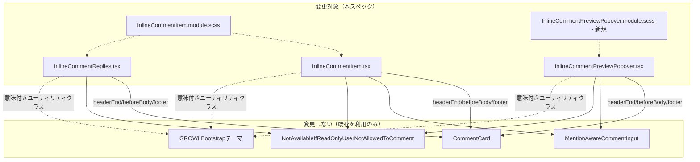

# Design Document

## Overview

**Purpose**: `InlineCommentItem`／`InlineCommentReplies`（画面最下部の一覧）と `InlineCommentPreviewPopover`（本文中ポップオーバー）の見た目を、承認済みのデザインモックアップ（Artifact: https://claude.ai/code/artifact/d19799da-fedc-4687-ad14-24d134bc7e89）に合わせて刷新する。

**Users**: インラインコメントを一覧・本文中で見る・操作するすべての利用者。

**Impact**: 対象3ファイルとその `.module.scss` のみを変更する。`InlineCommentService`・apiv3ルート・DTO・データモデルは一切変更しない。既存の単体テストは新しいマークアップ・クラス名に合わせて更新するが、テストが検証する内容（操作の呼び出し・権限判定）自体は変えない。

### Goals
- 一覧アイテムの4状態（通常・編集・削除確認・解決済み）を Artifact `Main.dc.html` に忠実な見た目にする
- ポップオーバーの2状態（通常＋返信＋返信フォーム・編集）を Artifact `Popover.dc.html` に忠実な見た目にする
- 一覧アイテムの編集・削除操作を、通常コメント（`CommentControl.tsx`）と同じ「ホバーで現れるアイコンのみ」の操作感に変える（配置は既存のヘッダー行に収める）
- 引用ブロックの見た目を一覧・ポップオーバー間で統一する
- GROWIの既存Bootstrapテーマ（意味付きユーティリティクラス）だけで実現し、新規のハードコード16進色・カスタムフォント指定を持ち込まない
- 実装完了の判定に、実ブラウザ（Playwright）でのスクリーンショット目視照合を含める

### Non-Goals
- 解決トグルの仕組み自体の変更（モックアップの「ピルをクリックしてトグル」案は不採用。現行の「バッジ＋別ボタン」を維持。**ただし2026-09-11の判断により、ポップオーバーはバッジ自体を表示しない — Requirement 2.5参照。これは「トグルの仕組み」ではなく「バッジの表示有無」の変更であり、この非目標と矛盾しない**）
- ~~ポップオーバーへの削除操作の追加~~ **（2026-09-11 その2で撤回。Requirement 2.6参照）**
- API・サービス・データモデルの変更（**ただし2026-09-11 その2で `packages/editor` の1関数に限り例外を認める。「MentionAwareCommentInput 編集時に既存本文が復元されないバグの修正」参照**）
- 新しい受け入れ基準・機能の追加

### 2026-09-11 の方針転換（ユーザー判断・実機確認後）

タスク4.4のGO判定後、実装結果をユーザーが実機で確認し、当初の設計判断2点を覆した。詳細は「Boundary Commitments」「Popover 再設計」を参照。

1. **ポップオーバーは `CommentCard` を流用しない。** 起点コメント部分（アバター・投稿者名・日時・本文）を `CommentCard` のスロット注入方式ではなく、ポップオーバー独自のマークアップで作り直す。理由: `CommentCard`・共有スタイルの値をそのまま使うという当初の判断（「モックアップ忠実度の適用範囲」）が、ポップオーバーに関しては「モックアップと違いすぎる」という結果になった。ポップオーバーの不解決バッジも撤去する（モックアップ自体には残っているが、ユーザーが不要と判断）。配色は Popover.dc.html 自身の配色（`--paper`／`--surface`／`--surface-2`／`--ink`系トークン等）を可能な限り忠実に、Bootstrapの意味付きクラスで近似する。**一覧アイテム（`InlineCommentItem`）側はこの対象外** — `CommentCard` 流用はそのまま維持する。
2. **削除確認UIを通常コメントとインラインコメントで共通化する。** 現行の通常コメント側の `DeleteCommentModal`（モーダル）を廃止し、インラインコメントで採用済みのインライン警告帯方式に統一する。共有コンポーネントとして抽出し、両方から使う。

### 2026-09-11 の方針転換 その2（ユーザーが実際に使ってみたフィードバック）

`CommentCard` 流用中止・削除確認共通化を実装・GOした後、ユーザーが実際に機能を使い、さらに5点のフィードバックが来た。加えて、ユーザー自身が直接2コミット（`be49248348`／`6ef7593ce8`）でスタイルを簡素化済み——以降の実装はこの2コミットの方向性（枠線・インデント・`rounded-circle` を減らす）を踏襲する。

1. **スタイルの簡素化を全箇所に揃える**: `be49248348` は `InlineCommentItem.tsx` の編集・削除アイコンから `rounded-circle` を外し32pxの角丸なしボタンにした。`6ef7593ce8` はポップオーバーの返信スレッドから枠線・インデント・区切り線を外し、返信の `%bg-comment`／`%comment-section` 流用も止めた（コメントアウトで無効化——本amendmentで正式に削除する）。しかし `InlineCommentReplies.tsx`（一覧の返信）と `InlineCommentPreviewPopover.tsx` の編集アイコン・送信ボタンにはまだ `rounded-circle` が残っており、不整合になっている。**ポップオーバー内のアイコンボタンはすべて `rounded-circle` を外して32pxの角丸なしに揃える。一覧側（`InlineCommentItem`／`InlineCommentReplies`）も同様に揃える**（一覧側はこのタスクの対象だが、`CommentCard` 流用自体はそのまま——見た目の細部だけの追随）。
2. **ポップオーバーの日付表示**: 調査の結果、起点コメントはすでに `FormattedDistanceDate`（相対表示＋既定でホバーツールチップ）を使っており、返信も `CommentCard` 経由で同じコンポーネントを使っている。**コードは既に要求を満たしている**——ただし返信をポップオーバー内で `CommentCard` から切り離す（後述）ため、切り離し後も `FormattedDistanceDate` を直接使い続けることを明記する。
3. **バグ修正: ポップオーバーで編集モードに入ると返信が全て消える。** 現状 `!isEditing && (<>...返信一覧...返信フォーム...</>)` という1つのガードが、起点コメントの編集状態と返信・返信フォームの表示を一緒くたにしている。**編集対象になった項目（起点コメントなら起点コメントの本文、返信なら該当返信の本文）だけをエディタに置き換え、他の項目・返信一覧・返信フォームは表示したまま**にする。「Popover: 起点・返信の統合」参照。
4. **バグ修正: 編集モードの入力欄に既存の本文が復元されない。** タスク4.1で発見し「別タスクで直す」としていた既知の不具合（`MentionAwareCommentInput.tsx`の`initialValue`→`codeMirrorEditor.initDoc(initialValue)`が実ブラウザで効かない）を、今回スコープに含めて修正する。根本原因は `@growi/editor` パッケージの `packages/editor/src/client/stores/codemirror-editor.ts`（`useCodeMirrorEditorIsolated`）にある。「MentionAwareCommentInput 編集時に既存本文が復元されないバグの修正」参照
5. **ポップオーバーで返信の編集・削除を可能にする。** 現状ポップオーバーの返信は読み取り専用（`CommentCard` に編集・削除の仕組みを渡していない）。一覧の返信（`InlineCommentReplies.tsx`）と同じ編集・削除機能を追加する。
6. **起点コメントもポップオーバーから削除できるようにする。** Requirement 2.4（削除は一覧のみ）を撤回する（Requirement 2.6として新しい受け入れ基準を追記）。ユーザーの判断: 「インラインコメントとreplyとの仕様差をほぼ無くす」ため、起点コメントもポップオーバーから削除できるようにする。
7. **ポップオーバー内で起点コメントと返信の仕様差をほぼ無くし、コードも共通化する。** 引用ブロックの有無を除き、見た目・編集・削除の挙動をほぼ同一にする。返信も `CommentCard` を使わず、起点コメントと同じフラットな独自マークアップにする（**この「`CommentCard` を使わない」方針はポップオーバー限定。一覧側〈`InlineCommentItem`／`InlineCommentReplies`〉は`CommentCard` 流用のまま**）。「Popover: 起点・返信の統合」参照。

### 2026-09-11 の方針転換 その3（Markdownレンダリングオプションの不一致調査）

ユーザーから「通常コメントとインラインコメントで、Markdownのレンダリングオプション（改行の扱いなど）は一致しているか」という質問があり、調査した結果、2件の不一致が見つかった。見た目の刷新（本スペックの本来のスコープ）ではないが、本amendmentの一連の作業と地続きの実装バグであり、ユーザー承認のうえ同じ回で修正した。

1. **バグ修正: ポップオーバーのタイポグラフィが `.wiki.comment` を適用していない。** `InlineCommentPopoverEntry.tsx` の `RevisionRenderer` 呼び出しに `additionalClassName="comment"` が指定されておらず、`Comment.tsx`／`InlineCommentItem.tsx` が使っている `.wiki.comment`（`apps/app/src/styles/organisms/_wiki.scss`、フォントサイズ14px・行間1.5em・見出し余白0.95倍）が適用されていなかった。`additionalClassName="comment"` を追加して揃えた。
2. **バグ修正: ポップオーバーがページ本文用のレンダリングオプションを使っていた。** `PageView.tsx` の `<InlineCommentBodyInteraction rendererOptions={viewOptions} .../>` が、ページ本文用の `useViewOptions()`（`generateViewOptions`——math/plantuml/drawio/mermaid等の重量プラグイン一式、ページ全体の改行設定 `isEnabledLinebreaks` に従う）をそのまま渡していた。画面最下部のコメント一覧（`PageComment.tsx`）はすでに `useCommentForCurrentPageOptions()`（`generateCommentViewOptions`——軽量な `generateSimpleViewOptions` ベース＋`mention.remarkPlugin`〈@メンションのハイライト〉、コメント専用の改行設定 `isEnabledLinebreaksInComments` に従う）を使っており、ポップオーバーだけが一覧と異なるオプションでレンダリングされていた。`PageView.tsx` に `useCommentForCurrentPageOptions()` を追加で呼び出し、`InlineCommentBodyInteraction` にはその結果（`commentRendererOptions`）を渡すように変更した（`PageContentRenderer` に渡す `viewOptions` は変更なし）。実ブラウザで、ポップオーバー本文に `.wiki.comment` クラスが付くこと、および `@admin` のようなメンション記法が `.mention-user` としてハイライトされることを確認した。

### 2026-09-11 の方針転換 その4（返信フォームへのメンションピッカー追加）

ユーザーから「`inline-comment-preview-popover-reply-form` にも mention picker button ほしい」という要望があった。調査の結果、返信フォームだけが独自のプレーンな `<textarea>`（`rounded-pill` の1行入力）を使っており、起点コメント作成フォーム（`InlineCommentForm.tsx`）・起点コメント編集モード・返信編集モード（いずれも `InlineCommentPopoverEntry.tsx` 経由）はすべて `MentionAwareCommentInput` + `MentionPickerButton` の組を使っていることが分かった。`MentionPickerButton` の `onInsert` はその内部で `codeMirrorEditor.insertText(...)` を呼ぶ設計のため、プレーンな `<textarea>` に対しては挿入ロジックを新たに手書きする必要があり、それは「メンション挿入」という同じ関心を2通りに実装することになる。ユーザーに実装方針（CodeMirrorベースの入力に差し替える／見た目維持で挿入だけ自前実装する）を確認し、前者（差し替え）を選択した。

- **返信フォームを `MentionAwareCommentInput` + `MentionPickerButton` に差し替える。** `InlineCommentPreviewPopover.tsx` の返信フォームは、起点コメント作成フォームと同じ構成（アバター → `MentionAwareCommentInput`〈伸縮〉→ `MentionPickerButton` + 送信ボタンの右側グループ）になる。ローカルの `draftComment`／`isSubmitting`／`submitError` state と `handleSubmit` は削除し、`useCommentInputControls()` が返す `{canSubmit, submit, insertMention, onControlsChange}` をそのまま使う（`InlineCommentForm.tsx`・`InlineCommentPopoverEntry.tsx` と同じハンドシェイク）。editorKeyは `inline_comment_preview_popover_new_reply_${comment.id}`（既存の起点編集用 `..._edit_${id}`、返信編集用 `..._reply_edit_${id}` と衝突しない接頭辞）。
- **見た目への影響（開示が必要な副作用）**: 返信フォームの「1行・pill形状」（Requirement 2.1・design.md「Popover 再設計」で明記されていた仕様）はこの変更で失われる。`MentionAwareCommentInput` は CodeMirror エディタを内包する箱型の見た目を持ち、pill形状に収まらないため、編集モードと同じ箱型の見た目に変わる。Requirement 2.7として、この上書きを明示的に追記した。
- **既存の入力欄消失防止ガードを、返信フォームにも波及させる必要があった。** ポップオーバーの外側クリック判定（`handlePointerDown`）は、`popperElement.contains(target)` だけを見ていたため、`MentionAwareCommentInput` のメンション自動補完ポップアップ（`document.body` に portal される、`InlineCommentForm.tsx` がすでに同じ理由で `.cm-tooltip-autocomplete` を除外している）をクリックすると、返信フォーム・編集モードのどちらでもポップオーバーごと閉じてしまう潜在バグがあった（編集モードでは todo 化されていなかった既存のスキマ）。同じガード（`.cm-tooltip-autocomplete` の除外）をポップオーバー全体の外側クリック判定に追加し、実ブラウザで「メンションピッカーボタンからの挿入」「`@` タイプ中の自動補完からの選択」の両方でポップオーバーが閉じないことを確認した。
- **既知の未対応（今回は修正しない）**: 返信フォームは `MentionAwareCommentInput` 自身の二重送信ガードを持たない（クリック中の再入防止）。これは `InlineCommentForm.tsx`・起点/返信編集モードも同様に持っていない、この機能全体で共通の既存の隙間であり、今回の変更が新しく持ち込んだものではない。修正するなら `MentionAwareCommentInput` 自身に1箇所実装するのが筋が良いが、本amendmentのスコープ外として記録するに留める。

### 2026-09-11 の方針転換 その5（返信フォームの枠線・自動フォーカス）

ユーザーが直接コミット（`8ecc809d3d`）で、その4で箱型に変わった返信フォームに `border border-primary-subtle rounded p-2 gap-2` の枠線・余白と `align-items-start`（アバターは `ms-2` で位置調整）を追加した——編集モードのアクセント枠（`border border-primary rounded`）と対になる、フォーム全体を視覚的に区切る仕上げ。

その直後、ユーザーから「`inline-comment-form` が出現したとき、すぐタイプできるように入力欄にフォーカスしていてほしい」という要望があった。

- **`MentionAwareCommentInput` に `autoFocus?: boolean` プロパティを追加。** 内部で保持する `cmProps`（`@uiw/react-codemirror` に渡す）に素通しする。CodeMirrorの初期化は非同期（`view`/`state` は container アタッチ直後は未定義——`packages/editor`側の既存テストが検証済みの契約）だが、`@uiw/react-codemirror` 自身の `useEffect(() => { if (autoFocus && view) view.focus() }, [autoFocus, view])` が `view` の到着を待って発火するため、非同期初期化と正しく噛み合う。デフォルトは `undefined`（フォーカスしない）——起点コメント作成フォーム（`InlineCommentForm.tsx`）だけが `autoFocus` を明示的に渡す。編集モード・返信フォームには今回は付けない（ユーザーの要望は作成フォームに限定されていたため）。
- **バグ修正（本amendmentの実装中に発覚）**: `8ecc809d3d` が返信フォームの `className` を複数行のプレーン文字列（改行区切り）に変更したことで、`InlineCommentPreviewPopover.spec.tsx` の `document.querySelector('.inline-comment-preview-popover-reply-form')` が突然 `null` を返すようになった。原因は本スペックの実装ではなく、この環境の単体テストが使う happy-dom というテスト用DOM実装自身の制限——`classList.contains()` は改行区切りのクラス属性も正しく解釈するが、`querySelector`/`querySelectorAll` によるCSSセレクタ照合は改行を区切り文字として認識しない（小さな再現テストで確認済み。実ブラウザのHTML仕様上は改行も空白として正しく扱われるため、本番挙動には影響しない）。`className` をこのファイルの他の箇所と同じ1行の文字列に整形し直すことで、見た目・クラス構成を変えずに解消した——ユーザーが加えた枠線・余白のスタイル自体は変更していない。

### 2026-09-11 の方針転換 その6（編集・削除アイコンのホバー挙動統一）

ユーザーから2点の要望があった: (1) `.btn-close` の「ホバー時に opacity が濃くなる」インタラクションを、編集・削除アイコンボタンにも（ポップオーバー・通常コメントアイテム・インラインコメントアイテムのすべてで）持たせたい。(2) アイテムホバー時の編集・削除ボタンの「出現の仕方」が通常コメントアイテム・通常コメントreply・インラインコメントアイテムで違うので、通常コメントと同じ「個別に出現する」形に統一したい。

調査の結果、通常コメントアイテムと通常コメントreplyは実はすでに同じ挙動だった——どちらも同じ `Comment.tsx`／`CommentControl.tsx` を経由し、各コメント（アイテムもreplyも）は独立した `Comment` インスタンスとしてそれぞれ自前の `.page-comment > .page-comment-main` を持つため、`.page-comment-main:hover > .page-comment-control` は自然に行単位で独立している。修正が必要だったのはインラインコメント側だけだった。

- **本当のバグ**: `InlineCommentItem.module.scss` のホバー表示ルールが `&:hover .icon-button-container`（`&` は起点コメント＋返信スレッド全体を包む外側の `.inline-comment-item-styles`）になっていた。これだと、アイテム内のどこにマウスを乗せても（起点でも、どのreplyでも）すべての行の `.icon-button-container` が一斉に表示されてしまい、通常コメントの「行ごとに独立」という挙動と食い違っていた。トリガーを外側のラッパーではなく `:global(.page-comment-main):hover`（各 `CommentCard` インスタンス自身の箱——既存の `%comment-section` 共有プレースホルダーがすでに適用済み）に変更し、起点・各replyそれぞれの `.page-comment-main` に個別に届くようにした。`InlineCommentItem.module.scss` の1行のセレクタ変更のみ——`InlineCommentReplies.tsx` はこのモジュールのクラスを再利用しているだけなのでコード変更は不要（ドキュメントコメントのみ更新）。
- **ホバー時のopacity変化**: Bootstrapには、`.link-*` 系ユーティリティに紐づく `.link-opacity-*-hover` 以外に、通常の要素に対する「ホバーで opacity が変わる」汎用ユーティリティが存在しない。また既存の `opacity-50` ユーティリティは `!important` 付きなので、素の `:hover` ルールで対抗しても勝てない。そこで `opacity: 0.5` ／ `&:hover { opacity: 0.75; }`（Bootstrap自身の `.btn-close` が使う `$btn-close-opacity`／`$btn-close-hover-opacity` と同じ値）を、各サーフェスの既存アイコンボタン用CSS Modulesクラスに直接追加し、`opacity-50` ユーティリティは呼び出し側からすべて削除した:
  - `InlineCommentItem.module.scss` の `.icon-button`（`InlineCommentItem.tsx`・`InlineCommentReplies.tsx` 共有、一覧側）
  - `InlineCommentPreviewPopover.module.scss` の `.inline-comment-preview-popover-icon-button`（`InlineCommentPopoverEntry.tsx` が使用。ポップオーバーのボタンは常時表示のまま——design.md「Popover 再設計」の判断は変えない。今回追加したのはホバーで濃くなる挙動だけで、表示・非表示の仕組みは変更していない）
  - 新規 `CommentControl.module.scss`（通常コメント／replyはこれまでCSS Moduleを持っていなかった）を `CommentControl.tsx` の2つのボタンに適用
- 削除した `opacity-50` クラスを直接検証していた古い単体テストのアサーション（`InlineCommentReplies.spec.tsx`）を1件更新した。
- 実ブラウザで確認（確認用の使い捨てPlaywrightテストは確認後に削除）: `getComputedStyle` で測定したopacityが、通常コメントアイテム・インラインコメントアイテム・ポップオーバーそれぞれで、ホバー時に `0.5` から `0.75` に変わることを確認。インラインコメントの起点をホバーすると起点の編集・削除ボタンだけが現れ、replyのボタンは非表示のままであること、逆にreplyをホバーするとそのreplyのボタンだけが現れ起点のボタンは非表示のままであることも確認済み（行単位の独立表示の修正が効いている証拠）。

## Boundary Commitments

### This Spec Owns
- `InlineCommentItem.tsx`／`InlineCommentReplies.tsx`／`InlineCommentPreviewPopover.tsx` のJSXマークアップとクラス名
- `InlineCommentItem.module.scss`（既存）の拡張、および新規 `InlineCommentPreviewPopover.module.scss` の追加
- 対応する `.spec.tsx` の、新しいマークアップ・クラス名に合わせたテスト更新
- 実ブラウザでのスクリーンショット照合手順（Playwright）
- （2026-09-11追加）`Comment.tsx`／`PageComment.tsx`／`ReplyComments.tsx` の削除確認まわりの変更（振る舞い自体は変えない。UIの方式だけをモーダルからインライン警告帯に変更する）
- （2026-09-11追加）新規 `DeleteConfirmAlert.tsx`（+ `.module.scss`）— 通常コメント・インラインコメント共有の削除確認UI
- （2026-09-11追加）`DeleteCommentModal.tsx`／`dynamic.tsx`／`index.ts` の削除
- （2026-09-11 その2追加）新規 `InlineCommentPopoverEntry.tsx` — ポップオーバー内の起点・返信共有の表示コンポーネント
- （2026-09-11 その2追加）`PageView.tsx`／`InlineCommentBodyInteraction.tsx` の `remove`／`updateReply`／`removeReply` 配線追加（既存のstore/API呼び出しの使い回し。新規ロジックなし）
- （2026-09-11 その2追加）`packages/editor/src/client/stores/codemirror-editor.ts` の `shouldUpdate` 修正（1関数のみ）

### Out of Boundary
- `InlineCommentService`、apiv3ルート4本（`update.ts`／`update-reply.ts`／`delete.ts`／`delete-reply.ts`）、DTO — 一切変更しない
- `CommentCard.tsx`、`NotAvailableForReadOnlyUser.tsx` — 既存のprops・振る舞いのまま利用する。中身は変更しない（**ただし `InlineCommentPreviewPopover.tsx` はこのコンポーネント自体を利用しなくなる。返信部分は引き続き `CommentCard` を使うため、`CommentCard.tsx` 自体の変更禁止は維持**。詳細は「Popover 再設計」参照）
- **`MentionAwareCommentInput.tsx`（2026-09-10 訂正: 変更禁止を解除）**: task 4.1（項目11・30）で判明した「保存ボタンが常にコンポーネント内部に描画され、呼び出し側が位置を変える手段を持たない」という制約により、要件2.2・2.4の「入力欄の下、キャンセルと並んで右揃え」が一覧アイテム・ポップオーバーのどちらでも実現不能だった。ユーザーの判断により、このファイルへの変更を許可する。採用する具体的な変更: 送信ボタンの描画を呼び出し側に完全に移す。コンポーネントは `onControlsChange?: (controls: { canSubmit: boolean; submit: () => void; insertMention: (username: string) => void }) => void` を新設し、`canSubmit`／`submit`／`insertMention` が変わるたびに通知する。コンポーネント自身はもう送信ボタン・メンションピッカーボタンを描画しない（boolean フラグによる分岐は導入しない — 全ての呼び出し元が同じ形でコントロールを受け取り、自分で描画する）。既存の呼び出し元（`InlineCommentForm.tsx`／`InlineCommentReplies.tsx`）は、これまでコンポーネント内部にあったのと同じ見た目・同じクラス構成のボタンを、`onControlsChange` で受け取った値を使って自分のJSX内（エディタのすぐ右、これまでと同じ位置）に描画し直す。`InlineCommentItem.tsx`／`InlineCommentPreviewPopover.tsx`の編集モードは、送信ボタンをキャンセルボタンと同じ行（入力欄の下、右揃え）に描画する。
- `_comment-inheritance.scss`（`%bg-comment`／`%user-picture`／`%comment-section`）— 変更しない。これらのプレースホルダがすでに決めている値（投稿者アイコンの大きさ＝`1.2em`、カード左側の吹き出し風の飾り、カードの背景の濃さ）は、モックアップの値と異なっていても、そのまま採用する（下記「モックアップ忠実度の適用範囲」参照）。**この方針は一覧アイテム（`InlineCommentItem`）にのみ適用される。ポップオーバーの起点コメント部分は「Popover 再設計」の対象**
- **`Comment.tsx`／`CommentControl.tsx`／`DeleteCommentModal`（2026-09-11 訂正: 削除確認UIに限り変更を許可）**: ユーザー判断により、削除確認の振る舞いを通常コメントとインラインコメントで共通化する。詳細は「削除確認UIの共通化」参照。これ以外の変更（編集フロー、権限判定、リビジョンリンク等）は引き続き対象外
- 一覧・ポップオーバー間での解決トグルUIの共通コンポーネント化（`inline-comment-popover-refinement` の既存決定「解決トグルのマークアップを共有化しない」を維持する。削除確認UIの共通化は別軸の決定であり、この既存決定と矛盾しない — 解決トグルは各コンポーネントが独自に持つマークアップのまま、削除確認だけを共有部品に切り出す）

### Popover 再設計（2026-09-11、ユーザー判断）

`InlineCommentPreviewPopover.tsx` の起点コメント部分（アバター・投稿者名・日時・本文の表示）を `CommentCard` のスロット注入方式から切り離し、ポップオーバー独自のマークアップで描画する。

- **対象**: 起点コメントのヘッダー行・本文表示のみ。引用ブロック・返信フォーム・編集モードは既存のまま（タスク3.1〜3.3の実装を維持）。~~返信アイテムは引き続き `CommentCard` を使う~~ **（2026-09-11 その2で撤回。返信も `CommentCard` を使わずフラットな独自マークアップにする。「Popover: 起点・返信の統合」参照）**
- **不解決バッジの撤去**: ヘッダー行から状態バッジ（`inline-comment-status` 相当）を削除する。解決トグルボタンは維持する（現行の「バッジ＋別ボタン」方針のうち、バッジだけをポップオーバーから外す）
- **配色の目標**: Popover.dc.html 自身の配色トークン（`--paper: #f6f8fb`／`--surface: #ffffff`／`--surface-2: #eef1f6`／`--ink: #1b2433`／`--ink-dim: #5b6577`／`--ink-faint: #8994a6`／`--line: #dfe4ec` 等）を、GROWIのBootstrapテーマが提供する意味付きユーティリティクラスで可能な限り近似する。ハードコードされた16進色は使わない（要件3.1を維持）。具体的な近似（実装時に実際のBootstrapクラスの生成結果を確認しながら微調整してよい）:
  - ポップオーバー本体の背景・枠線: `bg-body`／`border`（Bootstrapのニュートラルな表面色）
  - アバター: 共有スタイル `%user-picture` は使わず、ポップオーバー独自のサイズ・配色（モックアップは30px、丸背景 `--accent-soft`+`--accent`のイニシャル表示だが、GROWIの実装は既存の `UserPicture`／`Username` コンポーネントの画像アバターを使うため、サイズのみモックアップに寄せて30pxとする。イニシャル表示への変更はしない — 既存の `UserPicture` の振る舞いを変えない）
  - 投稿者名・日時: `fw-semibold`／`text-body-secondary`相当
- **編集ボタン**: 既存のまま（アイコンボタン、Requirement 3.5準拠）
- **CommentCard を使わなくなることの帰結**: `headerEnd`／`beforeBody`／`footer` スロットという構成そのものが無くなる。ヘッダー行・引用ブロック・本文・削除確認（該当しない）を、ポップオーバー自身のJSXで直接組み立て直す

### 削除確認UIの共通化（2026-09-11、ユーザー判断）

通常コメント（`Comment.tsx`、`ReplyComments.tsx` 経由の返信も同じ `Comment.tsx` を再利用）の削除確認を、現行の `DeleteCommentModal`（モーダル、`PageComment.tsx` がページ単位で1つだけ持つ共有状態）から、インラインコメントで採用済みの「インラインの警告帯（`alert alert-danger`）」方式に変更する。

- **共有コンポーネントの新設**: `apps/app/src/client/components/PageComment/DeleteConfirmAlert.tsx`（+ 左罫用の `.module.scss`）を新設し、`InlineCommentItem.tsx` が現在持っている削除確認の警告帯マークアップ（`alert alert-danger d-flex align-items-center gap-2 mb-0 mt-1`、`warning` アイコン、メッセージ、キャンセル・削除ボタン）をこのファイルに抽出する。`testIdPrefix` のようなpropで呼び出し元ごとに `data-testid` を変えられるようにし、`InlineCommentItem.tsx` 側の既存の `data-testid`（`inline-comment-delete-confirm` 等）は変更しない
- **`Comment.tsx` の変更**: 削除確認の状態（`isDeleteConfirmOpen`）を `PageComment.tsx` の共有state（`commentToBeDeleted`／`isDeleteConfirmModalShown`）からこのコンポーネント自身のローカルstateに変える（`InlineCommentItem.tsx` と同じ構成）。`CommentControl`の削除ボタンはこのローカルstateを開くだけにする。実際の削除API呼び出し（`apiPost('/comments.remove', ...)`）とその後の `mutate()`／`mutatePageInfo()` は `PageComment.tsx` から渡される非同期コールバック（例: `onDeleteConfirmed: (comment) => Promise<void>`）として残し、`Comment.tsx` はそれを呼び出してエラー時は自身のローカルエラー表示に反映する（`InlineCommentItem.tsx` の `handleDeleteConfirm` と同じパターン）
- **`PageComment.tsx` の変更**: `commentToBeDeleted`／`isDeleteConfirmModalShown`／`DeleteCommentModalLazyLoaded` を除去し、代わりに `onDeleteConfirmed` コールバックを `Comment`／`ReplyComments` に渡す
- **`DeleteCommentModal` の削除**: `DeleteCommentModal.tsx`／`dynamic.tsx`／`index.ts`（＋ `.module.scss` があれば）を削除する。他に参照しているファイルが無いことを確認してから削除する
- **対象外**: 編集フロー（`CommentEditor`）、権限判定（`NotAvailableIfReadOnlyUserNotAllowedToComment`）、リビジョンリンクは変更しない

### Popover: 起点・返信の統合（2026-09-11 その2、ユーザー判断）

ポップオーバー内の起点コメントと返信の見た目・編集・削除の挙動をほぼ同一にし、コードも共有する。

**新設: `InlineCommentPopoverEntry.tsx`**（`InlineCommentBodyInteraction/` 配下）— ポップオーバー内の「1件のコメント表示」を担う共有コンポーネント。起点コメント・各返信の両方がこれを使う。

- Props（概略）: `id`／`creator`／`createdAt`／`commentText`／`rendererOptions`／`isOwn: boolean`／`editorKeyPrefix: string`／`onUpdate: (text: string) => Promise<unknown>`／`onRemove: () => Promise<unknown>`／`beforeBody?: ReactNode`（引用ブロック。起点のみ渡す）／`headerExtra?: ReactNode`（解決トグル＋閉じるボタン。起点のみ渡す）／`testIdPrefix: string`
- 内部で持つstate: `isEditing`／`isDeleteConfirmOpen`／`editError`／`deleteError`（すべてこのコンポーネントのインスタンスごとのローカルstate——`InlineCommentReplyItem` と同じ設計）
- 描画するもの: アバター（`UserPicture`、30px）／投稿者名（`Username`）／日時（`FormattedDistanceDate`、id・date をそのまま渡す。ツールチップは既定で有効）／`headerExtra`／編集・削除アイコンボタン（`isOwn && !isEditing && !isDeleteConfirmOpen` のときのみ、`NotAvailableIfReadOnlyUserNotAllowedToComment` で保護、方針転換その2-1により `rounded-circle` は付けない）／`beforeBody`／本文（`isEditing` なら `MentionAwareCommentInput` ＋Cancel/Save、そうでなければ `RevisionRenderer`）／`isDeleteConfirmOpen` なら `DeleteConfirmAlert`（`testIdPrefix` をそのまま渡す）
- **バグ修正の実現方法**: `isEditing`／`isDeleteConfirmOpen` がこのコンポーネントのインスタンスにローカルであるため、ある1件を編集中でも他の項目（起点・他の返信・返信フォーム）は普通に表示され続ける。`InlineCommentPreviewPopover.tsx` 側は、もう「`!isEditing` で返信一覧・返信フォームをまるごと隠す」という1つのガードを持たない——返信一覧・返信フォームは常に表示し、編集中の項目だけがその場でエディタに置き換わる

`InlineCommentPreviewPopover.tsx` の変更:
- 起点コメント: `<InlineCommentPopoverEntry ... beforeBody={引用ブロック} headerExtra={解決トグル+閉じるボタン} onUpdate={update} onRemove={remove} testIdPrefix="inline-comment-preview-popover" />`
- 各返信: `<InlineCommentPopoverEntry ... onUpdate={(text) => updateReply(reply.id, text)} onRemove={() => removeReply(reply.id)} testIdPrefix="inline-comment-preview-popover-reply" />`（`beforeBody`／`headerExtra` は渡さない）
- 返信一覧・返信フォームは常時表示（`!isEditing` ガードを撤去）

**新しいprop配線（Requirement 2.6: 起点コメントもポップオーバーから削除できる）**:
`remove`／`updateReply`／`removeReply` を `PageView.tsx` → `InlineCommentBodyInteraction.tsx` → `InlineCommentPreviewPopover.tsx` へ新規に配線する。`PageView.tsx` はすでに `removeInlineComment`／`updateInlineCommentReply`／`removeInlineCommentReply` を持っている（`InlineCommentItem.tsx` 側に既に渡している値の使い回し）ため、新しいstore・API呼び出しは不要——配線を通すだけ。

**削除確認**: `DeleteConfirmAlert` を `testIdPrefix` 違いでそのまま使う（新規コンポーネントは不要）。

### MentionAwareCommentInput 編集時に既存本文が復元されないバグの修正（2026-09-11 その2、ユーザー判断でスコープに追加）

**根本原因**（実測ではなく静的解析で特定。実装者は実機で必ず確認すること）: `packages/editor/src/client/stores/codemirror-editor.ts` の `useCodeMirrorEditorIsolated` 内、`shouldUpdate` の判定:
```ts
const shouldUpdate =
  key != null &&
  container != null &&
  (currentData == null || (isValid(newData) && !isDeepEquals(currentData, newData)));
```
`currentData == null`（そのフックインスタンスからの最初の発行）のときは `isValid(newData)` のチェックを素通りする。`CodeMirrorEditor.tsx` は `containerRef.current` をレンダー中に読んでいる（`useRef` はrefが着いても再レンダーを起こさない）ため、コンテナが着いた直後の再レンダーではCodeMirrorの `view`/`state` がまだ非同期に初期化される前で、`newData` が無効（`view === undefined`）なことがある。にもかかわらずこの無効な `newData` が「最初の発行」としてそのまま共有atomに入ってしまう。`MentionAwareCommentInput.tsx` の初期値適用エフェクトは `codeMirrorEditor` が非nullになった時点で一度だけ `initDoc` を呼び、呼んだかどうかに関わらず `hasAppliedInitialValueRef.current = true` にして二度と呼ばない設計のため、この無効なエディタに対して空振りした`initDoc`呼び出しがその一度きりのチャンスを消費してしまい、その後atomが本当に有効なエディタへ更新されても、もう`initDoc`は呼ばれない。

**修正**: `isValid(newData)` のチェックを「最初の発行」でも省略しない。
```ts
const shouldUpdate =
  key != null &&
  container != null &&
  isValid(newData) &&
  (currentData == null || !isDeepEquals(currentData, newData));
```
この関数1つだけの変更で、`@growi/editor` を使う全ての呼び出し元（ページ本文エディタ含む）に影響する。影響範囲が広いため、実装者は変更後に少なくとも: (1) インラインコメントの編集モードで既存本文が実際に復元されることを実ブラウザで確認、(2) 新規コメント作成フォーム（`MentionAwareCommentInput` の他の呼び出し元）が壊れていないこと、(3) ページ本文エディタ（`CodeMirrorEditor` の他の消費者）が壊れていないことを確認する。

**Boundary**: `packages/editor/src/client/stores/codemirror-editor.ts` はこのAmendmentに限り変更を許可する（唯一の例外。他の `packages/editor` ファイルは対象外）。
### モックアップ忠実度の適用範囲（Critical Issue 2 の解決）

`InlineCommentItem`／`InlineCommentReplies`／`InlineCommentPreviewPopover` がこの機能のために新しく持ち込む・作り直す要素——状態バッジ、引用ブロック、編集・削除アイコンボタン、削除確認帯、編集モードの入力欄、返信フォーム——は、モックアップに忠実にする。

一方、`CommentCard`・共有スタイル（`_comment-inheritance.scss`）がすでに決めている以下の見た目は、モックアップの値と異なっていても、既存の値をそのまま採用する。**上書きも変更もしない**（オーバーライドによる部分的な変更も含めて行わない——理由は「シンプルさ・共有コードへの影響ゼロを優先する」というユーザーの判断による）:

| 要素 | 既存の値（`_comment-inheritance.scss`／Bootstrap既定） | モックアップの値 | 扱い |
|---|---|---|---|
| 投稿者アイコンの大きさ | `%user-picture { width: 1.2em; height: 1.2em; }`（本文16px基準で約19px） | 30px（返信・返信フォームは22〜26px） | 既存の値のまま。約19pxで表示される |
| カード左側の吹き出し風の飾り | `%comment-section::before` による三角形（`border: 1em solid transparent; border-left-width: 0;`） | 描画なし（単純な角丸長方形） | 既存の値のまま。飾りは残る |
| カードの角の丸み | Bootstrap既定 `.rounded`（`--bs-border-radius: 0.375rem` = 6px） | 12〜14px | 既存の値のまま。6px相当になる |
| カードの背景色の濃さ | `%bg-comment`（ライト: `rgba(gray-200, 0.5)` + ぼかし、ダーク: `rgba(gray-800, 0.3)` + ぼかし） | モックアップ独自の配色（実装には持ち込まない、Requirement 3.1） | 既存の値のまま |

この切り分けにより、`CommentCard`・共有スタイルへの変更は文字通りゼロ件になり、実装のスコープも小さくなる。トレードオフとして、投稿者アイコンはモックアップより小さく、カードには吹き出しの飾りが残った状態で仕上がる——これは実装のミスではなく、意図した仕様である。

### Allowed Dependencies
- `CommentCard`（既存）の `headerEnd`／`beforeBody`／`footer` スロット — 一覧アイテム（`InlineCommentItem`）とポップオーバーの返信部分は、新しい見た目をこれらのスロットの中身の変更で実現し、`CommentCard` 自体には手を入れない。**（2026-09-11 訂正）ポップオーバーの起点コメント部分はこの限りでない** — 「Popover 再設計」の決定により `CommentCard` を使わず独自マークアップで描画する（返信部分は引き続き `CommentCard` を使う）
- GROWIのBootstrapテーマ（`packages/core-styles`）が提供する意味付きユーティリティクラス（`badge`／`rounded-pill`／`bg-warning-subtle`／`bg-danger-subtle`／`bg-success-subtle`／`text-*-emphasis`／`btn-outline-secondary`／`btn-link`／`btn-close` 等、Bootstrap 5.3.8で実際に生成されることを確認済み）
- `material-symbols-outlined` アイコンフォント（既存、アプリ全体で読み込み済み）— `CommentControl.tsx` と同じ `edit`／`close` グリフを踏襲する
- `_comment-inheritance.scss` の共有プレースホルダ（`%bg-comment`／`%user-picture`／`%comment-section`）— 既存の `InlineCommentItem.module.scss` がすでに `@extend` しているものをそのまま使う。新しいプレースホルダは追加しない

### Revalidation Triggers
- `CommentCard` のスロット構成（`headerEnd`／`beforeBody`／`footer`）が変わった場合、一覧アイテムとポップオーバーの返信部分は再確認が必要（ポップオーバーの起点コメント部分はもう `CommentCard` に依存しないため対象外）
- `CommentControl.tsx` の編集・削除アイコンの視覚パターン（グリフ・ボタンクラス）が変わった場合、Requirement 3.5（同じパターンを踏襲する）の前提が崩れるため再確認する必要がある
- GROWIのBootstrapテーマの `-subtle`／`-emphasis` トークンの実装が変わった場合（例: Bootstrapの将来のメジャーアップデート）、色の見え方を再確認する必要がある
- ~~（2026-09-11追加）ポップオーバーの起点コメント部分は `CommentCard` のスロットAPIには依存しなくなったが、代わりに `CommentCard` が生成するクラス名（`.page-comment`／`.page-comment-main`／`.bg-comment` 等）に、返信部分のSCSS・`InlineCommentPreviewPopover.spec.tsx` の一部テストが依存し続けている。これらのクラス名が変わった場合は再確認が必要~~ **（2026-09-11 その2で撤回。「Popover: 起点・返信の統合」により返信も `CommentCard` を使わなくなったため、この依存自体が無くなった）**

## Architecture

### Existing Architecture Analysis

3つのコンポーネントはすでに `CommentCard` の3スロット（`headerEnd`／`beforeBody`／`footer`）に見た目の差分を注入する構成になっている（`.kiro/specs/inline-comment` design.md 参照）。本スペックは当初この構成をそのまま維持する方針で始まったが、**2026-09-11の「Popover 再設計」決定により、ポップオーバーの起点コメント部分だけはこの構成から外れ、`CommentCard` を使わない独自マークアップになった**（一覧アイテム・ポップオーバーの返信部分は当初方針のまま）。

現状の3つの相違点（変更対象）:
1. **状態バッジ**: `<span className="badge bg-warning text-dark">`／`bg-secondary` — Bootstrapの生の配色クラスを直接使っており、`-subtle`／`-emphasis` トークンを使っていない
2. **編集・削除ボタン**: 一覧アイテム・返信アイテムとも、`footer` スロット内に常時表示の `btn btn-link p-0` テキストリンクとして存在する。通常コメントの `CommentControl.tsx` は逆に `headerEnd`（正確には独立した絶対配置）に、ホバー時のみ visibility が変わるアイコンのみのボタンとして存在する
3. **引用ブロック**: 一覧アイテムは `border-left: 3px solid var(--grw-inline-comment-marker-bg)`（黄色いハイライトマーカー色）、ポップオーバーは `bg-body-tertiary border-start border-3`（グレー系、マーカー色を使わない）と、2箇所で別の見た目になっている

### Architecture Pattern & Boundary Map



**Architecture Integration**:
- 選定パターン: 既存の「`CommentCard` + スロット注入」構成を完全に維持する（新パターンなし）
- ドメイン境界: 見た目（JSX・CSS）だけを変更し、状態・権限判定・イベントハンドラのロジックには一切触れない
- 既存パターンの維持: `NotAvailableIfReadOnlyUserNotAllowedToComment` によるガード、`creatorId` 比較による本人判定、`MentionAwareCommentInput` の再利用は変更しない
- 新規コンポーネントの理由: 新規コンポーネントは追加しない。`InlineCommentPreviewPopover.module.scss` のみ新規（ポップオーバーはこれまでCSS Modulesを持たず、Bootstrapユーティリティクラスとインラインstyleのみで実装されていたため、Requirement 3.3「インラインstyleの使用を最小限にする」を満たすために新設する）
- Steering準拠: `.claude/rules/coding-style.md` の「不変な状態更新」「named exports」は維持する

## File Structure Plan

### Modified Files
- `apps/app/src/features/inline-comment/client/components/InlineCommentItem/InlineCommentItem.tsx` — ヘッダー行の状態バッジ・解決トグルの見た目変更、編集・削除ボタンを常時表示フッターリンクからホバー表示ヘッダーアイコンへ変更、引用ブロックのクラス変更
- `apps/app/src/features/inline-comment/client/components/InlineCommentItem/InlineCommentReplies.tsx` — `InlineCommentReplyItem` の編集・削除ボタンを同様にホバー表示ヘッダーアイコンへ変更（返信は元々 `headerEnd` を使っていないため、新規に使用する）
- `apps/app/src/features/inline-comment/client/components/InlineCommentItem/InlineCommentItem.module.scss` — ホバー表示の可視性制御規則、状態ドットの装飾、引用ブロックの左罫スタイルを追加
- `apps/app/src/features/inline-comment/client/components/InlineCommentBodyInteraction/InlineCommentPreviewPopover.tsx` — 状態バッジ・引用ブロック・編集ボタン・返信スレッド・返信フォームの見た目変更
- 各ファイルの `.spec.tsx`（`InlineCommentItem.spec.tsx`／`InlineCommentReplies.spec.tsx`／`InlineCommentPreviewPopover.spec.tsx`）— 新しいクラス名・DOM構造に合わせてセレクタを更新（アサーション対象の振る舞いは変えない）
- `apps/app/playwright/20-basic-features/inline-comment.spec.ts` — 既存の視覚関連アサーション（もしクラス名に依存しているものがあれば）の更新、および本スペック用のスクリーンショット照合テストの追加

### New Files
- `apps/app/src/features/inline-comment/client/components/InlineCommentBodyInteraction/InlineCommentPreviewPopover.module.scss` — ポップオーバー専用のCSS Module。編集・削除アイコンボタンと同じホバー可視性規則、状態ドット、引用ブロックのスタイル（`InlineCommentItem.module.scss` と重複する部分は、後述のとおり将来的な共有を検討する余地として残すが、本スペックでは重複を許容する——2ファイルの規則は数行程度で、共有ユーティリティを新設するほどの重複ではないため）

## Requirements Traceability

| Requirement | Summary | Components | Interfaces | Flows |
|-------------|---------|------------|------------|-------|
| 1.1 | 一覧アイテム通常表示のモックアップ忠実度 | InlineCommentItem | headerEnd/beforeBody/footer スロット | — |
| 1.2 | 一覧アイテム編集モードのモックアップ忠実度 | InlineCommentItem | MentionAwareCommentInput（既存） | — |
| 1.3 | 一覧アイテム削除確認のモックアップ忠実度 | InlineCommentItem | 削除確認アラートのマークアップ | — |
| 1.4 | 一覧アイテム解決済み状態のモックアップ忠実度 | InlineCommentItem | 状態バッジ・不透明度 | — |
| 1.5 | 編集・削除アイコンのホバー表示・ヘッダー行配置 | InlineCommentItem, InlineCommentReplies, InlineCommentItem.module.scss | `:hover` 可視性規則 | — |
| 1.6 | ホバー解除で非表示に戻る・権限判定の維持 | InlineCommentItem, InlineCommentReplies | NotAvailableIfReadOnlyUserNotAllowedToComment（既存） | — |
| 1.7 | 引用ブロックの一覧・ポップオーバー間統一 | InlineCommentItem, InlineCommentPreviewPopover | 共通の引用ブロッククラス構成（規則は各moduleで個別定義） | — |
| 2.1 | ポップオーバー通常表示のモックアップ忠実度 | InlineCommentPreviewPopover | headerEnd/beforeBody/footer スロット | — |
| 2.2 | ポップオーバー編集モードのモックアップ忠実度 | InlineCommentPreviewPopover | MentionAwareCommentInput（既存） | — |
| 2.3 | 解決トグルの形（バッジ＋別ボタン）を維持 | InlineCommentPreviewPopover | 状態バッジ・`toggle-btn` 相当のBootstrapボタン | — |
| 2.4 | ポップオーバーに削除操作を追加しない | InlineCommentPreviewPopover（変更なし） | — | — |
| 3.1 | 色は意味付きユーティリティクラスのみ | 全対象コンポーネント | Bootstrapテーマの `-subtle`/`-emphasis` トークン | — |
| 3.2 | フォント指定なし | 全対象コンポーネント | — | — |
| 3.3 | インラインstyleの最小化 | 全対象コンポーネント、InlineCommentPreviewPopover.module.scss（新規） | — | — |
| 3.4 | レイアウト・余白はBootstrapユーティリティクラス優先 | 全対象コンポーネント | flexユーティリティ・spacingユーティリティ | — |
| 3.5 | 編集・削除アイコンはCommentControl.tsxと同じ視覚パターン | InlineCommentItem, InlineCommentReplies | `material-symbols-outlined` の `edit`/`close` グリフ、`btn btn-link p-2` | — |
| 4.1-4.4 | 実ブラウザでのスクリーンショット照合による完了判定 | Playwright (`inline-comment.spec.ts`) | — | Validationフロー |

## Components and Interfaces

| Component | Domain/Layer | Intent | Req Coverage | Key Dependencies (P0/P1) | Contracts |
|-----------|--------------|--------|--------------|--------------------------|-----------|
| InlineCommentItem | Client / UI | 一覧アイテムの見た目（4状態）と、編集・削除アイコンのホバー表示切り替え | 1.1-1.7, 3.1-3.5 | CommentCard(P0), MentionAwareCommentInput(P0), NotAvailableIfReadOnlyUserNotAllowedToComment(P0) | State |
| InlineCommentReplies | Client / UI | 返信アイテムの編集・削除アイコンのホバー表示切り替え | 1.5, 1.6, 3.1-3.5 | CommentCard(P0), MentionAwareCommentInput(P0), NotAvailableIfReadOnlyUserNotAllowedToComment(P0) | State |
| InlineCommentPreviewPopover | Client / UI | ポップオーバーの見た目（2状態）、引用ブロックの統一 | 2.1-2.4, 1.7, 3.1-3.5 | CommentCard(P0), MentionAwareCommentInput(P0) | State |

### Client

#### InlineCommentItem / InlineCommentReplies

| Field | Detail |
|-------|--------|
| Intent | 4状態の見た目をモックアップに合わせ、編集・削除操作をホバー表示アイコンへ変更する |
| Requirements | 1.1-1.7, 3.1-3.5 |

**Responsibilities & Constraints**
- **状態バッジ**: `<span className="badge rounded-pill bg-warning-subtle text-warning-emphasis">`（未解決）／`bg-success-subtle text-success-emphasis`（解決済み）に変更する。モックアップのドット装飾は、`InlineCommentItem.module.scss` に追加する小さな `::before` 疑似要素（`background-color: currentColor` で親の文字色を継承）として実装し、tsx側にインラインstyleを書かない
- **解決トグルボタン**: 現行の `btn btn-sm btn-outline-secondary` に `rounded-pill` を追加する。文言（`解決する`／`再オープン`）は変更しない
- **編集・削除アイコン**: `CommentControl.tsx` と同じ `<button type="button" className="btn btn-link p-2 opacity-50"><span className="material-symbols-outlined">edit</span></button>`（削除は `delete` グリフ、`text-danger` を追加）のパターンを踏襲し、`headerEnd` スロット内・状態バッジ／解決トグルの左隣に配置する。ホバー時のみ見せる仕組みは `CommentControl.tsx` と同じ「親要素への `:hover`＋子要素の `visibility`」をCSS Modulesで実装する（`display` ではなく `visibility` を使うのは、非表示時にレイアウトシフトが起きないようにする既存パターンをそのまま踏襲するため）。ただし `CommentControl.tsx` は絶対配置（右上コーナー）だが、ここは通常のflexアイテムとして `headerEnd` の行内に置く——このコンポーネントのヘッダー行にはすでにバッジ・解決ボタンがあり、コーナーを使う余地がないため（Requirement 1.5 の「配置は既存のヘッダー行に収める」の実装）
- **削除確認**: 現行の裸のテキスト行を、`alert alert-danger d-flex align-items-center gap-2 border-start border-3 mb-0`（Bootstrapの標準アラートコンポーネントを活用し、左罫を強調する）に変更する。ボタンは `btn btn-sm btn-outline-secondary`（キャンセル）／`btn btn-sm btn-danger`（削除）のまま
- **引用ブロック**: 既存の `.inline-comment-quote { border-left: 3px solid var(--grw-inline-comment-marker-bg); }` はそのまま維持し（黄色いハイライトマーカー色との統一を保つ）、追加で `bg-body-tertiary rounded-end` ユーティリティクラスを付与して背景色を持たせる（モックアップの「淡色背景＋アクセント左罫」を、既存のマーカー色トークンの上に実現する）
- **解決済み状態**: カード全体に `opacity-75`（Bootstrapユーティリティ）を適用する。新しいクラスの追加は不要

**Dependencies**
- Inbound: `PageView.tsx`（既存、propsは変更なし）
- Outbound: `CommentCard`(P0), `MentionAwareCommentInput`(P0), `NotAvailableIfReadOnlyUserNotAllowedToComment`(P0)

**Contracts**: Service [ ] / API [ ] / Event [ ] / Batch [ ] / State [x]

##### State Management
- 新しい状態は追加しない。既存の `isEditing`／`isDeleteConfirmOpen`／`resolveError`／`editError`／`deleteError` をそのまま使う
- ホバーの可視性はReactの状態を経由しない（CSSの `:hover` のみ）——余分な再レンダリングを避けるため

**Implementation Notes**
- Integration: `headerEnd` の中身は `<span className="ms-auto d-flex align-items-center gap-2">` のままで、編集・削除アイコンのコンテナを先頭に追加する形になる
- Validation: 新規のものはない
- Risks: ホバー表示への変更で、タッチデバイス（真の `:hover` がない）での編集・削除操作の発見しやすさが下がる可能性がある。これは通常コメント（`CommentControl.tsx`）にすでに存在する制約であり、本スペックが新しく持ち込むものではない（Requirement 3.5 の踏襲元がすでに持つ制約のため許容する）

#### InlineCommentPreviewPopover

| Field | Detail |
|-------|--------|
| Intent | ポップオーバーの2状態の見た目をモックアップに合わせ、引用ブロックを一覧アイテムと統一する |
| Requirements | 2.1-2.4, 1.7, 3.1-3.5 |

**Responsibilities & Constraints**
- **状態バッジ・解決トグル**: `InlineCommentItem` と同じクラス構成（`badge rounded-pill bg-*-subtle text-*-emphasis`、`btn btn-sm btn-outline-secondary rounded-pill`）にする
- **編集ボタン**: 現行の `btn btn-sm btn-link p-0`（テキストリンク）を、`InlineCommentItem` と同じ `material-symbols-outlined` の `edit` グリフを使ったアイコンボタンに変える。ただしポップオーバーは表示時間が短く常時操作可能である方が実用的なため、ホバー表示ではなく常時表示のままとする（Requirement 2.1 のモックアップもポップオーバー側は常時表示のアイコンボタンとして描いている）
- **引用ブロック**: 現行の独自スタイル（`bg-body-tertiary border-start border-3`、マーカー色を使わない）を廃止し、一覧アイテムと同じ `.inline-comment-quote` 相当のクラス（`border-left` はマーカー色、背景は `bg-body-tertiary`）に統一する。2行クランプ（`-webkit-line-clamp: 2`）は現状維持するが、これはBootstrapユーティリティで表現できないため `InlineCommentPreviewPopover.module.scss` に規則として残す（Requirement 3.3 の「ユーティリティクラスで表現できない場合に限定してCSS Modulesを使う」の対象）
- **閉じるボタン**: 既存の `btn-close position-absolute top-0 end-0 m-2` はBootstrap標準コンポーネントであり、変更不要
- **返信スレッド**: モックアップにある「縦線でスレッドをまとめる」表現は、`border-start ps-3` ユーティリティクラスの組み合わせで実現する（新しいSCSS規則は不要）
- **返信フォーム**: 現行の `form-control`（角丸なし）テキストエリアを `rounded-pill`（一行入力を想定した見た目）に変更する。送信ボタンは現行の円形ボタンのまま維持する

**Dependencies**
- Inbound: `InlineCommentBodyInteraction`（既存、propsは変更なし）
- Outbound: `CommentCard`(P0), `MentionAwareCommentInput`(P0)

**Contracts**: Service [ ] / API [ ] / Event [ ] / Batch [ ] / State [x]

**Implementation Notes**
- Integration: ポジショニング・ポータルのロジックに変更はない
- Validation: 新規のものはない
- Risks: なし

## Data Models

変更なし。本スペックはJSX・CSSのみを変更し、データモデル・DTO・APIレスポンス形は一切触れない。

## Error Handling

変更なし。既存の `resolveError`／`editError`／`deleteError`／`submitError` の表示ロジック（`text-danger d-block`）はそのまま使う。

## Testing Strategy

### Unit Tests
- `InlineCommentItem.spec.tsx`／`InlineCommentReplies.spec.tsx`: 状態バッジのクラス（`bg-warning-subtle`／`bg-success-subtle` 等）が状態に応じて正しく切り替わること。編集・削除アイコンボタンが、投稿者本人にだけ存在し、リードオンリー制限下では無効化されること（既存の権限判定テストのセレクタを新しいマークアップに合わせて更新する）。編集・削除アイコンがヘッダー行のバッジ・解決ボタンと同じコンテナ内に存在すること（DOM構造の検証）
- `InlineCommentPreviewPopover.spec.tsx`: 引用ブロックが一覧アイテムと同じクラス構成を持つこと。状態バッジ・解決トグルのクラスが更新されていること。削除操作が依然として存在しないこと（既存テストの回帰確認）

### Integration Tests
- なし（サーバー側の変更がないため新規の結合テストは不要）

### E2E/UI Tests (Playwright)
- **モックアップ照合（本スペックの核心的な検証）**: `apps/app/playwright/20-basic-features/inline-comment.spec.ts` に、以下の6状態それぞれについて、実際に開発サーバー上でスクリーンショットを撮影する手順を追加する:
  1. 一覧アイテム・通常表示（未解決）
  2. 一覧アイテム・編集モード
  3. 一覧アイテム・削除確認
  4. 一覧アイテム・解決済み
  5. ポップオーバー・通常表示（返信＋返信フォーム込み）
  6. ポップオーバー・編集モード
- 撮影したスクリーンショットは、`.kiro/specs/inline-comment-visual-refresh/visual-acceptance-checklist.md` に列挙された35項目（うち適用対象外4件を除く31件）と1つずつ突き合わせる（Requirement 4.2・4.3）。この照合は実装したエージェント自身の自己申告ではなく、独立した最終レビュー（`/kiro-validate-impl` の一環、Opusクラスのモデルによる実行）で行う（Requirement 4.6）
- 一覧アイテムで投稿者本人としてホバーすると編集・削除アイコンが現れ、ホバーを外すと消えることを確認する（実ブラウザでの `:hover` 挙動——単体テストでは検証できない）
- ライトモード・ダークモードそれぞれで6状態を確認し、意味付きカラークラスが両モードで正しい役割（警告・危険・成功）を保っていることを確認する

## Security Considerations

変更なし。認可判定（`creatorId` 比較、`NotAvailableIfReadOnlyUserNotAllowedToComment`）は既存のまま維持し、見た目の変更がこれらの判定ロジックに影響しないことをテストで確認する。
