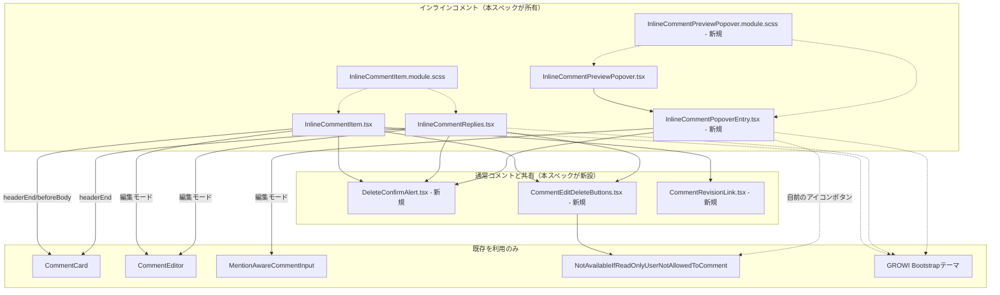

# Design Document

## このドキュメントに書くこと・書かないこと

この spec は「実装の記録」ではなく「次にこの機能を変更するときの出発点」である。判断に迷ったら、次の問いを使う——**その内容は、コードとテストファイルを読めば分かるか？** 分かるなら、ここには書かない。コードが変わった瞬間に黙って古くなり、ドキュメント全体の信頼を落とすためである。

| 書く | 書かない |
|---|---|
| 調べないと分からなかった事実（コードをざっと読んだだけでは分からない挙動、外部ライブラリの隠れた挙動） | 関数の引数と戻り値、ファイル構成図、「どのファイルに何が入っているか」 |
| 変わった設計を選んだ理由——とくに**試して退けた形と、退けた理由** | 素直な実装の素直な説明 |
| 自動テストでは捕まえられないこと（残っている穴） | どのテストが何をカバーしているかの一覧（テストファイルを読めばよい。一覧は腐る） |
| コードから再現できない手作業の確認手順（再現環境の作り方、どこを見るか、合否を分ける基準値） | 差分の有無、いつ実装したか、といったその時点かぎりの経過 |

**迷ったら書かない。**

## Overview

**目的**: `InlineCommentItem`／`InlineCommentReplies`（画面最下部の一覧）と `InlineCommentPreviewPopover`（本文中ポップオーバー）の見た目を、承認済みのデザインモックアップ（Artifact: https://claude.ai/code/artifact/d19799da-fedc-4687-ad14-24d134bc7e89）に合わせて刷新する。

**利用者**: インラインコメントを一覧・本文中で見る・操作するすべての人。

**影響範囲**: インラインコメントの3コンポーネントとその `.module.scss` に加え、通常コメントとの共通化のために `apps/app/src/client/components/PageComment/` 配下の数ファイルを変更・新設する。`InlineCommentService`・apiv3ルート・DTO・データモデルは一切変更しない。

### Goals
- 一覧アイテムの4状態（通常・編集・削除確認・解決済み）を Artifact `Main.dc.html` に忠実な見た目にする
- ポップオーバーの2状態（通常＋返信＋返信フォーム・編集）を Artifact `Popover.dc.html` に忠実な見た目にする
- 一覧アイテムの編集・削除操作を、通常コメントと同じ「ホバーで現れるアイコンのみ」の操作感に変える（配置は既存のヘッダー行に収める）
- 引用ブロックの見た目を一覧・ポップオーバー間で統一する
- 通常コメントとインラインコメントで、同じ役割の部品（削除確認の警告帯、編集・削除アイコンの組、編集モードのエディタ）を同じ実装に揃える
- GROWIの既存Bootstrapテーマ（意味付きユーティリティクラス）だけで実現し、新規のハードコード16進色・カスタムフォント指定を持ち込まない
- 実装完了の判定に、実ブラウザ（Playwright）でのスクリーンショット目視照合を含める

### Non-Goals
- 解決トグルの**仕組み**の変更（モックアップの「ピルをクリックしてトグル」案は不採用。「バッジ＋別ボタン」の形を維持する。ポップオーバーがバッジを表示しないのは「トグルの仕組み」ではなく「バッジの表示有無」の決定であり、この非目標とは別軸——Requirement 2.5）
- API・サービス・データモデルの変更（`packages/editor` の `codemirror-editor.ts` だけは例外。「エディタの初期値が復元されない不具合」を参照）
- 新しい受け入れ基準・機能の追加

## Boundary Commitments

### This Spec Owns

インラインコメント側:

- `InlineCommentItem.tsx`／`InlineCommentReplies.tsx`／`InlineCommentPreviewPopover.tsx` のJSXマークアップとクラス名
- `InlineCommentItem.module.scss`（既存）の拡張、および新規 `InlineCommentPreviewPopover.module.scss`
- 新規 `InlineCommentPopoverEntry.tsx` — ポップオーバー内の「1件のコメント表示」を担う、起点コメントと返信で共有するコンポーネント
- `PageView.tsx`／`InlineCommentBodyInteraction.tsx` の prop 配線（`remove`／`updateReply`／`removeReply`、およびコメント用レンダラーオプションの受け渡し）
- 上記に対応する `.spec.tsx` と、`playwright/20-basic-features/inline-comment.spec.ts` の視覚照合ブロック

通常コメントとの共通部品（両方から使う）:

- 新規 `PageComment/DeleteConfirmAlert.tsx`（+ `.module.scss`）— 削除確認の警告帯
- 新規 `PageComment/CommentEditDeleteButtons.tsx`（+ `.module.scss`）— 編集・削除アイコンボタンの組
- 新規 `PageComment/CommentRevisionLink.tsx` — リビジョン履歴リンク（`Comment.tsx` から抽出）
- 上記の導入に伴う `Comment.tsx`／`CommentControl.tsx`／`Comment.module.scss`／`PageComment.tsx`／`ReplyComments.tsx` の変更（削除確認の方式をモーダルからインライン警告帯へ、アイコンボタンを共通コンポーネントへ、`.page-comment-control` を絶対配置からヘッダー行のflowへ）
- `DeleteCommentModal/` ディレクトリの削除

`packages/editor`:

- `packages/editor/src/client/stores/codemirror-editor.ts` の `useCodeMirrorEditorIsolated`（このspecに限った例外。「エディタの初期値が復元されない不具合」を参照）

### Out of Boundary

- `InlineCommentService`、apiv3ルート4本（`update.ts`／`update-reply.ts`／`delete.ts`／`delete-reply.ts`）、DTO — 一切変更しない
- `CommentCard.tsx`、`NotAvailableForReadOnlyUser.tsx` — 既存のprops・振る舞いのまま利用する。中身は変更しない
- `_comment-inheritance.scss`（`%bg-comment`／`%user-picture`／`%comment-section`）— 変更しない。これらがすでに決めている値（投稿者アイコンの大きさ、カード左側の吹き出し風の飾り、カードの背景の濃さ）は、モックアップと違っていてもそのまま採用する（「モックアップ忠実度の適用範囲」参照）
- 通常コメントの編集フロー・権限判定 — 削除確認UI・アイコンボタン・リビジョン履歴リンクの共通化、および `.page-comment-control` の配置方式変更以外は触らない
- 一覧・ポップオーバー間での解決トグルUIの共通コンポーネント化 — `inline-comment-popover-refinement` の既存決定「解決トグルのマークアップを共有化しない」を維持する。解決トグルは各コンポーネントが自前のマークアップを持ったままにする
- `packages/editor` の `codemirror-editor.ts` 以外のファイル

### Allowed Dependencies

- `CommentCard`（既存）の `headerEnd`／`beforeBody`／`footer` スロット — **一覧側（`InlineCommentItem`／`InlineCommentReplies`）のみ**が使う。ポップオーバーは起点・返信とも `CommentCard` を使わない
- `CommentEditor`（既存、通常コメントの再編集が使うもの）— 一覧側の編集モードが使う。永続化は `onSubmit` の上書きで差し替える
- GROWIのBootstrapテーマ（`packages/core-styles`）が提供する意味付きユーティリティクラス（`badge`／`rounded-pill`／`bg-warning-subtle`／`bg-danger-subtle`／`bg-success-subtle`／`text-*-emphasis`／`btn-outline-secondary`／`btn-link`／`btn-close` 等、Bootstrap 5.3.8で実際に生成されることを確認済み）
- `material-symbols-outlined` アイコンフォント（既存、アプリ全体で読み込み済み）— `edit`／`delete` グリフ
- `_comment-inheritance.scss` の共有プレースホルダ（`%bg-comment`／`%user-picture`／`%comment-section`）— 既存の `@extend` をそのまま使う。新しいプレースホルダは追加しない

### Revalidation Triggers

- `CommentCard` のスロット構成（`headerEnd`／`beforeBody`／`footer`）が変わった場合、一覧アイテム・返信を再確認する（ポップオーバーは `CommentCard` に依存しないため対象外）
- `CommentCard` が生成するクラス名（`.page-comment`／`.page-comment-main`／`.bg-comment`）が変わった場合、`InlineCommentItem.module.scss` のホバー表示規則（`:global(.page-comment-main):hover` をトリガーにしている）と、一覧側の `.spec.tsx` の一部アサーションが壊れる
- `CommentEditor` の `onSubmit` の扱い（指定があれば `currentCommentId` の有無に関わらず優先される、という現在の契約）が変わった場合、一覧側の編集モードの永続化が壊れる
- `CommentEditDeleteButtons`／`DeleteConfirmAlert` の `testIdPrefix` の扱いが変わった場合、Playwright の全セレクタが壊れる
- GROWIのBootstrapテーマの `-subtle`／`-emphasis` トークンの実装が変わった場合（例: Bootstrapの将来のメジャーアップデート）、色の見え方を再確認する

## Architecture

### Architecture Pattern & Boundary Map

**分解の考え方**（どの部品がどこを持つか。ファイル一覧そのものはツリーを見れば分かるので書かない）:

- **一覧側は `CommentCard` の箱の中**。通常コメントと同じ箱に入っているという見た目上の意味があるため、スロット注入の構成を維持する。
- **ポップオーバーは `CommentCard` を使わない**。起点コメント・返信とも、ポップオーバー自身のフラットなマークアップで描く。
- **ポップオーバー内の1件のコメント表示は `InlineCommentPopoverEntry` が1つで持つ**。起点コメントと返信は、引用ブロック・ヘッダー行の追加要素（解決トグル・閉じるボタン）の有無だけが違い、それは props（`beforeBody`／`headerExtra`）で渡す。
- **編集中・削除確認中の状態は、表示している1件ごとのローカルstate**。ページ単位・コンポーネント単位の共有stateにしない。
- **共通部品はラッパーを持たない**。`CommentEditDeleteButtons` はボタンの組だけを描き、ホバーで出す仕組み（通常コメントは `.page-comment-control`、インラインコメントは `.icon-button-container`）は各呼び出し元が持つ。どちらもヘッダー行の `headerEnd` スロット内・`ms-auto` の flow に置く形で揃っているが、ラッパー自体（クラス名・testid接頭辞）は共通化しない。
- **呼び出し元ごとの `data-testid` は `testIdPrefix` プロパティで切り替える**。共通化しても既存のtestidが変わらないため、Playwright側の変更が要らない。

## 主要コンポーネントの責務と制約

### InlineCommentItem / InlineCommentReplies（一覧側）

| Field | Detail |
|-------|--------|
| Intent | 4状態の見た目をモックアップに合わせ、編集・削除操作をホバー表示アイコンにする |
| Requirements | 1.1-1.7, 3.1-3.5 |

- **リビジョン履歴リンク**: 共通コンポーネント `CommentRevisionLink`（`Comment.tsx` と共用、`apps/app/src/client/components/PageComment/`）。日時リンクの直後、`ms-2` で配置する（`headerEnd` の `ms-auto` グループには含めない——含めるとグループごと右端に押し出され、日時から離れてしまう）。
- **状態バッジ**: `badge rounded-pill bg-warning-subtle text-warning-emphasis`（未解決）／`bg-success-subtle text-success-emphasis`（解決済み）。先頭のドットは `::before` 疑似要素（`background-color: currentColor`）としてCSS Modulesで描き、tsx側にインラインstyleを書かない。ヘッダー行の `ms-auto` グループの一番右（カードの角）に置く——常時表示のこのアイテム自身の状態であり、操作ボタンではないため。
- **解決トグルボタン**: `btn btn-sm btn-outline-secondary rounded-pill`。`ms-auto` グループ内、編集・削除アイコンと状態バッジの間に置く。`.icon-button-container` でホバー表示にする（編集・削除アイコンと同じ挙動）。
- **編集・削除アイコン**: 共通コンポーネント `CommentEditDeleteButtons`（`testIdPrefix="inline-comment"`／`"inline-comment-reply"`）。`ms-auto` グループの一番左（本人にしか出ない）。
- **ホバーで出す仕組み**: `display` ではなく `visibility` を切り替える（非表示時にレイアウトシフトを起こさないため）。トリガーは `:global(.page-comment-main):hover`——つまり**各 `CommentCard` インスタンス自身の箱**であり、起点と返信スレッド全体を包む外側のラッパーではない。外側をトリガーにすると、アイテム内のどこにマウスを乗せても起点と全返信のボタンが一斉に出てしまい、通常コメントの「行ごとに独立」という挙動と食い違う。
- **削除確認**: 共通コンポーネント `DeleteConfirmAlert`（起点は `testIdPrefix="inline-comment"`、返信は `"inline-comment-reply"`）。モーダルは使わない。ボタンの並びは Cancel → Delete（アプリ内の他の削除確認すべてと同じ順序）。
- **引用ブロック**: 左罫は既存の `border-left: 3px solid var(--grw-inline-comment-marker-bg)`（黄色いハイライトマーカー色との統一）を維持し、`bg-body-tertiary rounded-end` で淡色背景を足す。
- **編集モード**: `CommentCard` ごと `CommentEditor` 単体に差し替える。編集中は `CommentCard` とそのスロットの中身（ヘッダー行・アバター・投稿者名・日時・状態バッジ・解決トグル・引用ブロック）がDOMから完全に消える。`CommentEditor` は自前のアバターを描くため、`CommentCard` を残したまま入れ子にすると画面にアバターが2つ（返信フォームのトグルを含めると3つ）並んでしまう。永続化は `onSubmit` の上書きで差し替える。
- **解決済み状態**: カード全体に `opacity-75`。

**状態管理**: 新しい状態は追加しない。ホバーの可視性はReactの状態を経由しない（CSSの `:hover` のみ）——余分な再レンダリングを避けるため。

### InlineCommentPreviewPopover / InlineCommentPopoverEntry（ポップオーバー側）

| Field | Detail |
|-------|--------|
| Intent | ポップオーバーの2状態の見た目をモックアップに合わせ、起点コメントと返信の仕様差をほぼ無くす |
| Requirements | 1.7, 2.1-2.3, 2.5-2.7, 3.1-3.4 |

- **`CommentCard` を使わない**。`headerEnd`／`beforeBody`／`footer` というスロット構成そのものが無く、ヘッダー行・引用ブロック・本文をポップオーバー自身のJSXで組み立てる。アバターは共有スタイル `%user-picture` ではなく、ポップオーバー独自のサイズ（30px、CSS Modulesの上書き）で描く。`UserPicture` の画像アバターはそのまま使う（モックアップのイニシャル表示には変えない）。
- **配色**: `Popover.dc.html` 自身の配色トークン（`--paper`／`--surface`／`--ink` 系）を、Bootstrapの意味付きユーティリティクラスで近似する。ハードコードされた16進色は使わない（要件3.1）。本体は `card rounded-4 shadow`、投稿者名は `fw-semibold`、日時は `text-body-secondary` 相当。
- **状態バッジを表示しない**（Requirement 2.5）。解決トグルボタンは残す。
- **起点コメントと返信は同じ `InlineCommentPopoverEntry` で描く**。違いは `beforeBody`（引用ブロック、起点のみ）と `headerExtra`（解決トグル＋閉じるボタン、起点のみ）だけ。編集・削除はどちらからもできる（Requirement 2.6）。
- **編集中・削除確認中は1件ごとに独立**。`isEditing`／`isDeleteConfirmOpen` は `InlineCommentPopoverEntry` のインスタンスごとのローカルstateなので、ある1件を編集中でも他の項目・返信一覧・返信フォームは表示されたままになる。ポップオーバー側に「編集中なら返信をまとめて隠す」ガードを置いてはいけない。
- **編集モードの入力欄**: `MentionAwareCommentInput` を `border border-primary rounded p-2` のアクセント枠で囲む（一覧側とは違い、`CommentEditor` には寄せない。ポップオーバーは表示領域が狭く、ツールバー・添付・プレビュータブを持つフルUIが収まらない）。
- **編集・削除アイコンは常時表示**（ホバー表示にしない）。ポップオーバー自体がホバー／クリックで一時的に出る要素であり、その中でさらにホバー待ちの操作を要求すると発見しづらくなる。この挙動差があるため、ポップオーバーは共通の `CommentEditDeleteButtons` を使わず、自前の `.inline-comment-preview-popover-icon-button` を持つ——意図的な重複である。
- **返信の表示順は古い順**。サーバー（`InlineCommentService.listByPageId()`）は `createdAt: 'desc'`（新しい順）で返し、表示順の決定は各利用側の責務になっている。一覧側（`InlineCommentReplies.tsx`）と同じく `[...comment.replies].reverse()` で古い順に直してから描く。
- **返信フォーム**: 起点コメント作成フォーム（`InlineCommentForm.tsx`）と同じ構成——アバター → `MentionAwareCommentInput` → メンションピッカーボタン＋送信ボタン——に、`border border-primary-subtle rounded p-2 gap-2` の枠を付ける。モックアップの1行ピル形状は採らない（Requirement 2.7）。
- **本文のレンダリング**: `RevisionRenderer` に `additionalClassName="comment"` を渡し、`.wiki.comment` のタイポグラフィを当てる。レンダラーオプションは、ページ本文用（`useViewOptions()`）ではなくコメント用（`useCommentForCurrentPageOptions()`）を `PageView.tsx` から渡す。コメント専用の改行設定と `@`メンションのハイライトがこちらにしかない。
- **外側クリックでポップオーバーを閉じる判定**: `popperElement.contains(target)` だけでは足りない。`MentionAwareCommentInput` のメンション自動補完ポップアップは `document.body` に portal されるため、候補をクリックするとポップオーバーごと閉じてしまう。`.cm-tooltip-autocomplete` を除外する（`InlineCommentForm.tsx` がすでに同じ理由で持っている除外）。

### モックアップ忠実度の適用範囲

この機能が新しく持ち込む・作り直す要素——状態バッジ、引用ブロック、編集・削除アイコンボタン、削除確認帯、編集モードの入力欄、返信フォーム——は、モックアップに忠実にする。

一方、`CommentCard`・共有スタイル（`_comment-inheritance.scss`）がすでに決めている以下の見た目は、モックアップと異なっていても既存の値をそのまま採用する。**上書きも部分的な変更もしない**:

| 要素 | 既存の値 | モックアップの値 | 扱い |
|---|---|---|---|
| 投稿者アイコンの大きさ | `%user-picture { width: 1.2em; height: 1.2em; }`（本文16px基準で約19px） | 30px（返信・返信フォームは22〜26px） | 既存の値のまま |
| カード左側の吹き出し風の飾り | `%comment-section::before` の三角形 | 描画なし | 既存の値のまま。飾りは残る |
| カードの角の丸み | Bootstrap既定 `--bs-border-radius`（6px） | 12〜14px | 既存の値のまま |
| カードの背景色の濃さ | `%bg-comment` | モックアップ独自の配色 | 既存の値のまま |

この切り分けにより、共有スタイルへの変更は文字通りゼロ件になる。トレードオフとして、投稿者アイコンはモックアップより小さく、カードには吹き出しの飾りが残った状態で仕上がる——実装のミスではなく、意図した仕様である。なおポップオーバーはこの表の対象外（`CommentCard`・共有スタイルを使わないため、アバターは独自に30pxにしている）。

## 設計判断（採用した形と、退けた形）

### 編集・削除アイコンは「視覚パターンを踏襲し、配置はヘッダー行のflowに揃える」

- **退けた形（当初）**: 通常コメント（`CommentControl.tsx`）とまったく同じ絶対配置（`position: absolute; top: 0; right: 0`、カード右上コーナー）にする
- **採った形**: アイコン・ボタンクラス・ホバー切り替えという視覚パターンを踏襲し、配置はヘッダー行の `headerEnd` スロット内・`ms-auto` の通常のflexフローにする
- **理由（当初）**: 一覧アイテムのヘッダー行にはすでに状態バッジ・解決トグルボタンがあり、これは通常コメントに存在しない要素である。右上コーナーに絶対配置すると、これらと重なるかレイアウトが崩れる
- **後日談**: 通常コメント側の `position: absolute` は、CSSの仕様上、包含ブロックの**パディング辺**を基準に配置され親自身のパディングを無視するため、カードの角にぴったり張り付いてしまう不具合だと判明し、通常コメント側も `headerEnd` の `ms-auto` flow に変更した（ユーザー報告）。結果として、当初「一覧側だけの事情」だった配置方針が、両サーフェスの共通パターンになった
- **トレードオフ**: 現在は解消——グリフ・寸法（32px四方）・不透明度（0.5、ホバーで0.75）に加えて、パディングの尊重のされ方も揃っている

### ポップオーバーの編集ボタンはホバー表示にしない

- **退けた形**: 一覧アイテムと完全に統一してホバー表示にする
- **採った形**: 常時表示のアイコンボタンのまま
- **理由**: ポップオーバー自体がホバー／クリックで一時的に表示される要素であり、その中でさらにホバー待ちの操作を要求すると発見しづらくなる。承認済みモックアップ（`Popover.dc.html`）も編集ボタンを常時表示で描いている

### 通常コメントとインラインコメントのコンポーネントは統合しない

- **退けた形**: `InlineCommentItem.tsx` と `Comment.tsx` を1つのコンポーネントにまとめる
- **採った形**: 統合せず、重複していた**部品**だけを共通化する（削除確認の警告帯、編集・削除アイコンの組、編集モードのエディタ）
- **理由**: ヘッダー行の中身が本質的に異なる（解決トグル＋状態バッジ vs リビジョン履歴リンク）。無理に1つにまとめると「インラインかどうかで分岐する巨大コンポーネント」になり、coding-style の「モード分岐を消費側に持たない」方針にも反する
- **トレードオフ**: 2つのコンポーネントが残るため、片方だけを変更して挙動がずれる余地は残る。実際このspecの作業中に、不透明度・寸法・ホバーの出方・編集モードのDOM構造が、それぞれ別のタイミングでずれているのが見つかっている

### ホバーで不透明度を濃くする挙動は、ユーティリティクラスでは書けない

- Bootstrapには、`.link-*` 系に紐づく `.link-opacity-*-hover` 以外に、通常の要素向けの「ホバーで不透明度が変わる」汎用ユーティリティが存在しない
- さらに既存の `opacity-50` ユーティリティは `!important` 付きなので、素の `:hover` 規則では勝てない
- そのため `opacity: 0.5` ／ `&:hover { opacity: 0.75; }`（Bootstrap自身の `.btn-close` が使う `$btn-close-opacity`／`$btn-close-hover-opacity` と同じ値）をCSS Modulesに直接書き、`opacity-50` は呼び出し側から外した

### 引用ブロックを共有コンポーネントにしない

- **退けた形**: 一覧とポップオーバーの引用ブロックを1つの共有Reactコンポーネントに切り出す
- **理由**: 差分は数行のCSS規則にとどまり、新しい抽象を1つ増やすコストに見合わない

### エディタの初期値が復元されない不具合（`packages/editor`）

編集モードに入っても入力欄に既存の本文が入らない、という不具合。根本原因は `packages/editor/src/client/stores/codemirror-editor.ts` の `useCodeMirrorEditorIsolated` にあり、この機能のファイルではなかった。

- **原因1**: `shouldUpdate` の判定が、そのフックインスタンスからの**最初の発行**のときだけ `isValid(newData)` のチェックを素通りしていた。CodeMirrorの `view`／`state` は非同期に初期化されるため、コンテナが着いた直後の再レンダーでは `newData` が無効なことがある。その無効な値が共有atomに入ってしまう。`MentionAwareCommentInput` 側は「`codeMirrorEditor` が非nullになったら一度だけ `initDoc` を呼び、呼んだかどうかに関わらず二度と呼ばない」設計なので、この空振りが唯一のチャンスを使い切ってしまう。**直し方**: `isValid(newData)` を最初の発行でも省略しない。
- **原因2**（原因1を直しても、同じコメントを「キャンセル→再度開く」と再発した）: `editorKey` ごとのJotai atomがアンマウント時に消えないため、再マウント直後の最初のレンダーが「前回の、すでに破棄されたエディタ」を見てしまう。**直し方**: 発行側（publisher）のインスタンスがアンマウントしたときにatomをリセットする。ただし読み取り専用の利用者（`container` を渡さずにフックを呼ぶ `MentionAwareCommentInput` 自身）が、生きているエディタを消してしまわないよう ref でガードする。
- **影響範囲**: この関数は `@growi/editor` を使う全ての呼び出し元（ページ本文エディタ含む）に効く。変更する場合は、インラインコメントの編集モード・新規コメント作成フォーム・ページ本文エディタの3つを実ブラウザで確認すること。
- **確認は「2回目」で止めない**。原因2は1回目の開閉では出ない。最低3回開き直して確認する。

## 既知の制約

- **編集中は `CommentCard` ごと消えるため、`CommentCard` の余白に頼っていた間隔も一緒に消える。** 通常コメントの下に並ぶ「返信する」トグルボタンは、以前は直前のコメントの `.page-comment-main` が持つ `mb-2` だけで間隔ができていた。編集中は `CommentCard` がアンマウントされるため、この間隔が0になってボタンと入力欄が接してしまう。**後続要素が自分で `mt-2` を持つ**ようにして直してある（`PageComment.tsx`）。通常時は隣接するブロックのマージンが相殺される（どちらも0.5remなので大きい方＝0.5remになり、足し算にはならない）ので見た目は変わらない——**一見すると冗長に見えるが、消すと編集中の間隔が失われる。**
- **二重送信のガードが無い。** `MentionAwareCommentInput` を使う4箇所（作成フォーム・起点編集・返信編集・返信フォーム）のいずれも、送信中の再クリックを防いでいない。この機能全体で共通の既存の穴で、本specが持ち込んだものではない。直すなら `MentionAwareCommentInput` 自身に1箇所実装するのが筋が良い。
- **編集モードの入力欄（CodeMirror）はダークモードでも背景が白い。** インラインコメント固有ではなく、GROWIのコメント入力欄全体の挙動（通常のページコメントでも同じ）。文字は白地に濃い文字（コントラスト比約13）で読める。直すには共通のエディタ配色に手を入れる必要がある。
- **削除に失敗した後、確認帯を開き直しても `deleteError` がリセットされない。** `Comment.tsx` と `InlineCommentItem.tsx` の両方に同じ穴がある（前者は共通パターンを取り込んだ結果として引き継いだ）。直すなら、確認帯を開くときに `setDeleteError(undefined)` を両方に入れる。
- **`packages/editor` には `test` スクリプトが無い**ため、同パッケージのspec（このspecが追加した回帰テスト2件を含む）はCIで走らない。
- **ポップオーバーの横幅はモックアップの340pxではなく576px。** ヘッダー行にアバター・投稿者名・日時・編集/削除アイコン・解決トグル・閉じるボタンが入り、文字サイズ16px基準で約470px必要になる。544pxを下回るとヘッダー行の要素が黙って切れる。モックアップの340pxは実際の内容量を反映していない仮の値と判断し、実測必要幅を正とした（ユーザー承認済み）。
- **保存ボタンの文言は "Update"**（モックアップは "Save"）。このコードベースに汎用の "Save" 翻訳キーが無く、既存の慣習が `t('Update')` であるため（例: `SavePageControls.tsx`）。新しいキーは追加していない。

## 検証

自動テストが担保する範囲（各コンポーネントの `.spec.tsx`、`inline-comment.spec.ts` の視覚照合ブロック）は、テストファイル自身を読むこと。ここには、コードから再現できない手順・注意点だけを書く。

### 見た目の照合手順

`visual-acceptance-checklist.md` の項目を、実際に起動した開発サーバー上でPlaywrightにより撮影したスクリーンショットおよび実測値（`getBoundingClientRect()` と `getComputedStyle()`）と1つずつ突き合わせる。「大きく崩れていないか」という粗い確認では代替しない。ライトモード・ダークモードの両方で行う（ダークモードは `<html>` に `data-bs-theme="dark"` を書いて切り替える。GROWIが `next-themes` に設定しているのと同じ属性名）。

最終確認は、実装したエージェント自身ではなく独立したレビューで行う（Requirement 4.6）。その際、各タスクが引用した design.md の箇条書きの部分集合ではなく、**コンポーネントごとの責務・制約の一覧全体**と現在のコードを突き合わせること——タスクの説明文がたまたま触れていない要件は、タスク単位のレビューを何度通しても実装されないまま通ってしまう（実際に2件そうなった）。

### Playwrightの罠（知らないと product のバグに見える）

- **視覚照合ブロックは `--project=chromium` に絞って実行する。** 既定では `chromium`／`firefox`／`webkit` の3プロジェクトが並列実行され、3つとも同じ固定ページパスを作りにいって `createPage failed: 400` で競合する。
- **`-g "<個別のテスト名>"` で1件だけ再現しようとしない。** ページを作る処理が別の `test()` になっているため、名前で絞ると前提のページが作られず、対象のテストは `inline-comment-ready` の待機で必ず落ちる。これは製品のバグにしか見えないが、バグではない。絞るなら `describe` のタイトルで絞ること。
- **セレクタが解決できなくても撮影スイートは落ちない。** 実測値を集める処理は、見つからないセレクタを例外にせず素通りする。マークアップを変えたときは、生成された `.json` に当該キーの値が入っているかを必ず確認する（値が空のまま緑になり、証拠が静かに空になる事故が2回起きている）。
- **開発サーバーを相手にファイル全体を1回流した結果を最終判定に使わない。** この環境では、このspecが触っていない `describe` ブロックが実行のたびに違う箇所で落ちる（ポップオーバーの表示待ちか `inline-comment-ready` のタイムアウト）。`describe` ブロック単位で流した結果を信号にすること。
