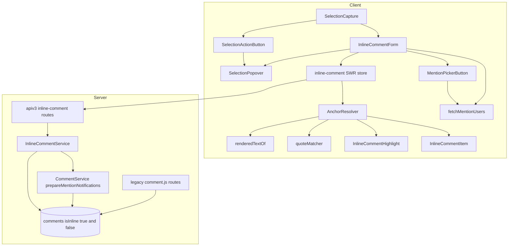
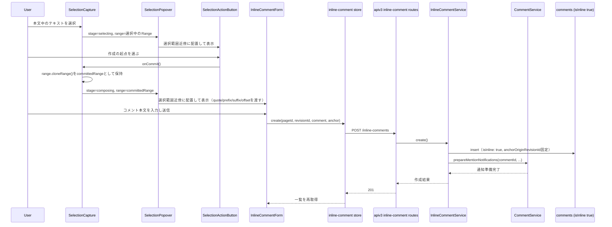
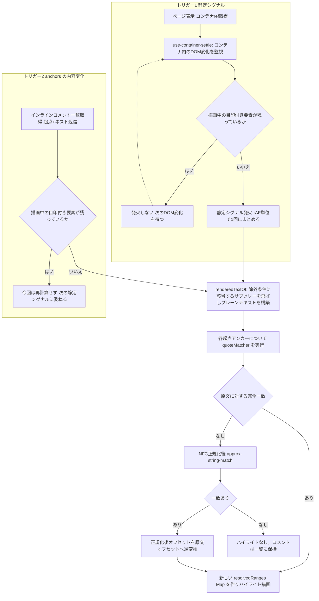
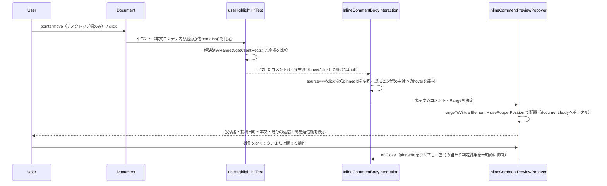
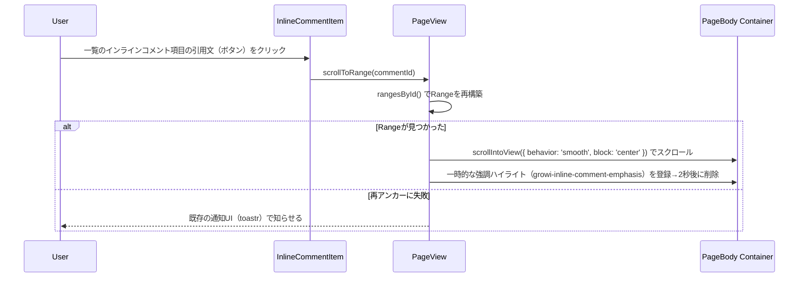

# Technical Design: inline-comment

## Overview

インラインコメント機能は、ページ本文の読み取り専用ビュー（`RevisionRenderer.tsx` がレンダリングした結果）に対して、閲覧者が選んだテキスト範囲を対象としたコメントを作成・閲覧できるようにする。位置情報はDOM XPathやmarkdownソースの文字オフセットではなく、レンダリング後のプレーンテキストに対する「選択文字列（exact quote）＋前後文脈（prefix/suffix）＋おおよそのオフセット」（W3C Web Annotation Data Model の TextQuoteSelector/TextPositionSelector 相当）として保存し、表示のたびにクライアント側で再検索してハイライトを復元する。

**Users**: ページ閲覧者・編集者が、本文の特定範囲について議論するために利用する。
**Impact**: 既存のページ末尾コメントスレッド（`apps/app/src/features/comment/`、`/_api/comments.*`）の**投稿・編集・削除・通知の挙動は変更しない**。データは既存の `comments` Prisma/Mongooseモデルに新しいフィールドを追加する形で共存させ、新しい種類の行（インラインコメント）を区別するための識別フィールドを1つ追加する。既存の一覧取得（`/_api/comments.get`）には、この新しい種類の行を結果から除外するフィルタを追加する（これは既存機能の挙動変更ではなく、新しいデータ種別が増えたことに伴う最小限の対応）。既存の `RevisionRenderer.tsx` に対する変更は「コンテナへのref転送」1点のみに限定する。本文レンダリング用コンポーネントのうち `Header.tsx`／`TableWithEditButton.tsx`／`DrawioViewerWithEditButton.tsx` の3つには、条件付き表示の編集ボタンのアイコン要素へ `aria-hidden="true"` を付与する変更が入る（本文テキストの抽出範囲を安定させるための標準属性の付与であり、これらのコンポーネントの表示条件・振る舞い・見た目は変えない）。既存の `PageView.tsx` に対する変更は、そのrefを本文コンテナまで橋渡しする配線と、この機能のクライアントコンポーネント3つ（`SelectionCapture`／`InlineCommentHighlight`／`InlineCommentBodyInteraction`。いずれも `next/dynamic(..., { ssr: false })` 経由）およびフック2つ（`useAnchorResolver`／`useSWRxInlineComments`）の組み込みで構成される（タスク5.2）。`InlineCommentForm` はこの一覧に含まれない——`SelectionCapture` の内部で描画される子コンポーネントであり、`PageView.tsx` が直接組み込むわけではない。また `PageView.tsx` には、この配線とは別にもう1点、既存の不具合修正が入っている——本文サブツリーが `useCallback` を要素の型として使っていたため、依存が変わるたびに（本機能が加えたアンカー再計算の依存を含め）サブツリー全体が再マウントされてしまう問題があり、`useMemo` で値をレンダーする形に直した（経緯は tasks.md の Implementation Notes と `PageView.tsx` 内のコメントを参照）。

### Goals
- 文字単位で選択したテキスト範囲にインラインコメントを作成・表示できる（1.1–2.6）
- インラインコメントへの返信をスレッドとして持てる（1.8–1.9）
- 本文編集後もベストエフォートで対象範囲を再アンカーし、失敗時はハイライトなしでコメントを保持する（5.1–5.5）
- 既存のメンション通知・ハイライト機構をそのまま再利用する（3.1–3.2）
- 解決/未解決を管理できる（4.1–4.5）
- 共有リンク閲覧者にインラインコメント（起点・返信とも）の内容が一切返らないことを保証する（6.1–6.3）

### Non-Goals
- インラインコメント（起点・返信とも）の編集・削除
- エディタ（Yjs共同編集セッション）内でのインラインコメント作成・表示
- 共有リンク経由でのインラインコメント閲覧・作成
- @メンション機能自体の変更

## Boundary Commitments

### This Spec Owns
- 既存 `comments` Prisma/Mongooseモデルへの拡張フィールド（`isInline`／アンカー4項目／`anchorOriginRevisionId`／`resolvedById`／`resolvedAt`）と、それらが `true` である行（インラインコメントのスレッド。起点・返信とも）に対する作成・一覧取得・解決トグルを提供する新規 `apiv3` ルート（`/_api/v3/inline-comments*`）
- クライアント側のテキスト選択キャプチャ、アンカー計算（quote/prefix/suffix/おおよそのオフセット）、表示時の再アンカー（完全一致→あいまい一致→ハイライトなし）、ハイライト描画
- 解決/未解決状態とその操作者・日時の記録（起点コメントのみが状態を持つ）
- 既存の一覧取得（`/_api/comments.get` が使う `findCommentsByPageId`／`findCommentsByRevisionId`）から `isInline: true` の行を除外するフィルタの追加（後述の通り、これは共有リンクかどうかによらず常に適用する）

### Out of Boundary
- 既存コメント（`isInline` が `true` でない行）の投稿・編集・削除・通知に関する**挙動**の変更 — 既存の呼び出し元から見た振る舞いは変わらない
- インラインコメント（起点・返信とも）の編集・削除
- エディタ（Yjs共同編集セッション）内でのインラインコメント作成・表示、CodeMirror/Yjsのドキュメントモデルやawareness機構への変更
- 共有リンク経由でのインラインコメント閲覧・作成
- 本文レンダリングパイプライン（rehype/remarkプラグイン構成、`generateViewOptions`）自体の変更。`RevisionRenderer.tsx` へのref転送以外、レンダリングパイプラインには一切触れない。本文レンダリング用コンポーネントのうち、条件付きで表示される操作ボタンのアイコン要素に `aria-hidden="true"` を付与する3ファイル（`Header.tsx`／`TableWithEditButton.tsx`／`DrawioViewerWithEditButton.tsx`）のみ例外とする——これは標準属性の付与であり、表示条件・クリック時の振る舞い・見た目はいずれも変更しない（後述「本文テキストの抽出範囲」参照）
- 解決済みオフセットの永続キャッシュ（設計の簡素化として意図的に見送り。詳細はArchitecture節参照）

### Allowed Dependencies
- 既存 `comments` Prisma/Mongooseモデルへの直接的なフィールド追加。`.claude/rules/model.md` の通り、Mongooseスキーマ（`apps/app/src/features/comment/server/models/comment.ts`）と `apps/app/prisma/schema.prisma` の両方を同期させる
- 既存の `replyToId` フィールドと、返信のネスト構造を返す取得パターン（既存クライアントの `ReplyComments.tsx` が確立した表示パターンを参考にする）
- `crowi.commentService.prepareMentionNotifications`（`apps/app/src/server/service/comment.ts`）— メンション通知経路の再利用。同一 `comments` テーブル・同一 `comment_id` 空間を使うため、**変更なしでそのまま呼び出せる**
- `apps/app/src/interfaces/activity.ts` の `SupportedAction` — 新しい `ACTION_INLINE_COMMENT_*` 定数を追加する
- 既存 `apiv3` ミドルウェアチェーン（`accessTokenParser` → `loginRequired` → express-validator → `apiV3FormValidator` → `res.apiv3()`/`res.apiv3Err()`）、`revision-diff` フィーチャーモジュールが確立した構成規約（`interfaces/` + `server/{service,routes}`）
- 外部ライブラリ `approx-string-match`（新規直接依存、あいまい一致の実装に採用。選定理由は後述）
- `RevisionRenderer.tsx` が転送するコンテナDOM要素への参照（新規に追加する、この設計唯一のレンダリングパイプライン変更点）
- `GROWI_IS_CONTENT_RENDERING_ATTR`/`GROWI_IS_CONTENT_RENDERING_SELECTOR`（`@growi/core/dist/consts`）— [auto-scroll](../auto-scroll/) スペックが確立した「レンダリング状態属性プロトコル」を静定検知にそのまま再利用する（後述）。drawio・mermaid・plantUML・lsxはこのプロトコルに既に参加している

### Revalidation Triggers
- `comments` Prisma/Mongooseスキーマの構造変更、特に `isInline` の意味・型・デフォルト値の変更
- `findCommentsByPageId`／`findCommentsByRevisionId` のシグネチャ変更（インラインコメント除外フィルタの実装箇所）
- `getMentionedUsers`（`prisma.comments.findUnique` を直書き）のクエリ対象コレクションが変わる場合
- `SupportedAction` の値の削除・リネーム
- `RevisionRenderer.tsx` のprops・DOM構造の変更（refの転送方法に影響する場合）
- [share-link-comments](../share-link-comments/) の認可モデル変更（`certify-shared-page.js`／`req.isSharedPage` の意味が変わる場合）
- `GROWI_IS_CONTENT_RENDERING_ATTR` プロトコルに参加するコンポーネントの追加・変更。添付ファイル埋め込み（Ref/Refs/RefImg/RefsImg/Gallery、RichAttachment）は [auto-scroll](../auto-scroll/) スペックの時点でこのプロトコルへの参加が見送られており、これらを含むページでは埋め込みの内容が確定する前のテキストに対してマッチングが走ることがある。埋め込みが確定する際のDOM変化そのものは静定シグナルを発火させるため（後述 `use-container-settle`）、その変化が監視期間（マウント時点から10秒）の内側で起きれば、誤ったマッチング結果はその発火による再計算で自己修復する。ただしこれらの埋め込みはレンダリング状態属性プロトコルに参加しておらず、確定までの時間はネットワーク次第であるため、監視期間の内側に収まる保証はない。監視期間を過ぎてから確定した場合はハイライトのズレがページを開き直すまで残るため、残存するリスクとして扱う
- 静定シグナルの発火条件（`use-container-settle` が「描画が落ち着いた」と判定する条件）が変わる場合、`useAnchorResolver` の再計算タイミング全体に影響する
- `renderedTextOf` の除外条件（`.katex` または `aria-hidden="true"`）が変わる場合、その変更以前に作成されたアンカーの再アンカー成否に影響しうる。KaTeX（数式）のDOM出力構造（`.katex` クラス）が変わる場合も同様に前提が崩れる
- `.wiki` 配下に、条件付きで表示される操作用の画面要素（アイコン用の素のテキストノードを持つもの）が新たに追加された場合、同じ `aria-hidden="true"` の付与を横展開する必要がある
- `_comment-inheritance.scss` の `%bg-comment`／`%comment-section`／`%user-picture` の中身が変わったとき（通常コメントの箱とインラインコメントの箱の両方が同時に変わる、共有の抽象のため）
- `packages/core-styles/scss/bootstrap/theming/_root.scss` のprimary/secondary限定の絞り込みが外れたとき（`--bs-warning-*` 等がテーマ対応になれば、専用のカスタムプロパティを持つ理由が薄れる）
- `Comments`／`PageComment` の呼び出し元が増えたとき（共有リンク画面（`ShareLinkPageView.tsx`）に `inlineComments` が渡らないことを再確認する。取得は `PageView.tsx` 側の1箇所に閉じており、`Comments`／`PageComment` 自身はインラインコメントを取得しない）

## Architecture

### Existing Architecture Analysis

- `comments` Prisma/Mongooseモデルは既存の通常コメント専用であり、`commentPosition`（常に`-1`）は事実上未使用。インラインコメントの位置情報の土台にはしない（`.kiro/specs/inline-comment/brief.md` で確定済み）。新設するアンカーフィールドは `commentPosition` とは独立した新しいフィールド群である。
- `apps/app/prisma/schema.prisma` には、Mongooseからの移行に伴う機械的な `Json` フィールドは存在するが、意図的に設計された構造化フィールドの前例はない（`research.md` 参照）。本設計ではアンカーの各要素を独立したスカラーフィールドとして宣言し（`Json` にまとめない）、既存スキーマの一貫したフィールド宣言スタイルに合わせる。

### アーキテクチャ選定：既存 `comments` モデルへの拡張＋新規ルート（設計レビューでの転換）

設計レビュー時点では、共有リンク閲覧者への非公開（要件6）を構造的に保証しやすいという理由で、インラインコメント専用の新規Prismaモデルへ分離する案を採用していた。その後、ユーザーとの設計レビューで次の2点の指摘を受け、方針を転換した。

1. **既存の `comments` モデルに同居させても、`/_api/comments.get` を「共有リンクのときだけ」ではなく「常に」インラインコメントを除外するようにすれば、要件6は単純な1本のルールで満たせるのではないか**（`isSharedPage` に依存する条件付きフィルタではなく、無条件フィルタにする）
2. **インラインコメントにも返信（スレッド化）を持たせたい**というユーザー需要があり、これは既存の `replyToId` の仕組みをそのまま使えば追加コストなしで実現できる

この指摘は妥当と判断し、方針を転換した。ただし、正直に言うと、この転換は**トレードオフの選び直し**であり、以前の設計が持っていた性質を無条件に上回るものではない：

- 新規モデルに分離する案の「共有リンク閲覧者へ返さない」という保証は、**物理的に別のコレクションであり、そこへ到達する経路（ルート）自体が存在しない**という意味で構造的だった。
- 本設計（同居＋無条件フィルタ）の保証は、**`/_api/comments.get` が使う2つの取得メソッド（`findCommentsByPageId`／`findCommentsByRevisionId`）の中にある1本の `WHERE` 条件**に依存する。これは「誰も削除・回避してはいけないルール」であり、コレクションが存在しないこととは性質が異なる。
- この2つのメソッドは通常コメントの唯一の読み取り経路であり、他に `comments` テーブルを読む経路を新設しない設計（本スペックの新規ルートは、常に `isInline: true` を明示的に指定してクエリする）にすることで、フィルタが必要な箇所を「この2メソッドの中だけ」に閉じ込めている。**条件が `isSharedPage` に依存しない（共有リンクの有無にかかわらず常に適用される）**ことが、以前のOption A/C案（`isSharedPage` 分岐の中だけにフィルタを足す案）との重要な違いであり、これによって「新しい呼び出し元がフィルタを書き忘れる」リスクの大部分は残るものの、「既存の `isSharedPage` 分岐が特別扱いを必要とする」という以前のリスクは解消されている。
- この保証をテストで固定する：`/_api/comments.get` が `isInline: true` の行を一切返さないことを、共有リンク文脈・通常文脈の両方について結合テストで検証する（Testing Strategy参照）。このテストが、ルールが将来壊れていないことを継続的に保証する仕組みになる。
- **正確に言うと、`comments` テーブルには `findCommentsByPageId`／`findCommentsByRevisionId` 以外にも読み取り経路が複数ある**（`getMentionedUsers` の `findUnique`、`comment.js` の更新・削除前 `findUnique`、`countCommentByPageId` 等）。このうち `/_api/comments.get` のレスポンスに直接影響するのは前者2メソッドのみだが、`countCommentByPageId`（ページ末尾コメントの件数バッジに使われる）もフィルタ漏れの対象になる——直さないと、インラインコメントの件数が通常コメントの件数バッジに混入してしまう（セキュリティ上の漏洩ではないが、利用者に見える不具合）。この設計では `countCommentByPageId` にも同じ `isInline: { not: true }` 条件を追加する。`getMentionedUsers` の `findUnique` は単一IDを指定した取得であり、一覧やカウントには影響しないため対象外（メンション通知はインラインコメントの行に対しても正しく動作する必要があるため、ここはむしろフィルタを入れてはいけない）。

この性質の違いを踏まえてもなお同居案を選んだ理由は、**返信の再利用**と**メンション通知の変更不要**という具体的な利益が、保証の強さの違いを上回ると判断したためである：

- 返信は既存の `replyToId` フィールドと、既存クライアントが確立した「ネストした返信一覧」の表示パターン（`ReplyComments.tsx`）をそのまま使える。新しいスキーマや新しいAPIを発明する必要がない。
- `getMentionedUsers`（`prisma.comments.findUnique` を直書き）の一般化が不要になる。同じテーブル・同じ `comment_id` 空間なので、変更なしでそのまま動く。
- 副作用として、`resolvedById`/`resolvedAt` が通常コメントの行に対して常に `null` の列として現れることは受け入れる（軽微な弊害として認識した上での判断）。

### データ所有権の分割（同一テーブルの明示的な分担）

`comments` テーブルを既存コメント機能と本スペックの両方が書き込む形になるため、**責務の境界を明示する**（`.claude/rules/coding-style.md` の「隠れた共同所有を作らない」原則に対応）：

- **`isInline` フィールドが唯一の判別子。** 既存コメント機能（`comment.js`、`CommentEditor.tsx` 等）は `isInline` を常に `false`（省略時のデフォルト）で書き込み、`isInline: true` の行を作成・更新することはない。本スペックの新規ルートは常に `isInline: true` を明示して書き込み、`isInline` が `false`／未設定の行を作成・更新することはない。
- **起点コメント（アンカーを持つ）と返信は、どちらも `isInline: true`。** アンカー4フィールド（`quote`/`prefix`/`suffix`/`approxOffset`）と `anchorOriginRevisionId`／`resolvedById`／`resolvedAt` は起点コメントにのみ値を持ち、返信では常に `null`。「このコメントがどのスレッドに属するか」は `isInline` で、「起点か返信か」は `replyToId` の有無で判定する（既存コメントの返信判定と同じロジックを流用できる）。
- **既存の読み取り経路（`findCommentsByPageId`／`findCommentsByRevisionId`）は `isInline: true` の行を常に除外し、本スペックの新規読み取り経路は `isInline: true` の行のみを対象にする。** 2つの経路が同じ行を返すことはない。

### レンダリングパイプラインへの意図的な非依存（クライアント側マッチング）

2023年当時のB案（`data-line` 機構を文字オフセットまで拡張する案）は、brief.mdの時点で「(a) 読み取りパス全体へのレンダリングパイプライン変更が必要」「(b) sanitizeより前の段階に新しいhastウォーカーを差し込む必要があり本文レンダリングの他機能にも影響しうる」という理由で却下されている。本設計もサーバー側でレンダリング済みプレーンテキストを取得する案（SSR中に抽出する案）を検討したが、以下の理由で同じ却下理由に該当すると判断し、採用しなかった：

- `PageContentRenderer` は `{ ssr: true }` でサーバーレンダリングされる（`PageView.tsx`）が、本文中の `lsx`（子ページ一覧）ブロックは `packages/remark-lsx/src/client/` 配下のSWRフックによって**クライアント側でのみ**解決される。サーバーが構築するAST由来のプレーンテキストは、閲覧者が実際に見るテキストと一致しない。
- したがって、アンカーの計算・再検索は**クライアント側で、レンダリング（および非同期ウィジェットの解決）が完了した後のDOMに対して**行う。
- GROWIには「非同期にレンダリングされる要素が今も描画中かどうか」を判定する既存の共通プロトコルが既にある：`GROWI_IS_CONTENT_RENDERING_ATTR`（`data-growi-is-content-rendering`、`@growi/core/dist/consts`）を描画中の要素に `"true"` として立て、完了時に `"false"` に落とすという規約で、`drawio`・`mermaid`・`plantUML`・`lsx` が既にこのプロトコルに参加している（[auto-scroll](../auto-scroll/) スペックで確立・整理済み）。本設計はこれを**そのまま**「静定検知」に再利用する（後述の `use-container-settle`）。これにより、非同期ウィジェットの内容を独自に「除外対象」として一覧管理する必要がなくなる——描画完了を待ってからテキスト抽出すれば、`lsx`/`drawio`/`mermaid` の出力も他の本文と同様にアンカーの対象に含めてよい。

### 本文テキストの抽出範囲（除外条件と単一の情報源）

「この本文コンテナに今どんな文字が存在するか」を定義する処理は `renderedTextOf`（`services/rendered-text.ts`）**1箇所だけ**であり、コメント作成時（`use-text-selection` の `captureSelection`）とハイライト解決時（`useAnchorResolver`）は同じ関数を通して同じ答えを得る。一本化の対象は本文テキスト（`fullText`）と位置（`startOffset`／`endOffset`／`approxOffset`）であり、`quote` は選択時の原文をそのまま保持する（要件1.4。この違いから生じる帰結はSystem Flowsの「フロー上の決定事項」を参照）。作成時に保存する `approxOffset` と、解決時に `quote-matcher` へ渡す本文テキストが同一の座標系に乗るのはこの一本化によるものであり、除外条件が将来変わっても両方の呼び出し元に自動的に反映される。この性質を満たすため、`renderedTextOf` は「テキストオフセット→DOM位置」（`resolveDomPosition`）と「DOM境界点→テキストオフセット」（`textOffsetOf`）の双方向の変換を提供する。

除外するサブツリーは次の2条件のOR（`isExcludedRoot`）で判定する：

- **`.katex` クラスを持つ要素**（数式）。KaTeXはアクセシビリティ用の `.katex-mathml` とビジュアル表示用の `.katex-html` を並べて出力する二重構造のため、そのまま数えると数式の文字が重複・破綻する
- **`aria-hidden="true"` を持つ要素**。「装飾であって内容ではない」ことを表す標準の宣言的な印である。たとえば見出し・表・draw.io図に付く編集ボタンのアイコンは、DOM上は Material Symbols のリガチャ名（`edit_square` など）という素のテキストノードとして存在し、その有無は共同編集データの読み込み進捗といったインラインコメントとは無関係なクライアント側の状態で切り替わる。これを本文テキストに含めると、同じページでも読み込みの進み具合によって前後文脈・位置の数え方が変わってしまう

除外すべき対象の知識は、除外する側（`renderedTextOf`）がセレクタを列挙するのではなく、**除外されるべき要素を持つ側**が `aria-hidden="true"` を付けることで表明する（`.claude/rules/coding-style.md` の「実行する側で個別分岐せず、宣言された集合を参照する」原則）。これにより、同じ形の要素が今後どの機能で増えても `renderedTextOf` は変更不要であり、付与する側も `inline-comment` フィーチャーへの依存を持たない。

`lsx`/`drawio`/`mermaid` の出力は除外しない——上記のレンダリング状態属性プロトコルで静定を待ってから抽出するため、他の本文と同様にアンカーの対象に含めてよい。コードブロックも同期的・決定的にレンダリングされるため除外しない。

### 解決済みオフセットキャッシュを持たない判断

brief.mdの討論メモは「再アンカーに成功した場合の解決済みオフセットを、アンカー起点リビジョンIDとは別の場所にキャッシュする」ことに触れているが、`requirements.md` の要件5（5.1–5.5）にはキャッシュ永続化を求める受け入れ基準は存在しない。持続的なキャッシュを実装すると、(a) 新しい永続フィールド、(b) リビジョン一致判定によるキャッシュ無効化ロジック、(c) 本文編集直後に複数閲覧者が同時に閲覧した場合の再計算競合、という3つのコストが生じる一方、得られるのは「クライアント側での文字列検索1回分の節約」という未計測の効果でしかない。設計をシンプルに保つため、v1ではキャッシュを持たず、**ページ表示のたびにクライアント側で再計算する**（後述のAnchorResolverが冪等な再計算として扱う）。将来、実際の計測でボトルネックと判明した場合にキャッシュ導入を検討する（`research.md` に持ち越し事項として記録）。

`anchorOriginRevisionId`（既存の `revisionId` とは別に保持する不変フィールド）は、この決定により**再アンカーのオフセット計算やキャッシュ無効化には使われない**。役割は「このアンカーがどの本文に対して作られたものかを、diffを行わずに判定できるようにする」provenance（来歴）情報のみであり、作成後は再アンカーの成否にかかわらず書き換えない。

### Architecture Pattern & Boundary Map



**Architecture Integration**:
- 選定パターン: 既存の `revision-diff` フィーチャーモジュール構成（`interfaces/` + `server/{service,routes}`）を踏襲し、クライアント層 (`client/`) を同一フィーチャーディレクトリに追加する
- ドメイン境界: サーバー側は永続化・認可・通知連携のみを担当し、アンカー計算アルゴリズム（テキスト抽出・あいまい一致・DOM位置解決）はすべてクライアント側に閉じる
- 既存パターンの維持: `apiv3` ミドルウェアチェーン、`Activity`/`SupportedAction` 記録、`CommentEditor.tsx` が確立したメンション対応テキストエリアの利用パターン、`ReplyComments.tsx` が確立した返信のネスト表示パターン
- 新規コンポーネントの理由: 「レンダリング後・非同期ウィジェット解決後のDOMに対する再検索」という要求は既存のどのコンポーネントも担っていないため、`AnchorResolver` を中心とした新規クライアントロジックが必要

### Technology Stack

| Layer | Choice / Version | Role in Feature | Notes |
|-------|------------------|------------------|-------|
| Backend / Services | 既存 `apiv3` ミドルウェアチェーン、`Prisma.defineExtension` | インラインコメントのCRUD（作成・返信・一覧・解決トグル） | `revision-diff` と同じ構成規約 |
| Data / Storage | 既存 Prisma モデル `comments` への拡張フィールド追加（MongoDB, `provider = "mongodb"`） | アンカー・解決状態の永続化 | Mongooseスキーマ（`comment.ts`）とPrismaスキーマの両方を同期させる（`.claude/rules/model.md`） |
| フロント（マッチング） | `approx-string-match` `^2.0.0`（新規直接依存） | あいまい一致（文字列のみ、DOM非依存） | 能動的にメンテされている。`diff-match-patch` は不採用（下記参照） |
| フロント（正規化・分割） | 標準 `String.prototype.normalize('NFC')`、`Intl.Segmenter`（`granularity: 'grapheme'`） | NFC比較・書記素クラスタ境界スナップ | Node 24/主要ブラウザとも追加パッケージ不要 |
| フロント（配置） | `@popperjs/core` `^2.11.8`（`apps/app`では`dependencies`） | 作成の起点・入力フォームを選択範囲近傍に配置する（`flip`/`preventOverflow`/`offset`のみ使用） | `getBoundingClientRect()`のみを実装した仮想要素パターンで、DOM `Selection`/`Range`という実体を持たない対象に浮動要素を追随させる |

**`diff-match-patch` を採用しなかった理由**（build-vs-adopt調査、`research.md` に詳細）: `Match_MaxBits = 32` はBitapの探索対象パターン（=選択されたクオート文字列そのもの）の長さ上限であり、超過すると `match_bitap_` が例外を送出する（黙って動作を諦めるのではない）。文中の1文を選択する程度でも32文字を超えるため、`match_main` を主要な検索経路として使うにはパターンの事前チャンク分割が必須になる。`approx-string-match` にはこの制約がなく、文字列のみを扱うため、DOM非依存で採用できる。`dom-anchor-text-quote`/`dom-anchor-text-position`（hypothes.is）は2017〜2020年で更新が止まっており、かつDOM Range結合のため不採用。

## File Structure Plan

### Directory Structure
```
apps/app/src/features/inline-comment/
├── interfaces/
│   ├── index.ts                          # IInlineComment, InlineCommentAnchor, ResolvedRange 型定義（client/server共有）
│   └── dto/
│       ├── index.ts                      # DTOバレル
│       ├── create-inline-comment.ts      # POST（起点作成）リクエスト/レスポンスDTO
│       ├── create-inline-comment-reply.ts # POST（返信作成）リクエスト/レスポンスDTO
│       ├── list-inline-comments.ts       # GET リクエスト/レスポンスDTO（起点＋ネストした返信）
│       └── resolve-inline-comment.ts     # PUT (resolve/unresolve) リクエスト/レスポンスDTO
├── server/
│   ├── routes/
│   │   ├── create.ts                     # POST /inline-comments ルートハンドラファクトリ（起点作成）
│   │   ├── create.integ.ts
│   │   ├── create-reply.ts               # POST /inline-comments/:id/replies ルートハンドラファクトリ
│   │   ├── create-reply.integ.ts
│   │   ├── list.ts                       # GET /inline-comments ルートハンドラファクトリ
│   │   ├── list.integ.ts
│   │   ├── resolve.ts                    # PUT /inline-comments/:id/resolve ルートハンドラファクトリ
│   │   ├── resolve.integ.ts
│   │   └── routing.integ.ts              # ルート構成・URL形状の結合テスト（revision-diffのroutingパターンに倣う）
│   └── service/
│       ├── inline-comment-service.ts     # 作成・返信・一覧・解決トグルのビジネスロジック、Prismaアクセス、Activity発行
│       └── inline-comment-service.spec.ts
└── client/
    ├── components/
    │   ├── SelectionCapture/
    │   │   ├── SelectionCapture.tsx      # 本文コンテナをラップし選択イベントを監視。idle/selecting/composingの3段階の状態機械を管理し、作成の起点・入力フォームの表示を切り替える
    │   │   ├── use-text-selection.ts     # 純粋フック：Selection → quote/prefix/suffix/おおよそのオフセット（本文テキスト・位置はrenderedTextOf経由で求める）
    │   │   └── SelectionActionButton.tsx # 選択直後に現れる軽量な作成の起点（提示専用、onCommitのみを受け取る）
    │   ├── SelectionPopover/
    │   │   ├── SelectionPopover.tsx          # {range, children}を受け取り、document.body直下へのポータル経由で選択範囲近傍に配置する汎用コンポーネント
    │   │   ├── use-popper-position.ts        # createPopperのライフサイクル（生成・更新・destroy）を管理するフック
    │   │   └── selection-virtual-element.ts  # Range→Popper仮想要素への変換（純粋関数）
    │   ├── AnchorResolver/
    │   │   ├── use-anchor-resolver.ts    # (containerEl, anchors[]) → Map<id, ResolvedRange>。詳細契約は後述
    │   │   └── use-container-settle.ts   # GROWI_IS_CONTENT_RENDERING_ATTRプロトコルを使った「静定」検知フック（auto-scrollの仕組みを再利用）＋`hasRenderingElements`判定の公開
    │   ├── InlineCommentHighlight/
    │   │   └── InlineCommentHighlight.tsx # ResolvedRangeを受け取り保存済みハイライトを描画。RangeそのものはresolvedRangeユーティリティ（servicesの`resolved-range.ts`）経由で構築する
    │   ├── PendingSelectionHighlight/
    │   │   └── PendingSelectionHighlight.tsx # 作成中（選択中・入力中）の範囲専用のハイライト。`::selection`と`::highlight(growi-inline-comment-pending)`の両方に、保存済みとは別のテーマ対応トークンを半透明で適用する。SelectionCaptureに組み込まれる
    │   ├── InlineCommentBodyInteraction/
    │   │   ├── InlineCommentBodyInteraction.tsx # 保存済みハイライトへのhover/click/tapに応じてInlineCommentPreviewPopoverの開閉・対象コメントを決める。クリックで開いた後は、外側クリック等の明示的な閉じる操作までポップオーバーを維持する「ピン留め」状態もここが持つ
    │   │   ├── use-highlight-hit-test.ts        # 純粋関数hitTestRanges()＋フックuseHighlightHitTest()。document上のpointermove/clickをコンテナ内判定でフィルタし、解決済みRangeのgetClientRects()との座標比較でコメントidを返す
    │   │   └── InlineCommentPreviewPopover.tsx  # 内容確認＋簡易返信ポップオーバー本体
    │   ├── InlineCommentForm/
    │   │   ├── InlineCommentForm.tsx     # コメント作成フォーム。エディタ組み立て・送信・エラー表示はMentionAwareCommentInputに委譲する
    │   │   └── MentionPickerButton.tsx   # メンション相手をボタン操作で選び、選ばれたユーザー名をonInsertで通知する
    │   ├── MentionAwareCommentInput/
    │   │   └── MentionAwareCommentInput.tsx # メンション対応コメント入力の共有部品（CodeMirrorEditorComment＋useCodeMirrorEditorIsolated＋メンション補完拡張＋送信・エラー表示）。InlineCommentFormの起点フォームと、InlineCommentRepliesの返信入力の両方から使われる。永続化そのものは持たず、呼び出し側がonSubmitで注入する
    │   └── InlineCommentItem/
    │       ├── InlineCommentItem.tsx     # 一覧の1項目。起点コメントの本文・状態・アンカーの引用文を表示する。引用文は`<button>`で包み、クリックでPageViewから渡されたscrollToRange(comment.id)を呼ぶ
    │       └── InlineCommentReplies.tsx  # 返信のネスト表示＋「Reply...」⇄MentionAwareCommentInputのトグル式返信入力（`showEditorIds`パターンを踏襲したローカルなboolean状態）
    ├── services/
    │   ├── rendered-text.ts              # renderedTextOf(container) 純粋関数。詳細契約は後述
    │   ├── quote-matcher.ts              # matchQuote(text, anchor) 純粋関数。approx-string-matchのラッパー
    │   ├── quote-matcher.spec.ts
    │   ├── normalized-offset-mapping.ts  # NFC正規化後オフセット→原文オフセットの逆変換
    │   ├── normalized-offset-mapping.spec.ts
    │   ├── resolved-range.ts             # rangeForResolved()／rangesById()。詳細契約は後述
    │   ├── resolved-range.spec.ts
    │   └── fetch-mention-users.ts        # メンション候補取得（`/users/`検索）。`@`タイプ補完・MentionPickerButtonの双方から利用。CommentEditor.tsx側の同種実装とは共有しない
    └── stores/
        └── inline-comment.ts             # SWRフック（一覧取得・起点作成・返信作成・解決トグルのmutate）
```

### Modified Files
- `apps/app/src/components/PageView/RevisionRenderer.tsx` — `ReactMarkdown` を包むコンテナ `div` に `ref` を転送するよう変更（新規rehype/remarkプラグインは追加しない）
- `apps/app/src/components/PageView/PageView.tsx` — 転送されたrefを`AnchorResolver`/`SelectionCapture`に配線し、既存の `Comments` と並置する。共有リンク経由のページ表示（`!isSharedPageView`）では`SelectionCapture`/`InlineCommentHighlight`/`PendingSelectionHighlight`/`InlineCommentBodyInteraction`のいずれもレンダーしないガードもここに置く。`scrollToRange(commentId): boolean`（`rangesById()`で対象の`Range`を再構築できればスクロール＋一時的な強調ハイライト`growi-inline-comment-emphasis`の登録、できなければ既存の通知UIで知らせる）を実装し、`resolve`/`createReply`とあわせて`inlineCommentsForComments`バンドルとして`Comments`に渡す
- `apps/app/src/client/components/ReactMarkdownComponents/Header.tsx` / `TableWithEditButton.tsx` / `DrawioViewerWithEditButton.tsx` — 条件付きで表示される編集ボタンのアイコン用 `<span>`（例: `<span className="material-symbols-outlined">edit_square</span>`）に `aria-hidden="true"` を追加する。表示条件・クリック時の振る舞い・見た目は変えない。この標準属性が、本文テキスト抽出の除外条件（Architecture節「本文テキストの抽出範囲」）から読み取られる
- `apps/app/package.json` — `@popperjs/core`を`dependencies`に追加（選択範囲近傍への配置に使用）
- `apps/app/src/server/routes/apiv3/index.js` — `inline-comment` フィーチャーモジュールのルートファクトリをimportし、`/inline-comments` にマウントする（`revisions` と同じマウントパターン）
- `apps/app/src/features/comment/server/models/comment.ts` — Mongooseスキーマに `isInline`／アンカー4フィールド／`anchorOriginRevisionId`／`resolvedById`／`resolvedAt` を追加。`findCommentsByPageId`／`findCommentsByRevisionId`／`countCommentByPageId` の `where` 条件に `isInline: { not: true }` を追加（無条件フィルタ。呼び出し元からオーバーライド不可）。`@@index([pageId, isInline])` の宣言を追加
- `apps/app/prisma/schema.prisma` — `comments` モデルに同じフィールドを追加。既存の `creator` リレーション（現在は無名の暗黙リレーション）に `@relation("CommentCreator", ...)` と明示的な名前を付け、新設する `resolvedBy` リレーションと区別できるようにする（`comments`→`users` 間に2本のリレーションができるため、Prismaの制約でどちらも名前付けが必須になる）。`users` モデル側の `comments comments[]` も `@relation("CommentCreator")` を付け、新設する `resolvedInlineComments comments[] @relation("InlineCommentResolver")` を追加する
- `apps/app/src/interfaces/activity.ts` — `ACTION_INLINE_COMMENT_CREATE`／`ACTION_INLINE_COMMENT_REPLY`／`ACTION_INLINE_COMMENT_RESOLVE`／`ACTION_INLINE_COMMENT_UNRESOLVE` を追加
- `apps/app/src/styles/_marker.scss` — `:root` に `--grw-inline-comment-marker-bg-pending` を追加（既定では保存済み用の `--grw-inline-comment-marker-bg` と異なるマーカー色ファミリーにフォールバックする）
- `.../InlineCommentHighlight/InlineCommentHighlight.tsx` — Rangeの再構築ロジックを`resolved-range.ts`の`rangeForResolved()`へ委譲する（挙動は変えない）
- `.../InlineCommentForm/InlineCommentForm.tsx` — エディタ組み立て・送信・エラー表示を`MentionAwareCommentInput`に委譲する（外部から見た挙動は変えない）
- `.../InlineCommentItem/InlineCommentItem.tsx`（旧`InlineCommentList/InlineCommentList.tsx`から移動・構造を変更） — アンカーの引用文を`<button>`で包み、クリックで`scrollToRange(comment.id)`を呼ぶ
- `.../InlineCommentItem/InlineCommentReplies.tsx` — 素の`<textarea>`ベースの返信欄を、`showEditorIds`パターンを踏襲した「Reply...」⇄`MentionAwareCommentInput`のトグルに置き換える
- `apps/app/src/client/components/Comments.tsx` / `PageComment.tsx` — `inlineComments` prop の型に `scrollToRange: (commentId: string) => boolean` を追加し、そのまま素通しする（ロジック変更なし）
- `apps/app/public/static/locales/en_US/translation.json` — 本文ハイライトのポップオーバー（返信欄プレースホルダ等）・一覧側の再アンカー失敗通知に必要な文言キーを追加

## System Flows

### 作成フロー（起点コメント）

選択してから送信するまでは二段階になっている：選択直後は`SelectionActionButton`（軽量な作成の起点）だけが選択範囲近傍に表示され、これを選んで初めて`InlineCommentForm`へ展開する。両方の表示位置は`SelectionPopover`が担う。



返信作成フローも同じ形だが、`Service` は `isInline: true, replyToId: <起点id>` を挿入し、アンカー4フィールド・`anchorOriginRevisionId`・`resolvedById`・`resolvedAt` はすべて `null` のまま作成する（要件1.9）。

### 表示・再アンカーフロー



**フロー上の決定事項**:
- 再アンカーの対象は**起点コメントのみ**。返信はアンカーを持たないため、マッチング対象にはならず、一覧上は起点コメントにネストして表示されるだけである。
- `AnchorResolver`（`useAnchorResolver`）は**2つのトリガーそれぞれで全アンカーの再計算を冪等に再実行する**。(1) `use-container-settle` が静定シグナルを出したとき。(2) `anchors` 引数の内容が変化したとき（一覧取得の完了タイミングが静定と無関係なため — 詳細はAnchorResolverコンポーネントのResponsibilities & Constraintsを参照）。トリガー(2)は、描画中の目印付き要素が残っている間は再計算を見送り、トリガー(1)に委ねる（描画途中のDOMに対してマッチングしないため）。永続キャッシュを持たないため、どちらのトリガーで再計算しても常に安全であり、`lsx` 等の非同期ウィジェットが遅れて内容を更新した場合でも、その更新が監視期間（マウント時点から10秒。詳細は `use-container-settle` の節）の内側であれば、次の静定シグナルで再計算が走り、ハイライトのズレは自己修復される。監視期間を過ぎるとシグナルは届かないため、自己修復はこの期間内に限られる。
- 静定シグナルは「描画中の目印付き要素が0個であることを確認するたび」に発火する。目印を持たない普通のDOM変化——たとえば見出しの編集ボタンが後から現れる・消える——も本文テキストを変えるため、再計算のきっかけになる（詳細は `use-container-settle` の節）。
- 再計算のたびに `resolvedRanges` は新しい `Map` として作り直される。`InlineCommentHighlight`／`InlineCommentBodyInteraction` はこの `Map` を入力として `Range` を組み立て直すため、本文が再描画されて古い `Range` が画面上の位置を失っても、次の再計算で見た目と当たり判定の両方が最新の `Range` に揃う。これは再描画に対して再計算のトリガーが届くこと——`useAnchorResolver` に静定シグナルが届く（＝監視期間の内側である）か、`anchors` の内容が変化する——を前提とする。
- 除外対象サブツリー（`renderedTextOf` が読み飛ばす範囲）は **`.katex`（数式）または `aria-hidden="true"` を持つ要素**。それぞれの理由はArchitecture節「本文テキストの抽出範囲」を参照。`lsx`/`drawio`/`mermaid` は上記のレンダリング状態属性プロトコルで静定を待ってから抽出するため、除外する必要がない。コードブロックも同期的・決定的にレンダリングされるため除外しない。
- `quote` は選択範囲の原文（`Range.toString()`）をそのまま保持する（要件1.4）。このため、選択範囲が除外対象のサブツリーの内側にある、またはそれを跨ぐ場合、`quote` には本文テキスト（`renderedTextOf` の `text`）に存在しない文字が混ざり、完全一致・あいまい一致のどちらも当たらず「ハイライトなし」に落ちる。装飾要素を跨いで選択したケースに限られるため、要件2.4/5.3のフォールバックの範囲内として扱う。
- 除外条件が将来変わった場合、その変更以前に作成されたアンカーが再アンカーできなくなることがある。これは要件2.4/5.3が定める「ハイライトなしでコメントを保持する」という正常系フォールバックとして扱い、データ移行やマイグレーションは行わない。

### 本文ハイライトのhover/click/tapからポップオーバー表示まで



タブレット以下の幅では `pointermove` を監視せず、`click`（タップ）のみが当たり判定のトリガーになる。保存済みハイライトはDOM要素を持たない（`CSS.highlights`へのRange登録のみ）ため、当たり判定はコンテナ要素へのイベントリスナーではなく、`document`レベルで拾ったイベントを対象コンテナの内側かどうかで絞り込む形で行う。

### 一覧クリックからスクロール・強調表示まで



## Requirements Traceability

| Requirement | Summary | Components | Interfaces | Flows |
|---|---|---|---|---|
| 1.1–1.2 | 範囲選択とアンカー保存 | SelectionCapture, use-text-selection, rendered-text, InlineCommentForm, InlineCommentService | `useTextSelection`, `RenderedText.textOffsetOf`, POST /inline-comments | 作成フロー |
| 1.3 | 文字単位で開始・終了を扱う | use-text-selection | `CapturedSelection` | 作成フロー |
| 1.4 | クオートを正規化せず保存 | use-text-selection, InlineCommentService | `InlineCommentAnchor.quote` | 作成フロー |
| 1.5–1.6 | 権限・ログイン要求 | apiv3 inline-comment routes | `loginRequired`, `accessTokenParser` | 作成フロー |
| 1.7 | 空選択時は作成操作を無効化 | SelectionCapture | `useTextSelection` が `null` を返す | — |
| 1.8 | 返信を許可する | InlineCommentService, InlineCommentReplies | POST /inline-comments/:id/replies | 作成フロー（返信） |
| 1.9 | 返信はアンカーを持たない | InlineCommentService, Data Models | `replyToId` 行の全アンカーフィールドが `null` | 作成フロー（返信） |
| 2.1–2.4 | 完全一致→あいまい一致→ハイライトなしの3段階 | AnchorResolver, use-container-settle, rendered-text, quote-matcher | `useAnchorResolver`, `hasRenderingElements`, `matchQuote` | 表示・再アンカーフロー |
| 2.5–2.6 | 一覧表示・作成日時順 | InlineCommentItem, inline-comment store | GET /inline-comments | — |
| 3.1–3.2 | メンションハイライト・通知の再利用 | InlineCommentForm・InlineCommentItem・InlineCommentReplies（いずれも既存remarkプラグインを利用）, InlineCommentService, CommentService | `prepareMentionNotifications` | 作成フロー |
| 4.1–4.4 | 解決/未解決管理 | InlineCommentService, InlineCommentItem | PUT /inline-comments/:id/resolve | — |
| 4.5 | 解決状態は起点のみが持つ | Data Models（`resolvedById`/`resolvedAt` は返信では常に`null`） | — | — |
| 5.1–5.3 | ベストエフォート再アンカー | AnchorResolver, use-container-settle, rendered-text, quote-matcher | `useAnchorResolver`, `hasRenderingElements` | 表示・再アンカーフロー |
| 5.4–5.5 | アンカー起点リビジョンIDの不変記録 | InlineCommentService, Data Models | `InlineComment.anchorOriginRevisionId` | 作成フロー |
| 6.1 | 共有リンク閲覧者へ行を返さない | apiv3 inline-comment routes（`certifySharedPage`を通さない） | — | — |
| 6.2 | 共有リンク画面でUIを表示しない | SelectionCapture, InlineCommentItem（share-link文脈では未マウント） | — | — |
| 6.3 | 既存の一覧取得は共有リンクの有無によらず常に除外する | `findCommentsByPageId`／`findCommentsByRevisionId`（無条件`isInline`フィルタ） | — | — |
| 7.1 | 選択時に作成の起点を表示 | SelectionCapture, SelectionActionButton, SelectionPopover | `useTextSelection` | 選択→作成起点 |
| 7.2 | 空選択では起点を表示しない | SelectionCapture | `useTextSelection`が`null`を返す | — |
| 7.3 | 選択変更に起点位置を追随 | SelectionPopover | ライブ`Range`の再取得 | 選択→作成起点 |
| 7.4 | 展開前の選択解除で起点を消す | SelectionCapture | `stage: selecting → idle` | 状態遷移 |
| 8.1 | 起点選択でフォームへ展開 | SelectionCapture, SelectionActionButton | `onCommit` | 作成起点→フォーム展開 |
| 8.2 | 展開後も引用文を表示し続ける | InlineCommentForm | `anchor.quote` | — |
| 8.3 | 入力欄フォーカスでフォームを閉じない | SelectionCapture | `committedRange`は選択状態と独立 | — |
| 8.4 | 送信/取消でフォームを閉じる | SelectionCapture, InlineCommentForm | `onSubmitted`/`onCanceled` | 送信 |
| 9.1 | メンション選択操作を別途用意 | InlineCommentForm, MentionPickerButton | — | メンション選択 |
| 9.2 | 選択操作でユーザー一覧を表示 | MentionPickerButton | `fetchMentionUsers` | メンション選択 |
| 9.3 | 一覧選択でメンションを本文に挿入 | MentionPickerButton, InlineCommentForm | `codeMirrorEditor.insertText` | メンション選択 |
| 9.4 | 既存の`@`タイプ補完を維持 | InlineCommentForm | `createMentionCompletionExtension` | — |
| 10.1 | 起点・フォームを選択範囲近くに表示 | SelectionPopover | `usePopperPosition`, `selection-virtual-element` | 全フロー |
| 10.2 | 共有リンク画面では表示しない | SelectionCapture（`PageView.tsx`側の`!isSharedPageView`ガードにより未マウント） | — | — |
| 11.1–11.5 | 作成UIのBootstrap5クラス・テーマ追随 | SelectionActionButton, InlineCommentForm | Bootstrap 5クラス（色の直値を使わない） | — |
| 11.6 | 表示文言の翻訳キー化 | SelectionActionButton, InlineCommentForm, InlineCommentItem | `translation.json` | — |
| 12.1–12.3 | ハイライト色を単一のCSSカスタムプロパティから読む・既定は検索マーカー色 | InlineCommentHighlight, `_marker.scss` | `--grw-inline-comment-marker-bg`（既定 `--grw-marker-bg-yellow` 経由） | — |
| 12.4–12.7 | 選択中・入力中・保存後の3状態でのハイライト表示 | PendingSelectionHighlight, InlineCommentHighlight | `::selection`, `::highlight()` | — |
| 12.8, 12.9 | 作成中・保存済みの色分離と重なり時の視認性 | PendingSelectionHighlight, `_marker.scss` | `--grw-inline-comment-marker-bg-pending` | 詳細はRequirement 14として引き継がれている（上記12.8注記参照） |
| 13.1, 13.2 | 通常コメントと同じ一覧・投稿日時順 | PageView (`inlineComments` props), PageComment | `scrollToRange`とあわせて渡す`inlineComments`バンドル | — |
| 13.3, 13.4, 13.9 | 見た目の統一（箱・投稿者表示）・通常コメントの見た目維持 | CommentCard | `CommentCardProps` | — |
| 13.5 | 一覧取得応答に投稿者情報を含める | InlineCommentService (`listByPageId`) | `serializeUserSecurely` | — |
| 13.6, 13.10 | 引用文・種別見出し行 | InlineCommentItem | `beforeBody`, `headerEnd` | — |
| 13.7 | 解決トグルを共通の箱の中に置く | InlineCommentItem, CommentCard | `headerEnd` | — |
| 13.8 | 共有リンクでは一覧に含めない | PageView (`isSharedPageView`ガード), ShareLinkPageView | `inlineComments`を渡さない | — |
| 14.1, 14.3, 14.4 | ハイライト色の分離・独立したテーマ上書き | `_marker.scss`, PendingSelectionHighlight | `--grw-inline-comment-marker-bg-pending` | — |
| 14.2 | 重なったときの視認性 | PendingSelectionHighlight | `color-mix()`による半透明適用 | — |
| 14.5 | 3時点を通じた一貫表示 | PendingSelectionHighlight, InlineCommentHighlight | 単一のカスタムプロパティを両者が参照 | — |
| 15.1, 15.2 | hover/click/tapでの内容確認 | InlineCommentBodyInteraction, use-highlight-hit-test | `useHighlightHitTest` | 本文ハイライトのhover/click/tapフロー |
| 15.3 | 簡易返信欄 | InlineCommentPreviewPopover | `createReply` | 同上 |
| 15.4 | 外側クリックで閉じる | InlineCommentPreviewPopover | `mousedown`監視 | 同上 |
| 15.5 | 編集は提供しない | InlineCommentPreviewPopover | — | 同上 |
| 15.6 | 再アンカー失敗時はトリガーを提供しない | resolved-range (`rangesById`が対象を絞り込む) | — | 同上 |
| 16.1 | 一覧からのスクロール | InlineCommentItem, PageView (`scrollToRange`) | `scrollToRange` | 一覧クリックからスクロールまでのフロー |
| 16.2 | 再アンカー失敗時の通知 | PageView (`scrollToRange`) | 既存の通知UI | 同上 |
| 16.3 | 一時的な強調表示 | PageView (`scrollToRange`) | `CSS.highlights`（`growi-inline-comment-emphasis`） | 同上 |
| 17.1–17.5 | 返信UIの統一 | InlineCommentReplies, MentionAwareCommentInput | `createReply` | — |

## Components and Interfaces

| Component | Domain/Layer | Intent | Req Coverage | Key Dependencies (P0/P1) | Contracts |
|---|---|---|---|---|---|
| InlineCommentService | Server | 作成・返信・一覧・解決トグルの永続化とActivity発行 | 1.1-1.6, 1.8-1.9, 3.2, 4.1-4.5, 5.4-5.5, 6.1, 6.3 | `prisma.comments`(P0), `CommentService`(P0) | Service, API |
| rendered-text (`renderedTextOf`) | Client / ロジック | 除外対象を除いたプレーンテキストと、テキストオフセット⇄DOM位置の双方向マッピングを構築（本文テキストの唯一の情報源） | 1.2-1.3, 2.1-2.4, 5.1-5.3 | DOMコンテナ(P0) | State |
| quote-matcher (`matchQuote`) | Client / ロジック | 完全一致→NFCあいまい一致→逆変換 | 2.1-2.4, 5.1-5.3 | `approx-string-match`(P0), `Intl.Segmenter`(P0) | Service |
| AnchorResolver (`useAnchorResolver`) | Client / ロジック | 静定シグナル、またはanchors内容の変化（描画中でないことを確認したうえで）のたびに全起点アンカーを再計算しResolvedRangeを供給 | 2.1-2.4, 5.1-5.3 | rendered-text(P0), quote-matcher(P0), use-container-settle(P0) | State |
| use-container-settle | Client / ロジック | レンダリング状態属性プロトコルでコンテナを監視し、描画中の要素が残っていないことを確認するたびに静定シグナルを出す。判定自体（`hasRenderingElements`）も公開する | 2.1-2.4, 5.1-5.3 | `GROWI_IS_CONTENT_RENDERING_ATTR`(P0) | State |
| use-text-selection | Client / ロジック | Selectionからアンカー候補（quote/prefix/suffix/offset）を構築。本文テキストと位置は`renderedTextOf`を通して求める | 1.1-1.4, 1.7 | rendered-text(P0), `Intl.Segmenter`(P1) | State |
| SelectionCapture | Client / State | 選択監視から入力フォームのクローズまでの状態機械（`idle`/`selecting`/`composing`の3段階）を管理する | 1.1-1.2, 1.7, 7.1-7.4, 8.1, 8.3-8.4, 10.2 | use-text-selection(P0), SelectionPopover(P0), SelectionActionButton(P0), InlineCommentForm(P0) | State |
| SelectionActionButton | Client / UI | 選択直後に現れる軽量な作成の起点（提示専用、`onCommit`のみを受け取る） | 7.1, 8.1 | SelectionCapture(P0) | — |
| SelectionPopover | Client / UI | 与えられた`Range`の近傍へ`children`を浮動配置する汎用コンポーネント。`@popperjs/core`の仮想要素パターンで位置計算し、ゼロ矩形時は直前の有効な位置を保持するフォールバックを持つ | 7.3, 10.1 | `@popperjs/core`(P0) | State |
| InlineCommentForm | Client / UI | コメント入力・送信。エディタ組み立て・送信・エラー表示は`MentionAwareCommentInput`に委譲し、`MentionPickerButton`を組み込む | 1.1-1.2, 1.8, 3.1, 8.2, 8.4, 9.1, 9.3-9.4 | useSWRxInlineComments(P0), MentionAwareCommentInput(P0), MentionPickerButton(P1) | Service |
| MentionPickerButton | Client / UI | メンション相手をボタン操作で選び、選ばれたユーザー名を通知する（一覧内の絞り込み検索はしない） | 9.1-9.3 | fetchMentionUsers(P0), `codeMirrorEditor.insertText`(P0, 既存API) | Service |
| fetchMentionUsers | Client / Service | `/users/`検索APIの呼び出し（`@`タイプ補完・メンションボタン一覧の双方から利用。`CommentEditor.tsx`側の同種実装とは共有しない） | 9.2 | `apiv3Get`(P0) | Service |
| InlineCommentItem / InlineCommentReplies / InlineCommentHighlight | Client / UI | 一覧の起点コメント・返信ネスト表示（読み取り表示でのメンションハイライト含む）・保存済みハイライト描画（提示層）。`InlineCommentItem`のアンカー引用文クリックが`scrollToRange`を呼ぶ | 1.8, 2.5-2.6, 3.1, 4.4, 14.1, 14.3-14.4, 16.1 | 上記ロジック層, resolved-range(P0) | — |
| resolved-range (`rangeForResolved`, `rangesById`) | Client / ロジック | 解決済みオフセット（`ResolvedRange`）からDOM `Range`を再構築する共有ユーティリティ。`InlineCommentHighlight`・`InlineCommentBodyInteraction`・`PageView.scrollToRange`の3箇所から使われる | 14.2, 15.1-15.2, 15.6, 16.1 | rendered-text(P0) | State |
| PendingSelectionHighlight | Client / UI | 作成中（選択中・入力中）の範囲を、保存済みとは別のテーマ対応トークン（半透明）で描画する | 14.1, 14.2, 14.3, 14.4 | `--grw-inline-comment-marker-bg-pending`(P0) | — |
| use-highlight-hit-test (`useHighlightHitTest`) | Client / ロジック | document上のpointermove/clickの座標を、`resolved-range`が返す各`Range`の`getClientRects()`と比較し、当たったコメントidと発生源（hover/click）を返す | 15.1, 15.2, 15.6 | resolved-range(P0), `useDeviceLargerThanMd`(P0) | State |
| InlineCommentBodyInteraction / InlineCommentPreviewPopover | Client / UI | 当たり判定結果に応じてポップオーバーの開閉・対象コメントを決定し（クリックで開いた後は明示的な閉じる操作までピン留め）、内容確認＋簡易返信欄を表示する | 15.1-15.5 | use-highlight-hit-test(P0), resolved-range(P0), CommentCard(P0), createReply(P0) | Service |
| MentionAwareCommentInput | Client / UI | メンション対応コメント入力の共有部品（CodeMirrorエディタ組み立て・メンション補完・送信・エラー表示）。永続化は持たず`onSubmit`で注入される。`InlineCommentForm`と`InlineCommentReplies`の両方から使われる | 17.2, 17.5 | `CodeMirrorEditorComment`(P0), `createMentionCompletionExtension`(P0), fetchMentionUsers(P0) | Service |
| CommentCard | Client / UI | コメント1件の箱（投稿者アイコン・名前・投稿日時・本文の入れ物）だけを持つ共有コンポーネント。自分のCSSモジュールを持たず、使う側のモジュールが`_comment-inheritance.scss`の`%bg-comment`／`%comment-section`／`%user-picture`を`@extend`する。通常コメント（`Comment.tsx`）とインラインコメント（`InlineCommentItem.tsx`）の両方から使われ、見出し行の右側（`headerEnd`）・本文前（`beforeBody`）・本文後（`footer`）を差し込みで受け取る | 13.3, 13.4, 13.9 | `UserPicture`(P0), `Username`(P0), `FormattedDistanceDate`(P0) | — |

### Server

#### InlineCommentService

| Field | Detail |
|---|---|
| Intent | インラインコメント（起点・返信）の作成・一覧取得・解決トグルの永続化、メンション通知の起動、Activity記録 |
| Requirements | 1.1, 1.2, 1.5, 1.6, 1.8, 1.9, 3.2, 4.1, 4.2, 4.3, 4.5, 5.4, 5.5, 6.1, 6.3 |

**Responsibilities & Constraints**
- `comments` テーブルのうち `isInline: true` の行に対する唯一の書き込み経路。作成後は `anchorOriginRevisionId` を再アンカーの成否にかかわらず書き換えない（5.5）
- 作成・返信作成それぞれで `Activity` レコードを発行してから `CommentService.prepareMentionNotifications` を呼び出す（`prepareMentionNotifications` が `activityId` を要求するため）
- 解決トグルの認可は、ページへのコメント権限を持つログイン済みユーザーであれば作成者に限定しない（4.2, 4.3の文言通り）。解決トグルは起点コメントに対してのみ行える（返信のIDを渡された場合は400を返す）
- `listByPageId` は起点コメントと返信を別々に取得し、`replyToId` で紐付けてネスト構造を組み立てる責務を**自前で持つ**。既存の `comments` 拡張メソッド群には「返信込みで取得する」ヘルパーは存在しない（`removeWithReplies` は削除専用）ため、流用できるものはない

**Dependencies**
- Outbound: `crowi.commentService.prepareMentionNotifications` — メンション通知（P0）
- Outbound: `apps/app/src/interfaces/activity.ts` の `SupportedAction` — Activity記録（P0）
- Outbound: `prisma.comments`（既存の共有モデル。`isInline: true` の行のみを対象にする）— 永続化（P0）

**Contracts**: Service [x] / API [x] / Event [ ] / Batch [ ] / State [ ]

##### Service Interface
```typescript
interface CreateInlineCommentInput {
  pageId: string;
  anchorOriginRevisionId: string;
  comment: string;
  anchor: InlineCommentAnchor;
}

interface CreateInlineCommentReplyInput {
  parentId: string; // 起点コメントのID
  comment: string;
}

interface InlineCommentService {
  create(input: CreateInlineCommentInput, creatorId: string): Promise<InlineComment>;
  createReply(input: CreateInlineCommentReplyInput, creatorId: string): Promise<InlineCommentReply>;
  listByPageId(pageId: string): Promise<InlineComment[]>; // 各要素が返信のネスト配列を含み、投稿者情報（serializeUserSecurely済み）も含む
  setResolved(id: string, resolved: boolean, actorId: string): Promise<InlineComment>;
}
```
- Preconditions: `create` は `anchor.quote` が空文字でないこと（1.7 はクライアント側でも防ぐが、サーバー側でも検証する）。`createReply` は `parentId` が指す行が `isInline: true` かつ `replyToId` が `null`（＝起点コメントである）こと
- Postconditions: `createReply` はアンカー関連フィールドがすべて `null` の `InlineCommentReply` を返す。`setResolved(true)` は `resolvedBy`/`resolvedAt` を設定し、`setResolved(false)` は両方を `null` に戻す。`setResolved` の対象が返信（`replyToId` が非null）の場合はエラーとする
- Invariants: `anchorOriginRevisionId` は `create` 時にのみ設定され、以後変更されない

##### API Contract
| Method | Endpoint | Request | Response | Errors |
|---|---|---|---|---|
| POST | `/_api/v3/inline-comments` | `CreateInlineCommentInput` | `InlineComment` | 400（空クオート・不正なpageId）, 403, 500 |
| POST | `/_api/v3/inline-comments/:id/replies` | `CreateInlineCommentReplyInput` | `InlineCommentReply` | 400（`:id`が起点コメントでない）, 403, 404, 500 |
| GET | `/_api/v3/inline-comments?pageId=...` | `{ pageId: string }` | `InlineComment[]`（作成日時順、各要素に返信のネスト配列を含む） | 400, 403, 500 |
| PUT | `/_api/v3/inline-comments/:id/resolve` | `{ resolved: boolean }` | `InlineComment` | 400（`:id`が返信）, 403, 404, 500 |

未ログインのアクセスは、この実装が使う `loginRequiredFactory` がapiv3リクエストに対して常に403を返すため（401ではない）、表中の403に含まれる。当初の設計では401を想定していたが、実際の挙動と異なっていたため訂正した（タスク3.5／6.2のE2Eテストで実際の挙動として確認済み）。

すべてのエンドポイントは `accessTokenParser` → `loginRequired` → express-validator → `apiV3FormValidator` のチェーンを通す。**`certifySharedPage` ミドルウェアはこれらのルートに一切適用しない**（要件6.1/6.2）。

## Client / ロジック層

#### AnchorResolver (`useAnchorResolver`)

| Field | Detail |
|---|---|
| Intent | 本文コンテナの静定シグナル、および `anchors` の内容変化のたびに全起点アンカーを再計算し、ハイライト用の位置情報を供給する |
| Requirements | 2.1, 2.2, 2.3, 2.4, 5.1, 5.2, 5.3 |

**Responsibilities & Constraints**
- 永続キャッシュを持たない（Architecture節参照）。以下の2つのトリガーそれぞれで全件を冪等に再計算する
- 対象は起点コメントのアンカーのみ。返信は対象外（アンカーを持たないため）
- `renderedTextOf`／`quote-matcher` の合成のみを行い、DOM書き換え（ハイライト描画そのもの）は行わない。描画は `InlineCommentHighlight` の責務
- **再計算トリガーは2つある。** (1) `use-container-settle` の静定シグナル（描画中の要素が残っていないことが確認されるたびに届く）。(2) `anchors` 引数の**内容**が変化したとき（`useSWRxInlineComments` の一覧取得が非同期ウィジェットの静定と無関係なタイミングで完了するため）。静定シグナルはコンテナ内のDOM変化を契機に届くため、DOM変化が一切起きなければ次のシグナルも来ない。この場合、静定シグナルだけに依存すると、シグナル発火時点でまだ空だった `anchors`（一覧取得が未完了）が実際のアンカーに置き換わっても再計算が走らず、ハイライトが復元されない。トリガー(2)はこの隙間を埋める。`anchors` は再取得のたびに内容が同じでも新しい配列参照になりうるため、内容比較（深い等価性比較）で安定化した値を副作用の依存にし、内容が変わらない限り再計算しない
- トリガー(2)は `resolveAll` を呼ぶ前に `hasRenderingElements(container)` を確認し、描画中の目印付き要素が残っている間は再計算を見送る。一覧取得が非同期ウィジェットの解決より先に完了しても、描画途中のDOMに対してマッチングして誤った結果（多くは `not_found`）を publish することがない。見送った分の再計算はトリガー(1)が引き受ける
- ただし `use-container-settle` は `WATCH_TIMEOUT_MS`（10秒）を過ぎると監視を打ち切るため、それ以降に描画中の目印付き要素が残ったまま `anchors` が変化した場合、トリガー(2)は見送るがトリガー(1)も来ない——このコメントはページを開き直すまでハイライトされない。「描画中」を10秒以上出しっぱなしにする上流側の異常が前提であり、残存するリスクとして扱う
- 再計算のたびに `Map` を新しく作り直して返す（永続キャッシュを持たない方針の帰結）。これにより `InlineCommentHighlight`／`InlineCommentBodyInteraction` は毎回この `Map` から `Range` を組み立て直すため、本文が再描画されても見た目と当たり判定が最新のDOMに揃う

**Dependencies**
- Inbound: `use-container-settle` — 静定シグナル、および `hasRenderingElements` 判定（P0）
- Inbound: `anchors` 引数自体の内容変化（P0）
- Outbound: `rendered-text`, `quote-matcher`（P0）

**Contracts**: Service [ ] / API [ ] / Event [ ] / Batch [ ] / State [x]

##### State Management
```typescript
type ResolvedRange =
  | { status: 'exact' | 'fuzzy'; startOffset: number; endOffset: number }
  | { status: 'not_found' };

function useAnchorResolver(
  containerRef: RefObject<HTMLElement>,
  anchors: ReadonlyArray<{ id: string; anchor: InlineCommentAnchor }>,
): ReadonlyMap<string, ResolvedRange>;
```
- 状態モデル: `containerRef` が指すDOMの静定シグナルを購読し、そのたびに `renderedTextOf(container)` → 各アンカーへの `matchQuote` を実行して `Map` を再構築する。加えて、`anchors` の内容が変化するたびに、描画中の要素が残っていないことを確認したうえで同じ再構築を独立して行う（上記Responsibilities参照）
- 整合性: 再計算は純粋な読み取り専用処理であり、DOMを変更しない。読み取り専用であるため、監視対象のDOM変化が自分自身の出力によって連鎖する構造にはならない。並行呼び出し（複数の静定シグナル、または静定シグナルとanchors変化が短時間に連続した場合）は最後の完了分が状態を上書きする（React の状態更新の通常のセマンティクスに従う。追加のロック機構は設けない）

#### `use-container-settle`

既存の [auto-scroll](../auto-scroll/) スペックが確立した「レンダリング状態属性プロトコル」をそのまま再利用する。新規のヒューリスティック（固定フレーム数など）は導入しない。

```typescript
/** 現在、GROWI_IS_CONTENT_RENDERING_SELECTOR に一致する要素が container 内に存在するか。 */
function hasRenderingElements(container: HTMLElement): boolean;
```

- `GROWI_IS_CONTENT_RENDERING_SELECTOR`（`@growi/core/dist/consts`）でコンテナ内に描画中要素（`data-growi-is-content-rendering="true"`）が存在するかを判定する。この判定は `hasRenderingElements` として公開し、静定シグナルの発火判断と `useAnchorResolver` のトリガー(2)のガードが同じ1つの関数を使う（「何を描画中とみなすか」の定義を複製しない）
- `apps/app/src/client/util/watch-rendering-and-rescroll.ts` の `MutationObserver` 監視設定（`childList: true, subtree: true, attributes: true, attributeFilter: [GROWI_IS_CONTENT_RENDERING_ATTR]`）と同じ設定でコンテナを監視する
- **静定シグナルは「描画中要素が0個であることを確認するたび」に発火する**（0個になった瞬間の1回だけではない）。ただし「たび」の範囲は監視期間（マウント時点から `WATCH_TIMEOUT_MS`＝10秒）の内側に限られ、無期限ではない（後述の打ち切り参照）。この監視設定では、目印を持たない普通のDOM変化——見出しの編集ボタンが共同編集データの読み込み完了にあわせて現れる、など——でも判定が走る。こうした変化も本文テキストを変えるため、購読側に再解決の機会を渡す必要がある（要件2.1/5.1の「現在レンダリングされている本文テキストに対して再検索する」を満たすため）。描画中要素が残っている間は発火しない
- 発火の間引き: DOM変化を契機とする判定は `requestAnimationFrame` 単位でまとめ、1つの描画パスに属する多数の変化から高々1回の発火にする（`MermaidViewer.tsx` 等が使う「1フレーム待ってから完了を知らせる」やり方を踏襲）。すでにフレームが予約済みなら再予約しない
- 初回マウント時にも1回判定する（非同期ウィジェットが一切ないページでも再アンカーが動作するため）。この初回判定だけは**同期的に**発火させ、間引きの対象にしない。`useAnchorResolver` はマウント時に静定シグナル経由と `anchors` 経由の2回解決するため、初回を1フレーム遅らせるとこの2つの順序が入れ替わる
- `watchRenderingAndReScroll` 自体（スクロール専用）は呼び出さず、その内部で使われているのと同じ定数・監視設定のみを共有する。将来 `watchRenderingAndReScroll` 側が汎用化されればそちらへの統合を検討してよいが、本スペックの実装ではロジックを複製する
- 元の `watchRenderingAndReScroll` と同じ `WATCH_TIMEOUT_MS`（10秒）の考え方を踏襲し、監視はマウント時点から10秒間だけ行う。10秒が経った時点で、描画中要素が残っているかどうかにかかわらず監視を打ち切る（`MutationObserver` を切断し、予約済みのフレームも取り消す）ため、それ以降はこのコンテナに対して静定シグナルが二度と届かない。打ち切りの時点でまだ描画中要素が残っている場合（drawioの取得失敗・lsxのリクエスト停滞等）は、その時点のDOMに対して1回だけ `renderedTextOf`／`matchQuote` を実行する。つまり「無限にハイライトが出ない」状態にはせず、タイムアウト後は多少のズレを許容してでも表示を試みる（要件2.4/5.3の「見つからなければハイライトなし」というフォールバックで最終的に吸収される）。逆に、打ち切りの時点で描画中要素が残っていなければ最後の1回は走らず、以後の再解決の機会も残らない

#### `rendered-text` (`renderedTextOf`)

| Field | Detail |
|---|---|
| Intent | 除外対象のサブツリーを読み飛ばしたプレーンテキストと、テキストオフセット⇄DOM位置の双方向の対応を構築する。「このコンテナに今どんな文字が存在するか」の唯一の情報源 |
| Requirements | 1.2, 1.3, 2.1, 2.2, 2.3, 5.1, 5.2 |

**Contracts**: Service [ ] / API [ ] / Event [ ] / Batch [ ] / State [x]

```typescript
interface RenderedText {
  /**
   * `.katex` サブツリーと、`aria-hidden="true"` を持つ要素を根とするサブツリーを
   * 除いたプレーンテキスト。lsx/drawio/mermaidの出力は含む（静定後に呼ばれる前提のため）
   */
  text: string;
  /** text 上のオフセットをDOM位置へ。範囲外なら null。 */
  resolveDomPosition(textOffset: number): { node: Node; offset: number } | null;
  /**
   * text を構築したのと同じ除外条件・同じ走査順で、DOM上の境界点
   * （`Range.setEnd(node, offset)` が指すのと同じ意味の境界）を text 上の
   * オフセットへ変換する。境界が除外済みサブツリーの内側にある場合は、
   * そのサブツリーの直前までの長さを返す。
   */
  textOffsetOf(node: Node, offset: number): number;
}

function renderedTextOf(container: HTMLElement): RenderedText;
```
- 除外条件は `isExcludedRoot(node)` として1箇所にまとめる: `.katex` クラスを持つ要素、または `aria-hidden="true"` を持つ要素。それぞれの理由はArchitecture節「本文テキストの抽出範囲」を参照
- **判定は要素そのものに対してのみ行い、祖先を遡らない。** `aria-hidden` は除外したい要素そのものに付ける前提である。この判定に祖先参照や算出スタイル参照（例: `getComputedStyle(el).display`）を足してはならない——`textOffsetOf` は後述の通りレイアウトを持たないクローンDOM上でこの同じ判定を評価するため、`text` 側の判定結果と静かに食い違う
- `textOffsetOf` は、`container` の先頭から `(node, offset)` までを範囲とする `Range` を作り、その `cloneContents()` に対して `text` を構築したのと同一の走査関数（除外条件込み）を適用して文字数を数える。走査ロジックを2箇所に複製しないことで、2方向の変換が食い違わない。部分的に選択された除外対象の要素も属性ごとクローンされるため、`isExcludedRoot` が引き続きそれを弾き、除外済みサブツリー内部の境界は自然に「その直前までの長さ」になる
- 呼び出し元は2つあり、どちらも同じインスタンス経由で本文テキストと位置を得る: コメント作成時の `use-text-selection`（`fullText`／`startOffset`／`endOffset`）と、ハイライト解決時の `useAnchorResolver`
- 呼び出し前提: `use-container-settle` が静定シグナルを出した後、または `hasRenderingElements` が偽であることを確認した後にのみ呼ぶ（`useAnchorResolver` の2つのトリガーはいずれもこれを守る）。描画途中に呼ぶと、ローディングスピナーのテキストのような一時的な内容を対象にしてしまう

#### `quote-matcher` (`matchQuote`)

| Field | Detail |
|---|---|
| Intent | クオート＋前後文脈を、完全一致→NFCあいまい一致の順で `RenderedText.text` に対して検索する |
| Requirements | 2.1, 2.2, 2.3, 5.1, 5.2, 5.3 |

**Contracts**: Service [x] / API [ ] / Event [ ] / Batch [ ] / State [ ]

```typescript
interface QuoteMatchResult {
  status: 'exact' | 'fuzzy' | 'not_found';
  startOffset: number | null; // text（正規化前）上のUTF-16コード単位オフセット
  endOffset: number | null;
}

function matchQuote(text: string, anchor: InlineCommentAnchor): QuoteMatchResult;
```

**アルゴリズム契約（brief.mdの討論で確定した設計要求を具体化）**:
1. まず正規化前の `text` に対して `anchor.quote` の完全一致箇所を**すべて**列挙する（`String.prototype.indexOf` を使った反復検索）。1件以上見つかれば、`anchor.approxOffset` に最も近い開始位置を持つ候補を選び、`status: 'exact'` としてそのオフセットを返す（クオートがページ内に複数回出現する場合の曖昧性を、作成時に記録したおおよその位置で解消する。`approxOffset` はこの目的のためだけに保存・使用し、他の用途では読まない）
2. 完全一致が0件であれば、`text` と `anchor.quote`／`anchor.prefix`／`anchor.suffix` の両方を `String.prototype.normalize('NFC')` で正規化し、`approx-string-match` の `search(normalizedText, normalizedQuote, maxErrors)` を実行する。`maxErrors` は `Math.min(Math.ceil(quote.length * 0.2), 20)`（クオート長の20%、ただし20編集を上限とするキャップ付き。長いクオートほど誤差を甘くしすぎないための固定上限であり、実装時にチューニング可能なパラメータとして切り出す）
3. `prefix`/`suffix` の文脈窓は、選択位置周辺のテキストに対して `Intl.Segmenter(locale, { granularity: 'grapheme' })` を走査し、目標窓サイズに収まる直近の書記素境界へ**内側に**スナップして構築する。各セグメントの `index` はコード単位オフセットであり、そのままスライス境界として使う（`approx-string-match` はコード単位でエラーをカウントするため、書記素境界でスナップした文字列をそのまま渡せば単位変換は不要——スナップの時点で単位変換は完結している）
4. `approx-string-match` が複数の候補を返した場合は、`anchor.approxOffset` を同じNFC正規化後の座標系に変換した上で、最も近い開始位置を持つ候補を選ぶ（ステップ1と同じ曖昧性解消の考え方）
5. 選ばれた候補の一致位置は正規化後の `normalizedText` 上のオフセットである。これを正規化前の `text` 上のオフセットへ逆変換する（`normalized-offset-mapping.ts`）。逆変換は、正規化前後の文字列を先頭から並行して走査し、各正規化ステップが何コード単位を消費・生成したかを記録することで実装する（結合文字・互換分解でコード単位数が変わりうるため、単純な差分オフセットの流用はしない）。この関数はステップ4の `approxOffset` 変換にも同じロジックを使う
6. あいまい一致でも見つからなければ `status: 'not_found'` を返す（2.4, 5.3）

#### `resolved-range` (`rangeForResolved`, `rangesById`)

| Field | Detail |
|---|---|
| Intent | 解決済みオフセット（`ResolvedRange`）から現在のDOMに対するRangeを再構築する共有ユーティリティ |
| Requirements | 14.2, 15.1, 15.2, 15.6, 16.1 |

**Contracts**: Service [ ] / API [ ] / Event [ ] / Batch [ ] / State [x]

```typescript
function rangeForResolved(renderedText: RenderedText, resolved: ResolvedRange): Range | null;

function rangesById(
  container: HTMLElement,
  resolvedRanges: ReadonlyMap<string, ResolvedRange>,
): ReadonlyMap<string, Range>;
```
- `rangeForResolved` は `InlineCommentHighlight` が元々持っていた非公開の `rangeFor()` と同じロジック（`resolved.status === 'not_found'` または DOM位置に解決できない場合は `null`）。`InlineCommentHighlight` はこの関数を呼ぶ形に書き換えられており、実行時の挙動は変えていない
- `rangesById` は `resolvedRanges` の各エントリに対して `rangeForResolved` を呼び、解決できたものだけを同じidキーの `Map` に詰めて返す（`not_found` は結果に含まれない）
- `Range` オブジェクトは呼び出しのたびに `container` の現在のDOMから再構築し、キャッシュしない（rendered-text/quote-matcherと同じ方針）
- 3つの呼び出し元がある: `InlineCommentHighlight`（保存済みハイライトの描画）、`InlineCommentBodyInteraction`（当たり判定・ポップオーバーの位置決め）、`PageView.scrollToRange`（一覧からのスクロール・一時的強調のためのRange取得）

#### `use-highlight-hit-test` (`useHighlightHitTest`)

| Field | Detail |
|---|---|
| Intent | 本文中の保存済みハイライトへのpointermove/clickを当たり判定し、当たったコメントidと発生源（hover/click）を供給する |
| Requirements | 15.1, 15.2, 15.6 |

**Contracts**: Service [ ] / API [ ] / Event [ ] / Batch [ ] / State [x]

```typescript
interface HitTestTarget {
  getClientRects(): ArrayLike<DOMRectReadOnly>;
}

type HighlightHitSource = 'hover' | 'click';

interface HighlightHit {
  commentId: string;
  source: HighlightHitSource;
}

function hitTestRanges(
  candidates: Iterable<readonly [string, HitTestTarget]>,
  clientX: number,
  clientY: number,
): string | null;

function useHighlightHitTest(
  containerRef: RefObject<HTMLElement | null>,
  ranges: ReadonlyMap<string, HitTestTarget>,
): HighlightHit | null;
```
- 保存済みハイライトはDOM要素を持たない（`CSS.highlights`へのRange登録のみ）ため、コンテナ要素へリスナーを付けるのではなく、`document`レベルで`pointermove`／`click`を取り、イベントの発生元がコンテナの部分木に含まれるかを`Node.contains()`で絞り込む
- `pointermove`はデスクトップ幅（`useDeviceLargerThanMd()`）でのみ有効。`requestAnimationFrame`単位でフレームあたり最大1回に間引く。タブレット以下の幅では`click`（タップ）のみが有効
- 当たり判定は`getClientRects()`の矩形リストに対して行う（`getBoundingClientRect()`ではない）。矩形が0件の候補（折り返し途中で未レイアウトのRange等）は一致しない
- `not_found`で解決されなかったアンカーは、`rangesById()`の時点で候補から除外されているため、このフック自身は`not_found`を意識する必要がない（15.6）
- フックは現在の当たり判定結果のみを報告し、クリックで選ばれたコメントidを保持し続けない。クリック後にポインタがハイライトの外へ出れば、次の`pointermove`で結果は`null`に戻る。「クリックで開いたポップオーバーを、明示的に閉じるまで表示し続ける」というピン留めの状態管理は呼び出し側（`InlineCommentBodyInteraction`）の責務

## Data Models

### Domain Model

- **InlineComment**（集約ルート、起点コメント）: `pageId` を所有境界とし、1レコードが1つのアンカー＋1つのコメント本文＋解決状態＋ネストした `InlineCommentReply` の配列を保持する
- **InlineCommentReply**（子エンティティ）: `parentId`（＝既存の `replyToId`）で起点コメントに従属する。アンカー・解決状態を持たない
- **InlineCommentAnchor**（値オブジェクト）: `quote`/`prefix`/`suffix`/`approxOffset` の組。作成後は不変。起点コメントにのみ存在する
- ドメインイベント: 明示的なイベント発行は行わない（`Activity` 記録がこの役割を代替する）

### Logical Data Model

- `InlineComment`／`InlineCommentReply` はどちらも既存の `comments`（Prismaモデル名は `comments` のまま）の行であり、`Page`（`pageId`）と `User`（`creatorId`、起点コメントは任意で `resolvedBy`）を参照する。返信は既存の `replyTo` 自己参照リレーションで起点コメントを参照する
- `anchorOriginRevisionId` は `Revision` を参照するが、**外部キー的な整合性維持は行わない**（対象リビジョンが削除されても、provenance情報としての文字列IDはそのまま残る。既存 `comments.revisionId` の扱いと同様）

### Physical Data Model

`comments` モデル（Mongoose・Prisma両方）に以下のフィールドを追加する。既存フィールド（`page`/`creator`/`revision`/`comment`/`commentPosition`/`replyTo`/timestamps）は変更しない。

```prisma
model comments {
  // ...既存フィールドは変更なし...

  isInline               Boolean   @default(false)
  quote                  String?
  prefix                 String?
  suffix                 String?
  approxOffset           Int?
  anchorOriginRevisionId String?   @db.ObjectId
  resolvedById           String?   @db.ObjectId
  resolvedAt             DateTime?

  resolvedBy users? @relation("InlineCommentResolver", fields: [resolvedById], references: [id])

  @@index([pageId, isInline])
}
```
既存の `creator` リレーションも、上記の追加にあわせて明示的に名前を付ける（変更差分のみ抜粋）：
```prisma
  creator  users?     @relation("CommentCreator", fields: [creatorId], references: [id], onDelete: NoAction, onUpdate: NoAction)
```
`users` モデル側も対応する2本のリレーションを持つ：
```prisma
  comments               comments[] @relation("CommentCreator")
  resolvedInlineComments comments[] @relation("InlineCommentResolver")
```
- `isInline` はデフォルト `false`。`findCommentsByPageId`／`findCommentsByRevisionId`／`countCommentByPageId` 側のフィルタは `isInline: { not: true }` とする。ただし、既存の通常コメント行はこのフィールドを一切書き込んでいない（フィールド自体が存在しない）ため、PrismaのMongoコネクタの `{ not: true }`（および同等の `NOT`/`OR` 条件）は「フィールドが存在しない」ドキュメントにはマッチしない——マッチするのは「明示的に `false` 等の非true値が格納されている」ドキュメントのみである。このため、既存データに対して `isInline: false` を書き込むバックフィル用migration（`20260901160138-backfill-comments-isinline`）が必須であり、これを行わないと既存コメントが一覧・件数バッジから全消失する
- `quote`/`prefix`/`suffix`/`approxOffset` はそれぞれ独立したスカラーフィールドとして宣言する（`Json` 型の構造化フィールドという前例のない選択肢は避け、既存スキーマの一貫したフィールド宣言スタイルに合わせる）。起点コメントのみ値を持ち、返信・通常コメントでは `null`
- `@@index([pageId, isInline])` を新設する。既存の一覧取得（`isInline` を除外）・新規の一覧取得（`isInline` のみ）の両方が `pageId` 起点で `isInline` により分岐するため。**このインデックス作成もMongooseスキーマ側で宣言する必要がある**（`.claude/rules/model.md`：Mongooseがインデックス作成を引き続き所有するため）

### Data Contracts & Integration

- **API Data Transfer**: リクエスト/レスポンスは上記 Service Interface の型をそのままJSONへシリアライズする。`quote`/`prefix`/`suffix` は正規化前の原文のままシリアライズし、クライアント側での再選択・再表示に使う
- **一覧応答への投稿者情報の付与**: `listByPageId` は `prisma.comments.findMany` に `include: { creator: true }` を付けて起点・返信の投稿者を取得し、通常コメントの一覧取得と同じ `serializeUserSecurely()` を通してからレスポンスに含める（13.5）。これは秘匿処理を経ない生のユーザー情報を返さないための必須の変換であり、`InlineCommentService` の型シグネチャだけからは読み取れない
- **既存レスポンスからの除外**: `/_api/comments.get` が使う `findCommentsByPageId`／`findCommentsByRevisionId` は、`isSharedPage` の値によらず常に `isInline: { not: true }` を条件に含める。この2メソッドが `/_api/comments.get` に影響する読み取り経路であるため、この条件がインラインコメント非公開の実体になる（`comments` テーブルには他にもid指定の読み取り経路があるが、`/_api/comments.get` には影響しない——詳細はSecurity Considerations節参照）

## Error Handling

### Error Strategy
- **User Errors (4xx)**: 空クオート・ページ不存在・権限不足・起点でない対象への解決トグル・起点でないIDへの返信作成はAPI層のバリデーション（express-validator + `apiV3FormValidator`）と `InlineCommentService` の事前条件チェックで防ぎ、`res.apiv3Err()` で返す
- **再アンカー失敗**: エラーではない。要件2.4/5.3が定める正常系のフォールバックであり、`QuoteMatchResult.status === 'not_found'` はクライアント側で「ハイライトなしでコメントを一覧に残す」という表示ロジックに直結する（例外を投げない）
- **解決トグルの対象コメントが存在しない**: `404`

### Monitoring
- インラインコメント作成・返信作成・解決トグルは既存の `Activity` 記録機構を通じて監査ログに残る（新規の監視基盤は追加しない）

## Testing Strategy

- **Unit Tests**:
  - `quote-matcher`: 完全一致優先の分岐、`approxOffset` によるあいまい性解消（クオートがページ内に複数回出現するケース）、`maxErrors` の上限20キャップの境界、NFC正規化を要する結合文字ケース、正規化後オフセット→原文オフセットの逆変換（結合文字・互換分解を含むケース）
  - `rendered-text`: `.katex` サブツリーおよび `aria-hidden="true"` サブツリーの除外、コードブロック・`lsx`/`drawio` 出力は除外されないことの確認、`textOffsetOf` と `resolveDomPosition` の往復（DOM位置→オフセット→DOM位置）が一致すること、除外済みサブツリー内部の境界が「その直前までの長さ」に丸められること
  - `use-container-settle`: `hasRenderingElements` の単体動作、`GROWI_IS_CONTENT_RENDERING_SELECTOR` に一致する要素がある間は発火しないこと、そうした要素が存在しないまま目印を持たない要素の追加・削除が起きた場合にも発火すること、同一フレーム内の複数回の変化が1回の発火にまとまること（MutationObserverモックで検証）
  - `use-text-selection`: 空選択で `null` を返すこと、書記素境界への内側スナップ、`fullText`／`startOffset`／`endOffset` が `renderedTextOf` 経由で求まること（数式の直後を選択した場合の `approxOffset` が解決時の座標系と一致すること）
  - `use-anchor-resolver`: `anchors` の内容変化によるトリガーが、描画中の要素が残っている間は再計算せず、その後の静定シグナルで正しく再計算されること
- **Integration Tests**:
  - `POST /inline-comments` → `prepareMentionNotifications` が呼ばれメンション通知が発火すること（3.2）
  - `POST /inline-comments` にログインなし・ページ権限なしでアクセスした場合に拒否されること（1.5, 1.6）
  - `POST /inline-comments/:id/replies` が起点コメントに対しては成功し、返信IDに対しては400を返すこと（1.8, 1.9）
  - `PUT /inline-comments/:id/resolve` の状態遷移（未解決→解決→未解決）と `resolvedBy`/`resolvedAt` の記録（4.2, 4.3）、返信IDに対しては400を返すこと（4.5）
  - **既存 `/_api/comments.get` が `isInline: true` の行を一切返さないこと**を、通常文脈・共有リンク文脈の両方について検証する（6.1, 6.3。`isSharedPage` の値にかかわらず同じ結果になることを両方のケースで確認し、無条件フィルタが機能していることをテストで固定する）
- **E2E Tests**:
  - テキスト選択→コメント作成→ページ再読み込み後にハイライトが復元されること
  - インラインコメントへの返信を作成し、一覧上で起点コメントにネストして表示されること
  - 本文編集後にページを再読み込みし、対象範囲が完全に失われた場合にハイライトが表示されずコメントが一覧に残ること（2.4, 5.3）
  - `lsx` ブロックを含むページで、`lsx` の非同期解決（`GROWI_IS_CONTENT_RENDERING_ATTR` が `"false"` になるまで）を待ってからハイライトが正しい位置に付くこと（静定検知の実効性を検証する、このフィーチャー固有のリスクに対応するテスト）
  - draw.io図を含むページで、図の描画完了を人為的に遅らせた場合も、完了後に図より後ろのコメントが正しい位置にハイライトされること（レンダリング状態属性プロトコルの参加範囲を固定する）
  - 数式を含み、かつ同一文字列が複数回登場するページで、数式より後ろの重複文字列のうち、実際にコメントを付けた出現箇所にのみハイライトが表示されること（作成時と解決時の位置の数え方が一致していることの検証）
  - 見出し直後にコメントを作成し、共同編集データの読み込みを人為的に遅らせた状態でページを表示しても、読み込み完了後に正しい位置にハイライトが復元されること
  - ハイライト表示後、監視期間（マウント時点から10秒）の内側で、目印を持たない画面要素（見出しの編集ボタン等）が現れる・消える状況を作っても、ハイライトへのマウスオーバー・クリックで引き続きポップオーバーが開くこと（監視期間を過ぎてからの変化は静定シグナルが届かないため、このテストの対象外）

## Security Considerations

- 認可はすべて既存の `apiv3` ミドルウェアチェーン（`accessTokenParser` → `loginRequired`）を再利用し、独自の認可ロジックを新設しない
- 共有リンク閲覧者への非公開は、`findCommentsByPageId`／`findCommentsByRevisionId` に追加する無条件フィルタによって担保される。新規の `inline-comment` ルートは `certifySharedPage` を一切経由しないため、共有リンク経由でこれらのルートに到達する経路自体も存在しない（Architecture節参照。この保証の性質——コレクション分離ほど強くはない——は同節で明記している）。
  - **`comments` テーブルには、このフィルタが効かない読み取り経路が他にも存在する**： `apps/app/src/server/routes/comment.js`（コメントの更新前・削除前の `findUnique`、495行目付近と605行目付近）、`apps/app/src/server/service/comment.ts`（`getMentionedUsers` の `findUnique`、73行目付近）の3箇所である。これらはいずれも**特定の既知の `commentId` を1件だけ指定して取得する経路**であり、ページ単位の一覧取得（`findCommentsByPageId`等）とは性質が異なる。共有リンク閲覧者は自分がまだ知らないインラインコメントの `commentId` を持ち得ないため、これらの経路から共有リンク文脈で到達されることはなく、`isInline` フィルタを追加する必要はない（`getMentionedUsers` はむしろインラインコメントの行に対しても正しく動作する必要があるため、ここにフィルタを入れてはいけない——Architecture節参照）。
  - **上記3経路とは別に、`findCreatorsByPage`（`apps/app/src/features/comment/server/models/comment.ts`）も `isInline` フィルタが効かない、ページ単位（`where: { pageId }`）の読み取り経路である。** これは id 指定ではなくページ丸ごとの一覧取得であるため、上記3経路と同じ「共有リンク閲覧者は commentId を知らない」という理由付けは適用できない。ただし現時点でこのメソッドを呼び出しているコードはリポジトリ全体に存在せず（未使用）、実際の漏えい経路にはなっていない。将来「このページにコメントした人一覧」のような機能でこのメソッドが使われる場合は、`isInline: { not: true }` を追加するか、追加しない理由を明示すること。
- 解決トグルはページへのコメント権限を持つ任意のログイン済みユーザーが行える（作成者限定ではない）。これは要件4.2/4.3の文言通りの決定であり、将来「作成者限定にすべきか」が論点になった場合は要件フェーズに立ち戻って明示的に決定する

## Supporting References

- あいまい一致ライブラリの比較調査（`dom-anchor-text-quote`／`approx-string-match`／`diff-match-patch` の詳細な比較、`Match_MaxBits` の挙動検証）は `research.md` を参照
- 実装アプローチの検討経緯（新規モデル分離案からの転換を含む）の全文は `research.md` の「実装アプローチの選択肢」節を参照
