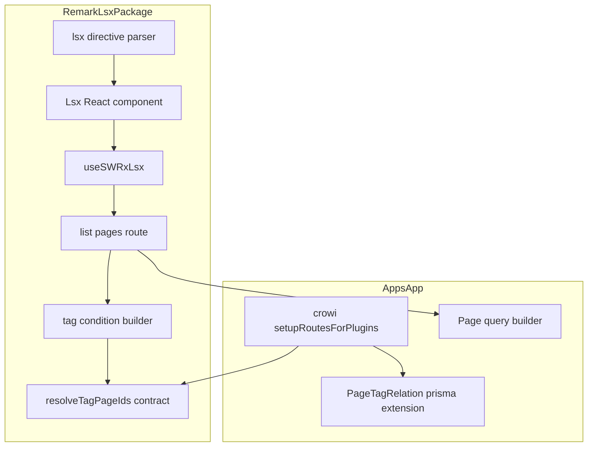

# Design Document

## Overview

**Purpose**: 本機能は、ページ本文に埋め込む `$lsx` ページ一覧記法に、タグによる絞り込みを追加する。パスの階層でしかページを一覧できなかった既存の `$lsx` に対し、タグでページを分類しているユーザーが、パス配下かつ指定したタグを持つページだけを一覧できるようにする。

**Users**: `$lsx` を使ってページ本文に一覧を埋め込んでいる編集者。タグでページを分類し、パスの階層だけでは目的の一覧を作れなかったユーザー。

**Impact**: `$lsx` のオプションに `tag` を追加し、既存のパス配下絞り込みとの組み合わせで動作させる。既存のパスのみを使った `$lsx` の挙動・表示は変更しない。

### Goals
- `$lsx` にタグによる絞り込みオプションを追加し、既存の `prefix`（パス配下絞り込み）と組み合わせて使えるようにする
- 複数タグを AND で指定できるようにする
- 既存の閲覧権限フィルター・一覧表示・追加読み込みの仕組みをそのまま再利用し、タグ指定時にも同じ挙動を維持する

### Non-Goals
- パスを指定しない「タグのみ」の一覧専用の呼び出し方（requirements.md の Boundary Context により対象外）
- 専用のタグ一覧ページ・タグ管理UIの新設
- 検索機能（Elasticsearch の `tag:` キーワード）自体の変更

## Boundary Commitments

### This Spec Owns
- `$lsx` の記法・オプションへの `tag` 属性の追加（構文解析・サニタイズ許可リスト・クライアント側の状態管理）
- `/_api/lsx` のクエリ組み立てにおける、タグ条件（既存の `depth`・`filter`・`except` と同じ合流点への `.and()` 条件追加）の実装
- タグ名の集合からページID一覧を求める処理の**契約**（関数の型）。`packages/remark-lsx` はこの契約のみを知り、実装を知らない
- タグ名の集合からページID一覧を求める処理の**実装**（`apps/app` 側、`PageTagRelation` の既存 Prisma 拡張への追加）と、それを `$lsx` のルートへ配線する処理

### Out of Boundary
- `Tag` / `PageTagRelation` のスキーマ変更、タグの作成・更新・削除ロジックそのもの（既存のまま利用するのみ）
- 検索機能（Elasticsearch）の `tag:` キーワードの実装・変更
- ページ一覧の階層表示ロジック（`generatePageNodeTree` / `LsxListView`）— 調査の結果、変更不要と判明したため、このスペックはここに触れない
- タグ管理UI・タグ一覧ページなど、`$lsx` 以外からタグ絞り込み結果を使う新しい画面

### Allowed Dependencies
- `apps/app` の `PageTagRelation` Prisma 拡張（`apps/app/src/server/models/page-tag-relation.ts`）、`Tag` Prisma 拡張（`apps/app/src/server/models/tag.ts`）— タグ→ページID解決の実装先として利用する
- 既存の `Page` モデルの `PageQueryBuilder`（`addConditionToListOnlyDescendants` / `addConditionToFilteringByViewerForList`）— 閲覧権限フィルターとパス絞り込みの合流点として、タグ条件もここに合流させる
- `@growi/core` の `OptionParser` — 既存オプション（`depth` 等）と同様の解析ユーティリティとして必要なら利用する
- 依存の方向は一方向のみ: `apps/app`（`crowi/index.ts`）→ `packages/remark-lsx`（`middleware` の第三引数としてタグ解決関数を渡す）。`packages/remark-lsx` から `apps/app`/Prisma への依存は発生させない

### Revalidation Triggers
- `PageQueryBuilder.addConditionToFilteringByViewerForList` の契約（引数・返り値・適用対象）が変わる場合
- `PageTagRelation` / `Tag` が Prisma 以外の実装へ移行する、またはこれらのモデルの `_id` の型・意味が変わる場合
- `$lsx` の属性解析（`SUPPORTED_ATTRIBUTES` とディレクティブのパース処理）の構造が変わる場合
- `packages/remark-lsx` の `middleware(crowi, app)` の呼び出しシグネチャが変わる場合（今回追加する第三引数を含む）

## Architecture

### Existing Architecture Analysis

- `$lsx` は、クライアント側の remark/rehype プラグイン（`packages/remark-lsx/src/client/services/renderer/lsx.ts`）が Markdown 中の `$lsx(...)` 記法を解析し、`<lsx>` 要素の属性（`prefix`・`depth`・`sort` 等）に変換する。
- React コンポーネント（`Lsx.tsx`）がその属性を受け取り、`LsxContext` に正規化した上で SWR（`useSWRxLsx`）経由で `/_api/lsx` を呼ぶ。
- サーバー側（`packages/remark-lsx/src/server/routes/list-pages/index.ts`）は、`generateBaseQuery` で「指定パス配下」＋「閲覧権限フィルター」を合流させたクエリを作り、そこに `depth`・`filter`・`except` の各条件を `.and()` で積み重ねていく。
- `packages/remark-lsx` は意図的に `apps/app` 固有の実装（Mongoose の `Page` モデル名や、`getExcludedPaths` のような設定値）に直接依存せず、`apps/app` 側から関数として受け取る形を取っている。
- 本機能は、この既存の「クエリへの `.and()` 条件追加」と「依存性注入」という2つのパターンをそのまま拡張する。新しいアーキテクチャパターンの導入は不要。

### Architecture Pattern & Boundary Map



**Architecture Integration**:
- 採用パターン: 既存の「クエリビルダーへの条件追加」＋「依存性注入」を延長する形。新規パターンは導入しない
- 責務境界: タグの構文・クエリ組み立ての**契約**は `packages/remark-lsx` が持ち、タグ解決の**実装**（Prisma 経由の実データアクセス）は `apps/app` が持つ
- 既存パターンの維持: `depth`/`filter`/`except` と同じ「合流点で `.and()` を積む」形。`getExcludedPaths` と同じ「関数を注入する」形
- 新規要素の理由: `resolveTagPageIds` という契約(関数の型)を1つ追加する以外、新しいコンポーネントは導入しない
- Steering 準拠: `.claude/rules/model.md`(Mongoose static は `Prisma.defineExtension` に対応させる)、`.claude/rules/coding-style.md`(Executors は work-set を入力として受け取る、のパターンを踏襲)

### Technology Stack

| Layer | Choice / Version | Role in Feature | Notes |
|-------|------------------|-----------------|-------|
| Frontend | React 18 / SWR（既存） | `$lsx` の属性受け渡し、`/_api/lsx` 呼び出し | 新規ライブラリなし |
| Backend | Express（既存, `packages/remark-lsx/src/server`） | `/_api/lsx` のクエリ組み立てにタグ条件を追加 | 新規ライブラリなし |
| Data | MongoDB（Mongoose の `Page`, Prisma の `pagetagrelations`/`tags`）（既存） | タグ→ページID解決、ページ本体の取得 | スキーマ変更なし。既存 Prisma 拡張にメソッドを1つ追加するのみ |

## File Structure Plan

### 新規作成

```
packages/remark-lsx/src/server/routes/list-pages/
├── parse-tag-names.ts        # tag オプション文字列(カンマ区切り)をタグ名配列へ分解・検証する純粋関数
├── parse-tag-names.spec.ts
├── add-tag-condition.ts      # 解決済みページID配列を _id: {$in:[...]} 条件としてクエリへ合流させる
└── add-tag-condition.spec.ts
```

### 変更対象ファイル

- `packages/remark-lsx/src/interfaces/api.ts` — `LsxApiOptions` に `tag?: string;` を追加
- `packages/remark-lsx/src/server/routes/list-pages/index.ts` — `listPages({ getExcludedPaths, resolveTagPageIds })` に第二の依存関数を追加し、`options?.tag` を `parseTagNames` → `resolveTagPageIds` → `addTagCondition` の順で処理するステップを、既存の `depth`/`filter`/`except` の処理と同じ場所（件数取得より前）に追加する
- `packages/remark-lsx/src/server/index.ts` — `middleware(crowi, app)` の引数に `{ resolveTagPageIds }` を追加し、`listPages(...)` へそのまま渡す
- `packages/remark-lsx/src/client/services/renderer/lsx.ts` — `SUPPORTED_ATTRIBUTES` に `'tag'` を追加（構文解析とサニタイズ許可リストの両方に効く）
- `packages/remark-lsx/src/client/components/Lsx.tsx` — `Props` に `tag?: string;` を追加し、`options` オブジェクトと `useMemo` の依存配列に含める
- `apps/app/src/server/models/page-tag-relation.ts` — 既存の Prisma 拡張（`model.pagetagrelations`）に `findPageIdsWithAllTags(tagNames: string[]): Promise<string[]>` を追加
- `apps/app/src/server/crowi/index.ts` — `~/utils/prisma` から `prisma` をインポートし、`lsxRoutes(this, this.express, { resolveTagPageIds: (tagNames) => prisma.pagetagrelations.findPageIdsWithAllTags(tagNames) })` の形に配線を変更

### 変更不要（調査済み、意図的に対象外）

- `packages/remark-lsx/src/client/components/lsx-context.ts` — `options` を汎用的に扱っており、`tag` を含めても既存コードのまま動く
- `packages/remark-lsx/src/client/stores/lsx/lsx.ts` — `options` を汎用的に SWR キー・API パラメータへ渡しており、変更不要
- `packages/remark-lsx/src/client/utils/page-node.ts` / `LsxListView` — タグ絞り込み結果は常に `prefix` 配下に限られるため、既存の木構築ロジックがそのまま動く

## System Flows

```mermaid
sequenceDiagram
    participant Editor as Page body ($lsx directive)
    participant Lsx as Lsx component
    participant Store as useSWRxLsx
    participant Route as list pages route
    participant Resolver as resolveTagPageIds (apps/app)
    participant PageQuery as Page query builder

    Editor->>Lsx: prefix, tag, depth, ... attributes
    Lsx->>Store: pagePath, options(including tag)
    Store->>Route: GET /_api/lsx?pagePath=...&options=...
    Route->>Route: parseTagNames(options.tag)
    Route->>Resolver: resolveTagPageIds(tagNames)
    Resolver-->>Route: pageIds (AND across all tagNames; [] if any tag name is unknown or no page matches all)
    Route->>PageQuery: base query (prefix + viewer filter) .and(_id in pageIds) .and(depth/filter/except...)
    PageQuery-->>Route: pages, total
    Route-->>Store: pages, cursor, total
    Store-->>Lsx: data
    Lsx->>Lsx: generatePageNodeTree(prefix, pages) (unchanged)
```

**主要な決定**:
- タグ解決（`Resolver`）は、クエリの他の条件と独立して先に1回実行し、結果のページID配列を通常の `.and()` 条件として合流させる。閲覧権限フィルターは `PageQuery` 側で常に適用されるため、タグ条件を通過したページのうち閲覧不可のものは、既存の仕組みでそのまま除外される。
- タグ名が1つも解決できない場合（存在しないタグ名を含む場合を含む）、`resolveTagPageIds` は空配列を返す。空配列を `$in` 条件に使うと結果的に0件になり、エラーにはならない（要件 1.4, 1.5）。

## Requirements Traceability

| Requirement | Summary | Components | Interfaces | Flows |
|-------------|---------|------------|------------|-------|
| 1.1, 1.2 | タグ1つ／複数(AND)による絞り込み | add-tag-condition, PageTagRelation拡張 | `resolveTagPageIds`, `findPageIdsWithAllTags` | System Flows |
| 1.3 | タグ名の完全一致 | PageTagRelation拡張 | `findPageIdsWithAllTags`（`name: { in: tagNames } }`） | - |
| 1.4, 1.5 | 該当ページ無し／未知タグ名は空一覧 | PageTagRelation拡張, add-tag-condition | `findPageIdsWithAllTags` が `[]` を返す | System Flows |
| 1.6 | 値なしの tag オプションはエラー | parse-tag-names | `parseTagNames` | - |
| 2.1 | パス指定とタグ指定の併用 | list-pages/index.ts | `listPages` | System Flows |
| 2.2 | タグ未指定時は従来通り | list-pages/index.ts | `listPages`（`options.tag` が無ければ既存処理のまま） | - |
| 2.3 | 既存オプションとの併用(AND) | list-pages/index.ts | 既存の `addDepthCondition`/`addFilterCondition`/`addExceptCondition` と同じ合流点 | - |
| 3.1, 3.2 | 閲覧権限フィルターの適用 | generateBaseQuery（既存, 変更なし） | `addConditionToFilteringByViewerForList`（既存） | System Flows |
| 3.3 | 共有リンクページでの無効化維持 | Lsx.tsx（既存, 変更なし） | `LsxDisabled`（既存） | - |
| 4.1, 4.2 | 階層表示・件数・追加読み込みの継続 | page-node.ts, LsxListView, useSWRxLsx（すべて既存, 変更なし） | `generatePageNodeTree`, `useSWRInfinite`（既存） | - |

## Components and Interfaces

| Component | Domain/Layer | Intent | Req Coverage | Key Dependencies (P0/P1) | Contracts |
|-----------|--------------|--------|--------------|--------------------------|-----------|
| parseTagNames | remark-lsx / server | `tag` オプション文字列をタグ名配列へ分解・検証 | 1.6 | なし | Service |
| addTagCondition | remark-lsx / server | 解決済みページID配列をクエリの `.and()` 条件へ変換 | 1.1-1.5, 2.1, 2.3 | PageQuery（P0） | Service |
| listPages（既存, 変更） | remark-lsx / server | ルートハンドラ。各条件の合流を制御 | 2.1, 2.2, 2.3 | parseTagNames（P0）, addTagCondition（P0）, resolveTagPageIds（P0） | API |
| resolveTagPageIds契約 | remark-lsx / server | タグ名配列→ページID配列の関数型契約 | 1.1-1.5 | なし（契約のみ） | Service |
| findPageIdsWithAllTags | apps/app / data | `resolveTagPageIds` 契約の実装。Prisma 経由でタグ→ページIDを解決 | 1.1-1.5 | `tags`拡張（P0）, `pagetagrelations`拡張（P0） | Service |
| crowi wiring（既存, 変更） | apps/app / bootstrap | `resolveTagPageIds` を `lsxRoutes` へ注入 | 1.1-1.5 | prisma（P0） | Service |
| lsx directive parser（既存, 変更） | remark-lsx / client rendering | `$lsx(...)` 記法を解析し `tag` 属性を許可・保持する | 1.1, 1.2, 2.1, 2.2 | なし | Service |
| Lsx component（既存, 変更） | remark-lsx / client rendering | `tag` 属性を props・options として `useSWRxLsx` まで受け渡す | 1.1, 1.2, 2.1, 2.2 | lsx directive parser（P1） | State |

### remark-lsx / server

#### parseTagNames

| Field | Detail |
|-------|--------|
| Intent | `tag` オプション文字列（カンマ区切り）をタグ名の配列に変換する純粋関数 |
| Requirements | 1.6 |

**Responsibilities & Constraints**
- 入力文字列をカンマで分割し、各要素の前後の空白を除去し、重複を除去する
- 値が空、または分割結果が空配列になる場合はエラーを投げる（既存の `addFilterCondition` の「値必須」エラーと同じ扱い）

**Contracts**: Service [x]

##### Service Interface
```typescript
export function parseTagNames(optionsTag: string | true | undefined): string[];
```
- Preconditions: `optionsTag` が `undefined` の場合はこの関数を呼ばない（呼び出し側でオプション有無を判定する）
- Postconditions: 返り値は重複のない、空文字列を含まないタグ名の配列（要素数 1 以上）
- Invariants: 入力が空文字列または `true`（値なし指定）の場合は例外を投げ、空配列を返すことはない

#### addTagCondition

| Field | Detail |
|-------|--------|
| Intent | 解決済みページID配列を `PageQuery` の `.and()` 条件に変換する |
| Requirements | 1.1, 1.2, 1.4, 1.5, 2.1, 2.3 |

**Responsibilities & Constraints**
- 既存の `addDepthCondition` / `addFilterCondition` と同じ形（`PageQuery` を受け取り `PageQuery` を返す）
- 空配列を渡された場合も例外にせず、0件に絞り込む条件を返す

**Contracts**: Service [x]

##### Service Interface
```typescript
export function addTagCondition(query: PageQuery, pageIds: string[]): PageQuery;
```
- Preconditions: `pageIds` はタグ解決済みの配列（空配列も許容）
- Postconditions: 返り値のクエリは、元のクエリの条件に加えて `_id` が `pageIds` に含まれるページのみを対象とする
- Invariants: 元のクエリが持つ他の条件（パス配下・閲覧権限フィルター等）を変更しない

### apps/app / data

#### findPageIdsWithAllTags

| Field | Detail |
|-------|--------|
| Intent | タグ名配列に対応するタグをすべて持つページのIDを求める（`resolveTagPageIds` 契約の実装） |
| Requirements | 1.1, 1.2, 1.3, 1.4, 1.5 |

**Responsibilities & Constraints**
- タグ名は完全一致で解決する
- 指定したタグ名の一部でもタグとして存在しない場合、条件を満たすページは存在しないため空配列を返す
- 複数タグが指定された場合、すべてのタグを持つページのみを返す（AND）
- `apps/app/src/server/models/page-tag-relation.ts` の既存 Prisma 拡張（`model.pagetagrelations`）に追加する。`Tag` の名前解決には既存の Prisma クライアントの標準呼び出しを用いる（新規メソッドは不要）

**Dependencies**
- Outbound: `tags`（Prisma 拡張, 既存） — タグ名からタグIDを引く（P0）
- Outbound: `pagetagrelations`（Prisma 拡張, 既存自身の拡張に追加） — タグIDからページIDを引く（P0）

**Contracts**: Service [x]

##### Service Interface
```typescript
async findPageIdsWithAllTags(tagNames: string[]): Promise<string[]>;
```
- Preconditions: `tagNames` は1件以上の非空文字列を含む配列
- Postconditions: 返り値は、`tagNames` に含まれるすべてのタグを持つページのID配列。`tagNames` のいずれかがタグとして存在しない場合、または該当ページが無い場合は空配列
- Invariants: タグ名の一致は完全一致（部分一致・大文字小文字無視は行わない）

**Implementation Notes**
- Integration: `apps/app/src/server/crowi/index.ts` の `setupRoutesForPlugins()` から、`prisma.pagetagrelations.findPageIdsWithAllTags` をそのまま `lsxRoutes` の第三引数として注入する
- Validation: `tagNames` が空配列で呼ばれることはない（呼び出し側の `parseTagNames` が保証する）ため、この関数自身は空配列入力を防御的にチェックしなくてよい
- Risks: 該当ページが非常に多いタグを指定された場合、タグ→ページID解決の中間結果が大きくなる可能性がある（research.md の Risks 参照）

## Data Models

既存の `Tag` / `PageTagRelation`（Prisma 拡張）のスキーマは変更しない。本機能が新たに導く導出データはない — `findPageIdsWithAllTags` は既存の2テーブル（`tags`, `pagetagrelations`）に対する読み取り専用の問い合わせであり、永続化する新しいデータは無い。

## Error Handling

### Error Strategy
既存の `$lsx` ルート（`packages/remark-lsx/src/server/routes/list-pages/index.ts`）の try/catch とエラー整形をそのまま利用する。タグ絞り込みのために新しいエラー種別は追加しない。

### Error Categories and Responses
- **User Errors (400)**: `tag` オプションに値が指定されていない（`parseTagNames` が例外を投げる）→ 既存の `filter`/`except` と同じ形で 400 を返す
- **該当ページ無し・未知タグ名（要件 1.4, 1.5）**: エラーではない。`findPageIdsWithAllTags` が空配列を返し、`addTagCondition` がそれを通常の絞り込み条件として使うため、200 で空の一覧が返る
- **System Errors (5xx)**: 既存の try/catch がそのまま処理する。新規のシステムエラー経路は追加しない

## Testing Strategy

- **Unit Tests**
  - `parseTagNames`: カンマ区切りの分解・前後空白除去・重複除去（要件 1.1, 1.2）／空文字列・値なし指定でエラーを投げる（要件 1.6）
  - `addTagCondition`: 空でないページID配列で `_id: {$in: [...]}` 条件を追加する／空配列でも例外を投げず0件に絞り込む条件を返す（要件 1.4, 1.5）
  - `findPageIdsWithAllTags`（`apps/app`, DB を使う統合テストとして実施）: 単一タグで一致するページのみ返す／複数タグ指定でAND（両方のタグを持つページのみ）／存在しないタグ名を含む場合は空配列（要件 1.1-1.5）
- **Integration Tests**
  - `/_api/lsx` に `prefix` と `tag` を同時に指定し、パス配下かつタグ一致のページのみが返ることを確認（要件 2.1）
  - `tag` を指定しない場合に既存の挙動（パスのみの絞り込み）が変わらないことを確認（要件 2.2, 既存挙動の非後退確認）
  - `tag` と `depth`/`filter`/`except` を同時に指定し、すべての条件を満たすページのみが返ることを確認（要件 2.3）
  - 閲覧権限を持たないページが `tag` 指定時にも一覧・件数から除外されることを確認（要件 3.1, 3.2）
- **E2E/UI Tests**
  - ページ本文に `$lsx(/path, tag=議事録)` を書いたページを表示し、対象タグを持つ配下ページのみが階層表示され、合計件数・「もっと見る」が既存と同様に動作することを確認（要件 4.1, 4.2）
  - 共有リンクページで、`tag` 属性の有無に関わらず `$lsx` が無効表示のままであることを確認（要件 3.3）

## Security Considerations

- 閲覧権限フィルターは既存の `addConditionToFilteringByViewerForList` を経由するため、タグ絞り込み結果にも同じ権限チェックが適用される。新しい権限チェック経路は作らない（要件 3.1, 3.2）。
- タグ名の一致は Prisma の `in` 演算子による完全一致であり、`filter`/`except` のように MongoDB 向け正規表現（`escapeStringForMongoRegex` が必要になるケース）を新たに組み立てることはない。したがって `.claude/rules/mongodb-regex.md` が対象とする種類のエスケープ漏れリスクは、この機能には発生しない。

## Supporting References

- `.kiro/specs/lsx-support-tags/research.md` — 発見事項・検討した代替案・リスクの詳細
