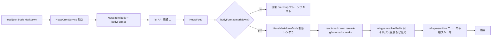

# Design Document: news-markdown-body

## Overview

**Purpose**: `/_news` のニュース本文をプレーンテキストから **Markdown 描画**へ変え、本文中の任意位置に書式・画像(GIF 含む)を配置できるようにする。

**Users**: 全ログインユーザーが `/_news` で書式付き・画像付きニュースを読む。GROWI 配信運営者は feed.json の body に Markdown を書くだけで全インスタンスに配信できる。

**Impact**: 既存 news 基盤(spec: `news-inappnotification`)への additive 拡張。描画層(NewsFeed の body 部)に**ニュース専用の制限レンダラ**を新設し、opt-in ゲートで従来のプレーンテキスト描画と切り替える。API・データモデルは additive、cron 取込・サイドバー・既存データは原則不変。

### Goals

- body の Markdown 描画(opt-in)と、本文中への複数画像(GIF 含む)埋め込み
- 外部フィード由来コンテンツを**最小権限で**描画する専用 sanitize(Wiki の許可範囲から隔離)
- 新規外部依存ゼロ・マイグレーション不要・前方/後方互換

### Non-Goals

- 動画(mp4 / `<video>`)— GIF で代替。将来の純追加とする
- サイドバー通知パネルの Markdown 描画(タイトルのみ維持)
- 配信リポジトリ(growi-news-feed)のスキーマ/CI/入稿(PrimaVista)整備
- GROWI 独自 Markdown 拡張(lsx / drawio / plantuml / mermaid 等)のニュースでの利用

## Boundary Commitments

### This Spec Owns

- ニュース専用の描画パス(option generator + 狭い sanitize スキーマ + body を描画に配線する UI)
- 本文 Markdown 中のメディア参照の**同一オリジン解決・封じ込め検証**と、失敗時のフォールバック
- opt-in ゲート(`bodyFormat`)のデータ形状と描画分岐

### Out of Boundary

- GROWI Wiki レンダラ本体、その sanitize 許可範囲(`recommended-whitelist.ts`)— **流用も改変もしない**
- cron のフェッチ/配信トグル/バージョン判定など既存取込ロジック(body の受け渡し以外は不変)
- 配信側の Markdown 入稿・画像配置(別リポジトリ)

### Allowed Dependencies

- 既存の描画機構: `react-markdown` v9 / `remark-gfm` / `remark-breaks` / `rehype-sanitize` / `hast-util-sanitize`(いずれも導入済み。**新規 npm 依存を追加しない**)。`RevisionRenderer` は `className="wiki …"` をハードコードするため直接は使わず、`react-markdown` + `react-error-boundary` の薄いラッパを自作する
- 既存 news feature モジュール(`feed-parser` / `news-cron-service` / interfaces / `NewsFeed.tsx`)への編集
- `FEED_URL` 定数 — 現在 `news-cron-service.ts`(サーバ)にハードコードされているが、描画側(クライアント)からも参照するため **`features/news/consts.ts`(サーバ依存を含まない feature 直下の共有 consts)へ移設**する。cron からの export はサーバ専用モジュール(configManager / cron / mongoose)をクライアントバンドルに引き込むため採らない

### Revalidation Triggers

- ニュース sanitize スキーマの許可範囲変更(セキュリティ契約の変更)
- `bodyFormat` の値・意味の変更
- `FEED_URL` の移転(封じ込め基準オリジンが変わる)
- 動画対応の追加(`<video>` 解禁は本設計の「生 HTML 不可」前提を変える)

## Architecture

### Existing Architecture Analysis(gap 分析より)

- `NewsFeed.tsx` は現状 body を `whiteSpace: pre-wrap` のプレーンテキストで描画。Markdown parse は皆無
- Wiki レンダラ(`services/renderer` + client `renderer.tsx` + `RevisionRenderer`)は機構としては再利用可能だが、option generator が `pagePath`/`RendererConfig` に結合し、sanitize 許可範囲が広い(`iframe`/`video` 許可 + `rehype-raw` で生 HTML 通過)。**外部フィードにこの許可範囲は過剰**
- Markdown/sanitize ライブラリは全て導入済み。**最小サブセットレンダラは存在しない**ため新設する
- 同一オリジン封じ込めの解決純関数(`resolveNewsMediaUrl`)はこの feature に存在しないため、design の契約(下記 Service Interface)どおり**新規実装**する(gif 対応・mp4 除外)

### Architecture Pattern & Boundary Map

ハイブリッド: **機構は Wiki と同じ react-markdown/rehype を再利用(Extend)、許可範囲・プラグイン集合・メディア解決は新規(New)**。



### 依存方向

```
consts(FEED_URL) → resolve-news-media-url(純関数)
                 → rehype-resolve-news-media(rehype プラグイン)
news-sanitize-schema(定数)   → news-markdown-options(option generator)
news-markdown-options + RevisionRenderer → NewsMarkdownBody(UI)
NewsMarkdownBody ← NewsFeed(bodyFormat で分岐)
feed-parser(zod: bodyFormat 追加) → news-cron-service → NewsItem model
```

各要素は左からのみ import する。`resolve-news-media-url` は base URL を引数で受け取る純関数(テスト容易 / FEED_URL に直接依存しない)。

### Technology Stack

| Layer | Choice | Role | Notes |
|-------|--------|------|-------|
| Markdown parse | react-markdown v9 + remark-gfm + remark-breaks(既存) | body を Markdown 描画 | 新規依存なし。**rehype-raw は使わない**(生 HTML を parse しない) |
| Sanitize | rehype-sanitize + hast-util-sanitize(既存) | ニュース専用の狭い許可スキーマ | Wiki の `recommended-whitelist` は流用しない |
| メディア解決 | 標準 `URL` + rehype プラグイン(新規・軽量) | 相対 img を絶対 URL 化 + 同一オリジン封じ込め | ESM 安全 |
| UI | React(NewsFeed に配線) | opt-in 分岐 + NewsMarkdownBody | client 描画(NewsFeed は SWR 駆動) |

## File Structure Plan

### New Files

```
apps/app/src/features/news/client/components/
├── NewsMarkdownBody.tsx            # 制限レンダラ本体(react-markdown + react-error-boundary の薄いラッパ + news options)
├── NewsMarkdownBody.module.scss    # ニュース本文の最小スコープスタイル(下記「スタイリング」参照)
└── NewsMarkdownBody.spec.tsx
apps/app/src/features/news/client/services/
├── news-markdown-options.tsx       # react-markdown option generator(remark/rehype 構成 + sanitize schema 適用 + img/a コンポーネント)
├── news-sanitize-schema.ts         # ニュース専用の hast-util-sanitize スキーマ(許可タグ/属性)
├── news-sanitize-schema.spec.ts
├── rehype-resolve-news-media.ts    # rehype プラグイン: img src を解決+封じ込め検証、不適合はノード除去
└── rehype-resolve-news-media.spec.ts
apps/app/src/features/news/utils/                      # ※client/server 共有(interfaces/ と同階層)
└── resolve-news-media-url.ts + .spec.ts   # 同一オリジン封じ込めの解決純関数(新規実装。gif 対応・mp4 除外)
apps/app/src/features/news/
└── consts.ts                       # FEED_URL の共有定数(cron・描画の両方が参照)
```

> `resolve-news-media-url` はクライアント(rehype プラグイン)から import するため、サーバ専用ディレクトリ(`server/services/`)ではなく feature 直下の共有 `utils/` に置く。`FEED_URL` も同様に feature 直下 `consts.ts` に共有定数として置く。
> `news-markdown-options` は JSX(`img`/`a` コンポーネント)を含むため `.tsx`。この options 単体の spec は作らず、観測境界である `NewsMarkdownBody.spec.tsx` の描画テスト+「sanitize がパイプラインに結線されている」ことを固定する mutation ガード(GFM の `input`/脚注が sanitize でのみ除去される)でカバーする。`rehypeShiftNewsHeadings` の見出しシフトも同 spec で観測する。

### Modified Files

- `apps/app/src/features/news/client/components/NewsFeed.tsx` — body 描画を「bodyFormat=markdown なら NewsMarkdownBody、それ以外は従来 pre-wrap」に分岐
- `apps/app/src/features/news/interfaces/news-item.ts` — `INewsItem` / `INewsItemInput` に `bodyFormat?: string` を追加
- `apps/app/src/features/news/server/services/feed-parser.ts` — zod に `bodyFormat: z.string().optional()` を追加(未知値をアイテムごと落とさないため literal にしない。上記 opt-in ゲート参照)
- `apps/app/src/features/news/server/models/news-item.ts` — `bodyFormat` フィールド追加(String、任意、enum 制約なし)
- `apps/app/src/features/news/server/services/news-cron-service.ts` — `bodyFormat` を INewsItemInput へ写経(body は従来どおり verbatim)。ハードコードしている `FEED_URL` は下記の共有 consts へ移設して参照に変更
- `apps/app/src/features/news/consts.ts` — **新規**。`FEED_URL` をサーバ(cron)・クライアント(描画)双方が参照する共有定数として定義。`images/` ディレクトリ名など封じ込め規約の定数もここに集約する

## Requirements Traceability

| Req | 要点 | Components |
|-----|------|-----------|
| 1.1–1.4 | Markdown 描画・opt-in・複数画像 | NewsFeed(分岐), NewsMarkdownBody, news-markdown-options |
| 2.1,2.2,2.5 | 許可範囲限定・生 HTML 不可・Wiki 非流用 | news-sanitize-schema(rehype-raw 不使用) |
| 2.3,2.4 | 非 http(s) リンク無効化・外部リンク rel | news-sanitize-schema(protocols) + a コンポーネント |
| 3.1–3.3 | 相対→絶対解決・https/同一オリジン封じ込め・拡張子(gif 含む) | resolve-news-media-url, rehype-resolve-news-media |
| 3.4 | lazy / no-referrer / 高さ上限 | NewsMarkdownBody の img コンポーネント |
| 4.1 | 検証失敗で該当画像除去・本文維持 | rehype-resolve-news-media(ノード除去) |
| 4.2 | 取得失敗で該当画像のみ非表示 | img コンポーネント onError |
| 4.3 | 描画時 http(s) 再検証 | news-sanitize-schema(protocols) + img コンポーネント |
| 5.1–5.4 | 互換・独立・サイドバー不変 | bodyFormat ゲート(additive)、NewsFeed のみ変更 |

## Components and Interfaces

| Component | Layer | Intent | Req | Contracts |
|-----------|-------|--------|-----|-----------|
| resolveNewsMediaUrl | Service(純関数) | 相対パス→検証済み絶対 URL(失敗 null) | 3.1–3.3 | Service |
| rehypeResolveNewsMedia | Client/rehype | hast の img src を解決+封じ込め、不適合ノード除去 | 3.1–3.3, 4.1 | — |
| newsSanitizeSchema | Client(定数) | ニュース専用の許可タグ/属性/プロトコル | 2.1–2.5, 4.3 | — |
| newsMarkdownOptions | Client/services | react-markdown 構成(remark/rehype/sanitize/components) | 1.1,1.3, 2.*, 3.4 | — |
| NewsMarkdownBody | Client/UI | body を制限レンダラで描画 | 1.1,1.3,1.4 | State |
| NewsFeed(変更) | Client/UI | bodyFormat で描画分岐 | 1.1,1.2, 5.1 | — |
| bodyFormat(model/interface/zod) | Server | opt-in ゲートのデータ形状 | 1.1, 5.1–5.3 | State |

#### newsSanitizeSchema(セキュリティの中核・確定スキーマ)

hast-util-sanitize 用スキーマ。hast-util-sanitize は与えたスキーマを **`defaultSchema` に浅くマージ**(`{...defaultSchema, ...schema}`)するため、`tagNames`/`attributes`/`protocols` を明示すると既定を**完全に置き換え**、Wiki の `recommended-whitelist` とは無関係の最小許可になる(このため「ゼロベース相当」の最小面になる)。許可外要素の扱いは `strip` に依存し、**`strip` が falsy(null)なら子要素ごと丸ごと除去、配列なら列挙外の要素をアンラップ(子を残す)**する。したがって remark-gfm が出力しうるタグ(表など)を許可リストに漏らすと**その要素が警告なく消える**。これを踏まえ、スキーマの構成要素を以下に確定する:

- **`tagNames`**: `p, br, strong, em, del, a, code, pre, blockquote, ul, ol, li, h1, h2, h3, h4, h5, h6, hr, img, table, thead, tbody, tr, th, td`
  - **見出しは h1–h6 を許可**し、remark/rehype で**2段シフト**する(body の `#` → DOM 上 `h3` 以降。h5/h6 は h6 で頭打ち)。理由: `NewsFeed.tsx` のニュースタイトルが `<h2>` なので、本文見出しをその配下の階層に落として a11y と視覚階層を保つ。サイズは CSS で調整
  - **GFM の表は許可**する(`table/thead/tbody/tr/th/td`)。remark-gfm を入れる以上、非許可だと表が黙って消えるため。ただし列の text-align は `style` を許可しないため反映されない(既知の軽微な劣化)
  - **タスクリスト/脚注は非対応**(`input`・脚注 `section`/`sup` を許可しない)。タスクリストのチェックボックス(`input`)は除去され、`li` のテキストのみ残る。脚注 `section` は `strip: null` により**子(見出し・リスト)ごと丸ごと除去**され、本文に漏れない(劣化として許容)
  - 生 HTML・`iframe`/`video`/`script`/`style` は**非許可**
- **`attributes`**: `a: [href, title]`、`img: [src, alt, title]`。`code` の `className` は**許可しない**(ニュースにハイライタを入れないため言語指定は効果がなく、最小権限の観点でも落とす)。`style` 属性・`on*` イベントハンドラ・任意 `class` は不許可
- **`protocols`**(hast-util-sanitize は属性名キーのグローバル設定): `{ href: ['http', 'https', 'mailto'], src: ['https'] }`。許可タグのうち `href` を持つのは `a`、`src` を持つのは `img` だけなので、属性名キーでも「リンクは http/https/mailto、画像は https のみ」というタグ別の意図と同じ効果になる
- **`strip`**: `null`(**明示必須**)。許可外要素を子ごと除去する挙動は `strip` が falsy のときのみ得られる。省略すると `defaultSchema.strip = ['script']` を継承してしまい、`script` 以外の許可外要素(脚注 `section` 等)がアンラップされて子が漏れる。`[]` も truthy なのでアンラップになるため不可。よって `null` を明示する
- **`a` コンポーネント(リンクの新規タブ化)**: 解決後の `href` が `http(s)://` の**外部リンクのときだけ** `target="_blank" rel="noopener noreferrer"` を付ける。fragment(`#...`)・`mailto:`・sanitize で `href` が剥がれたリンクは同タブ(`target` 無し)。理由: `id` 属性は許可外で存在しないため、fragment を新規タブで開いても飛び先が無い
- rehype-raw を**パイプラインに含めない**ため、body 中の生 HTML(`<video>` 等)はそもそも parse されない(Req 2.2 を構造的に担保)

#### resolveNewsMediaUrl(純関数、新規実装)

```typescript
// (imagePath, feedUrl) => 検証済み絶対 URL | null
export const resolveNewsMediaUrl = (imagePath: string, feedUrl: string): string | null;
```
- https のみ / credentials・query・hash 拒否 / 同一オリジン / feed の `images/` **直下のみ**(`images/<filename>`。`images/` の後にスラッシュを含まない単一セグメント。**サブディレクトリは不許可**)/ 拡張子 png・jpe?g・webp・**gif** / `%` 含みパス拒否。例外を投げず不正は null。上記契約に沿って**新規に実装**し、境界テストも新規に書く
- 封じ込めの基準ディレクトリ名(`images/`)は `features/news/consts.ts` の定数を単一の出所とする(規約の重複を避ける)

#### KEY DECISION: メディア解決は「描画時」(案II)を採用

gap で挙げた案I(取込時)/案II(描画時)のうち **案II(rehype プラグインで描画時に解決+検証)** を採る。

- 理由: (a) body を verbatim 保存でき、取込時の Markdown parse/serialize による本文変形リスクを回避、(b) 画像バイトはそもそもサーバに触れない(hotlink)ため「取込時ゲート」の価値が小さく、描画時の resolve プラグイン + sanitize の**二段ゲート**で十分、(c) 解決ロジックを描画パイプラインに一元化できる
  - 注: `/_news` の NewsMarkdownBody は client 限定描画(下記「SSR について」参照)なので、解決は client-only で完結する。「SSR/クライアント両対応」は不要
- 二段構え: `rehypeResolveNewsMedia`(オリジン+パス封じ込め、不適合ノード除去)→ `rehype-sanitize`(タグ/プロトコル許可)。前者が漏らしても後者が protocols で止める
- FEED_URL は `features/news/consts.ts` の共有定数として描画側(クライアント)から参照する

#### opt-in ゲート(`bodyFormat`)

- `INewsItem.bodyFormat?: string`(アイテム単位。ロケール別ではない = 配信側は全ロケールを同一フォーマットで揃える契約)。未指定=従来のプレーンテキスト描画。型を literal `'markdown'` にしない理由は下記(未知値も型として受ける)
- feed-parser: **`bodyFormat: z.string().optional()`** とし、描画側で `bodyFormat === 'markdown'` を判定する。`z.literal('markdown').optional()` にしない理由: feed-parser はアイテム単位の `safeParse` で**検証失敗アイテムを丸ごと skip** するため、`bodyFormat: 'mdx'` のような**将来の未知値がニュース自体を消してしまう**(プレーンテキストへの劣化にならず Req 5.3 の前方互換に反する)。`z.string().optional()` なら未知値はそのまま取り込まれ、描画側が markdown 以外を従来描画にフォールバックする
- NewsFeed: `item.bodyFormat === 'markdown'` のとき NewsMarkdownBody、else 従来 pre-wrap(Req 1.2, 5.1)

## Data Models

`NewsItem` に additive:
- `bodyFormat`: `{ type: String, required: false }`(未指定 = プレーンテキスト)。model では enum 制約を付けず**文字列として保存**する(feed-parser の `z.string().optional()` と揃え、未知値をアイテムごと落とさない)。描画分岐は `=== 'markdown'` 判定で行う
- `body` は現状のまま `Map<locale,string>`(Markdown 文字列を格納)。**スキーマ変更・マイグレーション不要**(Req 5.2)

## Error Handling

| 段階 | 失敗 | 応答 |
|------|------|------|
| 描画(解決) | img src が非 https/オリジン外/封じ込め外 | `rehypeResolveNewsMedia` が当該ノードを除去、本文の残りは描画(Req 4.1) |
| 描画(sanitize) | 許可外タグ/属性/プロトコル | rehype-sanitize が除去(Req 2.1–2.4, 4.3) |
| 描画(取得) | 画像 URL は妥当だが取得失敗 | img `onError` で当該画像のみ非表示(Req 4.2) |
| parse | 不正な Markdown | react-markdown は寛容 parse(壊れない)。ErrorBoundary で最悪時もページ全体は保つ。フォールバックは **`fallbackRender={() => null}`**(`fallback={null}` は不可: react-error-boundary@3 は `fallback` を `isValidElement()` 検査し、`null` は無効値なので描画エラー時に境界自身が throw してフィードを白画面にする) |

## Testing Strategy

### Unit(純関数・スキーマ)

- `resolve-news-media-url.spec`: 境界マトリクス(ディレクトリ脱出・他リポジトリ配下・偽ディレクトリ・http ダウングレード・credentials/query/hash・`%` 含みパス)+ gif 受理・mp4 拒否・非同一オリジン拒否
- `news-sanitize-schema.spec`: `sanitize(tree, newsSanitizeSchema)` に対する契約テスト。許可タグ(表・見出し・リンク・https 画像)が残る / `iframe`・`video`・`script`・`style`・`input` が除去される / **許可外要素は子ごと除去され、アンラップで漏れない**(脚注 `section` の `h2`/`ol` が残らない = `strip: null` の固定)/ `on*`・`style`・`class`・`id` が剥がれる / `javascript:` リンク無効化 / img src の http(非 https)除去。スキーマ単体を直接検証するのは、パイプライン経由のテストだけでは sanitize を外しても緑になり、防御の主体が固定されないため

### Component(NewsMarkdownBody / NewsFeed)

- Markdown(見出し・リスト・強調・リンク・複数画像)が要素として描画される
- `bodyFormat` 未指定で従来のプレーンテキスト描画になる(Req 1.2 / 5.1)、`bodyFormat=markdown` かつ**画像なし本文でも描画され壊れない**(Req 1.1)、本文欠如でも item は描画される
- 生 HTML(`<video>`, `<script>`)が本文にあっても実行・描画されない(Req 2.2)
- **sanitize がパイプラインに結線されている**ことの mutation ガード: GFM の `input`(タスクリスト)・脚注 `section` は sanitize でのみ除去されるため、これらが漏れないことで sanitize 除去を検知する
- 同一オリジン外/非 https の img が描画されない(Req 3.2 / 4.3)、取得失敗で当該 img のみ消える(Req 4.2)
- 外部 http(s) リンクが `target=_blank rel=noopener noreferrer`、fragment/`mailto:` は同タブ(Req 2.4)

### 敵対的テスト(セキュリティ)

- XSS ベクタ(``, `javascript:` href, `<iframe>`, data: src, HTML コメント内スクリプト等)が全て無害化されること

## Security Considerations

**なぜ Wiki レンダラを流用せず専用の制限レンダラにするか**(requirements Req 2.5 の根拠):

1. **影響範囲(最重要)**: ニュース body は外部配信元(growilabs)由来で**全インスタンスに一斉配信**される。Wiki コンテンツは各インスタンス自身の信頼済みユーザーが書くもので信頼境界が異なる。1つの不正フィードが全顧客に波及しうるため、外部入力として厳格に扱う
2. **最小権限**: ニュースに必要なのは基本書式 + 同一オリジン画像だけ。Wiki の許可範囲は `iframe`/`video`/生 HTML(`rehype-raw`)まで許し、外部由来コンテンツには過剰。余分な許可は攻撃面でしかない(例: `iframe` は任意外部サイトの埋め込み=トラッキング/クリックジャッキング/不適切表示を全顧客に持ち込みうる)
3. **Wiki 許可範囲からの隔離**: Wiki 側が将来自分たちの都合で許可範囲を広げても、共用していればニュースの許可範囲も黙って広がる。専用スキーマなら Wiki の変更から独立して最小を維持できる

**多層防御**: ①`rehype-raw` を含めない(生 HTML を parse しない)→ ②`rehypeResolveNewsMedia`(メディアを同一オリジン+封じ込めに限定)→ ③`rehype-sanitize`(タグ/属性/プロトコルの許可)。いずれか一層が漏らしても次で止まる。

**技術は再利用・設定は隔離**: react-markdown/rehype の**機構**は Wiki と共通のものを使う(実績・保守性)。隔離するのは寛容な**設定(スキーマ+プラグイン集合)**のみ。「一から別レンダラを書く」わけではない。

## スタイリング(スコープ CSS)

Wiki の `.wiki` スタイル面を意図的に流用しないため(上記)、`.wiki` が担っていた見た目(テーブル罫線・リンクの色/下線など)はニュース側で別途用意する必要がある。これを `NewsMarkdownBody.module.scss` の**ニュース本文ラッパ1クラス**に閉じ、子孫セレクタ(`.news-markdown-body table` / `... a` 等)で最小限だけ付与する。テーマ対応のため Bootstrap の CSS 変数(`--bs-border-color` / `--bs-tertiary-bg` / `--bs-link-color`)を用いる。

- 対象は表示のみ(罫線・パディング・ヘッダ背景・リンク色/下線)。アーキテクチャ・sanitize・契約には影響しない
- sanitize は本文由来の `class` を除去するが、この CSS はラッパクラスの子孫セレクタで当てるため本文側にクラスを付ける必要がなく、sanitize と独立
- 将来 Markdown で使う要素(引用・コードブロック等)の見た目が必要になったら、同じ module に追記する

> 経緯: この節はローカルスモークで「表が平文に見える / 本文リンクが本文色のまま」と判明したため追記した後追い記録。`.wiki` 非流用の帰結としての穴埋めであり、設計方針(Wiki スタイルからの隔離)とは整合する additive な追加。

## SSR について(確定)

`/_news` の NewsFeed は `apps/app/src/pages/_news/index.page.tsx` で `dynamic(..., { ssr: false })` として読み込まれる。したがって**本文描画に SSR 経路は無く、NewsMarkdownBody は client 限定で描画される**(ページ自体は `getServerSideProps` を持つが、body 描画はクライアントに閉じる)。メディア解決も client-only で完結する。

## 実装後の改訂(1回目レビュー対応)

実装後の1回目コードレビューで判明した「守っているつもりで守れていない」点を修正し、design を実態に合わせて改訂した(いずれも設計方針の変更ではなく、正しく方針を満たすための訂正):

- **sanitize `strip`**: `['script', 'style']` → **`null`**。hast-util-sanitize は与えたスキーマを `defaultSchema` に浅くマージするため、配列を指定すると列挙外の許可外要素(脚注 `section` 等)が**アンラップ**され子が漏れていた。`null`(falsy)で「許可外は子ごと除去」= design 意図(脚注非対応=除去)を満たす。この防御を `news-sanitize-schema.spec` で直接固定し、パイプライン結線を component の mutation ガードで固定した
- **`a` の新規タブ化**: 全リンク一律 `target=_blank` → **外部 http(s) リンクのみ**。fragment/`mailto:`/href 剥離済みリンクは同タブ(`id` 許可外で fragment の飛び先が無いため)
- **ErrorBoundary**: `fallback={null}` → **`fallbackRender={() => null}`**。react-error-boundary@3 は `fallback` を `isValidElement()` 検査し `null` は無効値で、描画エラー時に境界自身が throw してフィードを白画面にしていた
- **`RAW_IMAGE_PATH_PATTERN`**: `images/` の直書き → **`NEWS_IMAGES_DIRNAME` 由来**に統一(定数の単一の出所を実装でも遵守。定数変更時に raw ゲートだけ取り残されて全画像が無言で消える事故を防ぐ)
- **死に設定の除去**: `clobberPrefix`(id/name 属性を許可しないため発火しない)を削除
