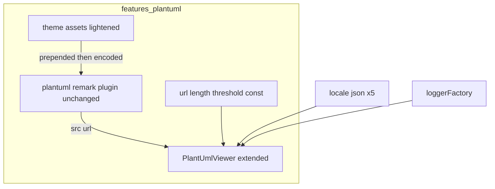
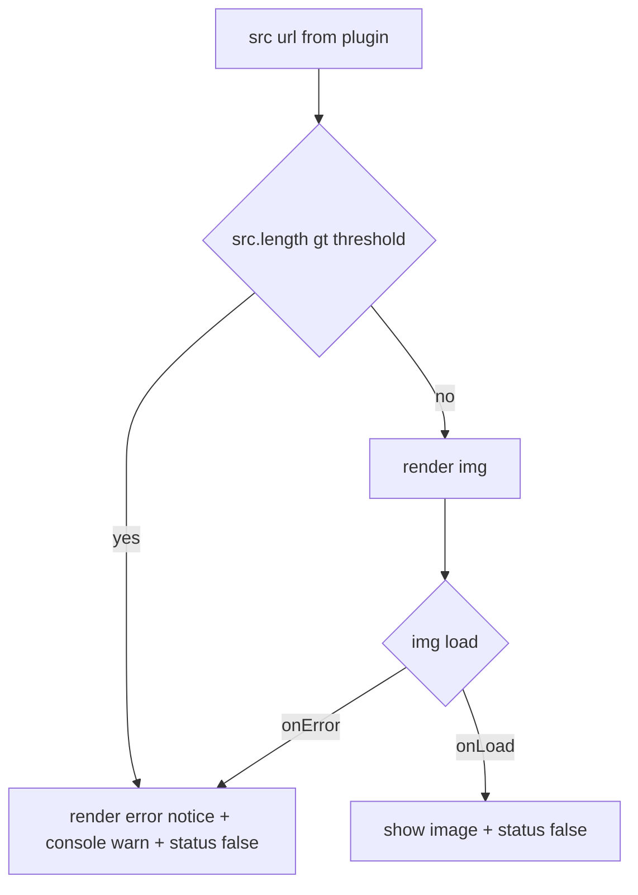

# Technical Design — plantuml-large-diagram-get

## Overview
**Purpose**: GET経路のPlantUML描画で、大きい図の体験を2点改善する ── (1) 付加テーマを軽量化してエンコード後URLを縮め、より多くの図を描画可能にする。(2) それでも上限を超える図には、分かりやすい画面エラー＋コンソール警告を出し「バグではなく制限」であることを伝える。
**Users**: 自前サーバを持たない利用者（公開plantuml.com / GROWI.cloud 含む全ユーザー）。
**Impact**: `features/plantuml` 内の**テーマ資産の縮小**と**`PlantUmlViewer` の拡張**のみ。GET送信・エンコード方式・auto-scroll等の枠組みは不変。極端に巨大な図の完全描画は別spec `plantuml-post-optin`（POST）が担う。

### Goals
- テーマ軽量化でエンコード後URLを短縮（ダークモード維持・図種別CSSなし）。
- 軽量化の効きを**実測**で確認（基準図が描画可能になるか）。
- GET描画失敗時に**分かりやすいエラー表示＋console警告**（onErrorを主判定、固定・安全側の閾値を保険）。

### Non-Goals
- POST送信による根本回避（別spec `plantuml-post-optin`）。
- 図の種類に応じたCSS切替（決定事項として不採用）。
- テーマの完全撤去（不採用。ダークモード維持のため）。
- サーバ/プロキシのURL長上限そのものの変更、閾値の設定化（固定）。

## Boundary Commitments

### This Spec Owns
- テーマ資産 `themes/carbon-gray-{common,light,dark}.puml.ts` の**内容の軽量化**（単一・静的テーマのまま縮小）。
- `PlantUmlViewer` の**URL長プリチェック**・**描画失敗検知（onError）**・**エラー表示UI**・**console警告**。
- 判定閾値の**固定定数**、およびエラーメッセージの**i18n（5ロケール）**。

### Out of Boundary
- POST経路・送信方式設定（`plantuml-post-optin`）。
- GET経路のエンコード実装（`@akebifiky/remark-simple-plantuml`）・URL生成の枠組み。
- 図種別スタイル選択、閾値の設定化。

### Allowed Dependencies
- 既存 `loggerFactory`（`~/utils/logger`、Mermaid手本）、`next-i18next` の `useTranslation`。
- 既存テーマ import 経路（`plantuml.ts` の `import ... from '../themes/carbon-gray-*.puml'`）は不変（中身だけ縮小）。
- ロケール資産 `apps/app/public/static/locales/*/translation.json`。

### Revalidation Triggers
- `PlantUmlViewer` の props 追加（もしあれば）→ `renderer.tsx` のマッピング／`PlantUmlViewer.spec.tsx`。
- **（クロススペック）別spec `plantuml-post-optin` が `PlantUmlViewerProps.src` を `string` → `src?: string` に緩める** → 本specのプリチェック（`src.length`）は `src != null`（＝GETモード）でのみ評価するガードが必須。
- 閾値定数の配置・値変更 → 参照箇所。
- テーマ資産から削除した要素に依存していた図の見た目（ダーク/ライト）→ 目視回帰。

## Architecture

### Existing Architecture Analysis
- `plantuml.ts`(:29) がテーマを図ソース先頭へ前置 → `@akebifiky/remark-simple-plantuml` が `image` ノード化（`node.url = <baseUrl>/svg/<deflate+base64>`）→ 2nd visit(:50-64) が `src = node.url` を `hName:'plantuml'` 要素の `hProperties.src` に格納。`plantumlUri.length===0` で早期return(:43)。
- `PlantUmlViewer.tsx`(32行): props は `src` のみ。`<div [status]='true'></div>`。onLoad/onErrorとも `handleLoaded` が status を `'false'` にするだけ（成否を区別しない）。
- テーマ資産は**素のTS文字列モジュール**（`export default style`）。特別なローダ無し ＝ **文字列編集で縮小可**。⚠️ **エンコード後サイズの主レバーはコメント・空白（＝ミニファイ）**であり、非UML `<style>` ブロックではない。実測(基準図・light): ミニファイで**テーマの encoded 寄与が 4,628→3,192字（寄与ベース31%減）＝図込みの全体URLでは 8,318→6,882字（全体17%減・着色は無傷）**。空白/インデントは deflate が既に圧縮するため、削減の主因はコメント/定義量であり全体では17%に落ち着く。非UMLブロック削除は効果が小さく（deflate が既に潰している）当該図種のダーク配色も失うため主レバーにしない（後述 File Structure Plan / theme assets 参照）。
- 手本: `MermaidViewer`(logger＋status遷移)、`DrawioViewerWithEditButton`(`useTranslation`/`t`)。

### Architecture Pattern & Boundary Map


**Architecture Integration**
- Selected pattern: **既存拡張（Extend）**。新アーキ・新依存なし。テーマは中身縮小、`PlantUmlViewer` に判定＋エラーUIを追加。
- **onError主・閾値保険**: 実際の描画失敗（onError）を真の判定とし、閾値は「明らかに巨大なURL」を先回りで弾く**極端に高い固定値**（誤検知回避。詳細は url-length threshold const 節）。
- 既存維持: ``描画、`GROWI_IS_CONTENT_RENDERING_ATTR` の status遷移、rehype-sanitize（`src` 許可は不変）。

### 依存方向（強制）
`consts(閾値)` / `locales` / `logger` → `PlantUmlViewer`。テーマ資産は `plantuml.ts` が import（既存・不変）。`PlantUmlViewer` はテーマを知らない（テーマは既に `src` にエンコード済み）。

### Technology Stack
| Layer | Choice | Role | Notes |
|---|---|---|---|
| Frontend | React（既存） | URL長プリチェック＋失敗検知＋エラーUI | `PlantUmlViewer` 拡張、新規依存なし |
| i18n | next-i18next（既存） | エラーメッセージ | 5ロケールにキー追加 |
| Logging | loggerFactory（既存） | console警告 | Mermaid手本 |
| Theme assets | `.puml.ts` 文字列（既存） | 軽量化 | 文字列編集のみ、ローダ不要 |

## File Structure Plan

### 変更ファイル
- `features/plantuml/themes/carbon-gray-common.puml.ts` — **軽量化の主対象**。**主レバー＝ミニファイ**: 行頭 `'`／`''` の PlantUML コメント行・行頭空白・空行を除去する（`!$VAR = '...'` のように `'` が行頭でない行は文字列リテラルなので残す）。
  - ⚠️ **削除ではなく「退避」が必要なコメントがある**: PlantUML コメントの中には、単なる説明ではなく**実装上のWHY（回避策・既知issue参照）**を記録したものが混ざっている。代表例が `ParticipantPadding`/`Padding` に関する注記（現行 `:45-49`）── 「これらを `skinparam` として宣言しないのは、宣言すると PlantUML が全図に "Please use CSS style instead of skinparam <name>" 警告を焼き込むため（#11258）。`ParticipantPadding` は下の `sequenceDiagram <style>` ルールで代替し、汎用 `Padding` は動作するCSS等価物が無い（plantuml/plantuml#2622）ため捨てている」という**消すと再発する類の知識**である。関連して `sequenceDiagram`(:448-449) の `Padding`/`Margin` 注記も同種。
  - **方針**: この種のコメントはミニファイで**消してよいが、消す前に TypeScript コメントへ退避**する。テーマ資産は `const style = \`…\`; export default style;` という単一テンプレートリテラルであり、リテラル内部に TS コメントは書けないため、**ファイル先頭（リテラル外）の TSDoc ブロックに「テーマ不変条件」節としてまとめて移す**。これでソース上のWHYは保全され、**エンコード後ペイロードには一切載らない**（＝削減効果はそのまま）。
  - **判定基準**: 「なぜこの定義がこう書かれているか／なぜこれを書かないか」を説明するコメントは退避対象。「何をしているか」を反復するだけのコメント（`' Colors` 等）は単に削除してよい。着色・skinparam・`<style>` 定義は**一切削除しない**ため、全図種の見た目（ライト/ダーク）が不変。⚠️ **副次レバー（任意）**: なお追加削減が要る場合に限り、非UML系 `<style>` 定義（board/gantt/json/mindmap/salt/wbs/wire/yaml）の削除を検討できるが、**それらの図種はダーク配色を `<style>` でしか着色できず、削除するとダークモードで判読不能になる**（グローバル `defaultFontColor` は無く背景は transparent）。採用するなら「ダーク既定色フォールバックを1行追加」等の緩和とセットにする。`sequenceDiagram`(:452-458) と `timingDiagram`(:608-627) はUML図なので**常に残す**。
- `features/plantuml/themes/carbon-gray-light.puml.ts` / `carbon-gray-dark.puml.ts` — 同様にミニファイ。参照されていないパレット階調があれば整理してよいが（`$GRAY/$LIGHT/$DARK/$PRIMARY` 等の実使用分は残す＝ダークモード維持）、削減の主因はミニファイである。
- `features/plantuml/components/PlantUmlViewer.tsx` — (1) `src.length > 閾値` のプリチェックで画像を出さずエラーUIへ、(2) `onError` を `handleLoaded` から分離し `useState` のエラーフラグ→エラーUI、(3) `useTranslation` でメッセージ、(4) `loggerFactory` で warn、(5) 成功/失敗/超過いずれも `GROWI_IS_CONTENT_RENDERING_ATTR` を `'false'` に遷移。
- `apps/app/public/static/locales/{en_US,ja_JP,fr_FR,ko_KR,zh_CN}/translation.json` — エラーメッセージ用キーを5ロケール追加。

### 新規ファイル
- `features/plantuml/consts.ts` — 2定数を定義（単一の出所）: `PLANTUML_GET_URL_MAX_LENGTH`（**ブロック用**・固定・安全側の高い値）と `PLANTUML_GET_URL_LIKELY_OVERSIZE_LENGTH`（**文言選択用**の目安値・実測失敗点ベース≈8,000字。ブロックには使わない）。後者は別spec `plantuml-post-optin` の Req 11 からも参照される。

> エラーUIは当面 `PlantUmlViewer.tsx` 内のプレースホルダ要素として実装（小規模）。肥大化する場合のみ小コンポーネントへ抽出。`plantuml.ts` は変更しない（テーマは中身のみ縮小、判定はViewer側）。

## System Flows

### GET描画の判定フロー

**決定**
- 真の判定は **onError**（環境の実上限に依存する失敗を確実に捕捉、誤検知ゼロ）。閾値は**明らかに巨大なURLの先回り**（無駄なリクエスト回避）。
- エラー時も status を `'false'` にする（auto-scroll退行防止）。

## Requirements Traceability
| Requirement | Summary | Components | Flows |
|---|---|---|---|
| 1.1/1.2/1.3 | テーマ軽量化でURL短縮（公開サーバでも有効） | theme assets | prepend→encode |
| 2.1/2.2 | ダークモード配色維持 | theme assets（palette 残置） | — |
| 3.1 | 図種別CSS切替なし（単一静的） | theme assets | — |
| 4.1 | 描画挙動の後方互換 | theme assets, PlantUmlViewer | — |
| 5.1 | 軽量化の効きを実測 | theme assets（測定手順/テスト） | — |
| 6.1 | onErrorで失敗検知→エラー表示 | PlantUmlViewer | onError |
| 6.2 | 閾値超過は先回りでエラー | PlantUmlViewer, consts | threshold |
| 7.1/7.2 | 分かりやすいメッセージ＋対処 | PlantUmlViewer, locales | error |
| 7.3 | console警告 | PlantUmlViewer, logger | error |
| 7.4 | 他の図/本文を妨げない | PlantUmlViewer（図単位） | — |
| 7.5 | メッセージのi18n(5ロケール) | locales | — |
| 8.1/8.2 | 閾値=固定・安全側（onErrorが真判定）。ブロック閾値と文言用の目安値を分離 | consts, PlantUmlViewer | threshold |

## Components and Interfaces

| Component | Layer | Intent | Req | Contracts |
|---|---|---|---|---|
| theme assets (lightened) | Client/asset | テーマ縮小・ダーク維持・単一静的 | 1,2,3,4,5 | State |
| url-length threshold const | Client/const | 固定・安全側の判定値 | 6.2,8 | State |
| PlantUmlViewer (extended) | Client/UI | プリチェック＋失敗検知＋エラーUI＋警告 | 4,6,7,8 | State |
| oversize error message (i18n) | Client/i18n | 5ロケールのメッセージ | 7 | State |

### theme assets（軽量化）— 変更
**Responsibilities & Constraints**
- 単一・静的テーマを縮小。**主レバー＝ミニファイ**（コメント行・行頭空白・空行の除去）。着色・skinparam・`<style>` 定義は削除しないため、**ダーク配色と全図種の見た目が不変**（#1 の退行が原理的に発生しない）。
- **副次レバー（任意・要緩和）**: 非UML系 `<style>` 定義の削除は追加削減が必要な場合のみ。ただし当該図種（board/gantt/json/mindmap/salt/wbs/wire/yaml）は skinparam で着色できず `<style>` が唯一の着色手段で、削除するとダークモードで既定の黒文字＋transparent背景となり判読不能。採用時は「ダーク既定色フォールバック」等の緩和とセットで。`sequenceDiagram`／`timingDiagram` はUML図なので常に残す。
- 図種別の切替ロジックは持たない（全図一律）。前置は文字列そのままなので削減分だけURLが縮む。
- **削減は段階適用し、基準図のエンコード後URL長を都度実測**（Req 5）。**実測（報告図・light）: フルURL 8,318→6,882字**＝ Tomcat 既定 `maxHttpHeaderSize`=8192 内（余裕 約1,310字）。⚠️ 8192 は**リクエスト行＋全ヘッダ込み**なので、自前サーバで **Cookie 等ヘッダが乗ると余裕が目減り**する（公開plantuml.com は Cookie 無しで安全側）。残余（桁違いに巨大な図）は本specのエラー表示＋別specのPOSTで受ける。

**Implementation Notes**
- Integration: `plantuml.ts` の import は不変。中身のみ縮小。
- Validation: 削減後にライト/ダークで**全図種**（UML主要図種＋ミニファイでも残る非UML図種）の見た目回帰を目視確認。
- Risks: ミニファイで `'` コメントと文字列リテラルを取り違えない（行頭判定）。**WHYコメント（`ParticipantPadding`/`Padding` の #11258・plantuml#2622 注記など）を退避せずに消すと、後任が「なぜ skinparam で書かないのか」を失って警告付きテーマへ戻してしまう**（退避先＝ファイル先頭の TSDoc）。副次レバー（非UML削除）を採る場合のみ当該図種の既定色化リスクがある。

### url-length threshold const — 新規
```typescript
// features/plantuml/consts.ts

// (1) ブロック閾値: 固定・極端に高い保険値。真の判定は onError。
export const PLANTUML_GET_URL_MAX_LENGTH: number;

// (2) 目安値（ブロックしない）: 実測失敗点ベース。onError の原因が
//     「URL長超過らしい」かを文言選択のためだけに判断する。
export const PLANTUML_GET_URL_LIKELY_OVERSIZE_LENGTH: number;
```

**2つの定数を分ける理由（役割が違う）**:

| 定数 | 値の水準 | 何をするか | 誤りのコスト |
|---|---|---|---|
| `PLANTUML_GET_URL_MAX_LENGTH` | 極端に高い（例 16,000〜32,000字級） | **リクエストをブロック**する | 誤検知＝**描画できる図が出なくなる**（重い）→ 安全側に高く |
| `PLANTUML_GET_URL_LIKELY_OVERSIZE_LENGTH` | 実測失敗点ベース（**約8,000字**。Tomcat 既定 `maxHttpHeaderSize`=8192）。⚠️ 根拠となる実測値は spec 内で2つあり、**同じ指標かが未確定**: requirements.md「テーマ有り約8,014字→**400**」と design.md「フルURL **8,318**→6,882字」。前者は 414 ではなく 400 で、送信先/測定対象（エンコード部分長か全URL長か）が異なる可能性がある。**実装時に task 2.2 の実測で `src.length` 基準の失敗点を1つに確定させ、この定数値を最終決定する** | **既に失敗した後の文言を選ぶ**だけ | 誤りは**文言のニュアンスがずれる**のみ（軽い）→ 実測値に置ける |

- ブロック閾値を実測失敗点（約8,000字）まで下げてはならない: **上限を上げた自前GETサーバでは正常な図を誤ブロック**する（Req 8.2）。プリチェックは「明らかに巨大なURLの無駄リクエスト回避」に限り、**実際の失敗は onError が捕捉**（Req 6.1）。設定化はしない（Req 8.1）。
- ⚠️ **その結果、既定構成（公開plantuml.com / Tomcat 8192）で実際に起きる失敗は、ほぼすべて onError 経路を通る**（プリチェックはまず発火しない）。これは設計どおり ── プリチェックは保険であり、`oversize-precheck` 文言は「桁違いに巨大な図」専用の稀な経路である。実務上の主経路は `render-failed-generic`（ヘッジ文言）であり、その中で **`src.length >= PLANTUML_GET_URL_LIKELY_OVERSIZE_LENGTH` なら「URL長超過の可能性が高い」寄りのニュアンス**を選ぶ（Req 7.1-b。判定＝ブロックには使わない）。
- 目安値は別spec `plantuml-post-optin` の Req 11（POST推奨メッセージの表示条件）からも参照される。**単一の出所は本specの `consts.ts`**（post-optin は import して使う）。

### PlantUmlViewer（拡張）— 変更
**Responsibilities & Constraints**
- props は現行の `src` を維持。内部で `src.length > PLANTUML_GET_URL_MAX_LENGTH` を判定（再エンコード不要）。
- ⚠️ **クロススペック注記（`src` の任意化）**: 本spec単体では `src: string`（必須）のままでよいが、別spec `plantuml-post-optin` はPOSTモードで URL を組み立てないため `src` を付与せず、**`PlantUmlViewerProps.src` を `src?: string` へ広げる**（型変更の所有は post-optin 側）。そのため本specのプリチェックは、**post-optin がマージされた時点で `method==='get'` かつ `src != null` のガード下でのみ評価される**必要がある（さもないと POSTモードで `undefined.length` により実行時エラー）。本specの実装時点では、プリチェックを**「`src` が存在する場合のみ評価する」形（`src != null && src.length > 閾値`）で書いておく**と、後続の型緩和を無改修で受けられる。
- 分岐: 超過 or `onError` → **エラーUI**（`t()` メッセージ＋対処）＋ `logger.warn`。正常 → ``。
- いずれの分岐でも `GROWI_IS_CONTENT_RENDERING_ATTR` を `'false'` に遷移（Req 6/8、auto-scroll非退行）。
- 各Viewerは独立（1つの失敗が他の図・本文を妨げない、Req 7.4）。

**Contracts**: State（描画ステータス属性＋内部エラーフラグ）

**Implementation Notes**
- Integration: `next-i18next` `useTranslation` と `loggerFactory('growi:features:plantuml:PlantUmlViewer')` を追加（Mermaid手本）。
- Validation: onError/閾値超過/正常 の3分岐で status='false' を担保。
- Risks: status遷移漏れ→auto-scroll退行（テストで固定）。

### oversize error message（i18n）— 変更
- 5ロケール（en/ja/fr/ko/zh）の `translation.json` に**2種のメッセージキー**を追加する:
  - `oversize-precheck`: プリチェックで固定閾値を超えた場合（画像リクエスト前）。**「URL長上限により表示できない可能性が高い」**と断定寄りの文言（Req 7.1）。
  - `render-failed-generic`: `` の onError による失敗。クライアントは `` のHTTPステータスを読めないため原因を断定できない。**「表示できない（原因: URL長上限の可能性・図の構文エラー・PlantUMLサーバ未到達 のいずれか）」**とヘッジする（Req 7.1-b）。`src.length >= PLANTUML_GET_URL_LIKELY_OVERSIZE_LENGTH`（実測失敗点ベースの目安値）なら「URL長上限の可能性が高い」寄りのニュアンスを選んでよいが、**ブロック判定には用いない**。既定構成の失敗はほぼこの経路を通る（プリチェックは桁違いに巨大な図専用の保険）。
- いずれも**汎用の対処（図の分割・簡略化）**を併記（Req 7.2）。
- **POST/自前サーバの推奨は本specに含めない**。POST推奨メッセージは別spec `plantuml-post-optin` が（POST利用可能な文脈で）担う。→ 本specは spec間の出荷順に依存しない。
- 技術的原因（URL長超過の可能性）は console 警告（Req 7.3）側に出す。

## Error Handling
- **クライアント**: `onError` または `src.length` 超過を捕捉し、当該図をエラーUIへ差し替え（Req 6.1/6.2/7）。他の図・本文は不影響（Req 7.4）。`logger.warn` で原因を出力（Req 7.3）。
- ページ本文の描画は妨げない。
- **文言は検知経路で分岐**: プリチェック超過は「URL長上限の可能性が高い」（`oversize-precheck`）。onError は URL長超過・構文エラー(plantuml-server 400)・サーバ拒否/切断/オフラインを区別できず**同じ経路に集約されるため、原因を断定しないヘッジ文言**（`render-failed-generic`）を用いる。

## Testing Strategy

### Unit / Component
- `plantuml.spec.ts`: 軽量化後テーマが**ミニファイされている**（行頭 `'` コメント行・空行が消え、`!$VAR = '...'` 等の文字列リテラル行と着色/skinparam/`<style>` 定義は残存 ── 例として `mindmapDiagram` 等の非UML `<style>` も**残っている**）／テーマ前置後の**ソース長が縮小**していること（light/dark両方、`it.each`）。※副次レバー（非UML削除）を採用した場合のみ、当該ブロックの消失をあわせて検証する。
  - **退避したWHYは失われていないこと**は、テーマ文字列ではなく**ソースファイルの TSDoc に対する目視/レビューで担保**する（文字列に残っていないことが正なので、テストで文字列を検索してはならない）。`skinparam ParticipantPadding` / `skinparam Padding` が**テーマ文字列に復活していない**ことは回帰テストで固定できる（復活＝全図に警告が焼き込まれる #11258 の再発）。
- `PlantUmlViewer.spec.tsx`:
  - 正常: `fireEvent.load` → `` 表示、status='false'（現行維持, 4.1）。
  - onError: `fireEvent.error` → **エラーUI表示**＋status='false'（6.1, 7）。※現行はstatusのみ検証なので拡張。
  - 閾値超過: 閾値超の `src` を渡す → 画像を出さずエラーUI（6.2, 8）。
  - i18n: `useTranslation` をモック（`t=>key`）しメッセージ描画を検証（7.5）。
  - console: `logger.warn` 呼び出しを検証（7.3）。

### 実測（Req 5・設計〜実装の検証）
- 軽量化テーマ ＋ 基準図（今回の問い合わせ図）を `plantuml-encoder` で符号化し、**エンコード後URL長が目標（<主要上限）に収まるか**を測るスクリプト/テストを1本。段階削減の判断根拠にする。

### 目視回帰
- ライト/ダークで主要図種（class/sequence/activity/component/state/note）が崩れないこと。ミニファイ主体なら**非UML図種（gantt/mindmap/json 等）もダークで判読可能なまま**であること（副次レバーで削除した場合のみ、その図種の見た目劣化を許容範囲として明示的に確認）。

## Security / Performance（要点）
- Security: 追加の外部通信・入力経路なし（`src` は既存のサニタイズ済み経路）。エラーUIは静的テキスト＋i18n。
- Performance: テーマ縮小でURL・ページ転送が減る（全図で軽くなる）。閾値プリチェックは無駄な失敗リクエストを削減。
