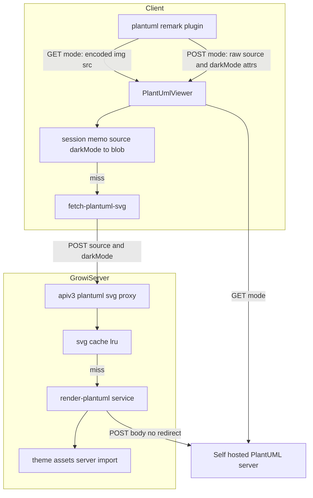

# Technical Design — plantuml-post-optin

## Overview
**Purpose**: 大きなPlantUML図がエンコード後URLの長さ超過で描画に失敗する問題を、図ソースをリクエストボディに載せて送信する **POST経路の追加（opt-in）** で根本解消する。
**Users**: 自前PlantUMLサーバを運用するGROWI管理者が設定でPOSTを有効化し、その配下の閲覧者が大きな図をリネームや分割なしに閲覧できる。
**Impact**: 既定は現行のGET（`">`）を維持。POST有効時のみ、GROWIサーバ内の描画プロキシを経由してSVGを取得し、``（blob URL）で表示する経路が追加される。

### Goals
- 送信方式（GET/POST）を管理者設定で切替可能にする（既定GET）。
- POST時、GET方式でURL長超過となる図を正しく描画する。
- 既存のGET経路・描画結果・パフォーマンスを一切変更しない。
- 受信SVGの安全な表示、送信先の限定、描画経路の悪用・過負荷対策を満たす。

### Non-Goals
- GET側の大きい図対応（テーマ軽量化＋上限超過時のエラー表示。別spec `plantuml-large-diagram-get`）。
- 公開 plantuml.com でのPOST対応（サーバ側非対応＝実測により不可能）。
- PlantUMLサーバ自体の構築・運用手順の提供。
- 管理画面へのUI追加（本specは環境変数ベースの設定に限定。UI化は将来課題）。
- SSR／印刷／PDF一括エクスポートでの図描画。⚠️ **これは「POSTモード固有の限界」ではない ── 現状 GET/POST いずれのモードでも、これらの経路に PlantUML 図は出ていない**（コードで確認済み。以下）。本specはこれらの経路について**退行も改善もさせない**ので、POST の制約として書いてはならない。
  - **SSR**: `PageView.tsx:112,176-177` は `useViewOptions()`（SWR ＋ `~/client/services/renderer/renderer` の非同期 dynamic import）の結果を `rendererOptions` として渡すが、SSR 時点では未解決のため `PageContentRenderer.tsx:26-27` が `generateSSRViewOptions()` にフォールバックする。この SSR 用レンダラ（`services/renderer/renderer.tsx:148-180`）は math / xsv-to-table / breaks ＋ rehype slug・sanitize・katex しか登録しておらず、**`plantuml` の文字列すら含まない（grep で 0 hit）**。したがって SSR HTML に `<plantuml>`/`` は出ず、図は **hydration 後にクライアントレンダラが引き継いで初めて描画される**（GETモードでも同じ）。`PageContentRenderer` の `dynamic(..., { ssr: true })` は「コンポーネントがSSRされる」だけで、「plantuml プラグインが SSR 経路に登録されている」ことを意味しない。
  - **PDF一括エクスポート（`page-bulk-export`）**: `markdown/plugin-set.ts` の除外理由コメント（`:139-142`）が `plantuml` を drawio/mermaid/lsx 等と同じ「React コンポーネント/ブラウザDOM駆動のため、忠実な描画には React SSR かブラウザが要る」グループとして挙げており、`ADOPTED_PLUGINS` に含まれない。出力は `bulk-export-markdown-renderer.spec.ts:162-166` が「plantuml の fenced code block は `<pre>`/`<code>` として出力される」ことを回帰として固定している。
  - **将来 SSR/エクスポートに PlantUML を載せる場合の構造的な差（設計上の注意）**: GET は「ソースをエンコードしてURLを組む」だけの**同期変換**なので原理的に SSR 可能。POST は**プロキシへの非同期取得が前提**なので、そのままでは SSR できない（サーバ側で待ち合わせて埋め込む等の別設計が要る）。この差は将来 renderer-convergence フェーズで扱う。

## Boundary Commitments

### This Spec Owns
- 新設定 `app:plantumlHttpMethod`（`get` | `post`、既定 `get`）の定義とクライアント伝播。
- PlantUML描画の送信方式分岐（`features/plantuml` 配下の remark プラグインと表示コンポーネント）。
- 新設のサーバ側描画プロキシ（生ソース＋darkMode受領 → テーマ前置 → `PLANTUML_URI` へPOST → SVG返却）とそのSVGキャッシュ。
- POST経路のアクセス制御・入力サイズ/タイムアウト上限・誤設定検知。
- **POST推奨メッセージ（Req 11）**: GET時、**URL長超過が疑わしい失敗（プリチェック超過 or `src.length` が目安値以上）**かつ**送信先が公開 plantuml.com でない**（＝POSTに切り替えられる見込みがある）場合に「自前サーバ＋POSTで解決可」を案内する文言とi18n。構文エラー/サーバ停止等（URL長でない失敗）や、送信先が公開 plantuml.com の環境では出さない。表示体は別spec `plantuml-large-diagram-get` のエラーUIに**相乗り**（本specは推奨行の追加と**送信先による実行時判定** `isPlantumlPostCapableUri` を担う）。
- **POST経路の失敗メッセージ文言とそのi18n（`method==='post'` 分岐, Req 6.3/6.4）**を本specが所有する。get spec のエラーUI文言は GET失敗にのみ適用され、エラーUIは `method` で分岐する（GET向け文言を POST に出さない）。

### Out of Boundary
- GET経路の内部実装（`@akebifiky/remark-simple-plantuml` によるエンコード）と現行テーマ前置ロジックのGET側見直し。
- PlantUMLサーバの提供・バージョン管理・ネットワーク到達性。
- 管理画面のUI/フォーム追加。
- ページ単位の**権限**照合（本経路はページ本文の権限は評価しない）。ただしアクセス制御は「インスタンスのゲスト許可ポリシー追従」に加え、**共有リンク文脈では任意の `pageId`＋`shareLinkId` を受け取り `certifySharedPage` で共有リンクの有効性のみ検証**する（GETモード同等の匿名描画を可能にするため。粒度は `get-page-info` と同じ粗粒度＝「有効な共有ページ閲覧者か」の判定に留め、`source` 個別の権限照合はしない ── 共有閲覧者は元々ページ本文で全PlantUMLソースを閲覧できるため露出は増えない）。

### Allowed Dependencies
- 設定伝播チェーン: `config-definition` → `configuration-props` → `RendererConfig`(interface) → `rendererConfigAtom` → `renderer.tsx`。
- サーバHTTP: 既存 `axios`（`ogp.ts` の外部取得パターンに準拠）。
- apiv3 ルート登録機構（`server/routes/apiv3/index.js`）と既存の認証／検証ミドルウェア: `loginRequiredFactory(crowi, true)`、共有ページ証明 `middlewares/certify-shared-page`（ボディの `pageId`/`shareLinkId` を読む既存実装をそのまま再利用）、`middlewares/reject-link-sharing-disabled`（共有無効インスタンスのキルスイッチ）。
- 既存テーマ資産 `features/plantuml/themes/*.puml.ts`（サーバ側からも import 可能な純粋な文字列モジュール）。
- **（Req 11）別spec `plantuml-large-diagram-get` が新設する `PlantUmlViewer` のエラーUI**（POST推奨行の差し込み先）。→ **順序依存: large-diagram-get 先 → 本specのReq 11 後（or 同時）**。

### Revalidation Triggers
- `RendererConfig` の形状変更（`plantumlHttpMethod` 追加）→ `RendererConfig` を参照する全テスト/モック（例 `PageContentRenderer.spec.tsx`）。
- 新apiv3エンドポイント契約（`POST /_api/v3/plantuml/svg`）の変更 → クライアント取得ユーティリティ。
- `<plantuml>` カスタム要素の属性追加 → `sanitizeOption`（rehype-sanitize 許可リスト）。
- テーマ資産のサーバ側 import 可否が崩れた場合 → プロキシのテーマ前置。
- **（Req 11・クロススペック）`PlantUmlViewer.tsx` / `plantuml.ts`(sanitizeOption) / `locales/*` を large-diagram-get と共有変更**する → どちらかの改修で相手のテスト/UIに影響。実装は large-diagram-get のエラーUI確定後に相乗り。
- **（クロススペック）`PlantUmlViewerProps.src` を `string` → `src?: string` へ緩める**（POSTモードでは `src` を付与しないため）→ large-diagram-get が実装した **GET側プリチェック（`src.length`）を `method==='get'` かつ `src != null` でガード**する必要がある。ガードが無いと POSTモードで `undefined.length` により実行時エラー。`PlantUmlViewer.spec.tsx` の GET/POST 双方のケースを併せて更新する。

## Architecture

### Existing Architecture Analysis
- PlantUML描画は `features/plantuml/` に集約。remark プラグイン [plantuml.ts](../../../apps/app/src/features/plantuml/services/plantuml.ts) が code ブロックにテーマを前置し、`@akebifiky/remark-simple-plantuml` で `GET /svg/<deflate+base64>` URL を持つ `<plantuml src>` 要素を生成。[PlantUmlViewer.tsx](../../../apps/app/src/features/plantuml/components/PlantUmlViewer.tsx) が `` として描画し、`GROWI_IS_CONTENT_RENDERING_ATTR` で auto-scroll と連携。
- 設定 `app:plantumlUri`（既定 `https://www.plantuml.com/plantuml`）は SSR props（`configuration-props.ts`）→ `RendererConfig` → Jotai atom → `renderer.tsx` で remark プラグインへ渡る。
- 外部HTTP取得の前例は [ogp.ts](../../../apps/app/src/server/routes/ogp.ts)（apiv3レベルで `axios` により取得しバイナリを返す）。
- テーマ資産 `themes/carbon-gray-*.puml.ts` は文字列を default export する純粋なTSモジュールで、ブラウザ専用依存を持たない（サーバ側 import 可能）。
- **維持すべき統合点**: `<plantuml>` → `PlantUmlViewer` のマッピング、rehype-sanitize 許可リスト合成、rendering-status 属性ライフサイクル。

### Architecture Pattern & Boundary Map



**Architecture Integration**:
- Selected pattern: **サーバサイド・レンダリングプロキシ**（ブラウザ→GROWI→PlantUMLサーバ）。CORS回避、PlantUMLサーバの秘匿、テーマ前置の集約、サーバ側キャッシュ、誤設定検知を一箇所で担保。
- **B1（プロキシが直接SVGを返す1往復）を採用**。B2（ハッシュを返し別GETで配信）はマルチインスタンス構成でGET側がキャッシュミス（別インスタンス）→404になり得るため不採用。B1は各POSTが本文完結で、キャッシュはあくまで最適化（miss時は手元の本文から再描画）なので水平スケールに堅牢。
- Feature 境界: 追加コードは `features/plantuml/{client,server}` に閉じる。設定伝播のみ既存チェーンに1項目追加。
- 既存パターン維持: `` 描画（GET/POST共通）、rendering-status 属性、rehype-sanitize 合成。

### 依存方向（強制）
`interfaces/constants`（型・エンドポイント定数） → `config` → `server(theme → cache → render → proxy route)` / `client(fetch-util → memo → viewer)`。クライアントとサーバは共有する型・エンドポイント定数・契約のみで結合し、相互に実装を import しない。

### Technology Stack

| Layer | Choice / Version | Role in Feature | Notes |
|-------|------------------|-----------------|-------|
| Frontend | React（既存） | POST時のSVG取得と `` 描画、セッション内メモ | 新規 `fetch-plantuml-svg` ＋メモ |
| Backend | Express apiv3（既存） | 描画プロキシ `POST /_api/v3/plantuml/svg` | `ogp.ts` パターン準拠、`loginRequired` で保護 |
| HTTP client | axios（既存） | PlantUMLサーバへ生テキストPOST | `maxRedirects: 0`, `timeout` 設定 |
| Cache | lru-cache（新規依存） | `hash(source, darkMode)` → SVG のTTL/件数上限付きキャッシュ | `.claude/rules/package-dependencies.md` に従い `dependencies` へ |
| Hash | node:crypto（標準） | ソース＋darkMode の sha256 でキャッシュキー生成 | 追加依存なし |

## File Structure Plan

### 新規ファイル
```
apps/app/src/features/plantuml/
├── interfaces/
│   └── post-rendering.ts        # 送信方式型('get'|'post')、エンドポイントパス定数、リクエスト/レスポンス型、サイズ/タイムアウト上限定数（client/server共有）、`isPlantumlPostCapableUri()`（Req 11.2 の送信先判定）
├── client/services/
│   └── fetch-plantuml-svg.ts    # 生ソース+darkModeをプロキシへPOSTしSVG Blobを返す＋セッション内メモ（source,darkMode→blob URL）
└── server/
    ├── routes/
    │   └── svg.ts               # apiv3 factory: 認証→サイズ制限→cache→render→SVG返却
    └── services/
        ├── render-plantuml.ts   # テーマ前置→axiosでPLANTUML_URIへ生テキストPOST（maxRedirects:0, timeout）→SVG
        └── svg-cache.ts         # lru-cache（key: sha256(source+darkMode)）。単一責務のキャッシュ
```
> テーマは `render-plantuml.ts` が既存 `features/plantuml/themes/*.puml.ts` をサーバ側 import して前置する（クライアントはテーマを持たない）。

### 変更ファイル
- `server/service/config-manager/config-definition.ts` — `app:plantumlHttpMethod` を CONFIG_KEYS と defineConfig に追加（`envVarName: 'PLANTUML_HTTP_METHOD'`, 既定 `'get'`）。
- `interfaces/services/renderer.ts` — `RendererConfig` に `plantumlHttpMethod: 'get' | 'post'` を追加。
- `pages/general-page/configuration-props.ts` — `plantumlHttpMethod` を props 化（通常/share-link 両方）。
- `states/server-configurations/server-configurations.ts` — `rendererConfigAtom` 既定に `plantumlHttpMethod: 'get'` を追加。
- `client/services/renderer/renderer.tsx` — remark プラグイン登録3箇所へ `plantumlHttpMethod` を受け渡し。
- `features/plantuml/services/plantuml.ts` — `PlantUMLPluginParams` 拡張。POST時は encoded GET URL を生成せず、また**テーマを前置せず**、生の図ソースと darkMode を `<plantuml>` 要素の属性に載せる分岐。`sanitizeOption` に新属性を許可。GET時は現行通り（テーマ前置＋encoded src）。
- `features/plantuml/components/PlantUmlViewer.tsx` — POST時は `fetch-plantuml-svg`（メモ経由）でSVGを取得し blob URL を `` に設定（rendering-status維持、unmountでrevoke）。GET時は現行のまま。
- `server/routes/apiv3/index.js` — `svg.ts` factory を `/plantuml` にマウント。
- **（Req 11）** `features/plantuml/services/plantuml.ts` — GET分岐で `<plantuml>` に**送信方式（またはPOST可否）を `hProperties`（`data-*`）で付与**し、`sanitizeOption` に許可追加（POST推奨判定をViewerに渡す）。
- **（Req 11・共有変更）** `features/plantuml/components/PlantUmlViewer.tsx` — large-diagram-get のエラーUIに、**`method==='get'` かつ URL長超過が疑わしい時（プリチェック超過 or `src.length` が大）だけ POST推奨行**（`t()`）を追記（構文エラー/サーバ停止では出さない）。※large-diagram-get と同一ファイルを変更（相乗り）。
- **（Req 11）** `apps/app/public/static/locales/{en_US,ja_JP,fr_FR,ko_KR,zh_CN}/translation.json` — POST推奨の文言キーを5ロケール追加（large-diagram-get の汎用文言とは別キー）。
- テスト: `plantuml.spec.ts`, `PlantUmlViewer.spec.tsx`, `PageContentRenderer.spec.tsx`(mock更新), `config-definition.spec.ts`(key一覧), 新規 `server/routes/svg.integ.ts`。**（Req 11）** `PlantUmlViewer.spec.tsx` に「GET＋URL長超過疑い（プリチェック超過 or `src.length`大）で POST推奨行が出る／POSTモード・上限内の onError（構文エラー/サーバ停止想定）では出ない」を追加。

## System Flows

### POST描画フロー（テーマ前置・キャッシュ・誤設定検知・アクセス制御含む）
```mermaid
sequenceDiagram
    participant V as PlantUmlViewer
    participant M as session memo
    participant F as fetch-plantuml-svg
    participant P as apiv3 proxy
    participant C as svg-cache
    participant R as render-plantuml
    participant S as PlantUML server
    V->>M: get(source, darkMode)
    alt memo hit (same SPA session)
        M-->>V: Blob
    else memo miss
        M->>F: fetch
        F->>P: POST /_api/v3/plantuml/svg {source, darkMode, pageId?, shareLinkId?}
        P->>P: certifySharedPage → loginRequired(guest=true) / 本文サイズ検査(ハンドラ内)
        P->>C: get hash(source, darkMode)
        alt cache hit
            C-->>P: SVG
        else miss
            P->>R: render
            R->>R: darkMode に応じテーマ前置
            R->>S: POST /svg (maxRedirects:0, timeout)
            alt 2xx かつ SVG
                S-->>R: SVG
                R-->>P: SVG
                P->>C: set
            else 上流4xx (図ソース/構文エラー)
                S-->>R: 400 + X-PlantUML-Diagram-Error
                R-->>P: throw ClientDiagramError
                P-->>F: 422 (構文エラー; ヘッダ転送可)
            else 上流3xx(誤設定)/5xx(上流失敗)/timeout
                S-->>R: redirect / error / timeout
                R-->>P: throw
                P-->>F: 502 or 504
            end
        end
        P-->>F: 200 image/svg+xml
        F->>M: set Blob
        F-->>V: Blob
    end
    V->>V: mount単位で objectURL 生成 → img src / onLoad で描画完了 / unmountで自分の分をrevoke
```

**フロー上の決定**:
- **アクセス制御（10.1/10.3）**: チェーンは `certifySharedPage → loginRequiredFactory(crowi, true)`。通常ページ（ログイン/ゲスト許可）は従来どおり通る。共有リンク閲覧では body の `pageId`＋`shareLinkId` を `certifySharedPage` が検証し `req.isSharedPage` を立て、`loginRequired` のゲストパス（`isGuestAllowed && req.isSharedPage`）で匿名描画を許可 ── **GETモードと同等の匿名描画を実現**（Req 10.3）。`certifySharedPage` は必ず `loginRequired` の**前**に置く（フラグを立てる順序依存）。`loginRequired` は必ず `isGuestAllowed=true` で構築する。ページ単位権限は評価しない（`get-page-info` と同じ粗粒度）。
- **誤設定検知（9.3）／上流ステータスの区別（6.3, #5）**: `maxRedirects: 0`。POST対応サーバは200でSVGを直接返す。公開plantuml.com等は302を返す＝誤設定→502。**上流ステータスは class を保存する**: 上流4xx（特に構文エラー400）は利用者起因の**図ソースエラー→422**（`X-PlantUML-Diagram-Error` を転送可、誤設定扱いにしない）、上流3xx=誤設定→502、上流5xx=上流失敗→502、timeout→504。黙って誤描画はしない。
- **XSS（4.1）**: SVGは常に ``（blob URL）で描画。画像コンテキストではSVG内スクリプトは実行されないため、インラインSVG用サニタイザは不要。
- **テーマ（7.1/7.2）**: プロキシ（`render-plantuml`）が darkMode に応じテーマを前置。クライアントはテーマを送らないためDOM・転送量が増えない。
- **キャッシュ（5.1/5.2）**: サーバLRU（`hash(source,darkMode)`）で上流再描画を回避。クライアントのセッション内メモ（**`Blob` を保持**）でSPA遷移時の再取得を回避。POSTのためブラウザHTTPキャッシュは効かないが、両キャッシュで実用速度を確保（Req 5はSHOULD）。
- **過負荷（10.2）**: プロキシは**ハンドラ内で本文サイズを検査**し上限超過は413、上流タイムアウトで 5xx を返し中止。※グローバル `bodyParser.json({limit:'50mb'})` がルート前に本文を消費するため、ルート単位パーサの `limit` では413が発火しない。`Content-Length`／`req.body` サイズをハンドラで明示検査する。

## Requirements Traceability

| Requirement | Summary | Components | Interfaces | Flows |
|-------------|---------|------------|------------|-------|
| 1.1 | 未設定は既定GET | config-definition, renderer.tsx | `plantumlHttpMethod`(既定'get') | — |
| 1.2 | POST設定で以降POST | plantuml.ts, PlantUmlViewer | plugin params | POST描画 |
| 1.3 | 変更可能な構成項目 | config-definition | env `PLANTUML_HTTP_METHOD` | — |
| 2.1 | ソースをbody送信 | fetch-plantuml-svg, proxy, render-plantuml | `POST /_api/v3/plantuml/svg` | POST描画 |
| 2.2 | 大きい図を描画 | proxy, render-plantuml | 同上 | POST描画 |
| 2.3 | 文字数/命名に非依存 | render-plantuml | body経由 | POST描画 |
| 3.1 | GET経路は現行同一 | plantuml.ts(GET分岐), PlantUmlViewer(GET分岐) | 既存 `` | — |
| 3.2 | 既定環境を不変 | config-definition(既定'get') | — | — |
| 4.1 | スクリプト非実行 | PlantUmlViewer | `` 描画 | POST描画 |
| 4.2 | 送信先の限定 | render-plantuml | `PLANTUML_URI` 固定 | POST描画 |
| 5.1 | 再表示が高速 | svg-cache, session memo | cache get/set, memo | POST描画 |
| 5.2 | 上流へ重複要求しない | svg-cache, proxy | cache hit分岐 | POST描画 |
| 6.1 | 図単位のエラー表示 | PlantUmlViewer | error状態 | POST描画 |
| 6.2 | 他図の描画継続 | PlantUmlViewer | 独立描画 | — |
| 6.3 | POST失敗の文言をmethod＋ステータスで分岐（本spec所有） | PlantUmlViewer, locales | `method==='post'`＋413/422/502/504 | POST描画 |
| 6.4 | POST失敗文言のi18n(5ロケール) | locales | 5ロケール | — |
| 7.1/7.2 | ライト/ダーク維持 | render-plantuml(テーマ前置) | darkMode param, テーマ資産 | POST描画 |
| 8.1 | auto-scroll非退行 | PlantUmlViewer | `GROWI_IS_CONTENT_RENDERING_ATTR` | POST描画 |
| 8.2 | fetch reject時もstatus完了へ遷移（再スクロール暴走防止） | PlantUmlViewer | `GROWI_IS_CONTENT_RENDERING_ATTR`='false' | POST描画 |
| 9.1 | POST対応に依存 | render-plantuml | — | POST描画 |
| 9.2 | 非対応を明示 | config-definition(説明/docs) | env説明 | — |
| 9.3 | 誤設定を検知 | render-plantuml | `maxRedirects:0`/非2xx失敗 | POST描画 |
| 10.1 | 閲覧同等のアクセス制御 | proxy(route) | `certifySharedPage → loginRequiredFactory(crowi,true)` | POST描画 |
| 10.2 | サイズ/時間上限 | proxy, render-plantuml | 上限定数, `timeout` | POST描画 |
| 10.3 | 共有リンク匿名閲覧者もGET同等に描画 | proxy(route), fetch-plantuml-svg, PlantUmlViewer | body `pageId`+`shareLinkId`, `certifySharedPage` | POST描画 |
| 11.1 | GET時・URL長超過疑い時のみPOST推奨を案内（構文エラー等では出さない） | plantuml.ts(method属性), PlantUmlViewer(推奨行), locales, consts(large-diagram-get) | `method==='get'`＋（プリチェック超過 or `src.length >= PLANTUML_GET_URL_LIKELY_OVERSIZE_LENGTH`） | — |
| 11.2 | POST非対応と分かる環境では出さない | plantuml.ts(POST可否属性), PlantUmlViewer | `isPlantumlPostCapableUri(plantumlUri)`（空/解析不能・`plantuml.com` → false） | — |
| 11.3 | POST推奨のi18n | locales | 5ロケール | — |

## Components and Interfaces

| Component | Domain/Layer | Intent | Req Coverage | Key Dependencies (P0/P1) | Contracts |
|-----------|--------------|--------|--------------|--------------------------|-----------|
| plantumlHttpMethod config | Config | 送信方式のサーバ設定とクライアント伝播 | 1.1,1.3,3.2 | config chain (P0) | State |
| plantuml.ts (remark) | Client/transform | GET/POST分岐で `<plantuml>` 要素生成 | 1.2,3.1 | RendererConfig (P0) | State |
| PlantUmlViewer | Client/UI | GET=`` / POST=fetch+blob描画、状態管理 | 3.1,4.1,6.1,6.2,8.1 | fetch-plantuml-svg (P0) | State |
| fetch-plantuml-svg + memo | Client/service | プロキシへPOSTしSVG Blobを取得、セッション内メモ | 2.1,5.1 | proxy contract (P0) | Service |
| plantuml svg proxy | Server/route | 認証→サイズ→cache→render→SVG | 2.1,2.2,5.2,10.1,10.2 | render, cache (P0) | API |
| render-plantuml | Server/service | テーマ前置→`PLANTUML_URI` へ生テキストPOST | 2.2,2.3,4.2,7.1,7.2,9.1,9.3,10.2 | axios (P0), PLANTUML_URI (P0), theme assets (P1) | Service |
| svg-cache | Server/service | `hash(source,darkMode)`→SVG のTTL/上限キャッシュ | 5.1,5.2 | lru-cache (P1) | State |
| POST推奨メッセージ | Client/UI+i18n | `method==='get'` かつ URL長超過が疑わしい（プリチェック超過 or `src.length >= 目安値`）かつ `isPlantumlPostCapableUri(plantumlUri)`=true の時のみ POST推奨行を追記（構文エラー等・公開plantuml.com環境では出さない。別spec のエラーUIに相乗り） | 11.1,11.2,11.3 | large-diagram-get エラーUI/consts (P0), locales (P1) | Service+State |

### Client

#### plantuml.ts (remark plugin) — 拡張
**Responsibilities & Constraints**
- `PlantUMLPluginParams` に `plantumlHttpMethod` を追加。GET時は現行通りテーマ前置＋encoded URL の `<plantuml src>` を生成。POST時は**テーマを前置せず**、生の図ソースと darkMode を `<plantuml data-plantuml-source data-plantuml-dark>`（属性名は実装で確定）に載せ、`src` は付与しない。
- `sanitizeOption` に POST用属性を追加（rehype-sanitize 許可リスト）。
- **`plantumlUri` 未設定時のガードをPOST分岐にも適用する**: 現行の GET 分岐は `plantumlUri.length === 0` で早期 return し `<plantuml>` 要素自体を生成しない（`plantuml.ts:43`）。POST 分岐でも**同様に要素を生成しない**（生成すると Viewer が未設定サーバ向けに無駄な POST を投げ、プロキシ側で 502 になるだけ）。GET/POST で挙動を揃える。
- **Boundary**: POST時のテーマ前置はサーバ（`render-plantuml`）が担う。GET時のテーマ前置ロジックは不変。

**Contracts**: State
```typescript
type PlantumlHttpMethod = 'get' | 'post';
type PlantUMLPluginParams = {
  plantumlUri: string;
  plantumlHttpMethod: PlantumlHttpMethod;
  isDarkMode?: boolean;
};
```

#### PlantUmlViewer — 拡張
**Responsibilities & Constraints**
- **props 型の緩和（本specが所有）**: POST時は URL を組み立てないため `src` を付与しない。したがって `PlantUmlViewerProps` を **`src?: string`（任意）** へ広げ、GET/POST を判別する送信方式属性を必須プロパティとして受ける。⚠️ **large-diagram-get が実装する GET側のプリチェック（`src.length > PLANTUML_GET_URL_MAX_LENGTH`）は `method==='get'`（かつ `src != null`）でのみ評価する**こと。POSTモードで `src` が `undefined` のまま長さ判定に入ると実行時エラーになる。GET経路の挙動は不変（`src` は必ず付与される）。
  ```typescript
  type PlantUmlViewerProps = {
    /** GETモードでのみ付与される。POSTモードでは undefined */
    src?: string;
    /** 'get' | 'post'。plantuml.ts が hProperties で付与 */
    method: PlantumlHttpMethod;
    // POSTモード用: 生ソース / darkMode / POST推奨可否（属性名は実装で確定）
  };
  ```
- GET時: 現行の ``（不変）。
- POST時: マウント時に `fetchPlantumlSvg(source, darkMode, { pageId, shareLinkId })`（メモ経由。共有リンク閲覧時のみ id を渡す）を呼び、取得した**Blobから自身の `objectURL` を生成**して `` に設定。`onLoad` で描画完了、失敗で error 状態（Req 6.1）。**unmount 時は自身が生成した `objectURL` のみ revoke**（メモ保持のBlobは revoke しない）。
- **`fetchPlantumlSvg` が reject した場合（`` が生成されず onLoad/onError が発火しない）も、`GROWI_IS_CONTENT_RENDERING_ATTR` を明示的に `'false'` へ遷移させる**（Req 8.2）。さもないと `watch-rendering-and-rescroll` が最長10秒間・5秒間隔（`RENDERING_POLL_INTERVAL_MS=5000`／`WATCH_TIMEOUT_MS=10000`）で無駄な再スクロールを続け、最後の補正再スクロールも正しく発火しない。成功/失敗いずれの分岐でも `'false'` に遷移することを保証する。
- `GROWI_IS_CONTENT_RENDERING_ATTR` のライフサイクルは両モードで維持（Req 8.1）。各 Viewer は独立に描画・失敗（Req 6.2）。

**Contracts**: State（描画ステータス属性）／内部で Service を消費

#### POST推奨メッセージ（Req 11）— 新規（クロススペック相乗り）
**Responsibilities & Constraints**
- 別spec `plantuml-large-diagram-get` が新設する **GET時・上限超過のエラーUI（`PlantUmlViewer` 内）に、POST推奨行を追記**する。表示条件は次の**3条件のAND**:
  1. `method==='get'`（`plantuml.ts` 付与の送信方式属性）。
  2. **原因がURL長超過らしい**こと ── プリチェック超過（`src.length > PLANTUML_GET_URL_MAX_LENGTH`）、または onError かつ `src.length >= PLANTUML_GET_URL_LIKELY_OVERSIZE_LENGTH`（実測失敗点ベースの目安値。large-diagram-get の `consts.ts` が所有）。構文エラー・サーバ停止等（目安値未満の onError）では**出さない**（POSTでは解決せず誤誘導になるため）。
  3. **送信先が POST を使える相手**であること（Req 11.2、下記）。
- **「POST利用可能」は実行時に送信先（`plantumlUri`）で判定する（Req 11.2）**。判定関数 `isPlantumlPostCapableUri(plantumlUri)` を `features/plantuml/interfaces/post-rendering.ts` に置き、`plantuml.ts`（remark プラグイン）が GET 分岐で評価して結果を `<plantuml>` の `hProperties`（`data-*` の boolean 属性）として Viewer へ渡す。`plantumlUri` は既に `PlantUMLPluginParams` にあるため**新たな設定伝播は不要**。判定規則:
  - `plantumlUri` が空／URLとして解析できない → **false**（判定不能なので案内しない）。
  - ホスト名が `plantuml.com` もしくは `*.plantuml.com`（既定値 `https://www.plantuml.com/plantuml` を含む）→ **false**。公開 plantuml.com は POST 非対応（research.md「公開 plantuml.com は非対応（実測）」: body を無視して 302 で既定サンプル図へリダイレクト）。
  - それ以外（自前ホストを指している）→ **true**。
- ⚠️ **`plantumlHttpMethod` では判定しない**: 本メッセージは `method==='get'` の時だけ出るため、方式で「POST利用可能」を判定すると常に false になり Req 11.1 が死ぬ。判定すべきは方式ではなく**相手先**。
- ⚠️ **「本specのコードが存在すること」では Req 11.2 を満たさない**（旧案の撤回）。コードがマージされていても、GROWI.cloud のように自前PlantUMLサーバを立てられず送信先が公開 plantuml.com のままの環境では POST は原理的に使えず、常時表示は「実現できない対処」の案内になる。
- 本判定は「その環境で POST に切り替えられる見込みがあるか」の**ヒューリスティック**であり、自前サーバが実際に POST に応答するかまでは保証しない（それは Req 9.3 の実行時検知が担う）。判定不能時は**出さない**方向へ倒し、誤誘導を避ける。
- 文言（自前サーバ＋POST設定で解決可）は **B専用のi18nキー**として5ロケール追加（汎用文言とは別）。
- **Boundary/順序**: large-diagram-get のエラーUI確定が前提（相乗り）。同一 `PlantUmlViewer.tsx`/`plantuml.ts(sanitizeOption)`/`locales` を共有変更。

**Contracts**: Service ＋ State（判定結果の boolean 属性で条件表示）
```typescript
// features/plantuml/interfaces/post-rendering.ts
// 送信先が POST 描画に使える見込みがあるか（Req 11.2）。
// 空/解析不能・plantuml.com ドメインは false（＝POST推奨を出さない）。
export function isPlantumlPostCapableUri(plantumlUri: string): boolean;
```

#### fetch-plantuml-svg + session memo — 新規
**Contracts**: Service
```typescript
// 生の図ソースと darkMode をプロキシへPOSTし、SVGのBlobを返す。
// 同一(source, darkMode)はセッション内メモ（上限付きの module-level LRU: max件数＋任意でTTL）が
// Promise<Blob> を保持しPOSTを重複排除する。無制限Mapは不採用（research.md「無制限Mapは
// メモリ境界が無く不採用／上限付きMapは可」に整合）。
// pageId/shareLinkId は共有リンク閲覧時のみ POST body に載せる（メモキーには含めない ── 同一
// sourceは閲覧者に依らず同一SVGなので key は sha256(source+darkMode) のまま）。
function fetchPlantumlSvg(
  source: string, darkMode: boolean,
  ctx?: { pageId?: string; shareLinkId?: string; signal?: AbortSignal },
): Promise<Blob>;
```
- Precondition: `source` は非空。エンドポイント/上限は共有定数（`interfaces/post-rendering.ts`）。
- Postcondition: 2xxならSVG Blob。非2xxは reject（Viewerがerror状態化）。
- **所有権（重要）**: メモは **`Promise<Blob>`（=Blob）を保持し、blob URL は保持しない**。`objectURL` の生成/`revokeObjectURL` は各 Viewer が **mount単位**で行う。メモ済みBlobは revoke 対象外。これによりSPA再mountで失効URLを参照するバグを防ぐ（Req 5.1）。
- **エビクションは安全**: メモは `Promise<Blob>` のみ保持し blob URL は持たないため、追い出しに `revokeObjectURL` は不要（各 Viewer が自分の `objectURL` を所有・revoke。追い出された Blob は参照が無くなり GC 回収）。追い出し後の再mountは単に再取得する。

### Server

#### plantuml svg proxy (apiv3 route factory) — 新規
**Responsibilities & Constraints**
- `POST /_api/v3/plantuml/svg`。ミドルウェア順は **`certifySharedPage → loginRequiredFactory(crowi, true)`**（＋任意で `accessTokenParser`、`rejectLinkSharingDisabled`）でページ閲覧と同ポリシーの保護（Req 10.1）。共有リンク経由の匿名閲覧者は body の `pageId`＋`shareLinkId` を `certifySharedPage` が検証して通す（Req 10.3、GET同等）。`pageId`/`shareLinkId` は express-validator で MongoId 検証してから DB 照会する（`certify-shared-page` 側も `$eq` ガード済み）。本文サイズは**ハンドラ内で明示検査**し上限超過は413（Req 10.2）。※グローバル body parser（50mb）がルート前に本文を消費するため、ルート単位 `express.json({ limit })` では413が効かない。`Content-Length`/`req.body` サイズをハンドラで検査する。
- **非変更エンドポイント**: ユーザー固有の状態を変更しない（キャッシュはコンテンツ addressable でユーザーに紐づかない）。副作用のある状態変更を伴わないため CSRF トークンは要件としない（GROWI apiv3 の標準認証で足りる）。
- `svg-cache` を参照し、hit ならSVGを即返却（Req 5）。miss なら `render-plantuml` を呼び、成功時のみキャッシュ。
- **Boundary**: テーマ前置・送信先決定・上流通信は `render-plantuml` に委譲（プロキシは認証・制御・キャッシュのみ）。

**Contracts**: API

##### API Contract
| Method | Endpoint | Request | Response | Errors |
|--------|----------|---------|----------|--------|
| POST | /_api/v3/plantuml/svg | JSON `{ source: string, darkMode: boolean, pageId?: string, shareLinkId?: string }`（pageId/shareLinkId は共有リンク閲覧時のみ） | 200 `image/svg+xml` | 400 空/不正, 401/403 認証（有効な共有リンク無し）, 413 サイズ超過, 422 上流4xx（図ソース/構文エラー; `X-PlantUML-Diagram-Error` を転送可）, 502 上流3xx（誤設定）/上流5xx（上流失敗）, 504 タイムアウト |

#### render-plantuml — 新規
**Contracts**: Service
```typescript
// darkMode に応じテーマを前置し、PLANTUML_URI の /svg へ生テキストをPOSTしてSVG文字列を返す
function renderPlantumlSvg(source: string, darkMode: boolean): Promise<string>;
```
- テーマは `features/plantuml/themes/*.puml.ts` をサーバ import して前置（Req 7.1/7.2）。
- 送信先は `configManager.getConfig('app:plantumlUri')` に固定（Req 4.2, SSRF防止。リクエスト由来URLは受けない）。
- **Precondition: `plantumlUri` が空文字/未設定なら上流へ送らず即座に設定エラーとして失敗させる**（プロキシは 502＝誤設定として応答し、logger に「PLANTUML_URI 未設定」を記録）。⚠️ GET経路には既にこのガードがある（`plantuml.ts:43` の `plantumlUri.length === 0` 早期return ＝ 図要素自体を生成しない）ので、**POST経路にも同等のガードが要る**。無いと `urljoin('', '/svg')` が **`'svg'`（先頭スラッシュ無しの相対パス）** を返し、baseURL を持たないサーバ側 axios では不正なURLとして実行時エラーになる ── 「PLANTUML_URI 未設定」という本当の原因が伝わらない失敗になる。
- `axios.post(urljoin(plantumlUri, '/svg'), themedSource, { headers: { 'Content-Type': 'text/plain; charset=UTF-8' }, responseType: 'text', maxRedirects: 0, timeout })`。
- **【重要】文字コード**: `Content-Type: text/plain; charset=UTF-8` を必ず明示する。plantuml-server の `doPost` は `setCharacterEncoding("UTF-8")` を呼ばず、web.xml にエンコーディングフィルタも無いため、**未指定だと既定 ISO-8859-1 で解釈され、日本語を含む図（note等）が文字化けする**（今回の問い合わせは日本語図が対象）。
- 上流ステータスの class を保存して例外化する（Req 9.3・6.3・Req 10.2）: 上流**4xx** は `ClientDiagramError`（→プロキシが422、`X-PlantUML-Diagram-Error` 転送可、info/warn ログで**誤設定扱いにしない**）、上流**3xx**（誤設定）／**5xx**（上流失敗）は→502、**timeout** は→504。
- **Dependencies**: External: PlantUMLサーバ — SVG生成 (P0)。Outbound: axios (P0)。Internal: theme assets (P1)。

#### svg-cache — 新規
**Contracts**: State
```typescript
// key: sha256(source + darkMode) / value: SVG文字列
interface SvgCache {
  get(key: string): string | undefined;
  set(key: string, svg: string): void;
}
```
- `lru-cache` で `max`（件数上限）と `ttl` を設定（メモリ境界。Req 5, 10.2の一部）。値は成功SVGのみ。
- マルチインスタンス構成では各インスタンスが独立にキャッシュを保持（B1のため miss 時も手元の本文から再描画でき、整合性問題は生じない）。

## Error Handling

### Error Strategy
- **クライアント（method＋失敗種別で文言分岐, Req 6.3）**: `fetchPlantumlSvg` の reject / 画像 `onError` を Viewer が捕捉し error 状態表示（Req 6.1）。他 Viewer は独立（Req 6.2）。ページ本文は妨げない。**POST失敗の文言は本specが所有**し、Viewer が受け取ったプロキシ HTTP ステータスで分岐する（GET向けの「URL長超過・分割/簡略化」は POST では出さない）: **413**→「サーバの本文サイズ上限超過（`client_max_body_size`/プロキシ上限の引き上げ）」／**422**→「図のソース/構文エラー」／**502**→「PlantUMLサーバの失敗または誤設定」／**504**→「描画タイムアウト」／**ネットワーク reject**→「PlantUMLサーバ未到達」。表示体は別spec `plantuml-large-diagram-get` のエラーUIに `method` 分岐で相乗り（`method` 属性は Req 11 が付与するものを共用）。
- **サーバ（プロキシ）**: 入力空/不正=400、サイズ超過=413、認証=401/403、上流4xx=422、上流3xx（誤設定）/5xx（上流失敗）=502、タイムアウト=504。

### Error Categories and Responses
- User Errors(4xx): 空/不正ソース・サイズ超過・未認証・**上流4xx（図ソース/構文エラー）→422** → 明示的ステータスで拒否（上流4xxは誤設定ではなくコンテンツエラーとして扱う）。
- System Errors(5xx): 上流3xx/5xx失敗・タイムアウト → 中止しエラー返却、Viewerでエラー表示（graceful degradation）。
- 誤設定(9.3): POST非対応サーバの302等 → 502扱いで「黙って誤描画しない」。

### Monitoring
- プロキシは失敗（上流ステータス/タイムアウト/サイズ超過）を logger で記録（原因調査容易化）。**上流4xx（422）は利用者起因のコンテンツエラーとして info/warn で記録し、誤設定（502）とは区別する**。図ソース本文はログに残さない。

## Testing Strategy

### Unit Tests
- `plantuml.spec.ts`: `'get'` で現行同一のテーマ前置＋encoded `<plantuml src>` を生成（3.1）。`'post'` で `src` を付与せず、テーマ非前置の生ソース＋darkMode属性を出力し、`sanitizeOption` が新属性を許可（1.2, 4.1準備, 7系はサーバ委譲）。
- `svg-cache`: 同一(source,darkMode)で set 後 get ヒット、darkMode 違いで別キー（5.1, 5.2, 7.1/7.2）。
- `render-plantuml`: 送信先が `plantumlUri` 固定、テーマが darkMode で切替、**`Content-Type` に `charset=UTF-8` を付与**、**上流400が `ClientDiagramError`（→422）として、302/5xx/タイムアウトが別クラス（→502/504）として例外化**（4.2, 6.3, 7, 9.3, 10.2）— axios をモック。日本語を含む図で文字化けしないこと（少なくとも UTF-8 指定を検証）。
- `fetch-plantuml-svg`: 同一(source,darkMode)の2回目がメモから返りPOSTを重複しない（5.1）／**メモが max件数を超えると最古エントリを追い出す（境界テスト, #9）**／共有リンク文脈では `pageId`/`shareLinkId` を body に載せるがメモキーには含めない（#2）。

### Integration Tests
- `server/routes/svg.integ.ts`: POSTでSVG 200（上流モック）／キャッシュヒットで上流未呼出（5.2）／本文サイズ超過で413（10.2）／未認証（ゲスト非許可時）で拒否（10.1）／上流302で502（9.3）／**上流400で422（構文エラー; 誤設定扱いにしない, #5）**／**匿名＋有効な `pageId`+`shareLinkId` で200、匿名＋共有リンク無し/無効なら非公開インスタンスで401/403（10.3）**。

### Component Tests
- `PlantUmlViewer.spec.tsx`: POST分岐で `fetchPlantumlSvg` を呼び自身の `objectURL` を `` に設定、成功で rendering-status 完了（8.1）、失敗で error 状態（6.1）。unmountで自分の `objectURL` のみ revoke、**再mount時にメモ由来Blobから再取得して壊れない**（5.1所有権）。**fetch reject 時に rendering-status が 'false' に遷移する（onError 非発火経路, 8.2）**。**POST失敗の文言が method＋ステータス（413/422/502/504）で分岐し、GET向け文言を出さない（6.3、`useTranslation` モック）**。GET分岐は現行不変（3.1）。
- `PageContentRenderer.spec.tsx`: `mockRendererConfig` に `plantumlHttpMethod` 追加（型整合）。
- **（Req 11）** `PlantUmlViewer.spec.tsx`: **GET＋URL長超過が疑わしい時（プリチェック超過 or `src.length >= PLANTUML_GET_URL_LIKELY_OVERSIZE_LENGTH`）かつ POST可否属性=true** に **POST推奨行が表示**される／**POST可否属性=false（送信先が公開plantuml.com）では表示されない**／**目安値未満の onError（構文エラー/サーバ停止想定）では出ない**／文言はi18n（`useTranslation` モック）を検証。
- **（Req 11.2）** `isPlantumlPostCapableUri` の unit: `''`／解析不能文字列／`https://www.plantuml.com/plantuml`／`https://plantuml.com/...` → **false**、`https://plantuml.example.com/...`／`http://localhost:8080/plantuml` → **true**（`it.each` で境界を固定）。⚠️ `example.com/plantuml.com-ish` のような**部分一致で誤判定しない**こと（ホスト名の完全一致 or `.plantuml.com` サフィックスで判定）。
- `PlantUmlViewer.spec.tsx`（POST・プレビュー対策）: **ソースが短時間に連続変化した場合、デバウンス期間内の中間ソースでは `fetchPlantumlSvg` が呼ばれない**（＝最後の値でのみ1回呼ばれる）／**アンマウント時に in-flight 取得が abort される**ことを fake timers で検証（キャッシュ汚染・上流過負荷の緩和が効いていることの回帰固定）。
- `plantuml.ts`（未設定ガード）: `plantumlUri: ''` のとき **GET/POST いずれのモードでも `<plantuml>` 要素を生成しない**ことを検証。

### Manual/E2E（クリティカルパス）
- 自前PlantUMLサーバ＋`PLANTUML_HTTP_METHOD=post` で、GETでは414となる大きい図がリネームなしで描画（2.1, 2.2）。ライト/ダークでテーマ反映（7.1, 7.2）。

## Security Considerations
- **アクセス制御（10.1/10.3）**: チェーンは `certifySharedPage → loginRequiredFactory(crowi, true)`（＋`rejectLinkSharingDisabled`）。ページ閲覧が匿名可のインスタンス、または有効な共有リンク（body の `pageId`＋`shareLinkId`）を持つ匿名閲覧者に描画を許可し、それ以外の匿名要求は非公開インスタンスで拒否。**IDOR**: `certifySharedPage` は `ShareLink.findOne({ _id: shareLinkId, relatedPage: pageId })`（`$eq` ガード）で「A用の共有リンクでB」を弾く。`source` は保存レコードではなく client 供給テキストで束縛対象が無いが、共有閲覧者は元々ページ本文で全ソースを閲覧できるため露出は増えない。ページ単位権限は評価しない（Out of Boundary）。
- **CSRF**: 本エンドポイントはユーザー固有状態を変更しない（キャッシュはコンテンツ addressable）。副作用が無いため CSRF トークンは要件としない。GROWI apiv3 標準の認証で足りる。
- **SSRF**: 送信先は `PLANTUML_URI` に固定し、リクエスト由来URLは一切使わない（4.2）。
- **XSS**: SVGは ``（blob URL）でのみ描画。画像コンテキストのためSVG内スクリプトは非実行（4.1）。インラインSVG化はしない。
- **悪用/DoS（10.2）**: **ハンドラ内サイズ検査による413**、上流タイムアウト（504）、キャッシュ件数/TTL上限でリソースを保護。レート制限は既存 `features/rate-limiter/`（グローバル適用）で自動被覆され、必要なら `API_RATE_LIMIT_*` env で当エンドポイントを厳格化。

## Performance & Scalability
- **キャッシュ**: サーバ側 `hash(source,darkMode)` LRU（TTL＋件数上限）で上流描画を回避（5.1, 5.2）。クライアントのセッション内メモは**上限付き（max件数／任意でTTL）の LRU**（**`Blob` 保持、blob URLは非保持**）でSPA遷移時の再取得を回避しつつメモリを境界化（無制限Mapは不採用＝research.md の既決方針に整合）。POSTはブラウザHTTPキャッシュを失うが、両キャッシュで再描画コストを吸収（Req 5はSHOULDのため許容）。
- **B1採用の根拠**: 各POSTが本文完結でマルチインスタンスに堅牢。B2（別GET配信）は水平スケール時にGET側キャッシュミス→404の失敗モードがあるため不採用。
- **テーマ**: サーバ側前置に集約したため、図が多いページでもクライアントDOM・転送量は増えない（Issue解消）。
- **⚠️ エディタのライブプレビューによるキャッシュ汚染・上流過負荷（POST固有）**: プレビューは入力を debounce 100ms / throttle 150ms で再レンダリングする（`PageEditor.tsx:198-205`）ため、**入力中に「打ちかけの図ソース」が毎秒数回生成される**。GETモードでは各中間ソースは `` のURL変化にすぎず、ブラウザが取得を破棄すれば何も残らない。POSTモードでは中間ソース1つごとに **(a) プロキシへのPOST、(b) 上流PlantUMLサーバでの描画、(c) サーバLRUへの新規エントリ**が発生し、**二度と再利用されないゴミが有用なエントリを追い出す**（LRUは件数上限なので、閲覧側のキャッシュヒット率が落ちる）。
  - **緩和（実装時に必須）**: `PlantUmlViewer` の POST 取得を **mount/ソース変更後の短いデバウンス（目安 300〜500ms）で開始**し、その間にアンマウント/ソース変更が起きたら `AbortSignal` で中断する（`fetchPlantumlSvg` の `ctx.signal` は既に契約にある）。これにより打鍵中の中間ソースは**送信される前に破棄**され、(a)(b)(c) のいずれも発生しない。クライアント側メモも上限付きLRUなので境界は保たれる。
  - **補助**: サーバLRUの `ttl` を短めに設定すれば、万一入り込んだ中間エントリも自然に排出される。
  - **実測**: 実装時に「プレビューで大きい図を1分間編集した際のプロキシ受信リクエスト数」を計測し、緩和の効きを確認する（デバウンス値の根拠にする）。
- **運用前提（nginx等の前段プロキシ）**: POSTはURL長制限を解消するが、上限は前段プロキシのリクエストボディ長へ移る。自前サーバ前段の nginx は `client_max_body_size` 既定 **1MB** を超えると **413** になるため、大きい図を通すには引き上げが必要。design/docs に運用注記として明記し、必要なら `render-plantuml`/proxy のサイズ上限（Req 10.2）とも整合させる。
