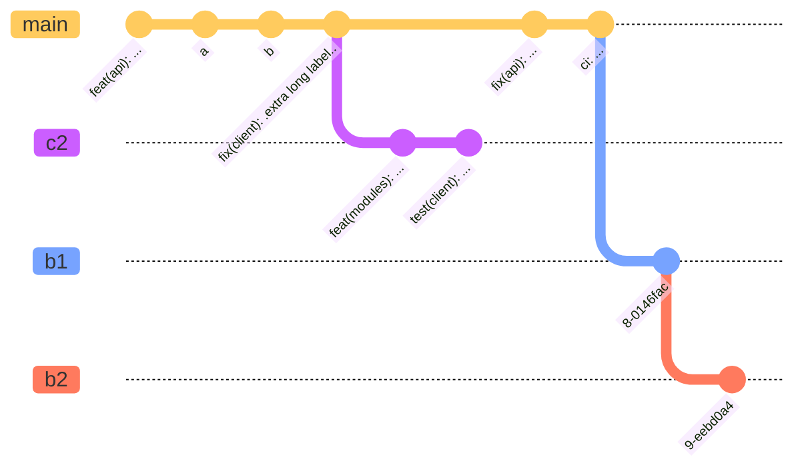

# :pencil2: diagrams.net(Draw.io)

[diagrams.net](https://diagrams.net) 참조

## 활동 다이어그램 (Activity diagram)

``` drawio
7Vxbc6M2FP41fnQGcTM8ZnNpH7YzO5PddvuIjWyzixHF8sbur6+EJUBIvoFEE8eeycQcSVzO+fjORZJHzsNq+1sR5cs/UAzTkW3F25HzOLJtEDiA/KOSHZMA19tLFkUSM1kteEn+hUxoMekmieFa6IgRSnGSi8IZyjI4w4IsKgr0Knabo1S8ah4toCR4mUWpLP0rifFyLw3sSS3/HSaLJb8y8MN9yyrindmTrJdRjF4bIudp5DwUCOH9t9X2AaZUe1wv+3HPB1qrGytghs8Z4Ab2fsivKN2wp2N3hnf8cckQolly8GmJVymRAfKV3HlO29c4KvALjjBtnydp+oBSVJQDHYt8fJ92xgX6CRstz88BaaMjUIafo1WSUix8jZZoFTEpMztw2bFqNLt3WGC4PagBUOmVIBKiFcTFjnThAxxmNQZGj53htTasw4y1bNiUyyIGpUV14lrb5AtT+CHlO2coPybQY4eowEu0QFmUPtXSplGoJhKC0/s0WWRENkUYoxVpgFl8T4FPT5LDbC9hGg4MGogYodh9J0LrzuOHf9PDynj0+Y6bjqgDbYoZbCGW4G4BMRe6aiMXMI1w8ku8gspmbOgXlJBr1+DwbAEcwGudYn8TbFRteaLraNfoltMOawkb1Y2eCRdXARc/xUz/Am78fzaIN4zXpaXuSQdg59u6kXxb0P+f0YJeJ8OI6nUJ6Z3nOT83ua/96fedJYQWaJPFMGYQfF0mGL7kUWmvV+IARIRGxYzhxrVkwogjGMxnKjz6swBO513xWBGRBsIIW5DgTNAgDGArGMPVwhjejTEuZwxXxRj+IIwhOYqLGePM64CWo7+sP/myv4Pu5OQbIqcHVBQ0iDvARs6zTEgEctPN+jQZvUP2AeAAvhr0Exhjn4lk4wz145+I8U4K5/ht05FARiU3daUjX0VH4VGzj9mJerKTHbTQ4/Vlp17xTCDBaQfXRvGEUf4mwKTPt6nAFB7nEE1garsUp7erk70X74Pm8zXEvQEXGvJRj8k6T8uHggRXxS1yVuLOtsVUW+W7zIXOoaUw/nWGzkD2VXCb4O/CUV/iCVVezEwa7ri6meaQexQBCjzNQXII+hMQUBHQ0zZZ4ySjaTw/4bTgjctompDHppHymbz0gQJoB7jDBdC8dvCBAuiO9MLfFDGu8QYJkicthPjuWWzTiRDkCvAtBNYClQPlHbMhsOueBxUz+VSooT7si97FmlU2rIXOfF5aU/JClevhgm9r2AyGp+2OpxwRoXksgruA5GajadmBYoZpjvT2Po28Rwr/DUZrhsRz34Y18XDEe36lB49j9wCe1ag35accR2QhW3JTnsJN2VrclFxlfsowNaUVkb8MvtKr0qhCDh0GT2mMJSvByTjBYLIiV1PrHJPFc1er+tYMixMOqvnJUe+boYy621rXlqhXdZ5VTpjTiXLuc9lpStlzQu+GFRgVXrnR/gNivGN2ozxHRHU48BmV9AV6R9mHfX9XD60sUgVqEOh2ySajN7mAqSedu4/jimcP5HNvJ50bKFFzPV+iAXOJWngZC4BzWaAR/06kAHhIitAc4FeW/7FZ5VxNxMlwCRvpdCYRz1KSiJZZ3EvrRK7f8lATt4kumZOCo/1715U8y9ICV9AAayM/U8F1aI/23uBa+YazChhm4eoAMZR1J75m+J0sa16URpYVEIMJIkv9ZrDMaeSccJXEcVlUSaMpTD9Fs5+L8tVp4GdefszliWzlKnuOUZXWNVHH3vrDNQ7rLnBaFW1NdY9x+6yOeAYt03WeZRtywtdAXCYKaQrK8sBkkDDds42F6Z6lWmbbnZ5oxf7GTqfZyT7KTtadNeHL4vWSUytvGIdGuElDrVWZ+j0s4ewnvVL24TI8Lxwuw/Msz1DIfF3ORXAtfVa98Zqy4FwsM4twnXYF0THoXORK7bc8ptthrr9Q61otPQ9ZI/cseTWqzuqbXHebodWq1MyV83J7AnxYXj5ZUzUUrJ1k/9Olgg+TfHTz... [truncated]
```

## 클래스 다이어그램 (Class diagram)

``` drawio
7V1rb5w4FP01I6WVNsK8Bj4mk2Zbqa2iJqvdfnQGzwwq4BEwefTXr41twNjMKx7UJFSVOhg/wOfc6+Nrm06cWfr0dw7Xq284QsnEtqKniXM1sW0QOID8Q1OeeQpwPZayzOOIpzUJt/FvxBMtnrqJI1RIGUuMkzJey4lznGVoXkppMM/xo5xtgRO51TVcIiXhdg4TNfXfOCpXLDWwp036ZxQvV6Jl4IfsTgpFZv4mxQpG+LGV5HyaOLMc45L9Sp9mKKG9J/qFlbvuuVs/WI6ycp8CU/7IDzDZ8Jf7DO/jkj9d+SxeuXiM0wRm5OpygbPylt8B5Bom8TIjv+emTZSThAeUlzHprQt+o8RrkjpfxUn0FT7jDX2yooTzX+LqcoXz+DepFia8TnI7Lznwti/luKUlSbJFUnNUkDw34nVBJ+kbfJIyfoVFyRPmOEnguojv69dIYb6Ms0tcljjlmcRLX8dJMsMJzqu+cBbVn+opc/wLte5cXweWZdV3BDlo9YtWHRluOpK9I3D4ta4yDhHpVfTUizOo2UPsDuEUlfkzySIKeJxw3OQcj1vcY8Pf2rxWbe76PBFym1nWddfN/SA2BrMl6cmmPbk5IPjeas7XtEaglhqDCWFUBkt0iTdZVLSpTH60XrRJqgjeQ/ZAIfvEvqSPQCn/5WriXNDcpEfpczhPF1Xf1xm+wxSxLATdOFvqc32OixLTJ6IZc7RABKI5UuyJQFkqDBK8UKkibCxBi7LXwoo1nJPn+lrluXKblB+8h2kSJmUXSeVzVnEUoYxaBy5hCZkpUMKtMemECgLvkvwlQM2sc2/ikQefkWvQXJO/NHtOeJuRd4FxRUdE7OwRUVvrcpoQ2vL9fTnNvJNK6meZLbs47Ln9FJbotI07oYY7HUyTuMJqL9vfAWhKoElQg+AdBfjqL6Cg7KgoOxpEE3iPkhtcxGWMaf05y9tB+lgw+/2gCZgD1XdoYQ5ejrJoSvEQGXqsxsUzZvofmHnzodL6qLiCKC7WCXxmZXjuB0yaUTKiBJWI5WtVNxOOyPq4rfR8hea/4oyVFJ6nW2b0PMY9TxDsR8mpbYCTYLfnQVl0QXUtuYpimOIsulvFtH/JDSpeeO+SK6GpKCCrMm30Vp8F7xApdbeip7j8j7ZD4GFXP+tWyRuzW647FQk/ecvVxQ3KY9IxVD1eNW4DRYoM7+gd0gl4k8+RLGaJdlwini0M9EC2kKslTo4SWMYPcptbdM8NZiYqaDSVRY/nTOUq2LPyUm1R3qmoHrDEOBd0KmIvqFR0hCQKbCPkAkORq02timjHMSW0VaZMh2OKM/VlNR56xzHFsTuyPvRPxhRHYQo4PwcKW/jw0oK/mnv1+njqxuGmxAWnwYFDDhdG7gFk2msA2D6dqicvwkIddTrl6uY3WyZTe48HrgKEdX7+8fUAYXJeW88BhAEInzsEEN4rtwiTQLiWJwMRhMMB4Y9ANEOCDyQgXOAMB4QaTZyxGYqCxRhPfNXxRNd2JJZ5IqbfYhkZcVWa1YHINxBPDLbGEznzW2FFtCR07pnCX5GHYhkj+kvJhdMUVa6JZknITP9sxpI+9Lm5cYK/jd7BwaFFLZ1NhBaDMbR4stDiDpg1oUUtzAZCi2FfaBFGETflxqQrK+dXfbFF7l/OZGdDy2pDha1mamdShRlvUF4Q4HjUsG7U6p1RjI7lJYxTI4daxvkGIoehGjmUA8jJntTmsyRlb92jXeq02SOAe0vQmpHLq5yByYJHJY0Cpyj/FDYQ5Yta6c6bpgQOKEaOhwFjiGBswNm3dqpDmYTAkeNS9Zrp0KrCGUjggJbVk7ZGCWpm2Jc1jytU9Ata+rY4poQJ2r09J+Czo9HUfKWREl3URR4KsdAqBMlJgKSoRoZbmmOttiohPGHno1fm7RfvcwxnK/EhI3+HGdOxzon71DFoiWO6xvgjRrIHhWLKcWyHWaxZWYXzCYUS1/8ligWOhbJm710xt/e5lUwrSJESuVVVtyr... [truncated]
```

## AWS 구성 다이어그램 (AWS configuration diagram)

``` drawio
3Zhdb5swFIZ/TS4XYRswuUzSr0mtVqmtejkZOASvgJHtfO3Xz+YjgdJqiaa1SbnBvD7G9vv4IJsRmeeba8nK9E7EkI2wE29G5GKEMfa9wNyssq0VhFyvVhaSx422Fx74b2hEp1GXPAbVC9RCZJqXfTESRQGR7mlMSrHuhyUi6/dasgUMhIeIZUP1mcc6rdUA071+A3yRtj0jf1LX5KwNbmaiUhaLdUcilyMyl0LoupRv5pBZ91pf6nZX79TuBiah0G80eFIgf4S/rCfYyVhowFRBI+xFIi9FYZthr3WvVaqYGxZy2+xRsugFpCndPN7dmtu0LJtuMxZBaswE2Te4HR7ezXA3cqW3ravGi9IW883CrpsxWyt3nIuQ24BZwrNsLjIhq2CSJOBHkdGVluIFOjUxnYSOY2pWIDU30G7tPO+F4pqLwsSEQmuRmwCmynp1JHwDZoizerS2HWzeNRR1JnENIgcttyakafANuQ3aZnG7Ph37vk8d6pAgoBO3rl131k3TIO0smVZjjZGLXUd7mKbQ2Ng+dvD+M+6n7xatUqDVgXTJ8XQVGZLFlJqEeYtsUl2fRRb7Y+QEJCCIBhQ5ExL0OBPHOReyqsre6VKnRjM+Vu4dxtg9nnEkFgXXYgh6ThFBV6cHmgRj10XUo9jByA1c90vk8/TeJvQ107Bm2wNpe8fTZiX/uWg6GRD3psSZeadH/C+p7RNvTAhxzaedUuoFwbkgf34w4i3Lw5gdSNw/nnhWvf9nsiyimtWBH/TCjPSzgCP/FXH3SwC/YJqFTMGBsOnxsONtwXIRh0PK1q/Z5PRymzgni3qwfW86X7FsCS113KcSLeXKWnNhd7hQxFN7nNlnk1GuuO2yqo+ZSqtg9BYXPwogTHYuQzw49Lzy2AxELGUEnc28OXgxuQA93AF2SEjIzB5j1X/7EdYNfJqcuU/uB/nUnpfP1ijvo4xC52SUNzTK/yij8DkZ5Q+Nov/HKPO4/2lT1XX+fZHLPw==
```


# :pencil2: PlantUML

[PlantUML](http://plantuml.com/) 참조.

## 시퀀스 다이어그램 (Sequence Diagram)


## 클래스 다이어그램 (Class diagram)


## 컴포넌트 다이어그램 (Component diagram)


## 상태 다이어그램 (State diagram)

``` plantuml
@startuml
scale 600 width

[*] -> 상태1
상태1 --> 상태2 : 성공
상태1 --> [*] : 중단됨
상태2 --> 상태3 : 성공
상태2 --> [*] : 중단됨
state 상태3 {
  state "충분한 데이터 축적
긴 상태 이름" as long1
  long1 : 그냥 테스트
  [*] --> long1
  long1 : 새 데이터
  long1 --> 데이터_처리 : 데이터 충분
}
상태3 --> 상태3 : 실패
상태3 --> [*] : 성공 / 결과 저장
상태3 --> [*] : 중단됨

@enduml
```


# :pencil2: Mermaid

## 파이 그래프 (Pie graph)


## 간트 차트 (Gantt chart)


## Git 트리 다이어그램 (Git tree diagram)



## 마인드맵 (Mind map)

