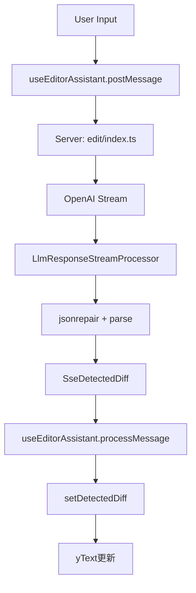
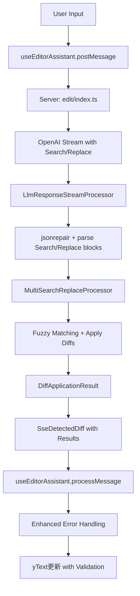

# 技術実装詳細

## 🏗️ アーキテクチャ変更

### 現在のフロー


### 改修後のフロー


## 📦 ファイル構成

### 新規作成ファイル
```
apps/app/src/features/openai/server/services/editor-assistant/
├── multi-search-replace-processor.ts          # メイン処理エンジン
├── fuzzy-matching.ts                          # 類似度計算ユーティリティ
├── diff-application-engine.ts                 # 差分適用ロジック
└── error-handlers.ts                          # エラーハンドリング
```

### 更新対象ファイル
```
apps/app/src/features/openai/
├── interfaces/editor-assistant/
│   ├── llm-response-schemas.ts                # Diffスキーマ更新
│   └── sse-schemas.ts                         # SSEスキーマ更新
├── server/
│   ├── routes/edit/index.ts                   # プロンプト・処理統合
│   └── services/editor-assistant/
│       └── llm-response-stream-processor.ts   # Search/Replace対応
└── client/services/
    └── editor-assistant.tsx                   # クライアント対応
```

## 🔍 核心技術実装

### 1. MultiSearchReplaceProcessor

```typescript
export class MultiSearchReplaceProcessor {
  private fuzzyThreshold: number = 0.8;
  private bufferLines: number = 40;

  constructor(config?: ProcessorConfig) {
    this.fuzzyThreshold = config?.fuzzyThreshold ?? 0.8;
    this.bufferLines = config?.bufferLines ?? 40;
  }

  async applyDiffs(
    originalContent: string,
    diffs: LlmEditorAssistantDiff[]
  ): Promise<DiffApplicationResult> {
    // 行終端の検出
    const lineEnding = originalContent.includes('\r\n') ? '\r\n' : '\n';
    let resultLines = originalContent.split(/\r?\n/);
    let delta = 0;
    let appliedCount = 0;
    const failedParts: DiffError[] = [];

    // startLineでソート
    const sortedDiffs = diffs
      .map((diff, index) => ({ ...diff, originalIndex: index }))
      .sort((a, b) => (a.startLine || 0) - (b.startLine || 0));

    for (const diff of sortedDiffs) {
      const result = await this.applySingleDiff(
        resultLines, 
        diff, 
        delta
      );
      
      if (result.success) {
        resultLines = result.updatedLines;
        delta += result.lineDelta;
        appliedCount++;
      } else {
        failedParts.push(result.error);
      }
    }

    return {
      success: appliedCount > 0,
      appliedCount,
      failedParts: failedParts.length > 0 ? failedParts : undefined,
      content: appliedCount > 0 ? resultLines.join(lineEnding) : undefined,
    };
  }

  private async applySingleDiff(
    lines: string[],
    diff: LlmEditorAssistantDiff,
    delta: number
  ): Promise<SingleDiffResult> {
    // バリデーション
    if (!diff.search.trim()) {
      return {
        success: false,
        error: {
          type: 'EMPTY_SEARCH',
          message: '検索内容が空です',
          details: { searchContent: diff.search, suggestions: [] }
        }
      };
    }

    // 検索実行
    const searchResult = this.findBestMatch(lines, diff.search, diff.startLine, delta);
    
    if (!searchResult.found) {
      return {
        success: false,
        error: this.createSearchError(diff.search, searchResult)
      };
    }

    // 置換実行
    return this.applyReplacement(lines, diff, searchResult);
  }
}
```

### 2. Fuzzy Matching実装

```typescript
import { distance } from 'fastest-levenshtein';

export class FuzzyMatcher {
  private threshold: number;

  constructor(threshold: number = 0.8) {
    this.threshold = threshold;
  }

  calculateSimilarity(original: string, search: string): number {
    if (search === '') return 0;
    
    // 正規化（スマートクォート等の処理）
    const normalizedOriginal = this.normalizeString(original);
    const normalizedSearch = this.normalizeString(search);

    if (normalizedOriginal === normalizedSearch) return 1;

    // Levenshtein距離による類似度計算
    const dist = distance(normalizedOriginal, normalizedSearch);
    const maxLength = Math.max(normalizedOriginal.length, normalizedSearch.length);
    
    return 1 - (dist / maxLength);
  }

  findBestMatch(
    lines: string[],
    searchChunk: string,
    startIndex: number = 0,
    endIndex?: number
  ): MatchResult {
    const searchLines = searchChunk.split(/\r?\n/);
    const searchLength = searchLines.length;
    const actualEndIndex = endIndex ?? lines.length;

    let bestScore = 0;
    let bestMatchIndex = -1;
    let bestMatchContent = '';

    // Middle-out検索
    const midPoint = Math.floor((startIndex + actualEndIndex) / 2);
    let leftIndex = midPoint;
    let rightIndex = midPoint + 1;

    while (leftIndex >= startIndex || rightIndex <= actualEndIndex - searchLength) {
      // 左側検索
      if (leftIndex >= startIndex) {
        const chunk = lines.slice(leftIndex, leftIndex + searchLength).join('\n');
        const similarity = this.calculateSimilarity(chunk, searchChunk);
        
        if (similarity > bestScore) {
          bestScore = similarity;
          bestMatchIndex = leftIndex;
          bestMatchContent = chunk;
        }
        leftIndex--;
      }

      // 右側検索
      if (rightIndex <= actualEndIndex - searchLength) {
        const chunk = lines.slice(rightIndex, rightIndex + searchLength).join('\n');
        const similarity = this.calculateSimilarity(chunk, searchChunk);
        
        if (similarity > bestScore) {
          bestScore = similarity;
          bestMatchIndex = rightIndex;
          bestMatchContent = chunk;
        }
        rightIndex++;
      }
    }

    return {
      found: bestScore >= this.threshold,
      score: bestScore,
      index: bestMatchIndex,
      content: bestMatchContent,
      threshold: this.threshold
    };
  }

  private normalizeString(str: string): string {
    return str
      .replace(/[\u2018\u2019]/g, "'")  // スマートクォート
      .replace(/[\u201C\u201D]/g, '"')  // スマートダブルクォート
      .replace(/\u2013/g, '-')         // en dash
      .replace(/\u2014/g, '--')        // em dash
      .normalize('NFC');
  }
}
```

### 3. エラーハンドリング強化

```typescript
export interface DiffError {
  type: 'SEARCH_NOT_FOUND' | 'SIMILARITY_TOO_LOW' | 'MULTIPLE_MATCHES' | 'EMPTY_SEARCH';
  message: string;
  details: {
    searchContent: string;
    bestMatch?: string;
    similarity?: number;
    suggestions: string[];
    lineRange?: string;
  };
}

export class ErrorHandler {
  static createSearchError(
    searchContent: string,
    matchResult: MatchResult,
    startLine?: number
  ): DiffError {
    const lineRange = startLine ? ` at line: ${startLine}` : '';
    const similarityPercent = Math.floor((matchResult.score || 0) * 100);
    const thresholdPercent = Math.floor(matchResult.threshold * 100);

    return {
      type: 'SIMILARITY_TOO_LOW',
      message: `No sufficiently similar match found${lineRange} (${similarityPercent}% similar, needs ${thresholdPercent}%)`,
      details: {
        searchContent,
        bestMatch: matchResult.content || '(no match)',
        similarity: matchResult.score,
        suggestions: [
          'Use the read_file tool to get the latest content',
          'Check for whitespace and indentation differences',
          'Verify the search content matches exactly',
          `Consider lowering similarity threshold (currently ${thresholdPercent}%)`
        ],
        lineRange: startLine ? `starting at line ${startLine}` : 'start to end'
      }
    };
  }
}
```

### 4. 文字正規化システム

roo-codeと同レベルの文字正規化機能を実装：

```typescript
// apps/app/src/features/openai/server/services/editor-assistant/text-normalization.ts
export const NORMALIZATION_MAPS = {
  // スマートクォートの正規化
  SMART_QUOTES: {
    '\u201C': '"', // 左ダブルクォート
    '\u201D': '"', // 右ダブルクォート
    '\u2018': "'", // 左シングルクォート
    '\u2019': "'", // 右シングルクォート
  },
  // タイポグラフィ文字の正規化
  TYPOGRAPHIC: {
    '\u2026': '...', // 省略記号
    '\u2014': '-',   // emダッシュ
    '\u2013': '-',   // enダッシュ
    '\u00A0': ' ',   // ノンブレーキングスペース
  },
};

export function normalizeForFuzzyMatch(text: string): string {
  return text
    .replace(/[\u201C\u201D]/g, '"')
    .replace(/[\u2018\u2019]/g, "'")
    .replace(/\u2026/g, '...')
    .replace(/\u2014/g, '-')
    .replace(/\u2013/g, '-')
    .replace(/\u00A0/g, ' ')
    .normalize('NFC'); // Unicode正規化
}
```

### 5. 段階的バリデーションシステム

roo-codeのバリデーション戦略を採用：

```typescript
// マーカーシーケンス検証 → 内容検証 → 適用処理
export class ValidationPipeline {
  static validateDiffContent(diffContent: string): ValidationResult {
    // 1. マーカーシーケンス検証
    const markerResult = this.validateMarkerSequencing(diffContent);
    if (!markerResult.success) return markerResult;
    
    // 2. 内容検証
    const contentResult = this.validateContent(diffContent);
    if (!contentResult.success) return contentResult;
    
    // 3. 構文検証
    const syntaxResult = this.validateSyntax(diffContent);
    return syntaxResult;
  }
  
  private static validateMarkerSequencing(content: string): ValidationResult {
    // roo-codeと同じマーカー検証ロジック
    // <<<<<<< SEARCH → ======= → >>>>>>> REPLACE の順序チェック
  }
}
```

### 6. 高度なエラーハンドリング

roo-codeレベルの詳細なエラーハンドリング実装：

```typescript
// apps/app/src/features/openai/server/services/editor-assistant/enhanced-error-handler.ts
export interface DetailedDiffError {
  type: 'MARKER_SEQUENCE_ERROR' | 'SIMILARITY_TOO_LOW' | 'MULTIPLE_MATCHES' | 'CONTENT_ERROR';
  message: string;
  line?: number;
  details: {
    searchContent: string;
    bestMatch?: string;
    similarity?: number;
    suggestions: string[];
    correctFormat?: string;
    lineRange?: string;
  };
}

export class EnhancedErrorHandler {
  static createMarkerSequenceError(found: string, expected: string, line: number): DetailedDiffError {
    return {
      type: 'MARKER_SEQUENCE_ERROR',
      message: `マーカーシーケンスエラー: 行${line}で '${found}' が見つかりました。期待値: ${expected}`,
      line,
      details: {
        searchContent: found,
        suggestions: [
          'マーカーの順序を確認: <<<<<<< SEARCH → ======= → >>>>>>> REPLACE',
          'コンテンツ内の特殊マーカーをバックスラッシュ(\\)でエスケープ',
          '余分なセパレータや不足しているセパレータがないか確認'
        ],
        correctFormat: `<<<<<<< SEARCH\n:start_line: X\n-------\n[検索内容]\n=======\n[置換内容]\n>>>>>>> REPLACE`
      }
    };
  }

  static createSimilarityError(
    searchContent: string,
    bestMatch: string,
    similarity: number,
    threshold: number,
    startLine?: number
  ): DetailedDiffError {
    const lineRange = startLine ? ` (開始行: ${startLine})` : '';
    const similarityPercent = Math.floor(similarity * 100);
    const thresholdPercent = Math.floor(threshold * 100);

    return {
      type: 'SIMILARITY_TOO_LOW',
      message: `類似度が不十分${lineRange}: ${similarityPercent}% (必要: ${thresholdPercent}%)`,
      details: {
        searchContent,
        bestMatch,
        similarity,
        suggestions: [
          'read_fileツールで最新のファイル内容を確認',
          '空白やインデントの違いを確認',
          '検索内容が正確に一致しているか検証',
          `類似度の閾値を下げることを検討 (現在: ${thresholdPercent}%)`
        ],
        lineRange: startLine ? `行${startLine}から開始` : '全体を対象'
      }
    };
  }
}
```

### 7. 設定管理とカスタマイズ

```typescript
// apps/app/src/features/openai/server/services/editor-assistant/config.ts
export interface EditorAssistantConfig {
  fuzzyThreshold: number;           // デフォルト: 0.8 (80%)
  bufferLines: number;              // デフォルト: 40
  preserveIndentation: boolean;     // デフォルト: true
  enableMiddleOutSearch: boolean;   // デフォルト: true
  maxDiffBlocks: number;           // デフォルト: 10
  stripLineNumbers: boolean;       // デフォルト: true
  enableAggressiveMatching: boolean; // デフォルト: false
}

export const DEFAULT_CONFIG: EditorAssistantConfig = {
  fuzzyThreshold: 0.8,              // roo-codeより緩い設定 (1.0 → 0.8)
  bufferLines: 40,
  preserveIndentation: true,
  enableMiddleOutSearch: true,
  maxDiffBlocks: 10,
  stripLineNumbers: true,
  enableAggressiveMatching: false,
};

// 環境変数による設定のオーバーライド
export function loadConfig(): EditorAssistantConfig {
  const envConfig: Partial<EditorAssistantConfig> = {
    fuzzyThreshold: parseFloat(process.env.GROWI_EDITOR_ASSISTANT_FUZZY_THRESHOLD || '0.8'),
    bufferLines: parseInt(process.env.GROWI_EDITOR_ASSISTANT_BUFFER_LINES || '40'),
    maxDiffBlocks: parseInt(process.env.GROWI_EDITOR_ASSISTANT_MAX_DIFF_BLOCKS || '10'),
  };

  return { ...DEFAULT_CONFIG, ...envConfig };
}
```

## 🎛️ 設定とカスタマイズ

### ProcessorConfig
```typescript
interface ProcessorConfig {
  fuzzyThreshold?: number;      // デフォルト: 0.8 (80%)
  bufferLines?: number;         // デフォルト: 40
  preserveIndentation?: boolean; // デフォルト: true
  stripLineNumbers?: boolean;    // デフォルト: true
  enableAggressiveMatching?: boolean; // デフォルト: false
}
```

### 環境変数での調整
```typescript
const config: ProcessorConfig = {
  fuzzyThreshold: parseFloat(process.env.EDITOR_ASSISTANT_FUZZY_THRESHOLD || '0.8'),
  bufferLines: parseInt(process.env.EDITOR_ASSISTANT_BUFFER_LINES || '40'),
  preserveIndentation: process.env.EDITOR_ASSISTANT_PRESERVE_INDENT !== 'false',
};
```

## 🧪 テスト戦略

### 単体テスト
```typescript
describe('MultiSearchReplaceProcessor', () => {
  it('should handle exact matches', async () => {
    const processor = new MultiSearchReplaceProcessor();
    const result = await processor.applyDiffs(originalContent, [
      { search: 'function test() {', replace: 'function newTest() {' }
    ]);
    expect(result.success).toBe(true);
    expect(result.appliedCount).toBe(1);
  });

  it('should handle fuzzy matches within threshold', async () => {
    // スペースやインデントが微妙に違う場合のテスト
  });

  it('should reject matches below threshold', async () => {
    // 類似度が低すぎる場合のエラーハンドリングテスト
  });
});
```

### 統合テスト
```typescript
describe('Editor Assistant Integration', () => {
  it('should process multiple diffs in correct order', async () => {
    // 複数の変更を正しい順序で処理することを確認
  });

  it('should handle partial failures gracefully', async () => {
    // 一部の変更が失敗した場合の処理を確認
  });
});
```

## 📈 パフォーマンス考慮

### メモリ最適化
- 大きなファイルでの文字列処理の最適化
- 不要なデータの早期解放
- ストリーミング処理の継続

### CPU最適化
- Middle-out検索による効率化
- 類似度計算の最適化
- 早期終了条件の設定

---
**ファイル**: `technical-implementation-details.md`  
**作成日**: 2025-06-17  
**関連**: `editor-assistant-refactoring-plan.md`
