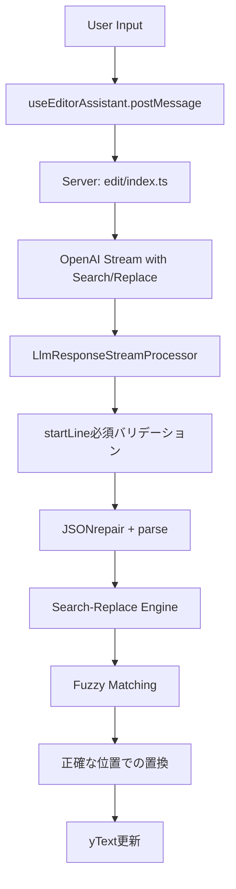

# 技術仕様 - Phase 2実装アーキテクチャ

## 🏗️ アーキテクチャ概要

### システムフロー


### レイヤー構成
```
┌─────────────────────────┐
│   ユーザーインターフェース    │
├─────────────────────────┤
│   クライアント検索・置換      │ ← use-editor-assistant.tsx
├─────────────────────────┤
│   Fuzzy Matching エンジン  │ ← fuzzy-matching.ts
├─────────────────────────┤
│   サーバーサイド処理        │ ← llm-response-stream-processor.ts
├─────────────────────────┤
│   LLMレスポンス処理        │ ← schemas + validation
└─────────────────────────┘
```

## 📦 核心コンポーネント

### 1. Search-Replace Engine
```typescript
// apps/app/src/features/openai/client/services/editor-assistant/search-replace-engine.ts

export interface SearchReplaceResult {
  success: boolean;
  appliedCount: number;
  errors?: DetailedError[];
}

export function performSearchReplace(
  yText: YText,
  searchText: string,
  replaceText: string,
  startLine: number
): boolean {
  // 1. 正規化処理
  const normalizedSearch = normalizeForBrowserFuzzyMatch(searchText);
  
  // 2. Fuzzy Matching検索
  const fuzzyMatcher = new ClientFuzzyMatcher(0.8);
  const result = fuzzyMatcher.findBestMatch(content, normalizedSearch, {
    preferredStartLine: startLine,
    bufferLines: 20
  });
  
  // 3. 正確な置換実行
  if (result.success && result.matchedRange) {
    const { startIndex, endIndex } = result.matchedRange;
    yText.delete(startIndex, endIndex - startIndex);
    yText.insert(startIndex, replaceText);
    return true;
  }
  
  return false;
}
```

### 2. Fuzzy Matching System
```typescript
// apps/app/src/features/openai/client/services/editor-assistant/fuzzy-matching.ts

export class ClientFuzzyMatcher {
  private threshold: number = 0.8;

  findBestMatch(
    content: string,
    searchText: string,
    context: SearchContext = {}
  ): MatchResult {
    // Phase 1: 完全一致検索
    const exactMatch = this.tryExactMatch(content, searchText, context);
    if (exactMatch.success) return exactMatch;
    
    // Phase 2: 指定行周辺での検索
    if (context.preferredStartLine) {
      const bufferedMatch = this.tryBufferedSearch(content, searchText, context);
      if (bufferedMatch.success) return bufferedMatch;
    }
    
    // Phase 3: 全体検索（middle-out方式）
    return this.performFullSearch(content, searchText);
  }

  private calculateSimilarity(text1: string, text2: string): number {
    // Levenshtein距離による類似度計算
    const maxLength = Math.max(text1.length, text2.length);
    if (maxLength === 0) return 1.0;
    
    const distance = levenshteinDistance(text1, text2);
    return (maxLength - distance) / maxLength;
  }
}
```

### 3. Server-Side Validation
```typescript
// apps/app/src/features/openai/server/services/editor-assistant/llm-response-stream-processor.ts

const isDiffItem = (item: unknown): item is LlmEditorAssistantDiff => {
  return typeof item === 'object' && item !== null
    && ('replace' in item)
    && ('search' in item)
    && ('startLine' in item);  // Phase 2B: 必須要求
};

// 強化されたエラーログ
if (!isDiffItem(item)) {
  logger.error('[LLM Response] Invalid diff structure:', {
    hasReplace: 'replace' in (item || {}),
    hasSearch: 'search' in (item || {}),
    hasStartLine: 'startLine' in (item || {}),
    received: JSON.stringify(item, null, 2)
  });
  return; // 不正な形式は無視
}
```

## 🎛️ 設定システム

### デフォルト設定
```typescript
// apps/app/src/features/openai/server/services/editor-assistant/server-config.ts

export interface EditorAssistantConfig {
  fuzzyThreshold: number;           // 0.8 (80%類似度)
  bufferLines: number;              // 20行 (指定行の前後検索範囲)
  preserveIndentation: boolean;     // true (インデント保持)
  enableMiddleOutSearch: boolean;   // true (middle-out検索)
  maxDiffBlocks: number;           // 10 (最大同時処理diff数)
}

export const DEFAULT_CONFIG: EditorAssistantConfig = {
  fuzzyThreshold: 0.8,              // roo-code(1.0)より緩い設定
  bufferLines: 20,                  // パフォーマンス重視で削減
  preserveIndentation: true,
  enableMiddleOutSearch: true,
  maxDiffBlocks: 10,
};
```

### 環境変数対応
```bash
# 設定可能な環境変数
GROWI_EDITOR_ASSISTANT_FUZZY_THRESHOLD=0.8
GROWI_EDITOR_ASSISTANT_BUFFER_LINES=20
GROWI_EDITOR_ASSISTANT_MAX_DIFF_BLOCKS=10
```

## 🔍 データフロー詳細

### 1. LLMレスポンス処理
```typescript
// 必須フィールドの強制
export const LlmEditorAssistantDiffSchema = z.object({
  search: z.string().min(1),
  replace: z.string(), 
  startLine: z.number().int().positive()  // 必須化済み
});
```

### 2. クライアント側処理
```typescript
// use-editor-assistant.tsx
useEffect(() => {
  // 従来のコード (削除済み):
  // appendTextLastLine(yText, detectedDiff.data.diff.replace);
  
  // 新しい処理:
  const { search, replace, startLine } = detectedDiff.data.diff;
  const success = performSearchReplace(yText, search, replace, startLine);
  
  if (!success) {
    // フォールバック処理
    handleSearchReplaceFailure(search, replace, startLine);
  }
}, [detectedDiff]);
```

### 3. バリデーション層
```typescript
// client-engine-integration.tsx
export function validateDiffs(diffs: LlmEditorAssistantDiff[]): void {
  for (const diff of diffs) {
    if (!diff.startLine) {
      throw new Error(
        `startLine is required for client processing but missing in diff: ${diff.search?.substring(0, 50)}...`
      );
    }
    if (!diff.search?.trim()) {
      throw new Error(
        `search field is required and cannot be empty in diff at line ${diff.startLine}`
      );
    }
  }
}
```

## 🛡️ エラーハンドリング

### エラー分類
```typescript
export interface DetailedError {
  type: 'SIMILARITY_TOO_LOW' | 'SEARCH_NOT_FOUND' | 'VALIDATION_ERROR' | 'MULTIPLE_MATCHES';
  message: string;
  line?: number;
  details: {
    searchContent: string;
    bestMatch?: string;
    similarity?: number;
    suggestions: string[];
    lineRange?: string;
  };
}
```

### 修復提案システム
```typescript
// 自動修復提案の生成
function generateSuggestions(error: DetailedError): string[] {
  switch (error.type) {
    case 'SIMILARITY_TOO_LOW':
      return [
        'read_fileツールで最新のファイル内容を確認',
        '空白やインデントの違いを確認',
        '検索内容が正確に一致しているか検証',
        `類似度の閾値を下げることを検討 (現在: ${(error.details.similarity || 0) * 100}%)`
      ];
    case 'SEARCH_NOT_FOUND':
      return [
        '指定行番号周辺の内容を確認',
        'startLineパラメータの正確性を検証',
        'ファイルが編集されていないか確認'
      ];
  }
}
```

## 📈 パフォーマンス特性

### 検索アルゴリズム効率
```typescript
// Middle-out検索による最適化
private performMiddleOutSearch(lines: string[], searchChunk: string, startLine: number): MatchResult {
  const maxRange = Math.min(this.bufferLines, lines.length);
  
  // 中央から外側への検索で早期発見を促進
  for (let offset = 0; offset <= maxRange; offset++) {
    // 上方向チェック
    if (startLine - offset >= 1) {
      const similarity = this.checkSimilarityAtLine(lines, searchChunk, startLine - offset);
      if (similarity >= this.threshold) {
        return { success: true, similarity, line: startLine - offset };
      }
    }
    
    // 下方向チェック
    if (startLine + offset <= lines.length) {
      const similarity = this.checkSimilarityAtLine(lines, searchChunk, startLine + offset);
      if (similarity >= this.threshold) {
        return { success: true, similarity, line: startLine + offset };
      }
    }
  }
}
```

### メモリ効率化
- **文字列正規化**: 最小限の変換処理
- **早期終了**: 閾値到達時の即座停止
- **範囲限定検索**: bufferLinesによる検索範囲制限

---

**技術仕様作成日**: 2025-06-18  
**対応Phase**: Phase 2A・2B完了版  
**参考実装**: roo-code互換アルゴリズム
