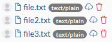

# growi-plugin-attachment-refs

[](https://david-dm.org/weseek/growi-plugin-attachment-refs)
[](https://david-dm.org/weseek/growi-plugin-attachment-refs?type=dev)
[](LICENSE)


Install
--------

1. install plugin

    ```bash
    yarn add growi-plugin-attachment-refs
    ```

1. build client app (see official documents)


Usage
------

### `ref` tag

#### Syntax

```
$ref(file.txt)
$ref(file.txt, page=/somewhere/page)
```

#### Output


#### Options

- **`file`** : File name of reference file (default: the first argument)
- *`page`* : Target page path of reference file (default: current page)

### `refs` tag

#### Syntax

```
$refs(/somewhere/page, regexp=/^file.*\.txt$/)
```

#### Output



#### Options

- *`page`* : Target page path to search attachments (default: the first argument || current page)
- *`prefix`* : Page prefix to search attachments
- *`depth`* : page depth to search attachments
- *`regexp`* : Regular Expression to retrieve
- *`format`* : File format filtering


### `refimg` tag

#### Syntax

```
$refimg(pict.png, width=50%, alt=Pic)
```

#### Output

```html

```

#### Options

- **`file`** : File name of reference file (default: the first argument)
- *`width`* : width
- *`height`* : height
- *`max-width`* : max-width
- *`max-height`* : max-height
- *`alt`* : alt text


### `refsimg` tag

#### Syntax

```
$refsimg(/somewhere/page, regexp=/^.*\.png$/, max-width=200)
```

#### Output

```html
<ul>
  <li></li>
  <li></li>
  <li></li>
</ul>
```

#### Options

- *`page`* : Target page path to search attachments (default: the first argument || current page)
- *`prefix`* : Page prefix to search attachments
- *`depth`* : page depth to search attachments
- *`regexp`* : Regular Expression to retrieve
- *`format`* : File format filtering
- *`width`* : width
- *`height`* : height
- *`max-width`* : max-width
- *`max-height`* : max-height


TODO
-----

- [ ] use `findOne` when `prefix` is not specified
- [ ] `depth` option
- [ ] `format` option

[GROWI]: https://github.com/weseek/growi
